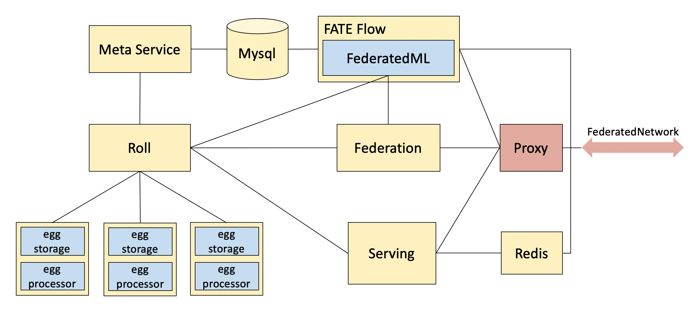

#                      **FATE Deployment Guide**

The Cluster version provides four deployment methods, which can be selected according to your actual situation:

- Install Cluster [Chinese guide](./doc/Fate-V1.1cluster部署指南(install).md) 
- Build Cluster from Source [Chinese guide](./doc/Fate-V1.1cluster部署指南(build).md) 
- Install AllinOne [Chinese guide](./doc/Fate-V1.1allinone部署指南(install).md)
- Build AllinOne from Source [Chinese guide](./doc/Fate-V1.1allinone部署指南(build).md)

thirdparty：

- Hadoop+Spark Deployment [Chinese guide](./doc/thirdparty_spark/Hadoop+Spark集群部署指南.md)

## 1.     Module Information

In a party, FATE (Federated AI Technology Enabler) has the following 8 modules,The specific module information is as follows:

| Module Name         | Port of module | Method of deployment                                | Module function                                              |
| ------------------- | -------------- | --------------------------------------------------- | ------------------------------------------------------------ |
| Federation          | 9394           | Single node deployment in one party                 | Federation module handles task data communication (i.e. 'federation') among Federated |
| Meta-Service        | 8590           | Single node deployment in one party                 | Meta-Service module stores metadata required by this arch.   |
| Proxy               | 9370           | Single node deployment in one party                 | Proxy (Exchange) is communication channel among parties.     |
| Roll                | 8011           | Single node deployment in one party                 | Roll module is responsible for accepting distributed job submission, job / data schedule and result aggregations. |
| Storage-Service-cxx | 7778           | Party Multi-node deployment                         | Storage-Service module handles data storage on that single node. |
| Egg-Processor       | 7888           | Party Multi-node deployment                         | Processor is used to execute user-defined functions.         |
| Fate-Flow           | 9360/9380      | Single node deployment in one party current version | Task Manager is a service for managing tasks. It can be used to start training tasks, upload and download data, publish models to serving, etc. |
| Fateboard           | 8080           | Single node deployment in one party                 | Fateboard is a web service to show informations and status of tasks running in FATE |

## 2. Deployment Architecture

### **2.1. Unilateral Deployment Architecture **


​                                                        Example deployment in one party

<div style="text-align:center", align=center>

</div>

### **2.2. Module Deployment Method**

FATE is a network-based multi-node distributed deployment complex architecture. Because the online module configuration depends on the offline module in the current version, it can be deployed both online and offline through deployment scripts during actual deployment, only in offline deployment. Configure the serving-server role ip in the configurations.sh configuration file. In the deployment process, we can divide into two deployment structures according to whether the exchange role is included in the project:

A) Exchange role exists: each party communicates as a proxy through exchange.

B) There is no exchange role: the party directly connects to the other party's proxy role for communication.

Each party can be deployed on one or more servers. In reality, you can balance the flexible deployment of modules that can be deployed on a single node based on the number of servers provided. In order to facilitate the use in actual applications, this guide describes the two exchange roles of unilateral deployment and bilateral deployment.


## 3. Installation Preparation

### **3.1. Server Configuration**

The following configuration is a one-sided server configuration information. If there are multiple parties, please refer to this configuration to copy this environment:

| Server                 |                                                              |
| ---------------------- | ------------------------------------------------------------ |
| **Quantity**           | 1 or more than 1 (according to the actual server allocation module provided) |
| **Configuration**      | 8 core / 16G memory / 500G hard disk / 10M bandwidth         |
| **Operating System**   | Version: CentOS Linux release 7.2                            |
| **Dependency Package** | yum source gcc gcc-c++ make autoconfig openssl-devel supervisor gmp-devel mpfr-devel libmpc-devel libaio numactl autoconf automake libtool libffi-dev (They can be installed using the initialization script env.sh) |
| **Users**              | User: app owner:apps (app user can sudo su root without password) |
| **File System**        | 1. The  500G hard disk is mounted to the /data directory.                                                                               2. Created /data/projects directory, projects directory belongs to app:apps. |

### **3.2. Software Version Requirements**

There are different software environment requirements for the operation node and the node where the different modules are located. The following are divided into three types according to the software environment: 

a). Execution node: that is, we want to enter the node that executes the command;

b). Meta-Service: That is, the node where the Meta-Service role is located; 

c).Other Modules: The node where other modules are installed.

*<u>Note: The above nodes can be the same node, but to distinguish the description, the following is explained in the case of full distribution.</u>*

| node           | Node description                            | Software configuration                                       | Software installation path                                   | Network Configuration                                        |
| -------------- | ------------------------------------------- | ------------------------------------------------------------ | ------------------------------------------------------------ | ------------------------------------------------------------ |
| Execution node | The operation node that executes the script | Git tool   rsync Maven 3.5 and above                         | Install it using the yum install command.                    | Interworking with the public network, you can log in to other node app users without encryption. |
| Modules        | Node where modules are located              | Jdk1.8+  Python3.6  python virtualenv redis5.0.2(One party only needs to install a redis on the serving-service node.)      mysql8.0.13(One party only needs to install a redis on the Meta-Service node.) | /data/projects/common/jdk/jdk1.8 /data/projects/common/miniconda3 /data/projects/fate/venv /data/projects/common/redis/redis-5.0.2                                                                   /data/projects/common/mysql/mysql-8.0.13 | In the same area or under the same VPC as other nodes.       |

Check whether the above software environment is reasonable in the corresponding server. If the software environment already exists and the correct installation path corresponds to the above list, you can skip this step. If not, refer to the following initialization steps to initialize the environment:

### 3.3.**create user**

Executed by the **root** user:

```
groupadd -g 6000 apps
useradd -s /bin/bash -g apps -d /home/app app
passwd app
```

### 3.4.**Configuring sudo**

Executed by the **root** user:

1.vim /etc/sudoers.d/app

2.Add the following content:

app ALL=(ALL) ALL

app ALL=(ALL) NOPASSWD: ALL

Defaults !env_reset

### 3.5.Configure password-free login from the execution node to the node to be deployed

1.Generate a key on the all node,Contains the execution node and the node to be deployed

su - app

ssh-keygen -t rsa

2.Generate authorized_keys fileon the execution node

cat ~/.ssh/id_rsa.pub >> /home/app/.ssh/authorized_keys 

chmod 600 ~/.ssh/authorized_keys

3.Copy the execution node authorized_keys file to all nodes to be deployed

scp \~/.ssh/authorized_keys app\@{ip}:/home/app/.ssh

## 4.Project Deployment

*<u>Note: The default installation directory is /data/projects/, and the execution user is app. It is modified according to the actual situation during installation.</u>*

### **4.1. Project Pull** and Packaging

Go to the /data/projects/ directory of the execution node and execute the git command to pull the project from github,then Packaging:

**Note: The server needs to have git and maven 3.5+ installed.**

```
cd /data/projects/
git clone https://github.com/FederatedAI/FATE.git
cd FATE/cluster-deploy/scripts
bash packaging.sh 
```

This script file puts each module and configuration file into the FATE/cluster-deploy/packages directory. You can view the directory and files of each module in this directory as following packages:

```
packages
|-- eggroll-api-1.1.tar.gz
|-- eggroll-computing-1.1.tar.gz
|-- eggroll-conf-1.1.tar.gz
|-- eggroll-egg-1.1.jar
|-- eggroll-egg-1.1.tar.gz
|-- eggroll-meta-service-1.1.tar.gz
|-- eggroll-roll-1.1.tar.gz
|-- eggroll-storage-service-cxx-1.1.tar.gz
|-- fateboard-1.1.jar
|-- fate-federation-1.1.tar.gz
|-- fate-proxy-1.1.tar.gz
|-- __init__.py
|-- jdk-8u192-linux-x64.tar.gz
|-- Miniconda3-4.5.4-Linux-x86_64.sh
|-- mysql-8.0.13-linux-glibc2.12-x86_64.tar.xz
|-- pip-packages-fate-5548239776e18466e0d59835d489952f.tar.gz
|-- redis-5.0.2.tar.gz
`-- third_party_eggrollv1.tar.gz
```

### **4.2. Modify Configuration File and Example****

Go to the FATE/cluster-deploy/scripts directory in the FATE directory and modify the configuration file multinode_cluster_configurations.sh.
The configuration file multinode_cluster_configurations.sh instructions:

| Configuration item           | Configuration item meaning                                  | Configuration Item Value                                     | Explanation                                                  |
| ---------------------------- | ----------------------------------------------------------- | ------------------------------------------------------------ | ------------------------------------------------------------ |
| user                         | Server operation username                                   | Default : app                                                | Use the default value                                        |
| deploy_dir                   | Fate installation path                                      | Default :  /data/projects/fate                               | Use the default value                                        |
| party_list                   | Party id                                                    | Each array element represents a partyid and only supports numbers, such as 9999, 10000. | Only deploy one party, just fill in one partyid, deploy two parties, and fill in two partyids. |
| party_names                  | The name of each party                                      | Default : (a b)                                              | Use the default value                                        |
| db_auth                      | Metaservice Jdbc connection database configuration          | Metaservice service jdbc configuration, fill in the database username and password (this user needs to have create database permission) | The configuration of the two parties is the same.            |
| redis_password               | The password of redis                                       | Default : fate_dev                                           | Use the default value                                        |
| cxx_compile_flag             | Switching for the Storage-Service-cxx module complie method | Default:false                                                | If the server system does not meet the compilation requirements for the Storage-Service-cxx node, try using true. |
| a_mysql /b_mysql             | Deploy mysql host                                           | Host IP, can only fill in one IP                             | 192.168.0.1/192.168.0.2                                      |
| a_redis/b_redis              | Deploy redis host                                           | Host IP, can only fill in one IP                             | 192.168.0.1/192.168.0.2                                      |
| a_fateboard /b_fateboard     | Deploy the fateboard module host                            | Host IP, can only fill in one IP                             | 192.168.0.1/192.168.0.2                                      |
| a_fate_flow /b_fate_flow     | Deploy the fate_flow module host                            | Host IP, can only fill in one IP                             | 192.168.0.1/192.168.0.2                                      |
| a_federation /b_federation   | Deploy the federation module host                           | Host IP, can only fill in one IP                             | 192.168.0.1/192.168.0.2                                      |
| a_proxy /b_proxy             | Deploy the proxy module host                                | Host IP, can only fill in one IP                             | 192.168.0.1/192.168.0.2                                      |
| a_roll /b_roll               | Deploy the roll module host                                 | Host IP, can only fill in one IP                             | 192.168.0.1/192.168.0.2                                      |
| a_metaservice /b_metaservice | Deploy the metaservice module host                          | Host IP, can only fill in one IP                             | 192.168.0.1/192.168.0.2                                      |
| a_egg /b_egg                 | Deploy the egg module host                                  | Host IP, can only fill in one IP                             | 192.168.0.1/192.168.0.2                                      |

example: 

| Party  | Ip          | Business service                                             |
| ------ | ----------- | ------------------------------------------------------------ |
| partyA | 192.168.0.1 | mysql;redis;proxy;federation;fate-flow;fateboard;roll;egg;metaservice |
| partyB | 192.168.0.2 | mysql;redis;proxy;federation;fate-flow;fateboard;roll;egg;metaservice |

**1）Two hosts partyA+partyB are deployed together**

```
#!/bin/bash

user=app
deploy_dir=/data/projects/fate
party_list=(10000 9999)
party_names=(a b)
db_auth=(root fate_dev)
redis_password=fate_dev
cxx_compile_flag=false

*services for a

a_mysql=192.168.0.1
a_redis=192.168.0.1
a_fate_flow=192.168.0.1
a_fateboard=192.168.0.1
a_federation=192.168.0.1
a_proxy=192.168.0.1
a_roll=192.168.0.1
a_metaservice=192.168.0.1
a_egg=(192.168.0.1)

*services for b

b_mysql=192.168.0.2
b_redis=192.168.0.2
b_fate_flow=192.168.0.2
b_fateboard=192.168.0.2
b_federation=192.168.0.2
b_proxy=192.168.0.2
b_roll=192.168.0.2
b_metaservice=192.168.0.2
b_egg=(192.168.0.2)
```

**2）Deploy one party**

```
#!/bin/bash

user=app
deploy_dir=/data/projects/fate
party_list=(1000)
party_names=(a)
db_auth=(root fate_dev)
redis_password=fate_dev
cxx_compile_flag=false

*services for a

a_mysql=192.168.0.1
a_redis=192.168.0.1
a_fate_flow=192.168.0.1
a_fateboard=192.168.0.1
a_federation=192.168.0.1
a_proxy=192.168.0.1
a_roll=192.168.0.1
a_metaservice=192.168.0.1
a_egg=(192.168.0.1)
```

*<u>Note: According to the above configuration method, you can modify it according to the actual situation.</u>*

### **4.3. Deployment**

Modify the configuration item corresponding to the multinode_cluster_configurations.sh file according to the above configuration, and then execute the deployment script in the FATE/cluster-deploy/scripts directory:

```
cd FATE/cluster-deploy/scripts

#If you need to deploy all components,execute:
bash deploy_cluster_multinode.sh build all 

#If only deploy some components,execute:
bash deploy_cluster_multinode.sh build fate_flow
```

## 5.     Configuration Check

After the execution, you can check whether the configuration of the corresponding module is accurate on each target server. Users can find a detailed configuration document in [cluster-deploy/doc](./doc/configuration.md).


## 6.     Start And Stop Service

### 6.1. Startup service

Use ssh to log in to each node with **app user**. Go to the /data/projects/fate directory and run the following command to start all services:

1) fateflow depends on the start of eggroll, you need to start eggroll and then start fateflow.

2) Each node deploys the module according to the parameter settings, so if it is not set, the module will not be deployed and started. When starting, it will prompt that the module cannot be started. Please ignore it.

Start all modules:

```
cd /data/projects/fate
sh services.sh all start
```

Start a single module,like:

```
cd /data/projects/fate
sh services.sh proxy start
```

### 6.2. Check service status

Check whether each service process starts successfully:

Check all modules:

```
cd /data/projects/fate
sh services.sh all status
```

Check a single module,like:

```
cd /data/projects/fate
sh services.sh proxy status
```

### 6.3. Shutdown service

To turn off the service, use:

Stop all modules:

```
cd /data/projects/fate
sh services.sh all stop
```

Stop a single module,like:

```
cd /data/projects/fate
sh services.sh proxy stop
```


## 7.      Test

### **7.1. Stand-alone Test**

Use ssh login to each node **app user**, run:

```
source /data/projects/fate/init_env.sh
cd $PYTHONPATH
sh ./federatedml/test/run_test.sh
```

See the "OK" field to indicate that the operation is successful.In other cases, if FAILED or stuck, it means failure, the program should produce results within one minute.

### **7.2. Toy_example Deployment Verification**

To run the test, you have 3 parameters to set:   guest_partyid, host_partyid, work_mode.

The work_mode is 1, the  guest_partyid and  host_partyid  should correspond to the your distributed version settings.  And please note distributed version test only do in the guest party

Pass the right values for different version to following commands, and run:

```
source /data/projects/fate/init_env.sh
cd /data/projects/fate/python/examples/toy_example/
python run_toy_example.py ${guest_partyid} ${host_partyid} ${work_mode}
```

The test result would show on the screen.


### 7.3. Minimization testing

Start the virtualization environment in host and guest respectively.

**Fast mode**

In the node of guest and host parts, set the fields: guest_id, host_id, arbiter_id  in run_task.py as you requirement. This file locates in / data / projects / fate / python / examples / min_test_task/.

In the  node of host part, running:

```
source /data/projects/fate/init_env.sh
cd /data/projects/fate/python/examples/min_test_task/
sh run.sh host fast 		
```

Get the values of "host_table" and "host_namespace" from test results, and pass them to following command.

In the node of guest part, running: 

```
source /data/projects/fate/init_env.sh
cd /data/projects/fate/python/examples/min_test_task/
sh run.sh guest fast ${host_table} ${host_namespace}
```

Wait a few minutes, see the result show "success" field to indicate that the operation is successful.
In other cases, if FAILED or stuck, it means failure.

**Normal mode**

Just replace the word "fast" with "normal" in all the commands, the rest is the same with fast mode.

### 7.4. Fateboard testing

Fateboard is a web service.  Get the ip of fateboard. If fateboard service is launched successfully, you can see the task information by visiting http://${fateboard-ip}:8080.

