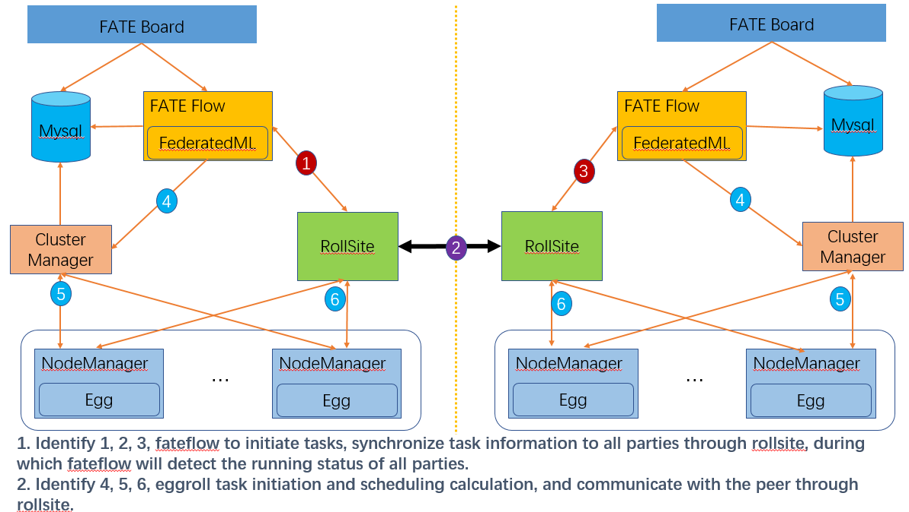

# Fate Cluster Deployment Guide

The Cluster version provides four deployment methods, which can be selected according to your actual situation:

- Install Cluster [Chinese guide](./doc/Fate_cluster_install_guide_ansible.md) 
- Install AllinOne [Chinese guide](./doc/Fate-allinone_deployment_guide_install_zh.md)
- Install Exchange Step By Step [Chinese guide](./doc/Fate-exchange_deployment_guide_zh.md)

## 1. General Introduction

### 1.1 System Introduction

------

1）FATE

FATE (Federated AI Technology Enabler) is an open source project initiated by the AI department of WeBank. It provides a secure computing framework based on data privacy protection and provides strong secure computing support for machine learning, deep learning, and migration learning algorithms. The security bottom layer supports a variety of multi-party secure computer mechanisms such as homomorphic encryption, secret sharing, and hashing. The algorithm layer supports logistic regression, boosting, and federated migration learning in the multi-party secure computing mode.

2）EggRoll

Eggroll is a large-scale distributed architecture suitable for machine learning and deep learning, including computing, storage and communication modules. Provide bottom support for FATE framework.

3）FATE Official Website ：https://fate.fedai.org/

This article will introduce the deployment of FATE cluster using ansible deployment script.

### 1.2. Component Description

| Software Products | Components     | Port      | Description                                          |
| ----------------- | -------------- | --------- | ---------------------------------------------------- |
| fate              | fate_flow      | 9360;9380 | Joint learning task pipeline management module       |
| fate              | fateboard      | 8080      | Joint learning process visualization module          |
| fate              | FederateML     |           | Algorithm code package                               |
| eggroll           | clustermanager | 4670      | Cluster manager manages the cluster                  |
| eggroll           | nodemanager    | 4671      | Node manager manages the resources of each machine   |
| eggroll           | rolllsite      | 9370      | Cross-site or cross-party communication components   |
| mysql             | mysql          | 3306      | Data storage, clustermanager and fateflow dependency |

### 1.3. System Structure

------

Example deployment in two parties



## 2.Detailed Design

### 2.1.Deployment Planning

------

In this example, there is only one host on each end, and multiple hosts on each end. Currently, only nodemanager multi-node deployment is supported, and other components are single-node.

| Role  | Partyid | Ip Address                    | Operating System        | Host Configuration | Storage | Deployment Module                                            |
| ----- | ------- | ----------------------------- | ----------------------- | ------------------ | ------- | ------------------------------------------------------------ |
| HOST  | 10000   | 192.168.0.1(Can be networked) | CentOS 7.2/Ubuntu 18.04 | 8C16G              | 500G    | fate_flow，fateboard，clustermanager，nodemanger，rollsite，mysql |
| Guest | 9999    | 192.168.0.2                   | CentOS 7.2/Ubuntu 18.04 | 8C16G              | 500G    | fate_flow，fateboard，clustermanager，nodemanger，rollsite，mysql |

**Remarks:Involving exchange instructions will use 192.168.0.88 to represent its IP, but this example does not involve exchange deployment.**

### 2.2.Host Resources And Operating System Requirements

| Category           | Description                                                  |
| ------------------ | ------------------------------------------------------------ |
| Host Configuration | No less than 8C16G500G, 1G network card                      |
| Operating System   | CentOS linux 7.2 and above are also lower than 8             |
| Dependent Package  | The following dependency packages need to be installed:<br />#centos<br />gcc gcc-c++ make openssl-devel gmp-devel mpfr-devel libmpc-devel libaio <br/>numactl autoconf automake libtool libffi-devel ansible<br/>#ubuntu<br/>gcc g++ make openssl ansible libgmp-dev libmpfr-dev libmpc-dev <br/>libaio1 libaio-dev numactl autoconf automake libtool libffi-dev <br/>cd /usr/lib/x86_64-linux-gnu<br/>if [ ! -f "libssl.so.10" ];then<br/>   ln -s libssl.so.1.0.0 libssl.so.10<br/>   ln -s libcrypto.so.1.0.0 libcrypto.so.10<br/>fi |
| User               | User: app, owner: apps (app users need to be able to sudo su root without a password) |
| File System        | 1. The data disk is mounted in the /data directory. <br/>2. Create a /data/projects directory, the owner of the directory is app:apps. <br/>3. The free space of the root directory is not less than 20G. |
| Virtual Memory     | Not less than 128G                                           |
| System Parameters  | 1. The number of file handles is not less than 65535. <br/>2. The number of user processes is not less than 65535. |

### 2.3.Network Requirements

| Category                   | Description                                                  |
| -------------------------- | ------------------------------------------------------------ |
| Firewall Policy            | 1. If you communicate through the public network, the hosts deployed at both ends of the rollsite need to open out and inbound firewall policies for each other. <br/>2. The firewall equipment needs to support long connections and needs no limit on the number of connections. |
| External Network Bandwidth | Incoming through the public network, the bandwidth of the public network is not less than 20Mb |
| Load Balancing Equipment   | 1. If there is a load balancing device at the entrance or exit, the device needs to support grpc or support transparent forwarding. <br/>2. Fate is a two-way communication, which needs to support active requests in the outbound and inbound directions. |

## 3. Basic Environment Configuration

### 3.1 Hostname Configuration (optional)

------

**1) Modify the host name**

**Execute under the 192.168.0.1 root user:**

hostnamectl set-hostname VM_0_1_centos

**Execute under the 192.168.0.2 root user:**

hostnamectl set-hostname VM_0_2_centos

**2) Add host mapping**

**Execute under the root user of the target server (192.168.0.1 192.168.0.2):**

vim /etc/hosts

192.168.0.1 VM_0_1_centos

192.168.0.2 VM_0_2_centos

### 3.2 Close selinux (optional)

------

**Execute under the root user of the target server (192.168.0.1 192.168.0.2):**

Confirm whether selinux is installed

Centos system execution: rpm -qa | grep selinux

If selinux has been installed, execute: setenforce 0

### 3.3 Modify Linux System Parameters

------

**Execute under the root user of the target server (192.168.0.1 192.168.0.2):**

1) Clean up the 20-nproc.conf file

cd /etc/security/limits.d

ls -lrt 20-nproc.conf

Existence: mv 20-nproc.conf 20-nproc.conf_bak

2) vim /etc/security/limits.conf

\* soft nofile 65535

\* hard nofile 65535

\* soft nproc 65535

\* hard nproc 65535

Log in again, ulimit -a to check whether it takes effect

### 3.4 Turn Off The Firewall

------

**Execute under the root user of the target server (192.168.0.1 192.168.0.2)**

Centos System:

systemctl disable firewalld.service

systemctl stop firewalld.service

systemctl status firewalld.service

### 3.5 Software Environment Initialization

------

**1) Create User**

**Execute under the root user of the target server (192.168.0.1 192.168.0.2)**

```
groupadd -g 6000 apps
useradd -s /bin/bash -g apps -d /home/app app
passwd app
```

**2) Configure sudo**

**Execute under the root user of the target server (192.168.0.1 192.168.0.2)**

vim /etc/sudoers.d/app

app ALL=(ALL) ALL

app ALL=(ALL) NOPASSWD: ALL

Defaults !env_reset

### 3.6 Increase Virtual Memory

------

**Target server (192.168.0.1 192.168.0.2) root user execution**

When used in a production environment, 128G of virtual memory needs to be added for memory calculations. Check whether the storage space is sufficient before execution.

Note: dd takes a long time to execute, please be patient

```
cd /data
dd if=/dev/zero of=/data/swapfile128G bs=1024 count=134217728
mkswap /data/swapfile128G
swapon /data/swapfile128G
cat /proc/swaps
echo '/data/swapfile128G swap swap defaults 0 0' >> /etc/fstab
```

### 3.7 Install Dependent Packages

------

**Target server (192.168.0.1 192.168.0.2) root user execution**

```
#Install basic dependencies
#centos
yum install -y gcc gcc-c++ make openssl-devel gmp-devel mpfr-devel libmpc-devel libaio numactl autoconf automake libtool libffi-devel
#ubuntu
apt-get install -y gcc g++ make openssl libgmp-dev libmpfr-dev libmpc-dev libaio1 libaio-dev numactl autoconf automake libtool libffi-dev
#If there is an error, you need to solve the yum source problem.

#Install ansible and process management dependency packages
#centos
yum install -y ansible
#ubuntu
apt-get install -y ansible

#If there is an error and the server has an external network, there is no need to solve the problem of incomplete yum source, execute:
#centos
yum install -y epel-release
#Add a more comprehensive third-party source, and then reinstall ansible jq supervisor
```

## 4.Project Deployment

### 4.1 Deployment Diagram

------


### 4.2 System Check

------

**Execute under the target server (192.168.0.1 192.168.0.2) app user**

```
#Virtual memory, size is not less than 128G, if not satisfied, please refer to section 3.6 to reset
cat /proc/swaps
Filename          Type    Size      Used  Priority
/data/swapfile128G file 134217724   384    -1

#File handle number, not less than 65535, if not satisfied, please refer to chapter 3.3 to reset
ulimit -n
65535

#The number of user processes, not less than 64000, if not satisfied, please refer to chapter 3.3 to reset
ulimit -u
65535

#Check whether the process has fate process residue, if any, you need to stop the service
ps -ef| grep -i fate

netstat -tlnp | grep 4670
netstat -tlnp | grep 4671
netstat -tlnp | grep 9370
netstat -tlnp | grep 9371
netstat -tlnp | grep 9360
netstat -tlnp | grep 8080
netstat -tlnp | grep 3306

#Check the deployment directory, if necessary, mv first
ls -ld /data/projects/fate
ls -ld /data/projects/data
ls -ld /data/projects/snmp

#Check the supervisord configuration file, if any, you need to mv or delete it
ls -lrt /data/projects/common/supervisord/supervisord.d/fate-*.conf
```

### 4.3 Obtain The Project

------

**Execute under the app user of the target server (192.168.0.1 with external network environment)**

Enter the /data/projects/ directory of the execution node and execute:

```
#Note: URL links have line breaks, please make sure to arrange them in one line when copying
cd /data/projects/
wget https://webank-ai-1251170195.cos.ap-guangzhou.myqcloud.com/ansible_nfate_1.5.0_release-1.0.0.tar.gz
tar xzf ansible_nfate_1.5.0_release-1.0.0.tar.gz
```

### 4.4 Configuration File Modification And Example

------

#### 4.4.1 Initial Configuration File

```
cd ansible-nfate-*
#init.sh file does not need to be modified, mainly to assist in generating some configuration files
 
#Production environment plus prod parameter execution
  sh ./tools/init.sh prod
 
>sh ./tools/init.sh prod
clean old config
init environments/prod
init var_files/prod
init project_prod.yml
```

#### 4.4.2 Certificate Production Configuration (optional)

**1) Certificate Production**

```
vi /data/projects/ansible-nfate-1.*/tools/make.sh

#1. The custom security certificate needs to be deployed at both ends at the same time, and only one end needs to be manually processed. The manual processing part will not be introduced temporarily.
#2. The security certificate supports the following deployment methods:
     1) Deploy host+guest, host and guest use secure certificate communication.
     2) Deploy host+exchange+guest, where host and exchange use secure certificates to communicate, and guest and exchange communicate normally.
     3) Deploy host+exchange+guest, where guest and exchange use secure certificates to communicate, and host and exchange communicate normally.

guest_host="192.168.0.1" ---Modify according to the actual IP
host_host="192.168.0.2" ---Modify according to the actual IP
exchange_host="192.168.0.88" --- Modify according to the actual IP, this example does not need to be modified without deployment
```

**2) Execute Script To Make Certificate**

```
cd tools
sh ./make.sh

Certificate files will be generated in the keys/host and guest directories.
```

**3) Copy The Certificate To The Deployment Directory**

```
sh cp-keys.sh host guest

The certificate file will be copied to the roles/eggroll/files/keys directory

Special Note:
1. Currently, script deployment only supports 2 parties to set up certificate authentication. (host&guest, host&exchange, guest&exchange)
```

#### 4.4.3 Modify Configuration File

1) **ModifyThe Initialization Host IP**

```
vi /data/projects/ansible-nfate-1.*/environments/prod/hosts

#ansible format configuration file
[fate] ---Fill the host IP to be deployed into the fate group
192.168.0.1
192.168.0.2

[deploy_check] --- Fill in the deploy_check group with the local IP that executes ansible
192.168.0.1

[all:vars]
ansible_connection=ssh
ansible_ssh_port=22 --- Modify according to actual situation
ansible_ssh_user=app
#ansible_ssh_pass=test ---If you have not done a password-free login, you need to provide a password
##method: sudo or su
ansible_become_method=sudo
ansible_become_user=root
ansible_become_pass= --- If each host has not done secret-free sudo, the root password must be filled
```

2) **Modify The Deployment Mode**

```
vi /data/projects/ansible-nfate-1.*/var_files/prod/fate_init

#Only modify the following parameters, other parameters remain unchanged by default
deploy_mode: "install" --- The default is empty, modified to install, which means a new deployment
```

**3) Modify Host Side Parameters**

**Note: The default is not to enable the configuration of the security certificate. If you enable the security certificate communication, you need to set server_secure, client_secure, is_secure to true, and the port corresponding to is_secure to 9371**

```
#If you don't deploy host, you don't need to modify
#Except nodemanger can set multiple IPs, all others are single IP
vi /data/projects/ansible-nfate-1.*/var_files/prod/fate_host

host:
    partyid: 10000 ---host partyid, modify according to actual plan
    rollsite:
      enable: True
      ips: ---IP list, currently rollsite only supports deployment to one server
      -192.168.0.1
      port: 9370 --- grpc port
      secure_port: 9371 ---grpcs port
      pool_size: 600 ---thread pool size
      max_memory: ---rollsite process JVM memory parameter, the default is 1/4 of the physical memory, which can be set according to the actual situation, such as 12G, if it is a machine dedicated to rollsite, configure it to 75% of the physical memory.
      server_secure: False ---As a server, turn on the security certificate verification, do not use the security certificate by default
      client_secure: False ---As a client, use a certificate to initiate a security request, not using a security certificate by default
      default_rules: ---This party points to the IP and port routing configuration of exchange or other parties
      -name: default
        ip: 192.168.0.2 ---exchange or peer party rollsite IP
        port: 9370 ---exchange or opposite party rollsite port, generally default 9370, which means no security certificate deployment; if you need to enable security certificate communication, it should be set to 9371;
        is_secure: False ---Whether to use secure authentication communication; it needs to be used in combination with server_secure or client_secure. When all three are true, it means to use secure authentication communication with the next hop rollsite. At the same time, the previous parameter port needs to be set to 9371; not used The default security certificate is sufficient.
      rules: ---The party's own routing configuration
      -name: default
        ip: 192.168.0.1
        port: 9370
      -name: fateflow
        ip: 192.168.0.1
        port: 9360
    clustermanager:
      enable: True
      ips:
      -192.168.0.1 --- Only support the deployment of one host
      port: 4670
    nodemanager:
      enable: True
      ips: ---Support multiple deployment
      -192.168.0.1
      -192.168.0.x
      port: 4671
    eggroll:
      dbname: "eggroll_meta"
      egg: 2
    fate_flow:
      enable: True
      ips:
      -192.168.0.1 ---Only support the deployment of one host
      grpcPort: 9360
      httpPort: 9380
      dbname: "fate_flow"
    fateboard:
      enable: True
      ips:
      -192.168.0.1 ---Only support the deployment of one host
      port: 8080
      dbname: "fate_flow"
    mysql:
      enable: True
      ips:
      -192.168.0.1 ---Only support the deployment of one host
      port: 3306
      dbuser: "fate"
      dbpasswd: "fate_deV2999"
    zk:
      enable: False
      lists:
      -ip: 192.168.0.1
        port: 2181
      use_acl: false
      user: "fate"
      passwd: "fate"
```

**4) Modify The Guest Parameters**

**Note: The default is not to enable the configuration of the security certificate. If you enable the security certificate communication, you need to set server_secure, client_secure, is_secure to true, and the port corresponding to is_secure to 9371.**

```
#If you don't deploy the guest party, you don't need to modify it
#Except nodemanger can set multiple IPs, all others are single IP
vi /data/projects/ansible-nfate-1.*/var_files/prod/fate_guest

guest:
    partyid: 9999 ---Modify according to actual plan
    rollsite:
      enable: True
      ips: ---IP list, currently rollsite only supports deployment to one server
      -192.168.0.2
      port: 9370 --- grpc port
      secure_port: 9371 ---grpcs port
      pool_size: 600 ---thread pool size
      max_memory: ---rollsite process JVM memory parameter, the default is 1/4 of the physical memory, which can be set according to the actual situation, such as 12G, if it is a machine dedicated to rollsite, configure it to 75% of the physical memory.
      server_secure: False ---As a server, turn on the security certificate verification, do not use the security certificate by default
      client_secure: False ---As a client, use a certificate to initiate a security request, not using a security certificate by default
      default_rules: ---This party points to the IP and port routing configuration of exchange or other parties
      -name: default
        ip: 192.168.0.1 ---exchange or peer party rollsite IP
        port: 9370 ---exchange or opposite party rollsite port, generally default 9370, which means no security certificate deployment; if you need to enable security certificate communication, it should be set to 9371;
        is_secure: False ---server_secure or client_secure is true, the next hop rollsite pointed to is also turned on security authentication, this parameter needs to be set to true, the previous parameter port needs to be set to 9371, and the default is not to use a security certificate.
      rules: ---The party's own routing configuration
      -name: default
        ip: 192.168.0.2
        port: 9370
      -name: fateflow
        ip: 192.168.0.2
        port: 9360
    clustermanager:
      enable: True
      ips: ---Only support the deployment of one host
      -192.168.0.2
      port: 4670
    nodemanager:
      enable: True
      ips: ---Support the deployment of multiple hosts
      -192.168.0.2
      -192.168.0.x
      port: 4671
    eggroll:
      dbname: "eggroll_meta"
      egg: 2
    fate_flow:
      enable: True
      ips: ---Only support the deployment of one host
      -192.168.0.2
      grpcPort: 9360
      httpPort: 9380
      dbname: "fate_flow"
    fateboard:
      enable: True
      ips: ---Only support the deployment of one host
      -192.168.0.2
      port: 8080
      dbname: "fate_flow"
    mysql:
      enable: True
      ips: ---Only support the deployment of one host
      -192.168.0.2
      port: 3306
      dbuser: "fate"
      dbpasswd: "fate_deV2999"
    zk:
      enable: False
      lists:
      -ip: 192.168.0.2
        port: 2181
      use_acl: false
      user: "fate"
      passwd: "fate"
```

**5) Modify Exchange Parameters**

**Note: The default is not to enable the configuration of the security certificate. If you enable the security certificate communication, you need to set server_secure, client_secure, is_secure to true, and the port corresponding to is_secure to 9371.**

```
#Do not deploy exchange without modification
vi /data/projects/ansible-nfate-1.*/var_files/prod/fate_exchange

exchange:
  enable: False - The deployment of exchange needs to be modified to True
  rollsite:
    ips:
    -192.168.0.88
    port: 9370
    secure_port: 9371 ---grpcs port
    pool_size: 600
    max_memory: ---rollsite process JVM memory parameter, the default is 1/4 of the physical memory, which can be set according to the actual situation, such as 12G, if it is a machine dedicated to rollsite, configure it to 75% of the physical memory.
    server_secure: False ---As a server, turn on the security certificate verification, do not use the security certificate by default
    client_secure: False ---As a client, use a certificate to initiate a security request, not using a security certificate by default
  partys: --- Routing configuration pointing to each party
  -id: 10000
    rules:
    -name: default
      ip: 192.168.0.1
      port: 9370 ---corresponding to the party rollsite port, generally the default is 9370, which means that there is no security certificate communication; if you need to open the security certificate communication, it should be set to 9371;
      is_secure: False ---server_secure or client_secure is true, the next hop rollsite pointed to is also turned on security authentication, this parameter needs to be set to true, the previous parameter port needs to be set to 9371, and the default is not to use a security certificate.
  -id: 9999
    rules:
    -name: default
      ip: 192.168.0.2
      port: 9370 ---corresponding to the party rollsite port, generally the default is 9370, that is, communication without a security certificate; if you need to enable communication with a security certificate, set it to 9371;
      is_secure: False ---server_secure or client_secure is true, the next hop rollsite pointed to is also turned on security authentication, this parameter needs to be set to true, the previous parameter port needs to be set to 9371, and the default is not to use a security certificate.
```

### 4.5 Deployment

**After modifying the corresponding configuration items according to the above configuration meaning, then execute the deployment script:**

```
#Relative ansible-nfate-* directory
cd /data/projects/ansible-nfate-1.*
 
#Production environment plus prod parameter execution
nohup sh ./boot.sh prod -D> logs/boot.log 2>&1 &
```

**The deployment log is output in the logs directory, and check whether there is an error in real time:**

```
#Relative ansible-nfate-* directory
cd logs
tail -f ansible.log (check the deployment in real time, if there is no such log file, you need to check whether ansible is installed)

List of check items fail prompt:
1. "Warning: now swap is 0, need to turn up"
    ---The virtual memory is not set, please refer to the previous chapter to set it, not less than 128G.
2. "Warning: key fate process exists, please has a check and clean"
    ---The environment has not been cleaned up, and the previously deployed fate process needs to be stopped.
3. "Warning: these ports: 4670 4671 9360 9370 9380 have been used"
    ---The environment has not been cleaned up, and the previously deployed fate process needs to be stopped.
4. "Warning: if reinstall mysql, please stop mysql, and rename /etc/my.cnf"
    ---mysql did not stop, it needs to be stopped. If there is a /etc/my.cnf file, mv needs to be renamed.
5. "Waring: please rename /data/projects/fate"
    ---The fate directory exists, you need to mv first.
6. "Warning: please rename /data/projects/data/fate/mysql"
    ---/data/projects/data exists, mv is required.
7. "Warning: supervisor_fate_conf exists, please remove ls /data/projects/common/supervisord/supervisord.d/fate-*.conf"
  --- The /data/projects/common directory exists, and mv is required.
```

**Restart after fateflow deployment:**

```
#Because fate_flow depends on more components, there may be exceptions in startup. The processing is as follows:
netstat -tlnp | grep 9360
If there is no port, restart fateflow:
sh service.sh stop fate-fateflow
sh service.sh start fate-fateflow
```

### 4.6 Problem Location

1) Eggroll log

/data/logs/fate/eggroll/bootstrap.clustermanager.err

/data/logs/fate/eggroll/logs/eggroll/clustermanager.jvm.err.log

/data/logs/fate/eggroll/logs/eggroll/nodemanager.jvm.err.log

/data/logs/fate/eggroll/logs/eggroll/bootstrap.nodemanager.err

/data/logs/fate/eggroll/logs/eggroll/bootstrap.rollsite.err

/data/logs/fate/eggroll/logs/eggroll/rollsite.jvm.err.log

2) fateflow log

/data/logs/fate/python/logs/fate_flow/

3) fateboard log

/data/logs/fate/fate/fateboard/logs

## 5.Test

## 5.1 Toy_example Deployment Verification

For this test you need to set 3 parameters: guest_partyid, host_partyid, work_mode.

### 5.1.1 Unilateral Test

**1) Execute on 192.168.0.1, guest_partyid and host_partyid are both set to 10000:**

```
source /data/projects/fate/bin/init_env.sh
cd /data/projects/fate/examples/toy_example/
python run_toy_example.py 10000 10000 1
```

Note: If there is no output for more than 1 minute, it indicates that there is a problem with the deployment. You need to look at the log to locate the problem.

A result similar to the following indicates success:

"2020-04-28 18:26:20,789-secure_add_guest.py[line:126]-INFO: success to calculate secure_sum, it is 1999.9999999999998"

**2) Execute on 192.168.0.2, guest_partyid and host_partyid are both set to 9999:**

```
source /data/projects/fate/bin/init_env.sh
cd /data/projects/fate/examples/toy_example/
python run_toy_example.py 9999 9999 1
```

Note: If there is no output for more than 1 minute, it indicates that there is a problem with the deployment. You need to look at the log to locate the problem.

A result similar to the following indicates success:

"2020-04-28 18:26:20,789-secure_add_guest.py[line:126]-INFO: success to calculate secure_sum, it is 1999.9999999999998"

### 5.1.2 Bilateral Testing

**Select 9999 as the guest and execute on 192.168.0.2:**

```
source /data/projects/fate/bin/init_env.sh
cd /data/projects/fate/examples/toy_example/
python run_toy_example.py 9999 10000 1
```

A result similar to the following indicates success:

"2020-04-28 18:26:20,789-secure_add_guest.py[line:126]-INFO: success to calculate secure_sum, it is 1999.9999999999998"

## 5.2 Minimize Test

### 5.2.1 Upload Preset Data:

**Execute on 192.168.0.1 and 192.168.0.2 respectively:**

```
source /data/projects/fate/bin/init_env.sh
cd /data/projects/fate/examples/scripts/
python upload_default_data.py -m 1
```

**For more details, please refer to**[Script README](../examples/scripts/README.rst)

### 5.2.2 Fast Mode:

Please make sure that both the guest and host have uploaded the preset data through the given script.

In the fast mode, the minimization test script will use a relatively small data set, that is, the breast data set containing 569 data.

**Select 9999 as the guest and execute on 192.168.0.2:**

```
source /data/projects/fate/bin/init_env.sh
cd /data/projects/fate/examples/toy_example/
python run_task.py -m 1 -gid 9999 -hid 10000 -aid 10000 -f fast
```

Some other parameters that may be useful include:

1. -f: File type used. "fast" represents the breast data set, and "normal" represents the default credit data set.
2. --add_sbt: If it is set to 1, the secureboost task will be started after lr is run. If it is set to 0, the secureboost task will not be started. If this parameter is not set, the system defaults to 1.

If the word "success" is displayed in the result after a few minutes, it indicates that the operation has run successfully. If "FAILED" appears or the program is stuck, it means the test has failed.

### 5.2.3 Normal Mode

Just replace "fast" with "normal" in the command, and the rest is the same as in fast mode.

## 5.3 Fateboard Testing

Fateboard is a web service. If the fateboard service is successfully started, you can view the task information by visiting http://192.168.0.1:8080 and http://192.168.0.2:8080. If there is a firewall between the local office computer and the server, you need to enable it.

## 6.System Operation And Maintenance

### 6.1 Service Management

------

**Execute under the target server (192.168.0.1 192.168.0.2) app user**

### 6.1.1 Service Management

```
cd /data/projects/common/supervisord
```

Start/Stop/Restart/View all:

```
#Note: Because mysql is a basic component, the startup is slow. It is recommended to restart all components first, then start mysql first, and then start other components
sh service.sh start/stop/restart/status all

#Note: Because fateflow depends on many components, restarting all operations may cause fateflow to start abnormally. The processing is as follows:
netstat -tlnp | grep 9360
If there is no port, restart fateflow:
sh service.sh stop fate-fateflow
sh service.sh start fate-fateflow
```

Start/stop/restart/view a single module (optional: clustermanager, nodemanager, rollsite, fateflow, fateboard, mysql):

```
sh service.sh start/stop/restart/status fate-clustermanager
```

## 6.2 View Process And Port

**Execute under the target server (192.168.0.1 192.168.0.2) app user**

### 6.2.1 View Process

```
#Check whether the process is started according to the deployment plan
ps -ef | grep -i clustermanager
ps -ef | grep -i nodemanager
ps -ef | grep -i rollsite
ps -ef | grep -i fate_flow_server.py
ps -ef | grep -i fateboard
```

### 6.2.2 View Process Port

```
#Check whether the process port exists according to the deployment plan
#clustermanager
netstat -tlnp | grep 4670
#nodemanager
netstat -tlnp | grep 4671
#rollsite
netstat -tlnp | grep 9370
#fate_flow_server
netstat -tlnp | grep 9360
#fateboard
netstat -tlnp | grep 8080
```


## 6.2.3 Service Log

| service                             | Service log path               |
| ----------------------------------- | ------------------------------ |
| eggroll                             | /data/logs/fate/eggroll/logs   |
| fate_flow& task log (fateflow node) | /data/logs/fate/python/logs    |
| fateboard                           | /data/logs/fate/fateboard/logs |
| mysql                               | /data/logs/fate/mysql/         |

### 6.2.4 File Directory Description

| file path                         | Description                                          |
| --------------------------------- | ---------------------------------------------------- |
| /data/projects/fate               | Software deployment path                             |
| /data/projects/data               | Mysql data storage path                              |
| /data/logs                        | Log path                                             |
| /data/projects/common/supervisord | Process management tool supervisor installation path |

## 7. Appendix

## 7.1 Eggroll Parameter Tuning

Configuration file path: /data/projects/fate/eggroll/conf/eggroll.properties

Configuration parameter: eggroll.session.processors.per.node

Assuming that the number of CPU cores (cpu cores) is c, the number of Nodemanagers is n, and the number of tasks that need to run simultaneously is p, then:

egg_num=eggroll.session.processors.per.node = c * 0.8 / p

partitions (roll pair partition number) = egg_num * n