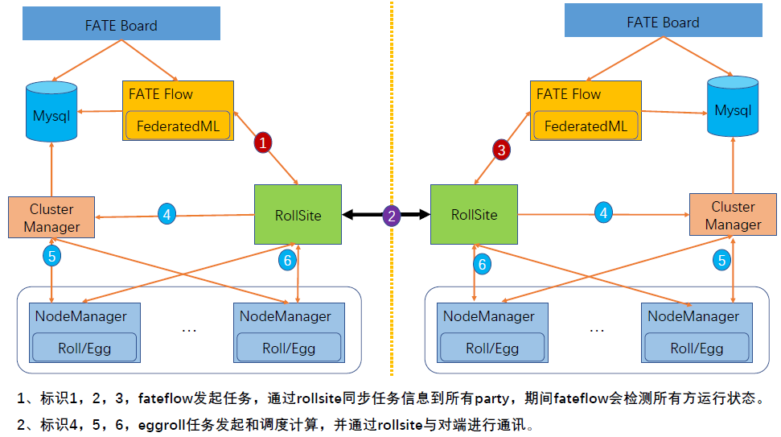

# FATE ON Spark Deploy Guide

## 1.Server Information

|  Server  |                                                              |
| :------: | ------------------------------------------------------------ |
|   Number | >1 (Depending on user needs)                                       |
|   Specs  | 8 core /16GB memory / 500GB hard disk/10M bandwidth       |
|   OS     | CentOS linux 7.2 & above/Ubuntu 16.04 & above        |
|  Dependency| Please refer section 4.5                                   |
|   User   | user: app, user group: apps (app user should be ablee to execute sudo su root without password) |
| File System | 1. mount 500G hard disk to /data 2. make /data/projects directory, ownership to app:apps |

## 2.Cluster Information

| party  | partyid | Host name     | IP Address  | OS                      | Software    | Service                              |
| ------ | ------- | ------------- | ----------- | ----------------------- | ----------- | --------------------------------- |
| PartyA | 10000   | VM-0-1-centos | 192.168.0.1 | CentOS 7.2/Ubuntu 16.04 | fate，mysql, nginx | fateflow，fateboard，mysql，nginx |
| PartyA | 10000   |               |             |                         | Spark、HDFS |                                   |
| PartyA | 10000   |               |             |                         | RabbitMQ    |                                   |
| PartyB | 9999    | VM-0-2-centos | 192.168.0.2 | CentOS 7.2/Ubuntu 16.04 | fate，mysql, nginx | fateflow，fateboard，mysql，nginx |
| PartyB | 9999    |               |             |                         | Spark、HDFS |                                   |
| PartyB | 9999    |               |             |                         | RabbitMQ    |                                   |

Architecture:

<div style="text-align:center", align=center>

</div>

## 3.Module Information

| Product  | Module    | Port     | Information                                               |
| -------- | --------- | --------- | ----------------------------------------------------- |
| fate     | fate_flow | 9360;9380 | Manages workflow of federated learning jobs, one service instance per party |
| fate     | fateboard | 8080      | Visualizes federated learning process, one service instance per party     |
| nginx    | nginx     | 9370      | proxy for cross-party scheduling                 |
| mysql    | mysql     | 3306      | meta table storage                                            |
| Spark    |           |           | compute engine                                              |
| HDFS     |           |           | storage engine                                            |
| RabbitMQ |           |           | proxy for cross-party data exchange                             |

## 4.Base Environment Configuration

### 4.1 configure hostname(optional)

**1) Modify Hostname**

**Execute on 192.168.0.1 as the root user**:

```bash
hostnamectl set-hostname VM-0-1-centos
```

**Execute on 192.168.0.2 as the root user**:

```bash
hostnamectl set-hostname VM-0-2-centos
```

**2) Add Host Mapping**

**Execute on 192.168.0.1 192.168.0.2 as the root user**:

```bash
vim /etc/hosts
192.168.0.1 VM-0-1-centos
192.168.0.2 VM-0-2-centos
```

### 4.2 Disable SELinux(Optional)


**Execute on 192.168.0.1 192.168.0.2 as the root user**:

Check if SELinux is available:

CentOS:

```bash
rpm -qa | grep selinux
```

Ubuntu:

```bash
apt list --installed | grep selinux
```

Is SELinux is already installed, run:

```bash
setenforce 0
```


### 4.3 Set Linux resource limit

**Execute on 192.168.0.1 192.168.0.2 as the root user**:

```bash
vim /etc/security/limits.conf
* soft nofile 65536
* hard nofile 65536
```

```bash
vim /etc/security/limits.d/20-nproc.conf
* soft nproc unlimited
```

### 4.4 Disable & Stop Firewall(Optional)


**Execute on 192.168.0.1 192.168.0.2 as the root user**:

CentOS:

```bash
systemctl disable firewalld.service
systemctl stop firewalld.service
systemctl status firewalld.service
```

Ubuntu：

```bash
ufw disable
ufw status
```

### 4.5 Initialize Software Environment

**Execute on 192.168.0.1 192.168.0.2 as the root user**:

**1) Create User**

```bash
groupadd -g 6000 apps
useradd -s /bin/bash -g apps -d /home/app app
passwd app
```

**2) Create**

```bash
mkdir -p /data/projects/fate
mkdir -p /data/projects/install
chown -R app:apps /data/projects
```

**3) Install Dependencies**

```bash
#centos
yum -y install gcc gcc-c++ make openssl-devel gmp-devel mpfr-devel libmpc-devel libaio numactl autoconf automake libtool libffi-devel snappy snappy-devel zlib zlib-devel bzip2 bzip2-devel lz4-devel libasan lsof sysstat telnet psmisc
#ubuntu
apt-get install -y gcc g++ make openssl supervisor libgmp-dev  libmpfr-dev libmpc-dev libaio1 libaio-dev numactl autoconf automake libtool libffi-dev libssl1.0.0 libssl-dev liblz4-1 liblz4-dev liblz4-1-dbg liblz4-tool  zlib1g zlib1g-dbg zlib1g-dev
cd /usr/lib/x86_64-linux-gnu
if [ ! -f "libssl.so.10" ];then
   ln -s libssl.so.1.0.0 libssl.so.10
   ln -s libcrypto.so.1.0.0 libcrypto.so.10
fi
```

## 5.Install FATE

**NOTE**

This guide assumes that installation path is /data/projects/install, all commands executed by user app. 
User may modify the given comments as needed.

### 5.1 Obtain packages


**Execute on 192.168.0.1 (with Internet access) as user app**:

```bash
mkdir -p /data/projects/install
cd /data/projects/install
wget https://webank-ai-1251170195.cos.ap-guangzhou.myqcloud.com/python-env-1.5.0-release.tar.gz
wget https://webank-ai-1251170195.cos.ap-guangzhou.myqcloud.com/jdk-8u192-linux-x64.tar.gz
wget https://webank-ai-1251170195.cos.ap-guangzhou.myqcloud.com/mysql-1.5.0-release.tar.gz
wget https://webank-ai-1251170195.cos.ap-guangzhou.myqcloud.com/openresty-1.17.8.2.tar.gz
wget https://webank-ai-1251170195.cos.ap-guangzhou.myqcloud.com/FATE_install_1.5.0_preview.tar.gz

#scp packages to 192.168.0.1和192.168.0.2
scp *.tar.gz app@192.168.0.1:/data/projects/install
scp *.tar.gz app@192.168.0.2:/data/projects/install
```

### 5.2 Check Settings of OS

**Execute on 192.168.0.1 192.168.0.2 as user app**:

```bash
#number of open files limit should be no lower than 65535; refer to section 4.3 to set
ulimit -n
65535

#max user process limit should be no lower than 64000; refer to section 4.3 to set
ulimit -u
65535
```

### 5.3 Deploy MySQL

**Execute on 192.168.0.1 192.168.0.2 as user app**:

**1）Install MySQL：**

```bash
#make mysql home directory
mkdir -p /data/projects/fate/common/mysql
mkdir -p /data/projects/fate/data/mysql

#extract package
cd /data/projects/install
tar xzvf mysql-*.tar.gz
cd mysql
tar xf mysql-8.0.13.tar.gz -C /data/projects/fate/common/mysql

#configure
mkdir -p /data/projects/fate/common/mysql/mysql-8.0.13/{conf,run,logs}
cp service.sh /data/projects/fate/common/mysql/mysql-8.0.13/
cp my.cnf /data/projects/fate/common/mysql/mysql-8.0.13/conf

#initialize
cd /data/projects/fate/common/mysql/mysql-8.0.13/
./bin/mysqld --initialize --user=app --basedir=/data/projects/fate/common/mysql/mysql-8.0.13 --datadir=/data/projects/fate/data/mysql > logs/init.log 2>&1
cat logs/init.log |grep root@localhost
#User should record passowrd from terminal output 'root@localhost:{$password}', which is password for MySQL root user and is needed later

#Start Service
cd /data/projects/fate/common/mysql/mysql-8.0.13/
nohup ./bin/mysqld_safe --defaults-file=./conf/my.cnf --user=app >>logs/mysqld.log 2>&1 &

#Change MySQL root user password to 'fate_dev'
cd /data/projects/fate/common/mysql/mysql-8.0.13/
./bin/mysqladmin -h 127.0.0.1 -P 3306 -S ./run/mysql.sock -u root -p password "fate_dev"
Enter Password: {$password}

#Login
cd /data/projects/fate/common/mysql/mysql-8.0.13/
./bin/mysql -u root -p -S ./run/mysql.sock
Enter Password: fate_dev
```

**2) Create Database & Configure User**

```bash
cd /data/projects/fate/common/mysql/mysql-8.0.13/
./bin/mysql -u root -p -S ./run/mysql.sock
Enter Password: fate_dev

#create fate_flow database
mysql>CREATE DATABASE IF NOT EXISTS fate_flow;

#create remote user and grant privileges
1) execute on 192.168.0.1
mysql>CREATE USER 'fate'@'192.168.0.1' IDENTIFIED BY 'fate_dev';
mysql>GRANT ALL ON *.* TO 'fate'@'192.168.0.1';
mysql>flush privileges;

2) execute on 192.168.0.2:
mysql>CREATE USER 'fate'@'192.168.0.2' IDENTIFIED BY 'fate_dev';
mysql>GRANT ALL ON *.* TO 'fate'@'192.168.0.2';
mysql>flush privileges;

#Check
mysql>select User,Host from mysql.user;
mysql>show databases;
mysql>use eggroll_meta;
mysql>show tables;
mysql>select * from server_node;

```

### 5.4 Deploy JDK

**Execute on 192.168.0.1 192.168.0.2 as user app**:

```bash
#make jdk home base
mkdir -p /data/projects/fate/common/jdk
#extarct
cd /data/projects/install
tar xzf jdk-8u192-linux-x64.tar.gz -C /data/projects/fate/common/jdk
cd /data/projects/fate/common/jdk
mv jdk1.8.0_192 jdk-8u192
```

### 5.5 Deploy python

**Execute on 192.168.0.1 192.168.0.2 as user app**:

```bash
#make python virtual env home base
mkdir -p /data/projects/fate/common/python

#install miniconda3
cd /data/projects/install
tar xvf python-env-*.tar.gz
cd python-env
sh Miniconda3-4.5.4-Linux-x86_64.sh -b -p /data/projects/fate/common/miniconda3

#install virtualenv and create virtual environment
/data/projects/fate/common/miniconda3/bin/pip install virtualenv-20.0.18-py2.py3-none-any.whl -f . --no-index

/data/projects/fate/common/miniconda3/bin/virtualenv -p /data/projects/fate/common/miniconda3/bin/python3.6 --no-wheel --no-setuptools --no-download /data/projects/fate/common/python/venv

#install dependencies
tar xvf pip-packages-fate-*.tar.gz
source /data/projects/fate/common/python/venv/bin/activate
pip install setuptools-42.0.2-py2.py3-none-any.whl
pip install -r pip-packages-fate-1.5.0/requirements.txt -f ./pip-packages-fate-1.5.0 --no-index
pip list | wc -l
```

### 5.6 Install NginX

**Execute on 192.168.0.1 192.168.0.2 as user app**:

```bash
cd /data/projects/install
tar xzf openresty-*.tar.gz
cd openresty-*
./configure --prefix=/data/projects/fate/proxy \
                   --with-luajit \
                   --with-http_ssl_module \
                     --with-http_v2_module \
                     --with-stream \
                     --with-stream_ssl_module \
                     -j12
make && make install
```

### 5.7 Deploy Spark & HDFS

#### 5.7.1
Please refer: [Hadoop_Spark_deployment_guide](./Hadoop_Spark_deployment_guide.md)


### 5.8 Deploy RabbitMQ

#### 5.8.1
Please refer: [RabbitMQ_deployment_guide](./RabbitMQ_deployment_guide.md)

### 5.9 Deploy FATE

#### 5.9.1 Deploy Software

```
#deploy software
#Execute on 192.168.0.1 192.168.0.2 as user app:
cd /data/projects/install
tar xf FATE_install_*.tar.gz
cd FATE_install_*
cp -r bin /data/projects/fate/
cp -r conf /data/projects/fate/
cp fate.env /data/projects/fate/
tar xvf python.tar.gz -C /data/projects/fate/
tar xvf fateboard.tar.gz -C /data/projects/fate
tar xvf proxy.tar.gz -C /data/projects/fate

#Set Environemnt Variable
#Execute on 192.168.0.1 192.168.0.2 as user app:
cat >/data/projects/fate/bin/init_env.sh <<EOF
export PYTHONPATH=/data/projects/fate/python
export SPARK_HOME=/data/projects/common/spark/spark-2.4.1-bin-hadoop2.7
venv=/data/projects/fate/common/python/venv
source \${venv}/bin/activate
export JAVA_HOME=/data/projects/fate/common/jdk/jdk-8u192
export PATH=\$PATH:\$JAVA_HOME/bin
EOF
```

#### 5.9.2 Modify NginX Configuration

conf file:  /data/projects/fate/proxy/nginx/conf/nginx.conf

This conf file is used by NginX for service base setting and lua code.
Please refer to Nginx.conf to manually edit conf; use the following command to check modified conf: 

```bash
/data/projects/fate/proxy/nginx/sbin/nginx -t
```

#### 5.9.3 Modify NginX Proxy Setting

conf file:  /data/projects/fate/proxy/nginx/conf/route_table.yaml

This conf file is used NginX for proxy information.
User may refer to the example below to manually modify the file.
Configuration may also be done through commands:


```
#Execute on 192.168.0.1 as user app
cat > /data/projects/fate/proxy/nginx/conf/route_table.yaml << EOF
default:
  proxy:
    - host: 192.168.0.2
      port: 9390
10000:
  proxy:
    - host: 192.168.0.1
      port: 9390
  fateflow:
    - host: 192.168.0.1
      port: 9360
9999:
  proxy:
    - host: 192.168.0.2
      port: 9390
  fateflow:
    - host: 192.168.0.2
      port: 9360
EOF

#Execute on 192.168.0.2 as user app
cat > /data/projects/fate/proxy/nginx/conf/route_table.yaml << EOF
default:
  proxy:
    - host: 192.168.0.1
      port: 9390
10000:
  proxy:
    - host: 192.168.0.1
      port: 9390
  fateflow:
    - host: 192.168.0.1
      port: 9360
9999:
  proxy:
    - host: 192.168.0.2
      port: 9390
  fateflow:
    - host: 192.168.0.2
      port: 9360
EOF
```

#### 5.9.4 Modify FATE-Board Configuration

1）conf/application.properties

- Service Port

  server.port---default

- Fate-Flow access url

  fateflow.url，host：http://192.168.0.1:9380，guest：http://192.168.0.2:9380

- Database source name, username, and password

  fateboard.datasource.jdbc-url，host：mysql://192.168.0.1:3306，guest：mysql://192.168.0.2:3306

  fateboard.datasource.username：fate

  fateboard.datasource.password：fate_dev
  

All above parameters may be modified manually by referring to the example below:
  
- example conf file: /data/projects/fate/fateboard/conf/application.properties


Configuration may also be done through commands:  
  
```bash
#Execute on 192.168.0.1 as user app
cat > /data/projects/fate/fateboard/conf/application.properties <<EOF
server.port=8080
fateflow.url=http://192.168.0.1:9380
spring.datasource.driver-Class-Name=com.mysql.cj.jdbc.Driver
spring.http.encoding.charset=UTF-8
spring.http.encoding.enabled=true
server.tomcat.uri-encoding=UTF-8
fateboard.datasource.jdbc-url=jdbc:mysql://192.168.0.1:3306/fate_flow?characterEncoding=utf8&characterSetResults=utf8&autoReconnect=true&failOverReadOnly=false&serverTimezone=GMT%2B8
fateboard.datasource.username=fate
fateboard.datasource.password=fate_dev
server.tomcat.max-threads=1000
server.tomcat.max-connections=20000
EOF

#Execute on 192.168.0.2 as user ap
cat > /data/projects/fate/fateboard/conf/application.properties <<EOF
server.port=8080
fateflow.url=http://192.168.0.2:9380
spring.datasource.driver-Class-Name=com.mysql.cj.jdbc.Driver
spring.http.encoding.charset=UTF-8
spring.http.encoding.enabled=true
server.tomcat.uri-encoding=UTF-8
fateboard.datasource.jdbc-url=jdbc:mysql://192.168.0.2:3306/fate_flow?characterEncoding=utf8&characterSetResults=utf8&autoReconnect=true&failOverReadOnly=false&serverTimezone=GMT%2B8
fateboard.datasource.username=fate
fateboard.datasource.password=fate_dev
server.tomcat.max-threads=1000
server.tomcat.max-connections=20000
EOF
```

2) service.sh

```
#Execute on 192.168.0.1 192.168.0.2 as user ap
cd /data/projects/fate/fateboard
vi service.sh
export JAVA_HOME=/data/projects/fate/common/jdk/jdk-8u192
```

#### 5.9.5 Modify FATE Configuration
 
  conf file: /data/projects/fate/python/conf/server_conf.yaml
  
##### Runtime Configuration
- work_mode(1 fot cluster, default 1)

- independent_scheduling_proxy(use NginX for FATE-Flow scheduling proxy service; needs to be True for FATE on Spark)

- FATE-Flow ip address and port

- FATE-Board ip address and port

- db ip address, port, username, and password

##### Dependent Service Configuration
- Spark
    - `address:home`: absolute path to Spark home
    - `cores_per_node`: cpu cores per node in Spark cluster
    - `nodes`: number of nodes in Spark cluster

- HDFS
    - `address:name_node`: complete address of HDFS namenode
    - `address:path_prefix`: default prefix for storage path, default `/`

- RabbitMQ
    - `address:self`: home site address
    - `address:$partyid`: remote site address

- proxy configuration, address ip & port

 
 This configuration file should be formatted following yaml format.
 Please refer to the example below to manually configure. 
 Configuration may also be done through commands. 


```
#Execute on 192.168.0.1 as user ap
cat > /data/projects/fate/python/conf/server_conf.yaml <<EOF
work_mode: 1
independent_scheduling_proxy: true
use_registry: false
fateflow:
  host: 192.168.0.1
  http_port: 9380
  grpc_port: 9360
fateboard:
  host: 192.168.0.1
  port: 8080
database:
  name: fate_flow
  user: fate
  passwd: fate_dev
  host: 192.168.0.1
  port: 3306
  max_connections: 100
  stale_timeout: 30
SPARK:
  address:
    home:
  cores_per_node: 20
  nodes: 2
HDFS:
  address:
    name_node: hdfs://fate-cluster
    path_prefix:
RABBITMQ:
  address:
    self:
      10000: 192.168.0.3
      mng_port: 12345
      port: 5672
      user: fate
      password: fate
    9999:
      host: 192.168.0.4
      port: 5672
PROXY:
  address:
    host: 192.168.0.1
    port: 9390
EOF

#Execute on 192.168.0.2 as user ap
cat > /data/projects/fate/python/conf/server_conf.yaml <<EOF
work_mode: 1
independent_scheduling_proxy: true
use_registry: false
fateflow:
  host: 192.168.0.2
  http_port: 9380
  grpc_port: 9360
fateboard:
  host: 192.168.0.2
  port: 8080
database:
  name: fate_flow
  user: fate
  passwd: fate_dev
  host: 192.168.0.2
  port: 3306
  max_connections: 100
  stale_timeout: 30
SPARK:
  address:
    home:
  cores_per_node: 20
  nodes: 2
HDFS:
  address:
    name_node: hdfs://fate-cluster
    path_prefix:
RABBITMQ:
  address:
    self:
      9999: 192.168.0.4
      mng_port: 12345
      port: 5672
      user: fate
      password: fate
    10000:
      host: 192.168.0.3
      port: 5672
PROXY:
  address:
    host: 192.168.0.2
    port: 9390
EOF
```

### 5.10 Start Service

**#Execute on 192.168.0.1 192.168.0.2 as user ap**

```
#start FATE service, FATE-Flow depennds on MytSQL to start
source /data/projects/fate/bin/init_env.sh
cd /data/projects/fate/python/fate_flow
sh service.sh start
cd /data/projects/fate/fateboard
sh service.sh start
cd /data/projects/fate/proxy
./nginx/sbin/nginx -c /data/projects/fate/proxy/nginx/conf/nginx.conf
```

### 5.11 Debug

1）FATE-Flow Logs

/data/projects/fate/logs/fate_flow/

2）FATE-Board Logs

/data/projects/fate/fateboard/logs

3) Nginx日志

/data/projects/fate/proxy/nginx/logs

## 6.Test


### 6.1 test deployment with toy-example


Set 3 parameters before starting test: `guest_partyid`, `host_partyid`, `work_mode`, `backend`

#### 6.1.1 Local Test

1) Execute on 192.168.0.1, set guest_partyid & host_partyid to 10000：

```bash
source /data/projects/fate/bin/init_env.sh
cd /data/projects/fate/examples/toy_example/
python run_toy_example.py 10000 10000 1 -b 1
```

If test succeeds, terminal should print similar results:

"2020-04-28 18:26:20,789 - secure_add_guest.py[line:126] - INFO: success to calculate secure_sum, it is 1999.9999999999998"

2) Execute on 192.168.0.2, set guest_partyid & host_partyid to 9999:

```bash
source /data/projects/fate/bin/init_env.sh
cd /data/projects/fate/examples/toy_example/
python run_toy_example.py 9999 9999 1 -b 1
```

If test succeeds, terminal should print similar results:

"2020-04-28 18:26:20,789 - secure_add_guest.py[line:126] - INFO: success to calculate secure_sum, it is 1999.9999999999998"

#### 6.1.2 Federated Test

Set 9999 to be guest, execute on 192.168.0.2:

```bash
source /data/projects/fate/bin/init_env.sh
cd /data/projects/fate/examples/toy_example/
python run_toy_example.py 9999 10000 1 -b 1
```

If test succeeds, terminal should print similar results:

"2020-04-28 18:26:20,789 - secure_add_guest.py[line:126] - INFO: success to calculate secure_sum, it is 1999.9999999999998"

### 6.2 Min-Test

#### 6.2.1 Upload Pre-set Data

Execute on 192.168.0.1 & 192.168.0.2:

```bash
source /data/projects/fate/bin/init_env.sh
cd /data/projects/fate/examples/scripts/
python upload_default_data.py -m 1
```

For more details on uploadind data, please refer to, [script README](../../examples/scripts/README.rst)

#### 6.2.2 Fast Mode

Please make sure that guest and host already upload pre-set data through scripts.

With fast mode, min test runs with a small data set--`breast` with 569 entries.

Set 9999 to be guest, execute on 192.168.0.2:

```bash
source /data/projects/fate/bin/init_env.sh
cd /data/projects/fate/examples/min_test_task/
python run_task.py -m 1 -gid 9999 -hid 10000 -aid 10000 -f fast -b 1
```

Other parameters for min-test include:

1. -f: data type to be used. "fast" mean `breast` data, "normal" means `default credit` data.
2. --add_sbt: if set to 1, a SecureBoost training job will be invoked after LR task completes; if set to 0, SecureBoost task will not be invoked. Default to 1.

If the word "success" is displayed in the result after a few minutes, it indicates that the operation has run successfully. If "FAILED" appears or the program is stuck, it means the test has failed.

#### 6.2.3 Normal Mode

Replace “fast” to “normal” in the command above.

### 6.3. FATE-Board testing

Fate-Board is a Web service. 
Once FATE-Board service is started successfully, job information can be found on http://192.168.0.1:8080 and http://192.168.0.2:8080.
Port needs to be opened in presence of firewall. 
IF Fate-Board and Fate-Flow are deployed to different servers, login information for FATE-Flow server
needs to be specified on FATE-Board web page: click the gear button on the top right corner --> add --> fill ip, os user, ssh port, and password for FATE-Flow server.

## 7.System Management

### 7.1 Service Management

**Execute on 192.168.0.1 & 192.168.0.2 as user app**

####  7.1.1 FATE Service Management

1) start/stop/check/restart fate_flow service

```bash
source /data/projects/fate/init_env.sh
cd /data/projects/fate/python/fate_flow
sh service.sh start|stop|status|restart
```

If modules are started manually, EGGROLL should be first started before FATE-Flow.

2) start/stop/restart FATE-Board service

```bash
cd /data/projects/fate/fateboard
sh service.sh start|stop|status|restart
```

3) start/stop/restart Nginx service

```bash
cd /data/projects/fate/proxy
./nginx/sbin/nginx -s reload
./nginx/sbin/nginx -s stop
```

#### 7.1.2 MySQL Service Management

start/stop/check/restart MySQL service

```bash
cd /data/projects/fate/common/mysql/mysql-8.0.13
sh ./service.sh start|stop|status|restart
```

### 7.2 Check Proess and Port

**Execute on 192.168.0.1 & 192.168.0.2 as user app**

#### 7.2.1 Check Process

```
#check if processes are started
ps -ef | grep -i fate_flow_server.py
ps -ef | grep -i fateboard
ps -ef | grep -i nginx
```

#### 7.2.2 Check Process Port

```
#check if processes are active
#fate_flow_server
netstat -tlnp | grep 9360
#fateboard
netstat -tlnp | grep 8080
#nginx
netstat -tlnp | grep 9390
```


### 7.3 Service Logs

| Service            | logs path                                           |
| ------------------ | -------------------------------------------------- |
| fate_flow&service logs | /data/projects/fate/python/logs                    |
| fateboard          | /data/projects/fate/fateboard/logs                 |
| nginx | /data/projects/fate/proxy/nginx/logs                 |
| mysql              | /data/projects/fate/common/mysql/mysql-8.0.13/logs |

## 8. Appendix

### 8.1 Build Structure

Please refer to [build guide](../build.md) 
