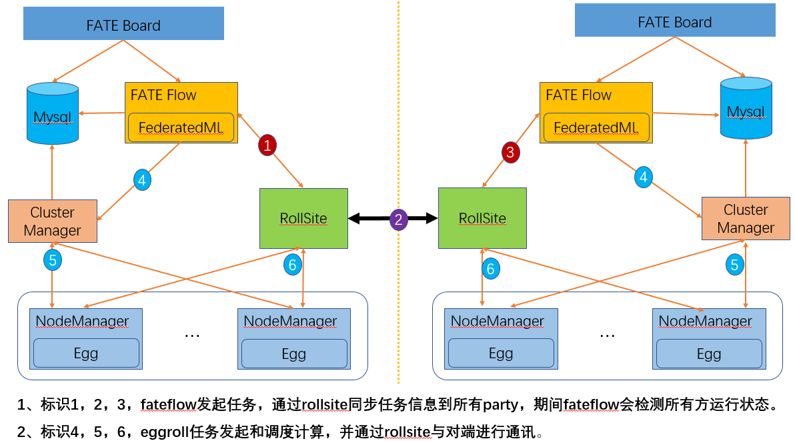

# Fate cluster部署指南

# 1.总体介绍

### 1.1.系统介绍

1）FATE

FATE (Federated AI Technology Enabler) 是微众银行AI部门发起的开源项目，
提供了一种基于数据隐私保护的安全计算框架，为机器学习、深度学习、迁移学习算法提供强有力的安全计算支持。
安全底层支持同态加密、秘密共享、哈希散列等多种多方安全计算机制，算法层支持多方安全计算模式下的逻辑回归、Boosting、联邦迁移学习等。

2）EggRoll

Eggroll 是一个适用于机器学习和深度学习的大规模分布式架构，包括了计算、存储和通信等模块。为FATE框架提供底层支撑。

3）FATE官方网站：https://fate.fedai.org/

本文将介绍使用ansible部署脚本进行FATE集群的部署。

### 1.2.组件说明

| 软件产品 | 组件           | 端口      | 说明                                   |
| -------- | -------------- | --------- | -------------------------------------- |
| fate     | fate_flow      | 9360;9380 | 联合学习任务流水线管理模块             |
| fate     | fateboard      | 8080      | 联合学习过程可视化模块                 |
| fate     | FederatedML    |           | 算法代码包                             |
| eggroll  | clustermanager | 4670      | cluster manager管理集群                |
| eggroll  | nodemanger     | 4671      | node manager管理每台机器资源           |
| eggroll  | rollsite       | 9370      | 跨站点或者跨party通讯组件              |
| mysql    | mysql          | 3306      | 数据存储，clustermanager和fateflow依赖 |

### 1.3.系统架构

<div style="text-align:center", align=center>

</div>

# 2.详细设计

## 2.1.部署规划

 本示例是每端只有一台主机，每端可以多台主机，目前只支持nodemanager多节点部署，其他组件都是单节点。

| role  | partyid | IP地址                | 操作系统                | 主机配置 | 存储 | 部署模块                                                     |
| ----- | ------- | --------------------- | ----------------------- | -------- | ---- | ------------------------------------------------------------ |
| host  | 10000   | 192.168.0.1 （有外网) | CentOS 7.2/Ubuntu 18.04 | 8C16G    | 500G | fate_flow，fateboard，clustermanager，nodemanger，rollsite，mysql |
| guest | 9999    | 192.168.0.2           | CentOS 7.2/Ubuntu 18.04 | 8C16G    | 500G | fate_flow，fateboard，clustermanager，nodemanger，rollsite，mysql |

备注：涉及exchange说明会用192.168.0.88表示其IP，但本次示例不涉及exchange的部署。

## 2.2.主机资源和操作系统要求

| **类别** | **说明**                                                     |
| -------- | ------------------------------------------------------------ |
| 主机配置 | 不低于8C16G500G，千兆网卡                                    |
| 操作系统 | CentOS linux 7.2及以上同时低于8/Ubuntu 18.04                 |
| 依赖包   | 需要安装如下依赖包：<br/>#centos<br/>gcc gcc-c++ make openssl-devel gmp-devel mpfr-devel libmpc-devel libaio <br/>numactl autoconf automake libtool libffi-devel ansible<br/>#ubuntu<br/>gcc g++ make openssl ansible libgmp-dev libmpfr-dev libmpc-dev <br/>libaio1 libaio-dev numactl autoconf automake libtool libffi-dev <br/>cd /usr/lib/x86_64-linux-gnu<br/>if [ ! -f "libssl.so.10" ];then<br/>   ln -s libssl.so.1.0.0 libssl.so.10<br/>   ln -s libcrypto.so.1.0.0 libcrypto.so.10<br/>fi |
| 用户     | 用户：app，属主：apps（app用户需可以sudo su root而无需密码） |
| 文件系统 | 1、数据盘挂载在/data目录下。<br>2、创建/data/projects目录，目录属主为：app:apps。<br/>3、根目录空闲空间不低于20G。 |
| 虚拟内存 | 不低于128G                                                   |
| 系统参数 | 1、文件句柄数不低于65535。<br>2、用户进程数不低于65535。     |

## 2.3.网络要求

| 类别         | 说明                                                         |
| ------------ | ------------------------------------------------------------ |
| 防火墙策略   | 1、如果通过公网互通，两端rollsite所部署主机需互相开通出和入防火墙策略。<br>2、防火墙设备需要支持长连接和需要对连接数无限制。 |
| 外网带宽     | 入通过公网互通，公网带宽不低于20Mb                           |
| 负载均衡设备 | 1、如果出或入口有负载均衡设备则此设备需要支持grpc或者支持透明转发。<br> 2、fate为双向通讯，需支持出和入方向主动请求。 |

3.基础环境配置
==============

3.1 hostname配置(可选)
----------------

**1）修改主机名**

**在192.168.0.1 root用户下执行：**

hostnamectl set-hostname VM_0_1_centos

**在192.168.0.2 root用户下执行：**

hostnamectl set-hostname VM_0_2_centos

**2）加入主机映射**

**在目标服务器（192.168.0.1 192.168.0.2）root用户下执行：**

vim /etc/hosts

192.168.0.1 VM_0_1_centos

192.168.0.2 VM_0_2_centos

3.2 关闭selinux(可选)
---------------

**在目标服务器（192.168.0.1 192.168.0.2）root用户下执行：**

确认是否已安装selinux

centos系统执行：rpm -qa | grep selinux

如果已安装了selinux就执行：setenforce 0

3.3 修改Linux系统参数
---------------------------

**在目标服务器（192.168.0.1 192.168.0.2）root用户下执行：**

1）清理20-nproc.conf文件

cd /etc/security/limits.d

ls -lrt 20-nproc.conf

存在则：mv 20-nproc.conf 20-nproc.conf_bak

2）vim /etc/security/limits.conf

\* soft nofile 65535

\* hard nofile 65535

\* soft nproc 65535

\* hard nproc 65535

重新登陆，ulimit -a查看是否生效

3.4 关闭防火墙
--------------

**在目标服务器（192.168.0.1 192.168.0.2 ）root用户下执行**

Centos系统：

systemctl disable firewalld.service

systemctl stop firewalld.service

systemctl status firewalld.service

3.5 软件环境初始化
------------------

**1）创建用户**

**在目标服务器（192.168.0.1 192.168.0.2）root用户下执行**

```
groupadd -g 6000 apps
useradd -s /bin/bash -g apps -d /home/app app
passwd app
```

**2）配置sudo**

**在目标服务器（192.168.0.1 192.168.0.2）root用户下执行**

vim /etc/sudoers.d/app

app ALL=(ALL) ALL

app ALL=(ALL) NOPASSWD: ALL

Defaults !env_reset

**3）配置ssh无密登录**

**注意：192.168.0.1不但需要可以免密登陆192.168.0.2，也需要可以免密登陆自身，配置完后务必手工ssh连接下自身和192.168.0.2，确认下认证信息。**

**a. 在目标服务器（192.168.0.1 192.168.0.2）app用户下执行**

su app

ssh-keygen -t rsa

cat \~/.ssh/id_rsa.pub \>\> /home/app/.ssh/authorized_keys

chmod 600 \~/.ssh/authorized_keys

**b.合并id_rsa_pub文件**

拷贝192.168.0.1的authorized_keys 到192.168.0.2
\~/.ssh目录下,追加到192.168.0.2的id_rsa.pub到authorized_keys，然后再拷贝到192.168.0.1

**在192.168.0.1 app用户下执行**

scp \~/.ssh/authorized_keys app\@192.168.0.2:/home/app/.ssh

输入密码

**在192.168.0.2 app用户下执行**

cat \~/.ssh/id_rsa.pub \>\> /home/app/.ssh/authorized_keys

scp \~/.ssh/authorized_keys app\@192.168.0.1:/home/app/.ssh

覆盖之前的文件

**c. 在目标服务器（192.168.0.1 192.168.0.2）app用户下执行ssh 测试**

ssh app\@192.168.0.1

ssh app\@192.168.0.2

## 3.6 增加虚拟内存

**目标服务器（192.168.0.1 192.168.0.2）root用户执行**

生产环境使用时，因内存计算需要增加128G虚拟内存，执行前需检查存储空间是否足够。

注意：dd执行时间较长，请耐心等待

```
cd /data
dd if=/dev/zero of=/data/swapfile128G bs=1024 count=134217728
mkswap /data/swapfile128G
swapon /data/swapfile128G
cat /proc/swaps
echo '/data/swapfile128G swap swap defaults 0 0' >> /etc/fstab
```

## 3.7 安装依赖包

**目标服务器（192.168.0.1 192.168.0.2）root用户执行**

```
#安装基础依赖包
#centos
yum install -y gcc gcc-c++ make openssl-devel gmp-devel mpfr-devel libmpc-devel libaio numactl autoconf automake
#ubuntu
apt-get install -y gcc g++ make openssl libgmp-dev libmpfr-dev libmpc-dev libaio1 libaio-dev numactl autoconf automake libtool libffi-dev
#如果有报错，需要解决依赖安装源问题。

#安装ansible和进程管理依赖包
#centos
yum install -y ansible
#ubuntu
apt-get install -y ansible

#如果安装有报错同时服务器有外网，没有外网的需要解决yum源不全的问题，执行：
#centos
yum install -y epel-release
#增加一个更全面的第三方的源，然后再重新安装ansible
```

4.项目部署
==========

### 4.1 部署示意图

<div style="text-align:center;width:500px",align=center>

</div>

### 4.2 系统检查

**在目标服务器（192.168.0.1 192.168.0.2）app用户下执行**

```
#虚拟内存，size不低于128G，如不满足需参考3.6章节重新设置
cat /proc/swaps
Filename                                Type            Size    Used    Priority
/data/swapfile128G                      file            134217724       384     -1

#文件句柄数，不低于65535，如不满足需参考3.3章节重新设置
ulimit -n
65535

#用户进程数，不低于64000，如不满足需参考3.3章节重新设置
ulimit -u
65535

#检查进程是否有fate进程残留,如有则需要停止服务
ps -ef| grep -i fate

netstat -tlnp | grep 4670
netstat -tlnp | grep 4671
netstat -tlnp | grep 9370
netstat -tlnp | grep 9371
netstat -tlnp | grep 9360
netstat -tlnp | grep 8080
netstat -tlnp | grep 3306

#检查部署目录，如有需先进行mv
ls -ld /data/projects/fate
ls -ld /data/projects/data
ls -ld /data/projects/snmp

#检查supervisord配置文件,如有则需要mv或者删除掉
ls -lrt /data/projects/common/supervisord/supervisord.d/fate-*.conf

```

### 4.3 获取项目

**在目标服务器（192.168.0.1 具备外网环境）app用户下执行**

进入执行节点的/data/projects/目录，执行：

```
#注意：URL链接有换行，拷贝的时候注意整理成一行
cd /data/projects/
wget https://webank-ai-1251170195.cos.ap-guangzhou.myqcloud.com/ansible_nfate_1.5.0_release-1.0.0.tar.gz
tar xzf ansible_nfate_1.5.0_release-1.0.0.tar.gz
```

### 4.4 配置文件修改和示例

#### 4.4.1 初始化配置文件

```
cd ansible-nfate-*
#init.sh文件不需要修改，主要是辅助生成一些配置文件
 
#生产环境加prod参数执行
 sh ./tools/init.sh prod
 
>sh ./tools/init.sh prod
clean old config
init environments/prod
init var_files/prod
init project_prod.yml
```

### 4.4.2 证书制作配置(可选)

1）证书制作

```
vi /data/projects/ansible-nfate-1.*/tools/make.sh

#1、自定义安全证书需同时部署两端，只部署一端需要手工处理证书，手工处理部分暂不介绍。
#2、安全证书支持如下部署方式：
    1）部署host+guest，host和guest使用安全证书通讯。
    2）部署host+exchange+guest，其中host和exchange使用安全证书通讯，guest和exchange普通通讯。
    3）部署host+exchange+guest，其中guest和exchange使用安全证书通讯，host和exchange普通通讯。

guest_host="192.168.0.1" ---根据实际IP修改
host_host="192.168.0.2" ---根据实际IP修改
exchange_host="192.168.0.88" ---根据实际IP修改，本示例不部署无需修改
```

2）执行脚本制作证书

```
cd tools
sh ./make.sh

在keys/host，guest目录下会产生证书文件。
```

3）拷贝证书到部署目录

```
sh cp-keys.sh host guest

证书文件会拷贝到roles/eggroll/files/keys目录

特别说明：
1、目前脚本部署只支持2方设置证书认证。（host&guest、host&exchange、guest&exchange)
```

#### 4.4.2 修改配置文件

**1）修改初始化主机IP**

```
vi /data/projects/ansible-nfate-1.*/environments/prod/hosts

#ansible格式配置文件
[fate]   ---把需要部署的主机IP填入fate组
192.168.0.1  
192.168.0.2

[deploy_check] ---把执行ansible的本机IP填入deploy_check组
192.168.0.1 

[all:vars]
ansible_connection=ssh
ansible_ssh_port=22   ---根据实际情况修改
ansible_ssh_user=app
#ansible_ssh_pass=test   ---如果未做免密登陆需提供密码
##method: sudo or su
ansible_become_method=sudo
ansible_become_user=root
ansible_become_pass=   ---各个主机未做免密sudo需填写root密码

```

**2）修改host方参数**

**注意：默认是不启用安全证书的配置，如果启用安全证书通讯需把server_secure，client_secure，is_secure设置为true，以及is_secure对应的port设置为9371**。

```
#不部署host方则不用修改
#除了nodemanger可以设置多个IP外，其他都是单个IP
vi /data/projects/ansible-nfate-1.*/var_files/prod/fate_host

host:
    partyid: 10000 ---host端partyid，根据实际规划修改
    rollsite:
      enable: True
      ips: ---IP列表，目前rollsite只支持部署到一台服务器
      - 192.168.0.1  
      port: 9370 ---grpc端口
      secure_port: 9371 ---grpcs端口
      pool_size: 600 ---线程池大小
      max_memory:    ---rollsite进程JVM内存参数，默认是物理内存的1/4，可根据实际情况设置,如12G，如果是rollsite专用的机器，配置成物理内存的75%。
      server_secure: False ---作为服务端，开启安全证书验证，不使用安全证书默认即可
      client_secure: False ---作为客户端，使用证书发起安全请求，不使用安全证书默认即可
      polling: ---是否使用单向模式，本示例不支持，默认false即可
        enable: False
      default_rules: ---本party指向exchange或者其他party的IP、端口路由配置
      - name: default
        ip: 192.168.0.2 ---exchange或者对端party rollsite IP
        port: 9370 ---exchange或者对端party rollsite 端口，一般默认9370，即无安全证书部署；如需开启安全证书通信，应设置为9371；
        is_secure: False ---是否使用安全认证通讯；需要结合server_secure或者client_secure使用，当三者都为true时，表示和下一跳rollsite使用安全认证通讯，同时上一个参数port需设置为9371；不使用安全证书默认即可。
      rules: ---本party自身路由配置
      - name: default
        ip: 192.168.0.1
        port: 9370
      - name: fateflow
        ip: 192.168.0.1
        port: 9360
    clustermanager:
      enable: True
      ips:
      - 192.168.0.1 ---只支持部署一台主机
      port: 4670
    nodemanager:
      enable: True
      ips: ---支持部署多台
      - 192.168.0.1
      - 192.168.0.x
      port: 4671
    eggroll: 
      dbname: "eggroll_meta"
      egg: 2
    fate_flow:
      enable: True
      ips:
      - 192.168.0.1  ---只支持部署一台主机
      grpcPort: 9360
      httpPort: 9380
      dbname: "fate_flow"
      proxy: rollsite ---fate_flow通讯服务的前置代理是rollsite还是nginx，默认即可
    fateboard:
      enable: True
      ips:
      - 192.168.0.1  ---只支持部署一台主机
      port: 8080
      dbname: "fate_flow"
    mysql:
      enable: True
      ips:
      - 192.168.0.1  ---只支持部署一台主机
      port: 3306
      dbuser: "fate"
      dbpasswd: "fate_deV2999"
    zk:
      enable: False
      lists:
      - ip: 192.168.0.1
        port: 2181
      use_acl: false
      user: "fate"
      passwd: "fate"
```

**4）修改guest参数**

**注意：默认是不启用安全证书的配置，如果启用安全证书通讯需把server_secure，client_secure，is_secure设置为true，以及is_secure对应的port设置为9371**。

```
#不部署guest方则不用修改
#除了nodemanger可以设置多个IP外，其他都是单个IP
vi /data/projects/ansible-nfate-1.*/var_files/prod/fate_guest

guest:
    partyid: 9999 ---根据实际规划修改
    rollsite:
      enable: True
      ips: ---IP列表，目前rollsite只支持部署到一台服务器
      - 192.168.0.2
      port: 9370 ---grpc端口
      secure_port: 9371 ---grpcs端口
      pool_size: 600 ---线程池大小
      max_memory:    ---rollsite进程JVM内存参数，默认是物理内存的1/4，可根据实际情况设置,如12G，如果是rollsite专用的机器，配置成物理内存的75%。
      server_secure: False ---作为服务端，开启安全证书验证，不使用安全证书默认即可
      client_secure: False ---作为客户端，使用证书发起安全请求，不使用安全证书默认即可
      polling: ---是否使用单向模式，本示例不支持，默认false即可
        enable: False
      default_rules:  ---本party指向exchange或者其他party的IP、端口路由配置
      - name: default
        ip: 192.168.0.1 ---exchange或者对端party rollsite IP
        port: 9370 ---exchange或者对端party rollsite 端口，一般默认9370，即无安全证书部署；如需开启安全证书通信，应设置为9371；
        is_secure: False ---server_secure或者client_secure为true，指向的下一跳rollsite也开启了安全认证，此参数需要设置为true，上一个参数port需设置为9371，不使用安全证书默认即可
      rules:  ---本party自身路由配置
      - name: default
        ip: 192.168.0.2
        port: 9370
      - name: fateflow
        ip: 192.168.0.2
        port: 9360
    clustermanager:
      enable: True
      ips:   ---只支持部署一台主机
      - 192.168.0.2
      port: 4670
    nodemanager:
      enable: True
      ips:  ---支持部署多台主机
      - 192.168.0.2
      - 192.168.0.x
      port: 4671
    eggroll:
      dbname: "eggroll_meta"
      egg: 2
    fate_flow:
      enable: True 
      ips:  ---只支持部署一台主机
      - 192.168.0.2
      grpcPort: 9360
      httpPort: 9380
      dbname: "fate_flow"
      proxy: rollsite  ---fate_flow通讯服务的前置代理是rollsite还是nginx，默认即可
    fateboard:
      enable: True
      ips:  ---只支持部署一台主机
      - 192.168.0.2
      port: 8080
      dbname: "fate_flow"
    mysql:
      enable: True
      ips:  ---只支持部署一台主机
      - 192.168.0.2
      port: 3306
      dbuser: "fate"
      dbpasswd: "fate_deV2999"
    zk:
      enable: False
      lists:
      - ip: 192.168.0.2
        port: 2181
      use_acl: false
      user: "fate"
      passwd: "fate"
```

**5）修改exchange参数**

**注意：默认是不启用安全证书的配置，如果启用安全证书通讯需把server_secure，client_secure，is_secure设置为true，以及is_secure对应的port设置为9371**。

```
#不部署exchange则不需要修改
vi /data/projects/ansible-nfate-1.*/var_files/prod/fate_exchange

exchange:
  enable: False --部署exchange需修改为True
  rollsite: 
    ips:
    - 192.168.0.88
    port: 9370
    secure_port: 9371 ---grpcs端口
    pool_size: 600
    max_memory:    ---rollsite进程JVM内存参数，默认是物理内存的1/4，可根据实际情况设置,如12G，如果是rollsite专用的机器，配置成物理内存的75%。
    server_secure: False ---作为服务端，开启安全证书验证，不使用安全证书默认即可
    client_secure: False ---作为客户端，使用证书发起安全请求，不使用安全证书默认即可
    polling:  ---是否使用单向模式，本示例不支持，默认false即可
      enable: False
      id: 10000
  partys:  ---指向各party的路由配置
  - id: 10000
    rules:
    - name: default
      ip: 192.168.0.1
      port: 9370  ---对应party rollsite 端口，一般默认9370，即无安全证书通讯；如需开启安全证书通信，应设置为9371；
      is_secure: False ---server_secure或者client_secure为true，指向的下一跳rollsite也开启了安全认证，此参数需要设置为true，上一个参数port需设置为9371，不使用安全证书默认即可
  - id: 9999
    rules:
    - name: default
      ip: 192.168.0.2
      port: 9370 ---对应party rollsite 端口，一般默认9370，即无安全证书通讯；如需开启安全证书通信，应设置为9371；
      is_secure: False ---server_secure或者client_secure为true，指向的下一跳rollsite也开启了安全认证，此参数需要设置为true，上一个参数port需设置为9371，不使用安全证书默认即可
```

### 4.5 部署

按照上述配置含义修改对应的配置项后，然后执行部署脚本：

```
#相对ansible-nfate-*目录
cd /data/projects/ansible-nfate-1.*
 
#生产环境加prod参数执行
nohup  sh ./boot.sh prod -D > logs/boot.log 2>&1 &

```

部署日志输出在logs目录下,实时查看是否有报错：

```
#相对ansible-nfate-*目录
cd logs
tail -f ansible.log （实时查看部署情况，如果没有这个日志文件，需要查看是否有安装ansible）

检查项不通过提示列表：
1、"Warning: now swap is 0, need to turn up" 
    ---没有设置虚拟内存，请参考前面章节进行设置，不低于128G。
2、"Warning: key fate process exists, please has a check and clean"
    ---环境没有清理干净，需要把以前部署的fate进程停掉。
3、"Warning: these ports: 4670 4671 9360 9370 9380 have been used"
    ---环境没有清理干净，需要把以前部署的fate进程停掉。
4、"Warning: if reinstall mysql, please stop mysql, and rename /etc/my.cnf"
    ---mysql没有停止，需要停止。如果有/etc/my.cnf文件，需要mv改名。
5、"Waring: please rename /data/projects/fate"
    ---fate目录存在，需要先mv。
6、"Warning: please rename /data/projects/data/fate/mysql"
    ---/data/projects/data存在，需要mv。
7、"Warning: supervisor_fate_conf exists, please remove ls /data/projects/common/supervisord/supervisord.d/fate-*.conf"
  ---/data/projects/common目录存在，需要mv。
```

fateflow部署完重启：

```
#因为fate_flow依赖的组件比较多，可能启动会有异常，处理如下：
netstat -tlnp | grep 9360
如果没有端口则重起fateflow：
sh service.sh stop fate-fateflow
sh service.sh start fate-fateflow
```

### 4.6 问题定位

1）eggroll日志

 /data/logs/fate/eggroll/bootstrap.clustermanager.err

/data/logs/fate/eggroll/logs/eggroll/clustermanager.jvm.err.log

/data/logs/fate/eggroll/logs/eggroll/nodemanager.jvm.err.log

/data/logs/fate/eggroll/logs/eggroll/bootstrap.nodemanager.err

/data/logs/fate/eggroll/logs/eggroll/bootstrap.rollsite.err

/data/logs/fate/eggroll/logs/eggroll/rollsite.jvm.err.log

2）fateflow日志

/data/logs/fate/python/logs/fate_flow/

3）fateboard日志

/data/logs/fate/fate/fateboard/logs

5.测试
======

5.1 Toy_example部署验证
-----------------------

此测试您需要设置3个参数：guest_partyid，host_partyid，work_mode。

### 5.1.1 单边测试

1）192.168.0.1上执行，guest_partyid和host_partyid都设为10000：

```
source /data/projects/fate/bin/init_env.sh
cd /data/projects/fate/examples/toy_example/
python run_toy_example.py 10000 10000 1
```

注意：如果超过1分钟没输出，表示部署有问题，需要看日志进行问题定位。

类似如下结果表示成功：

"2020-04-28 18:26:20,789 - secure_add_guest.py[line:126] - INFO: success to calculate secure_sum, it is 1999.9999999999998"

提示：如出现max cores per job is 1, please modify job parameters报错提示，需要修改当前目录下文件toy_example_conf.json中参数eggroll.session.processors.per.node为1.

2）192.168.0.2上执行，guest_partyid和host_partyid都设为9999：

```
source /data/projects/fate/bin/init_env.sh
cd /data/projects/fate/examples/toy_example/
python run_toy_example.py 9999 9999 1
```

注意：如果超过1分钟没输出，表示部署有问题，需要看日志进行问题定位。

类似如下结果表示成功：

"2020-04-28 18:26:20,789 - secure_add_guest.py[line:126] - INFO: success to calculate secure_sum, it is 1999.9999999999998"

### 5.1.2 双边测试

选定9999为guest方，在192.168.0.2上执行：

```
source /data/projects/fate/bin/init_env.sh
cd /data/projects/fate/examples/toy_example/
python run_toy_example.py 9999 10000 1
```

类似如下结果表示成功：

"2020-04-28 18:26:20,789 - secure_add_guest.py[line:126] - INFO: success to calculate secure_sum, it is 1999.9999999999998"

5.2 最小化测试
--------------

### **5.2.1 上传预设数据：**

分别在192.168.0.1和192.168.0.2上执行：

```
source /data/projects/fate/bin/init_env.sh
cd /data/projects/fate/examples/scripts/
python upload_default_data.py -m 1
```

更多细节信息，敬请参考[脚本README](../../examples/scripts/README.rst)

### **5.2.2 快速模式：**

请确保guest和host两方均已分别通过给定脚本上传了预设数据。

快速模式下，最小化测试脚本将使用一个相对较小的数据集，即包含了569条数据的breast数据集。

选定9999为guest方，在192.168.0.2上执行：

```
source /data/projects/fate/bin/init_env.sh
cd /data/projects/fate/examples/min_test_task/
python run_task.py -m 1 -gid 9999 -hid 10000 -aid 10000 -f fast
```

其他一些可能有用的参数包括：

1. -f: 使用的文件类型. "fast" 代表 breast数据集, "normal" 代表 default credit 数据集.
2. --add_sbt: 如果被设置为1, 将在运行完lr以后，启动secureboost任务，设置为0则不启动secureboost任务，不设置此参数系统默认为1。

若数分钟后在结果中显示了“success”字样则表明该操作已经运行成功了。若出现“FAILED”或者程序卡住，则意味着测试失败。

### **5.2.3 正常模式**：

只需在命令中将“fast”替换为“normal”，其余部分与快速模式相同。

5.3 Fateboard testing
----------------------

Fateboard是一项Web服务。如果成功启动了fateboard服务，则可以通过访问 http://192.168.0.1:8080 和 http://192.168.0.2:8080 来查看任务信息，如果本地办公电脑和服务器之间有防火墙则需开通。

6.系统运维
================

6.1 服务管理
------------

**在目标服务器（192.168.0.1 192.168.0.2）app用户下执行**

### 6.1.1 服务管理

```
cd /data/projects/common/supervisord
```

启动/关闭/重启/查看所有：

```
#注意：因mysql是基础组件，启动较慢，建议重启操作是先停止所有组件，然后先启动mysql，再启动其他组件
sh service.sh start/stop/restart/status all 

#说明：因为fateflow依赖的组件比较多，重启所有的操作可能会导致fateflow启动异常，处理如下：
netstat -tlnp | grep 9360
如果没有端口则重起fateflow：
sh service.sh stop fate-fateflow
sh service.sh start fate-fateflow
```

启动/关闭/重启/查看单个模块(可选：clustermanager，nodemanager，rollsite，fateflow，fateboard，mysql)：

```
sh service.sh start/stop/restart/status fate-clustermanager
```


## 6.2 查看进程和端口

**在目标服务器（192.168.0.1 192.168.0.2 ）app用户下执行**

### 6.2.1 查看进程

```
#根据部署规划查看进程是否启动
ps -ef | grep -i clustermanager
ps -ef | grep -i nodemanager
ps -ef | grep -i rollsite
ps -ef | grep -i fate_flow_server.py
ps -ef | grep -i fateboard
```

### 6.2.2 查看进程端口

```
#根据部署规划查看进程端口是否存在
#clustermanager
netstat -tlnp | grep 4670
#nodemanager
netstat -tlnp | grep 4671
#rollsite
netstat -tlnp | grep 9370
#fate_flow_server
netstat -tlnp | grep 9360
#fateboard
netstat -tlnp | grep 8080
```


## 6.2.3 服务日志

| 服务                             | 日志路径                       |
| -------------------------------- | ------------------------------ |
| eggroll                          | /data/logs/fate/eggroll/logs   |
| fate_flow&任务日志(fateflow节点) | /data/logs/fate/python/logs    |
| fateboard                        | /data/logs/fate/fateboard/logs |
| mysql                            | /data/logs/fate/mysql/         |

### 6.2.4 文件目录说明

| 文件路径                          | 说明                           |
| --------------------------------- | ------------------------------ |
| /data/projects/fate               | 软件部署路径                   |
| /data/projects/data               | mysql数据存放路径              |
| /data/logs                        | 日志路径                       |
| /data/projects/common/supervisord | 进程管理工具supervisor安装路径 |

# 7. 附录

## 7.1 Eggroll参数调优

配置文件路径：/data/projects/fate/eggroll/conf/eggroll.properties

配置参数：eggroll.session.processors.per.node

假定 CPU核数（cpu cores）为 c, Nodemanager的数量为 n，需要同时运行的任务数为 p，则：

egg_num=eggroll.session.processors.per.node = c * 0.8 / p

partitions （roll pair分区数）= egg_num * n