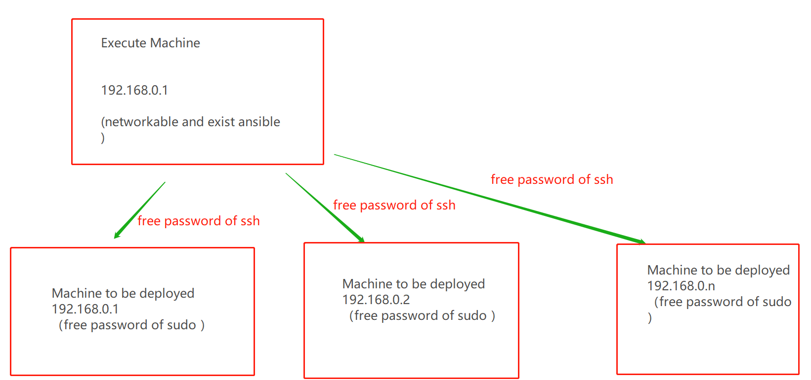

# FATE Cluster Deployment Guide

# 1\. Overview

### 1.1 System Overview

1\) FATE

FATE (Federated AI Technology Enabler) is an open-source project initiated by the AI department of WeBank. It provides a secure computing framework based on data privacy protection, offering strong secure computing support for machine learning, deep learning and transfer learning algorithms. The secure underlying layer supports various multi-party secure computing mechanisms such as homomorphic encryption, secret sharing, and hashing. The algorithm layer supports logistic regression, boosting, and federated transfer learning in multi-party secure computing mode.

2\) Eggroll

Eggroll is a large-scale distributed architecture for machine learning and deep learning, which includes computing, storage, communication, and other modules. It offers underlying support for the FATE framework.

3\) FATE Official Website: https://fate.fedai.org/

This document describes the deployment of FATE clusters by using the ansible deployment script.

### 1.2 Component Description

| Software| Component| Port| Description
|----------|----------|----------|----------
| fate| fate\_flow| 9360; 9380| The management module of federated learning task flow
| fate| fateboard| 8080| The visualization module of federated learning process
| fate| FederatedML| | The algorithm code package
| eggroll| clustermanager| 4670| The cluster manager manages clusters
| eggroll| nodemanger| 4671| The node manager manages the resources of each machine
| eggroll| rollsite| 9370| The cross-site/party communication component
| mysql| mysql| 3306| The data storage, relied on by clustermanager and fateflow

### 1.3 System Architecture


# 2\. Design Details

## 2.1 Deployment Planning

In this example, there is only one host on each end (in real scenario, there can be more than one). Multi-node deployment is currently supported only for nodemanager. For all other components, single-node deployment is supported.

| role| partyid| IP Address| Operating System| Host Configuration| Storage| Deployment Module
|----------|----------|----------|----------|----------|----------|----------
| host| 10000| 192.168.0.1 (with extranet)| CentOS 7.2/Ubuntu 18.04| 8C, 16G| 500G| fate\_flow, fateboard, clustermanager, nodemanger, rollsite, mysql
| guest| 9999| 192.168.0.2| CentOS 7.2/Ubuntu 18.04| 8C, 16G| 500G| fate\_flow, fateboard, clustermanager, nodemanger, rollsite, mysql

Note: When describing exchange, we use 192.168.0.88 as its IP. But, the deployment of exchange is not covered in this example.

## 2.2 Host Resource and OS Requirements

| **Item**| **Description**
|----------|----------
| Host Configuration| Minimum 8C, 16G, 500G; GbE network interface card
| Operating System| CentOS Linux 7.2+ (below 8)/Ubuntu 18.04
| Dependency Package| The following dependency packages are required: <br/>#centos<br/>gcc gcc-c++ make openssl-devel gmp-devel mpfr-devel libmpc-devel libaio <br/>numactl autoconf automake libtool libffi-devel ansible<br/>#ubuntu<br/>gcc g++ make openssl ansible libgmp-dev libmpfr-dev libmpc-dev <br/>libaio1 libaio-dev numactl autoconf automake libtool libffi-dev <br/>cd /usr/lib/x86\_64-linux-gnu<br/>if \[ ! -f "libssl.so.10" ];then<br/>   ln -s libssl.so.1.0.0 libssl.so.10<br/>   ln -s libcrypto.so.1.0.0 libcrypto.so.10<br/>fi
| User| User: app, Owner: apps (the app user should be able to execute sudo su root without entering a password)
| File System| 1\. Mount the data disk in the /data directory.<br> 2\. Create the /data/projects directory with the directory owner of app:apps.<br/> 3\. The root directory should have a minimum of 20G free space.
| Virtual Memory| Minimum 128G
| System Parameters| 1\. The number of file handles is not less than 65535.<br> 2\. The number of user processes is not less than 65535.

## 2.3 Network Requirements

| Item| Description
|----------|----------
| Firewall Policy| 1\. For connection through a pubic network, the hosts deployed by rollsite at both ends need to enable the firewall policies for mutual outbound and inbound connection.<br> 2\. The firewall device must support persistent connections without limiting the number of connections.
| Extranet Bandwidth| Inbound connection through public network with a minimum of 20Mb bandwidth
| Load Balancing Device| 1\. If there is a load balancing device at entry or exit, the device must support grpc or transparent forwarding.<br> 2\. FATE requires two-way communication, and must support active inbound and outbound requests.

# 3\. Basic Environment Configuration

## 3.1 Configure hostname

**1\) Modify hostname**

**Execute as root user on 192.168.0.1:**

hostnamectl set-hostname VM\_0\_1\_centos

**Execute as root user on 192.168.0.2:**

hostnamectl set-hostname VM\_0\_2\_centos

**2\) Add Host Mapping**

**Execute as root user on the destination server (192.168.0.1, 192.168.0.2):**

vim /etc/hosts

192.168.0.1 VM\_0\_1\_centos

192.168.0.2 VM\_0\_2\_centos

## 3.2 Shutdown selinux

**Execute as root user on the destination server (192.168.0.1, 192.168.0.2):**

Confirm if selinux is installed

For CentOS, execute: rpm -qa \| grep selinux

If selinux is installed, execute: setenforce 0

## 3.3 Modify Linux System Parameters

**Execute as root user on the destination server (192.168.0.1, 192.168.0.2):**

1\) Clean up the 20-nproc.conf file

cd /etc/security/limits.d

ls -lrt 20-nproc.conf

If this file exists: mv 20-nproc.conf 20-nproc.conf\_bak

2\) vim /etc/security/limits.conf

\* soft nofile 65535

\* hard nofile 65535

\* soft nproc 65535

\* hard nproc 65535

Log in again, and execute ulimit -a to check whether the change takes effect

## 3.4 Turn Firewall Off

**Execute as root user on the destination server (192.168.0.1, 192.168.0.2)**

For CentOS:

systemctl disable firewalld.service

systemctl stop firewalld.service

systemctl status firewalld.service

## 3.5 Initialize Software Environment

**1\) Create User**

**Execute as root user on the destination server (192.168.0.1, 192.168.0.2)**

```
groupadd -g 6000 apps
useradd -s /bin/bash -g apps -d /home/app app
passwd app
```

**2\) Configure sudo**

**Execute as root user on the destination server (192.168.0.1, 192.168.0.2)**

vim /etc/sudoers.d/app

app ALL=(ALL) ALL

app ALL=(ALL) NOPASSWD: ALL

Defaults !env\_reset

**3\) Configure Passwordless SSH Login**

**Note: 192.168.0.1 requires logging into 192.168.0.2 and itself without entering a password. After the configuration is completed, make sure to manually connect 192.168.0.1 and 192.168.0.2 by ssh and verify the authentication information.**

**a. Execute as app user on the destination server (192.168.0.1, 192.168.0.2)**

su app

ssh-keygen -t rsa

cat ~/.ssh/id\_rsa.pub >> /home/app/.ssh/authorized\_keys

chmod 600 ~/.ssh/authorized\_keys

**b. Merge id\_rsa\_pub file**

Copy authorized\_keys of 192.168.0.1 to ~/.ssh directory of 192.168.0.2, append id\_rsa.pub of 192.168.0.2 to authorized\_keys, then copy it back to 192.168.0.1

**Execute as app user on 192.168.0.1**

scp ~/.ssh/authorized\_keys app@192.168.0.2:/home/app/.ssh

Enter the password

**Execute as app user on 192.168.0.2**

cat ~/.ssh/id\_rsa.pub >> /home/app/.ssh/authorized\_keys

scp ~/.ssh/authorized\_keys app@192.168.0.1:/home/app/.ssh

Overwrite the previous file

**c. Execute ssh testing as app user on the destination server (192.168.0.1, 192.168.0.2)**

ssh app@192.168.0.1

ssh app@192.168.0.2

Note: Make sure to execute this connection test to verify the configuration is correct and the interaction can be performed without entering Yes, otherwise it will get stuck during deployment.

## 3.6 Increase Virtual Memory

**Execute as root user on the destination server (192.168.0.1, 192.168.0.2)**

In the production environment, an additional of 128G virtual memory is required for RAM computing. Make sure to check if there is enough storage space before operation.

Note: It will take a long time for dd to execute, please wait patiently.

```
cd /data
dd if=/dev/zero of=/data/swapfile128G bs=1024 count=134217728
mkswap /data/swapfile128G
swapon /data/swapfile128G
cat /proc/swaps
echo '/data/swapfile128G swap swap defaults 0 0' >> /etc/fstab
```

## 3.7 Install Dependency Package

**Execute as root user on the destination server (192.168.0.1, 192.168.0.2)**

```
#Install the basic dependency package
#centos
yum install -y gcc gcc-c++ make openssl-devel gmp-devel mpfr-devel libmpc-devel libaio numactl autoconf automake
#ubuntu
apt-get install -y gcc g++ make openssl libgmp-dev libmpfr-dev libmpc-dev libaio1 libaio-dev numactl autoconf automake libtool libffi-dev
#Fix the problem with dependency installation source if any error occurs

#Install ansible and process management dependency package
#centos
yum install -y ansible
#ubuntu
apt-get install -y ansible

#If any installation error occurs and the server has extranet (when there is no extranet, fix the incomplete yum source issue), execute:
#centos
yum install -y epel-release
#Add a more complete third-party source and then reinstall ansible
```

# 4\. Project Deployment

### 4.1 Deployment Diagram



### 4.2 System Check

**Execute as app user on the destination server (192.168.0.1, 192.168.0.2)**

```
#Virtual memory, minimum 128G in size; otherwise, refer to section 3.6 for resetting
cat /proc/swaps
Filename                                Type            Size    Used    Priority
/data/swapfile128G                      file            134217724       384     -1

#File handles, minimum 65535 in number; otherwise, refer to section 3.3 for resetting
ulimit -n
65535

#User processes, minimum 64000 in number; otherwise, refer to section 3.3 for resetting
ulimit -u
65535

#Check for any residual fate process, and stop the service if any
ps -ef| grep -i fate

netstat -tlnp | grep 4670
netstat -tlnp | grep 4671
netstat -tlnp | grep 9370
netstat -tlnp | grep 9371
netstat -tlnp | grep 9360
netstat -tlnp | grep 8080
netstat -tlnp | grep 3306

#Check for the deployment directory, and execute mv if any
ls -ld /data/projects/fate
ls -ld /data/projects/data
ls -ld /data/projects/snmp

#Check for the supervisord profile, and execute mv or delete it if any
ls -lrt /data/projects/common/supervisord/supervisord.d/fate-*.conf

```

### 4.3 Obtain Project

**Execute as app user on the destination server (192.168.0.1 with extranet environment)**

Go to the /data/projects/ directory of the execution node and execute:

```
#Note: The URL link has a line break. When copying, adjust it into one line
cd /data/projects/
wget https://webank-ai-1251170195.cos.ap-guangzhou.myqcloud.com/ansible_nfate_1.5.1_release-1.0.0.tar.gz
tar xzf ansible_nfate_1.5.1_release-1.0.0.tar.gz
```

### 4.4 Profile Modification and Examples

#### 4.4.1 Initialize Profile

```
cd ansible-nfate-*
#There is no need to modify the init.sh file, which is mainly used for generating some profiles
 
#For the production environment, execute with prod argument
 sh ./tools/init.sh prod
 
>sh ./tools/init.sh prod
clean old config
init environments/prod
init var_files/prod
init project_prod.yml
```

### 4.4.2 Configure Certificate Creation (Optional)

1\) Create Certificate

```
vi /data/projects/ansible-nfate-1.*/tools/make.sh

#1. The custom security certificate needs to be deployed on both ends, and only deploying it on one end will require manual processing of the certificate. The manual processing is not covered in this document.
#2. The security certificate supports the following deployment methods:
    1) host+guest deployment, where host and guest communicate with the security certificate.
    2) host+exchange+guest deployment, where host and exchange communicate with the security certificate, and guest and exchange communicate normally.
    3) host+exchange+guest deployment, where guest and exchange communicate with the security certificate, and host and exchange communicate normally.

guest_host="192.168.0.1" ---modify with the actual IP
host_host="192.168.0.2" ---modify with the actual IP
exchange_host="192.168.0.88" ---modify with the actual IP; there is no deployment in this example, so it does not need to be modified
```

2\) Execute Certificate Creation Script

```
cd tools
sh ./make.sh

The certificate file will be generated in the keys/host, guest directory
```

3\) Copy Certificate to Deployment Directory

```
sh cp-keys.sh host guest

The certificate file will be copied to the roles/eggroll/files/keys directory

Special note:
1. The script deployment now only supports two parties to set certificate authentication.
```

#### 4.4.3 Modify Profile

**1\) Modify Host IPs**

```
vi /data/projects/ansible-nfate-1.*/environments/prod/hosts

#The profile in ansible format
[fate]   ---enter the IPs of the target host in this group
192.168.0.1  
192.168.0.2

[deploy_check] ---enter the IP of this machine that will be executing ansible into the deploy_check group
192.168.0.1 

[all:vars]
ansible_connection=ssh
ansible_ssh_port=22   ---modify according to the actual situation
ansible_ssh_user=app
#ansible_ssh_pass=test   ---need providing a password if passwordless login is not configured
##method: sudo or su
ansible_become_method=sudo
ansible_become_user=root
ansible_become_pass=   ---need entering the root password if passwordless sudo is not configured for each host

```

**2\) Modify Host Parameters**

**Note: By default, the configuration of security certificate is not enabled. To enable security certificate communication, a user must set server\_secure, client\_secure, is\_secure to true, and the port for is\_secure to 9371.**

```
#Keep it unmodified if not deploying on host
#A single IP should be set for all components except for nodemanger, which can be set with multiple IPs
vi /data/projects/ansible-nfate-1.*/var_files/prod/fate_host

host:
    10000 ---the partyid of host, modify according to the actual plan
    rollsite:
      enable: True
      ips: ---list of IPs; rollsite now only supports deployment on one server
      - 192.168.0.1  
      port: 9370 ---grpc port
      secure_port: 9371 ---grpcs port
      pool_size: 600 ---thread pool size, recommended: min (1000 + len (party_ids) * 200, 5000)
      max_memory:    ---JVM memory parameter of rollsite process, which is 1/4 of physical memory by default, and can be set to, for example, 12G for actual need, or set to 75% of physical memory for the machine dedicated for rollsite.
      server_secure: False ---as a server, enable the security certificate verification, or keep the default setting if not using the security certificate
      client_secure: False ---as a client, initiate the secure request by using the security certificate, or keep the default setting if not using the security certificate
      polling: ---whether the one-way mode is used; it is not supported in this example; keep false by default
        enable: False
      default_rules: ---this party points to the IP and port routing configuration of exchange or other parties
      - name: default
        ip: 192.168.0.2 ---the rollsite IP of exchange or the peer party
        port: 9370 ---the rollsite port of exchange or the peer party, which is 9370 by default, i.e., deploying without the security certificate; if a user needs to enable communication with the security certificate, it should be set to 9371;
        is_secure: False ---whether to communicate with the security certificate; it needs to be used with server_secure or client_secure; when all the three parameters are set to true, it means communicating with the next-hop rollsite by using the security certificate, and the previous parameter port should be set to 9371; keep the default setting if not using the security certificate.
      rules: ---the routing configuration of this party
      - name: default
        ip: 192.168.0.1
        port: 9370
      - name: fateflow
        ip: 192.168.0.1
        port: 9360
    clustermanager:
      enable: True
      ips:
      - 192.168.0.1 ---only support deployment on one host
      port: 4670
      cores_per_node: 16 ---the number of cpu cores for nodemanager node; set to the minimum number for multiple nodemanager nodes
    nodemanager:
      enable: True
      ips: ---support deployment on multiple machines
      - 192.168.0.1
      - 192.168.0.x
      port: 4671
    eggroll: 
      dbname: "eggroll_meta"
      egg: 2
    fate_flow:
      enable: True
      ips:
      - 192.168.0.1  ---only support deployment on one host
      grpcPort: 9360
      httpPort: 9380
      dbname: "fate_flow"
      proxy: rollsite ---whether the front proxy of fate_flow communication service is rollsite or nginx; keep the default setting
    fateboard:
      enable: True
      ips:
      - 192.168.0.1  ---only support deployment on one host
      port: 8080
      dbname: "fate_flow"
    mysql:
      enable: True
      ips:
      - 192.168.0.1  ---only support deployment on one host
      port: 3306
      dbuser: "fate"
      dbpasswd: "fate_deV2999"
    zk:
      enable: False
      lists:
      - ip: 192.168.0.1
        port: 2181
      use_acl: false
      user: "fate"
      passwd: "fate"
    servings:
     ip: 192.168.0.1
     port: 8000
```

**3\) Modify Guest Parameters**

**Note: By default, the configuration of security certificate is not enabled. To enable security certificate communication, a user must set server\_secure, client\_secure, is\_secure to true, and the port for is\_secure to 9371.**

```
#Keep it unmodified if not deploying on guest
#A single IP should be set for all components except for nodemanger, which can be set with multiple IPs
vi /data/projects/ansible-nfate-1.*/var_files/prod/fate_guest

guest:
    partyid: 9999 ---modify according to the actual plan
    rollsite:
      enable: True
      ips: ---list of IPs; rollsite now only supports deployment on one server
      - 192.168.0.2
      port: 9370 ---grpc port
      secure_port: 9371 ---grpcs port
      pool_size: 600 ---thread pool size, recommended: min (1000 + len (party_ids) * 200, 5000)
      max_memory:    ---JVM memory parameter of rollsite process, which is 1/4 of physical memory by default, and can be set to, for example, 12G for actual need, or set to 75% of physical memory for the machine dedicated for rollsite.
      server_secure: False ---as a server, enable the security certificate verification, or keep the default setting if not using the security certificate
      client_secure: False ---as a client, initiate the secure request by using the security certificate, or keep the default setting if not using the security certificate
      polling: ---whether the one-way mode is used; it is not supported in this example; keep false by default
        enable: False
      default_rules:  ---this party points to the IP and port routing configuration of exchange or other parties
      - name: default
        ip: 192.168.0.1 ---the rollsite IP of exchange or the peer party
        port: 9370 ---the rollsite port of exchange or the peer party, which is 9370 by default, i.e., deploying without the security certificate; if a user needs to enable communication with the security certificate, it should be set to 9371;
        is_secure: False ---when server_secure or client_secure is true, and the security certification is enabled for the next-hop rollsite, this parameter should be set to true and the previous parameter port should be set to 9371; keep the default setting if not using the security certificate
      rules:  ---the routing configuration of this party
      - name: default
        ip: 192.168.0.2
        port: 9370
      - name: fateflow
        ip: 192.168.0.2
        port: 9360
    clustermanager:
      enable: True
      ips:   ---only support deployment on one host
      - 192.168.0.2
      port: 4670
      cores_per_node: 16 ---the number of cpu cores for nodemanager node; set to the minimum number for multiple nodemanager nodes
    nodemanager:
      enable: True
      ips:  ---support deployment on multiple hosts
      - 192.168.0.2
      - 192.168.0.x
      port: 4671
    eggroll:
      dbname: "eggroll_meta"
      egg: 2
    fate_flow:
      enable: True 
      ips:  ---only support deployment on one host
      - 192.168.0.2
      grpcPort: 9360
      httpPort: 9380
      dbname: "fate_flow"
      proxy: rollsite  ---whether the front proxy of fate_flow communication service is rollsite or nginx; keep the default setting
    fateboard:
      enable: True
      ips:  ---only support deployment on one host
      - 192.168.0.2
      port: 8080
      dbname: "fate_flow"
    mysql:
      enable: True
      ips:  ---only support deployment on one host
      - 192.168.0.2
      port: 3306
      dbuser: "fate"
      dbpasswd: "fate_deV2999"
    zk:
      enable: False
      lists:
      - ip: 192.168.0.2
        port: 2181
      use_acl: false
      user: "fate"
      passwd: "fate"
   servings:
     ip: 192.168.0.2
     port: 8000
```

**4\) Modify Exchange Parameters**

**Note: By default, the configuration of security certificate is not enabled. To enable security certificate communication, a user must set server\_secure, client\_secure, is\_secure to true, and the port for is\_secure to 9371.**

```
#Keep it unmodified if not deploying on exchange
vi /data/projects/ansible-nfate-1.*/var_files/prod/fate_exchange

exchange:
  enable: False ---modify to True if deploying on exchange
  rollsite: 
    ips:
    - 192.168.0.88
    port: 9370
    secure_port: 9371 ---grpcs port
    pool_size: 600, recommended: min (1000 + len (party_ids) * 200, 5000)
    max_memory:    ---JVM memory parameter of rollsite process, which is 1/4 of physical memory by default, and can be set to, for example, 12G for actual need, or set to 75% of physical memory for the machine dedicated for rollsite.
    server_secure: False ---as a server, enable the security certificate verification, or keep the default setting if not using the security certificate
    client_secure: False ---as a client, initiate the secure request by using the security certificate, or keep the default setting if not using the security certificate
    polling:  ---whether the one-way mode is used; it is not supported in this example; keep false by default
      enable: False
      id: 10000
  partys:  ---point to the routing configuration of each party
  - id: 10000
    rules:
    - name: default
      ip: 192.168.0.1
      port: 9370  ---the rollsite port of corresponding party, which is 9370 by default, i.e., communicating without the security certificate; if a user needs to enable communication with the security certificate, it should be set to 9371;
      is_secure: False ---when server_secure or client_secure is true, and the security certification is enabled for the next-hop rollsite, this parameter should be set to true and the previous parameter port should be set to 9371; keep the default setting if not using the security certificate
  - id: 9999
    rules:
    - name: default
      ip: 192.168.0.2
      port: 9370 ---the rollsite port of corresponding party, which is 9370 by default, i.e., communicating without the security certificate; if a user needs to enable communication with the security certificate, it should be set to 9371;
      is_secure: False ---when server_secure or client_secure is true, and the security certification is enabled for the next-hop rollsite, this parameter should be set to true and the previous parameter port should be set to 9371; keep the default setting if not using the security certificate
```

### 4.5 Deployment

Modify the corresponding configuration items according to the above configuration definition, then execute the deployment script:

```
#Relative to the ansible-nfate-* directory
cd /data/projects/ansible-nfate-1.*
 
#For the production environment, execute with prod argument
nohup  sh ./boot.sh prod -D > logs/boot.log 2>&1 &

```

The deployment log is located in the logs directory. A user can check it in real time to see if there are any errors:

```
#Relative to the ansible-nfate-* directory
cd logs
tail -f ansible.log (check the deployment status in real time; if this log file is not found, verify if ansible is installed)

List of messages for failed check items:
1. "Warning: now swap is 0, need to turn up" 
    ---No virtual memory is set; refer to the previous section for setting; minimum 128G.
2. "Warning: key fate process exists, please has a check and clean"
    ---The environment is not cleaned up, and the fate process deployed previously should be stopped.
3. "Warning: these ports: 4670 4671 9360 9370 9380 have been used"
    ---The environment is not cleaned up, and the fate process deployed previously should be stopped.
4. "Warning: if reinstall mysql, please stop mysql, and rename /etc/my.cnf"
    ---mysql does not stop, please stop it. If there is a /etc/my.cnf file, execute mv to rename it.
5. "Waring: please rename /data/projects/fate"
    ---The fate directory exists, please execute mv first.
6. "Warning: please rename /data/projects/data/fate/mysql"
    ---The /data/projects/data exists, please execute mv.
7. "Warning: supervisor_fate_conf exists, please remove ls /data/projects/common/supervisord/supervisord.d/fate-*.conf"
  ---The /data/projects/common directory exists, please execute mv.
```

Restart after the fateflow deployment:

```
#Because fate_flow depends on many components, an exception may occur while starting it, which can be handled as follows:
netstat -tlnp | grep 9360
If the port is not used, restart fateflow:
sh service.sh stop fate-fateflow
sh service.sh start fate-fateflow
```

### 4.6 Troubleshooting

1\) Eggroll Logs

/data/logs/fate/eggroll/bootstrap.clustermanager.err

/data/logs/fate/eggroll/logs/eggroll/clustermanager.jvm.err.log

/data/logs/fate/eggroll/logs/eggroll/nodemanager.jvm.err.log

/data/logs/fate/eggroll/logs/eggroll/bootstrap.nodemanager.err

/data/logs/fate/eggroll/logs/eggroll/bootstrap.rollsite.err

/data/logs/fate/eggroll/logs/eggroll/rollsite.jvm.err.log

2\) Fateflow Logs

/data/logs/fate/python/logs/fate\_flow/

3\) Fateboard Logs

/data/logs/fate/fate/fateboard/logs

# 5\. Testing

## 5.1 Verify toy\_example Deployment

A user must set 3 parameters for this testing: guest\_partyid, host\_partyid, and work\_mode.

### 5.1.1 One-Sided Testing

1\) Execute on 192.168.0.1, with both guest\_partyid and host\_partyid set to 10000:

```
source /data/projects/fate/bin/init_env.sh
cd /data/projects/fate/examples/toy_example/
python run_toy_example.py 10000 10000 1
```

Note: If no output is received after 1 minute, it means that there is a problem with the deployment. Check the logs to locate the problem.

A result similar to the following indicates successful operation:

"2020-04-28 18:26:20,789 - secure\_add\_guest.py\[line:126] - INFO: success to calculate secure\_sum, it is 1999.9999999999998"

Tip: If the error "max cores per job is 1, please modify job parameters" appears, a user needs to modify the parameter task\_cores to 1 in the toy\_example\_conf.json file under the current directory.

2\) Execute on 192.168.0.2, with both guest\_partyid and host\_partyid set to 9999:

```
source /data/projects/fate/bin/init_env.sh
cd /data/projects/fate/examples/toy_example/
python run_toy_example.py 9999 9999 1
```

Note: If no output is received after 1 minute, it means that there is a problem with the deployment. Check the logs to locate the problem.

A result similar to the following indicates successful operation:

"2020-04-28 18:26:20,789 - secure\_add\_guest.py\[line:126] - INFO: success to calculate secure\_sum, it is 1999.9999999999998"

### 5.1.2 Two-Sided Testing

Select 9999 as the guest and execute on 192.168.0.2:

```
source /data/projects/fate/bin/init_env.sh
cd /data/projects/fate/examples/toy_example/
python run_toy_example.py 9999 10000 1
```

A result similar to the following indicates successful operation:

"2020-04-28 18:26:20,789 - secure\_add\_guest.py\[line:126] - INFO: success to calculate secure\_sum, it is 1999.9999999999998"

## 5.2 Minimization Testing

### **5.2.1 Upload Preset Data:**

Execute on 192.168.0.1 and 192.168.0.2 respectively:

```
source /data/projects/fate/bin/init_env.sh
cd /data/projects/fate/examples/scripts/
python upload_default_data.py -m 1
```

For more details, refer to [Script Readme](../../examples/scripts/README.rst)

### **5.2.2 Fast Mode:**

Ensure that both the guest and host have uploaded the preset data with the given script.

In fast mode, the minimization testing script will use a relatively small breast dataset containing 569 pieces of data.

Select 9999 as the guest and execute on 192.168.0.2:

```
source /data/projects/fate/bin/init_env.sh
cd /data/projects/fate/examples/min_test_task/
#One-sided testing
python run_task.py -m 1 -gid 9999 -hid 9999 -aid 9999 -f fast
#Two-sided testing
python run_task.py -m 1 -gid 9999 -hid 10000 -aid 10000 -f fast
```

Other parameters that may be useful include:

1. -f: The file type used. Here, "fast" represents the breast dataset, and "normal" represents the default credit dataset.
2. --add\_sbt: When set to 1, the secureboost task will start after running lr. When set to 0, the secureboost task will not start. When not set, this parameter will default to 1.

The word "success" will display in the result after a few minutes to indicate the operation has been completed successfully. If "FAILED" appears or the program gets stuck, it means that the test has failed.

### **5.2.3 Normal Mode**:

Just replace "fast" with "normal" in the command. All other parts are identical to fast mode.

## 5.3 Fateboard Testing

Fateboard is a web service. When started, it allows a user to view task information by visiting http://192.168.0.1:8080 and http://192.168.0.2:8080. If there is a firewall between the browser and the server, a user needs to turn it on.

# 6\. System Operation and Administration

## 6.1 Service Management

**Execute as app user on the destination server (192.168.0.1, 192.168.0.2)**

### 6.1.1 Service Management

```
cd /data/projects/common/supervisord
```

Start/Shutdown/Restart/View all modules:

```
#Note: mysql as a basic component is slow to start, so it is recommended to stop all components first, then start mysql before other components
sh service.sh start/stop/restart/status all 

#Note: Because fateflow depends on many components, an exception may occur while starting fateflow if all modules are being restarted, which can be handled as follows:
netstat -tlnp | grep 9360
If the port is not used, restart fateflow:
sh service.sh stop fate-fateflow
sh service.sh start fate-fateflow
```

Start/Shutdown/Restart/View a single module (clustermanager, nodemanager, rollsite, fateflow, fateboard, mysql):

```
sh service.sh start/stop/restart/status fate-clustermanager
```

## 6.2 View Processes and Ports

**Execute as app user on the destination server (192.168.0.1, 192.168.0.2)**

### 6.2.1 View Processes

```
#Check if the process is started according to the deployment plan
ps -ef | grep -i clustermanager
ps -ef | grep -i nodemanager
ps -ef | grep -i rollsite
ps -ef | grep -i fate_flow_server.py
ps -ef | grep -i fateboard
```

### 6.2.2 View Process Ports

```
#Check if the process port exists according to the deployment plan
#clustermanager
netstat -tlnp | grep 4670
#nodemanager
netstat -tlnp | grep 4671
#rollsite
netstat -tlnp | grep 9370
#fate_flow_server
netstat -tlnp | grep 9360
#fateboard
netstat -tlnp | grep 8080
```

## 6.2.3 Service Logs

| Service| Log Path
|----------|----------
| eggroll| /data/logs/fate/eggroll/logs
| fate\_flow \& task log (fateflow node)| /data/logs/fate/python/logs
| fateboard| /data/logs/fate/fateboard/logs
| mysql| /data/logs/fate/mysql/

### 6.2.4 Description of File Directory

| File Path| Description
|----------|----------
| /data/projects/fate| The software deployment path
| /data/projects/data| The mysql data storage path
| /data/logs| The log path
| /data/projects/common/supervisord| The installation path of the process management tool "supervisor"

# 7\. Uninstallation

#### 7.1 Overview

Support the uninstallation of all services or a single service.

#### 7.2 Perform Uninstallation

```
cd /data/projects/ansible-nfate-1.*
sh ./uninstall.sh prod all

#Description of uninstall command
sh ./uninstall.sh $arg1 $arg2
- $arg1 is the same as that executed by init in step 4.4.1, which is test|prod.
- $arg2 refers to the selected service, with the options of (all|mysql|eggroll|fate_flow|fateboard), where all means uninstalling all services.
```

# 8\. Appendix

## 8.1 Eggroll Parameter Tuning

Assuming that the number of CPU cores is c, the number of nodemanagers is n, and the number of tasks to be executed simultaneously is p, then:

egg\_num=eggroll.session.processors.per.node = c \* 0.8 / p

partitions (roll pair partition number) = egg\_num \* n

The parameters used by the job can be specified with the job parameters in job conf:

1. egg\_num: configure task\_cores or configure processors\_per\_node parameter in eggroll\_run
2. partitions: configure computing\_partitions

For more information about configuring job submission, refer to [dsl\_conf\_v2\_setting\_guide\_zh](../../doc/dsl_conf_v2_setting_guide_zh.rst)