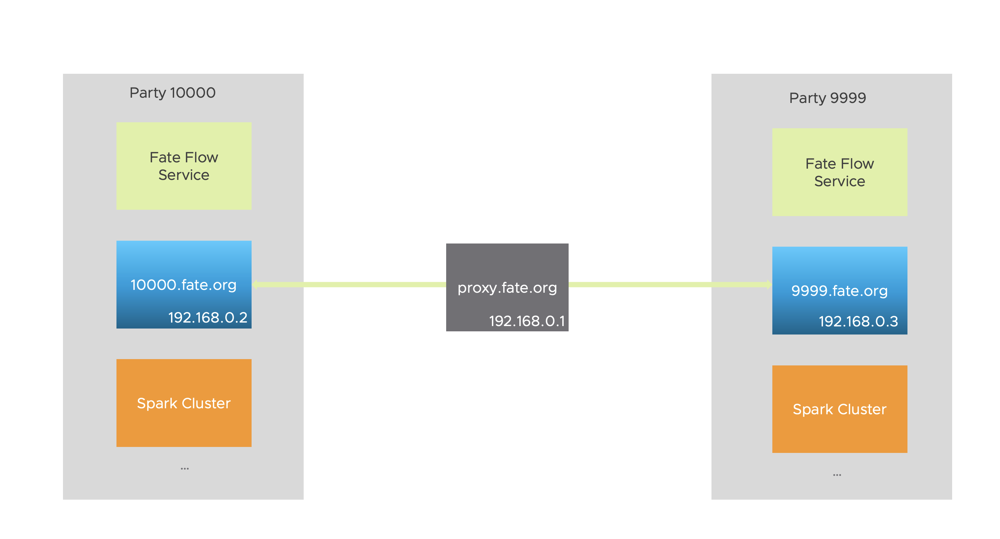

# FATE on Spark with Pulsar 部署指南

## 概述
FATE在1.5中支持了使用Spark作为计算服务，与其配套使用的还有作为存储服务的HDFS以及作为传输服务的RabbitMQ。1.6中更新了对使用Pulsar作为了跨站点(party)数据交换代理的支持，其具体架构图如下：
<div style="text-align:center", align=center>

</div>
如图所示，作为传输服务的RabbitMQ被替换成了Pulsar。但是对于FATE来说，系统中的这两种传输服务也可以同时存在，用户可以在提交任务时候指定使用哪种。

## 部署与配置
### 集群部署
具体部署可参考[FATE ON Spark 部署指南](https://github.com/FederatedAI/FATE/blob/master/cluster-deploy/doc/fate_on_spark/fate_on_spark_deployment_guide_zh.md)，其中RabbitMQ部分可略过，取而代之的是Pulsar集群的部署，具体可参考[Pulsar集群部署](https://github.com/FederatedAI/FATE/blob/develop-1.6-pulsar/cluster-deploy/doc/fate_on_spark/pulsar_deployment_guide_zh.md).


### 更新FATE Flow服务配置
当spark等服务部署完毕后，fate_flow需要更新的配置有两部分，分别为：

- "conf/service_conf.yaml"
```yml
...
  hdfs:
    name_node: hdfs://fate-cluster
    # default /
    path_prefix:
  pulsar:
    host: 192.168.0.1
    port: 6650
    mng_port: 8080
    # default conf/pulsar_route_table.yaml
    route_table:
  nginx:
    host: 127.0.0.1
    http_port: 9300
    grpc_port: 9310
...
```
其中`pulsar.host`填写Pulsar broker所在的主机IP或域名，`pulsar.port`和`pulsar.mng_port`分别填写broker的"brokerServicePort"和"webServicePort"。

- "conf/pulsar_route_table.yaml"
```yml
9999:
  # host can be a domain like broker.pulsar.9999
  host: 192.168.0.1
  port: 6650
  sslPort: 6651
  # set proxy for star deployment
  proxy: ""
10000:
  # host can be a domain like broker.pulsar.10000
  host: 192.168.0.2
  port: 6650
  sslPort: 6651
   # set proxy for star deployment
  proxy: ""
```
在这个文件中，需要填写各个参与方的pulsar服务的地址信息，对于点对点的链接，一般只需填写`host`和`port`。而`proxy`和`sslPort`字段用于支持星型组网方式，具体需要配合SSL证书使用，详情请参考下面的星型组网。

### 提交任务
用户在提交任务时可以在`config`文件中声明使用pulsar作为传输服务，例子如下:
```json
   "job_parameters": {
     "common": {
       "job_type": "train",
       "work_mode": 1,
       "backend": 2,
       "spark_run": {
         "num-executors": 1,
         "executor-cores": 2
       },
       "pulsar_run": {
         "producer": {
            ...
         },
         "consumer": {
            ...
         }
       }
     }
   }
```
其中`backend: 2`指定使用pulsar作为传输服务，在`pulsar_run`还可以指定创建"producer"和"consumer"时的参数，一般无需配置。至于具体可用配置请参考pulsar的python客户端中的[create_producer](https://pulsar.apache.org/api/python/2.7.0-SNAPSHOT/#pulsar.Client.create_producer)和[subscribe](https://pulsar.apache.org/api/python/2.7.0-SNAPSHOT/#pulsar.Client.subscribe)方法。

## 星型组网

使用pulsar作为传输服务可以支持星型部署，其中心节点是一个SNI(Server Name Indication)代理服务，具体的代理服务可使用[Apache Traffic Server](https://trafficserver.apache.org/)。具体的代理流程如下：
1. 客户端向代理服务器发送TLS Client Hello请求，请求中带有SNI字段，该字段声明了客户端想要连接的远端服务器的域名或主机名。
2. 代理服务器根据SNI的字段以及本身的路由信息与远端服务器建立TCP tunnel并转发客户端的TLS Hello。
3. 远端服务器发送TLS Server Hello给客户端并接着完成TLS握手。
4. TCP链接建立，客户端和远端服务器正常通讯。
具体如下

### 具体部署方式
#### 规划

主机名 | IP地址 | 操作系统 | 安装软件 | 服务
-------|--------|----------|----------|-----
proxy.ats      | 192.168.0.1 | CentOS 7.2/Ubuntu 16.04 | ats | ats
broker.pulsar1 | 192.168.0.2 | CentOS 7.2/Ubuntu 16.04 | pulsar | pulsar
broker.pulsar2 | 192.168.0.3 | CentOS 7.2/Ubuntu 16.04 | pulsar | pulsar

#### 证书生成
由于SNI代理基于TLS，因此需要为ATS和pulsar服务配置证书，首先生成的是CA证书，然后为ats和pulsar服务颁发"CN"与其主机名相同（在现实情况下证书的"CN"可与主机名不同）的证书。

##### 生成CA证书
输入下面的命令为 CA 创建一个目录，并将此 openssl 配置文件 放入该目录中。
``` bash
$ mkdir my-ca
$ cd my-ca
$ wget https://raw.githubusercontent.com/apache/pulsar/master/site2/website/static/examples/openssl.cnf
$ export CA_HOME=$(pwd)
```

输入下面的命令来创建必要的目录、密钥和证书。
``` bash
$ mkdir certs crl newcerts private
$ chmod 700 private/
$ openssl genrsa -aes256 -out private/ca.key.pem 4096
$ touch index.txt
$ echo 1000 > serial
$ chmod 400 private/ca.key.pem
$ openssl req -config openssl.cnf -key private/ca.key.pem \
    -new -x509 -days 7300 -sha256 -extensions v3_ca \
    -out certs/ca.cert.pem
$ chmod 444 certs/ca.cert.pem
```
在上面的命令中，生成密钥和证书需要进一步的交互，用户根据提示输入即可，对于不熟悉x509证书的用户来说一般除了`Common Name`之外其他都可使用默认值。一旦上述命令运行完毕，则CA相关的证书以及密钥均已生成。
其中：
- certs/ca.cert.pem 保存的是CA的证书文件
- private/ca.key.pem 保存是CA的密钥文件

##### 为broker.pulsar1生成证书
1. 生成目录存储证书文件
```
$ mkdir borker.pulsar1
```

2. 输入下面的命令来生成密钥。
```
$ openssl genrsa -out borker.pulsar1/broker.key.pem 2048
```

3. Broker 需要密钥使用 PKCS 8 格式，因此输入以下命令进行转换。
```
$ openssl pkcs8 -topk8 -inform PEM -outform PEM \
      -in borker.pulsar1/broker.key.pem -out borker.pulsar1/broker.key-pk8.pem -nocrypt
```

4. 输入下面的命令生成证书请求，其中`Common Name`输入**broker.pulsar1**
```
$ openssl req -config openssl.cnf \
    -key borker.pulsar1/broker.key.pem -new -sha256 -out borker.pulsar1/broker.csr.pem
```

5. 输入下面的命令获取证书颁发机构的签名。
```
$ openssl ca -config openssl.cnf -extensions server_cert \
    -days 1000 -notext -md sha256 \
    -in borker.pulsar1/broker.csr.pem -out borker.pulsar1/broker.cert.pem
```
此时，borker.pulsar1目录下存放了证书"broker.cert.pem"，和一个密钥 "broker.key-pk8.pem"。此时客户端可以配合CA证书来对broker服务进行验证。

##### 为broker.pulsar2生成证书
broker.pulsar2证书的生成与上述的步骤一致，第4步的`Common Name`输入为**broker.pulsar2**。

以下操作将默认"broker.pulsar2"的证书已生成并放置在"broker.pulsar2"目录下。

##### 为proxy.ats生成证书
proxy.ats证书的生成与上述的步骤一致，第3部的转化可省略，第5步的`Common Name`输入为**proxy.ats**。

以下操作将默认"proxy.ats"的证书已生成并放置在"proxy.ats"目录下，证书和私钥的分别为"proxy.cert.pem"，"proxy.key.pem"

#### 部署Apache Traffic Server
##### 安装Apache Traffic Server
1. 根据操作系统，按照此[文档](https://github.com/apache/trafficserver/tree/9.0.0)准备依赖软件。

2. 下载Apache Traffic server 9.0
```
$ wget https://apache.claz.org/trafficserver/trafficserver-9.0.0.tar.bz2
```

3. 解压并安装
```
$ mkdir /opt/ts
$ tar xf trafficserver-9.0.0.tar.bz2
$ cd trafficserver-9.0.0
$ ./configure --prefix /opt/ts
$ make                   
$ make install
$ echo 'export LD_LIBRARY_PATH=$LD_LIBRARY_PATH:/opt/ts/lib' >> ~/.profile
$ source ~/.profile
```

当命令执行完毕，traffic server会被安装在`/opt/ts`目录下，配置文件的路径为`/opt/ts/etc/trafficserver/`。

##### 启动Apache Traffic Server服务
1. 修改ATS配置
- /opt/ts/etc/trafficserver/records.config
```
CONFIG proxy.config.http.cache.http INT 0
CONFIG proxy.config.reverse_proxy.enabled INT 0
CONFIG proxy.config.url_remap.remap_required INT 0
CONFIG proxy.config.url_remap.pristine_host_hdr INT 0
CONFIG proxy.config.http.response_server_enabled INT 0

// 配置4443端口为安全端口
CONFIG proxy.config.http.server_ports STRING 8080 8080:ipv6 4443:ssl

CONFIG proxy.config.http.connect_ports STRING 4443 6650-6660

// CA根证书
CONFIG proxy.config.ssl.CA.cert.filename STRING ca.cert.pem
CONFIG proxy.config.ssl.CA.cert.path STRING /opt/proxy

// ATS服务证书目录
CONFIG proxy.config.ssl.server.cert.path STRING /opt/proxy
```

- /opt/ts/etc/trafficserver/ssl_multicert.config
```
dest_ip=* ssl_cert_name=proxy.cert.pem ssl_key_name=proxy.key.pem
```

- /opt/ts/etc/trafficserver/sni.config
此配置为路由表，Proxy根据此表会把客户端的请求转发到"tunnel_route"指定的地址
```
sni:
  - fqdn: a.broker.pulsar
    tunnel_route: 192.168.0.2:6651
  - fqdn: b.broker.pulsar
    tunnel_route: 192.168.0.3:6651

```
更多关于配置文件的详细描述请参考[官方文档](https://docs.trafficserver.apache.org/en/9.0.x/admin-guide/configuring-traffic-server.en.html)。

2. 启动服务
把前面步骤中为ATS生成的证书、私钥以及CA的证书拷贝到主机的"/opt/proxy"目录下，并使用以下命令启动ATS:
```
/opt/ts/bin/trafficserver start
```

#### 部署Pulsar
Pulsar的部署在[pulsar_deployment_guide_zh.md](https://github.com/FederatedAI/FATE/blob/develop-1.6-pulsar/cluster-deploy/doc/fate_on_spark/pulsar_deployment_guide_zh.md)详细描述，只需要在其基础上为broker添加证书以及打开安全服务端口，具体操作如下：
1. 把为broker.pulsar1生成的证书、私钥以及CA证书拷贝到主机broker.pulsar1的"/opt/pulsar/certs"目录下

2. 修改pulsar安装目录下的conf/standalone.conf文件，增加以下内容
```
brokerServicePortTls=6651
webServicePortTls=8081
tlsEnabled=true
tlsAllowInsecureConnection=true
tlsCertificateFilePath=/opt/pulsar/certs/broker.cert.pem
tlsKeyFilePath=/opt/pulsar/certs/broker.key-pk8.pem
tlsTrustCertsFilePath=/opt/pulsar/certs/ca.cert.pem
bookkeeperTLSTrustCertsFilePath=/opt/pulsar/certs/ca.cert.pem
```

3. 启动pulsar
```
$ pulsar standalone -nss
```
主机broker.pulsar2上的pulsar服务也以同样步骤启动。

#### 更新FATE的路由表
FATE集群之间的关系如下图所示，broker.pulsar1属于ID为10000的组织，而broker.pulsar2属于ID为9999的组织，ATS为一个独立的服务。
<div style="text-align:center", align=center>

</div>

- 在10000的`conf/pulsar_route_table.yaml`中编辑9999的连接方式如下:
```yml
9999:
  host: broker.pulsar2
  port: 6650
  sslPort: 6651
  local: false
  proxy: "pulsar+ssl://192.168.0.1:4443"
  
10000:
  host: 192.168.0.2
  port: 6650
```

- 在9999的`conf/pulsar_route_table.yaml`中编辑9999的连接方式如下:
```yml
10000:
  host: broker.pulsar1
  port: 6650
  sslPort: 6651
  proxy: "pulsar+ssl://192.168.0.1:4443"

9999:
  host: 192.168.0.3
  port: 6650
```

其中对方Puslar的host必须与其持有证书的"Common Name"对应。

至此，星型部署完毕，如需要增加参与方则签发为参与方签发新证书并增加路由即可。