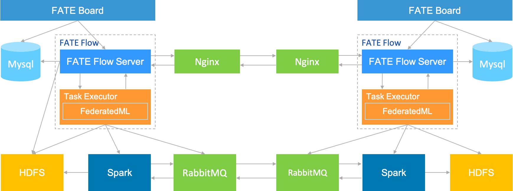

# FATE ON Spark Deploy Guide

## 1.Server Information

|  Server  |                                                              |
| :------: | ------------------------------------------------------------ |
|   Number | >1 (Depending on user needs)                                       |
|   Specs  | 8 core /16GB memory / 500GB hard disk/10M bandwidth       |
|   OS     | CentOS linux 7.2 & above/Ubuntu 16.04 & above        |
|  Dependency| Please refer section 4.5                                   |
|   User   | user: app, user group: apps (app user should be able to execute sudo su root without password) |
| File System | 1. mount 500G hard disk to /data 2. make /data/projects directory, ownership to app:apps |

## 2.Cluster Information

| party  | partyid | Host name     | IP Address  | OS                      | Software    | Service                              |
| ------ | ------- | ------------- | ----------- | ----------------------- | ----------- | --------------------------------- |
| PartyA | 10000   | VM-0-1-centos | 192.168.0.1 | CentOS 7.2/Ubuntu 16.04 | fate，mysql, nginx | fateflow，fateboard，mysql，nginx |
| PartyA | 10000   |               |             |                         | Spark、HDFS |                                   |
| PartyA | 10000   |               |             |                         | RabbitMQ    |                                   |
| PartyB | 9999    | VM-0-2-centos | 192.168.0.2 | CentOS 7.2/Ubuntu 16.04 | fate，mysql, nginx | fateflow，fateboard，mysql，nginx |
| PartyB | 9999    |               |             |                         | Spark、HDFS |                                   |
| PartyB | 9999    |               |             |                         | RabbitMQ    |                                   |

Architecture:

## 3.Module Information

| Product  | Module    | Port     | Information                                               |
| -------- | --------- | --------- | ----------------------------------------------------- |
| fate     | fate_flow | 9360;9380 | Manages workflow of federated learning jobs, one service instance per party |
| fate     | fateboard | 8080      | Visualizes federated learning process, one service instance per party     |
| nginx    | nginx     | 9370      | proxy for cross-party scheduling                 |
| mysql    | mysql     | 3306      | meta table storage                                            |
| Spark    |           |           | compute engine                                              |
| HDFS     |           |           | storage engine                                            |
| RabbitMQ |           |           | proxy for cross-party data exchange                             |

## 4. Deploy Spark & HDFS
Please refer: [Hadoop_Spark_deployment_guide](hadoop_spark_deployment_guide.md)

## 5. Deploy FATE
Please refer: [fate_on_spark_deployment_fate](fate_on_spark_deployment_fate.md) first/second/third chapter

## 6. Modify FATE Configuration
Please refer: [fate_on_spark_deployment_fate](fate_on_spark_deployment_fate.md) fourth chapter

## 7. Start FATE
Please refer: [fate_on_spark_deployment_fate](fate_on_spark_deployment_fate.md) fifth chapter

## 8. Debug
Please refer: [fate_on_spark_deployment_fate](fate_on_spark_deployment_fate.md) sixth chapter

## 9. Test
Please refer: [fate_on_spark_deployment_fate](fate_on_spark_deployment_fate.md) seventh chapter

## 10. System Management
Please refer: [fate_on_spark_deployment_fate](fate_on_spark_deployment_fate.md) eighth chapter

## 11. Appendix
Please refer: [fate_on_spark_deployment_fate](fate_on_spark_deployment_fate.md) ninth chapter
