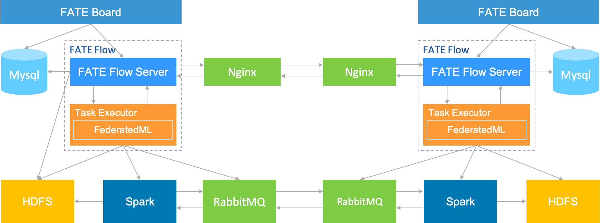

# FATE ON Spark 部署指南

## 1.服务器配置

|  服务器  |                                                              |
| :------: | ------------------------------------------------------------ |
|   数量   | >1（根据实际情况配置）                                       |
|   配置   | 8 core /16GB memory / 500GB硬盘/10M带宽                      |
| 操作系统 | CentOS linux 7.2及以上/Ubuntu 16.04 以上                     |
|  依赖包  | （参见4.5 软件环境初始化）                                   |
|   用户   | 用户：app，属主：apps（app用户需可以sudo su root而无需密码） |
| 文件系统 | 1.  500G硬盘挂载在/ data目录下； 2.创建/ data / projects目录，目录属主为：app:apps |

## 2.集群规划

| party  | partyid | 主机名        | IP地址      | 操作系统                | 安装软件    | 服务                              |
| ------ | ------- | ------------- | ----------- | ----------------------- | ----------- | --------------------------------- |
| PartyA | 10000   | VM-0-1-centos | 192.168.0.1 | CentOS 7.2/Ubuntu 16.04 | fate，mysql, nginx | fateflow，fateboard，mysql，nginx |
| PartyA | 10000   |               |             |                         | Spark、HDFS |                                   |
| PartyA | 10000   |               |             |                         | RabbitMQ    |                                   |
| PartyB | 9999    | VM-0-2-centos | 192.168.0.2 | CentOS 7.2/Ubuntu 16.04 | fate，mysql, nginx | fateflow，fateboard，mysql，nginx |
| PartyB | 9999    |               |             |                         | Spark、HDFS |                                   |
| PartyB | 9999    |               |             |                         | RabbitMQ    |                                   |

架构图：

<div style="text-align:center", align=center>

</div>

## 3.组件说明

| 软件产品 | 组件      | 端口      | 说明                                                  |
| -------- | --------- | --------- | ----------------------------------------------------- |
| fate     | fate_flow | 9360;9380 | 联合学习任务流水线管理模块，每个party只能有一个此服务 |
| fate     | fateboard | 8080      | 联合学习过程可视化模块，每个party只能有一个此服务     |
| nginx    | nginx     | 9370      | 跨站点(party)调度协调代理                             |
| mysql    | mysql     | 3306      | 元数据存储                                            |
| Spark    |           |           | 计算引擎                                              |
| HDFS     |           |           | 存储引擎                                              |
| RabbitMQ |           |           | 跨站点(party)数据交换代理                             |

## 4.基础环境配置

### 4.1 hostname配置(可选)

**1）修改主机名**

**在192.168.0.1 root用户下执行：**

```bash
hostnamectl set-hostname VM-0-1-centos
```

**在192.168.0.2 root用户下执行：**

```bash
hostnamectl set-hostname VM-0-2-centos
```

**2）加入主机映射**

**在目标服务器（192.168.0.1 192.168.0.2 ）root用户下执行：**

```bash
vim /etc/hosts
192.168.0.1 VM-0-1-centos
192.168.0.2 VM-0-2-centos
```

### 4.2 关闭SELinux(可选)


**在目标服务器（192.168.0.1 192.168.0.2）root用户下执行：**

确认是否已安装SELinux

CentOS系统执行：

```bash
rpm -qa | grep selinux
```

Ubuntu系统执行：

```bash
apt list --installed | grep selinux
```

如果已安装了SELinux就执行：

```bash
setenforce 0
```

### 4.3 修改Linux系统参数

**在目标服务器（192.168.0.1 192.168.0.2 192.168.0.3）root用户下执行：**

```bash
vim /etc/security/limits.conf
* soft nofile 65536
* hard nofile 65536
```

```bash
vim /etc/security/limits.d/20-nproc.conf
* soft nproc unlimited
```

### 4.4 关闭防火墙(可选)


**在目标服务器（192.168.0.1 192.168.0.2 192.168.0.3）root用户下执行**

如果是CentOS系统：

```bash
systemctl disable firewalld.service
systemctl stop firewalld.service
systemctl status firewalld.service
```

如果是Ubuntu系统：

```bash
ufw disable
ufw status
```

### 4.5 软件环境初始化

**在目标服务器（192.168.0.1 192.168.0.2 192.168.0.3）root用户下执行**

**1）创建用户**

```bash
groupadd -g 6000 apps
useradd -s /bin/bash -g apps -d /home/app app
passwd app
```

**2）创建目录**

```bash
mkdir -p /data/projects/fate
mkdir -p /data/projects/install
chown -R app:apps /data/projects
```

**3）安装依赖**

```bash
#centos
yum -y install gcc gcc-c++ make openssl-devel gmp-devel mpfr-devel libmpc-devel libaio numactl autoconf automake libtool libffi-devel snappy snappy-devel zlib zlib-devel bzip2 bzip2-devel lz4-devel libasan lsof sysstat telnet psmisc
#ubuntu
apt-get install -y gcc g++ make openssl supervisor libgmp-dev  libmpfr-dev libmpc-dev libaio1 libaio-dev numactl autoconf automake libtool libffi-dev libssl1.0.0 libssl-dev liblz4-1 liblz4-dev liblz4-1-dbg liblz4-tool  zlib1g zlib1g-dbg zlib1g-dev
cd /usr/lib/x86_64-linux-gnu
if [ ! -f "libssl.so.10" ];then
   ln -s libssl.so.1.0.0 libssl.so.10
   ln -s libcrypto.so.1.0.0 libcrypto.so.10
fi
```

## 5.项目部署

注：此指导安装目录默认为/data/projects/install，执行用户为app，安装时根据具体实际情况修改。

### 5.1 获取安装包


在目标服务器（192.168.0.1 具备外网环境）app用户下执行:

```bash
mkdir -p /data/projects/install
cd /data/projects/install
wget https://webank-ai-1251170195.cos.ap-guangzhou.myqcloud.com/python-env-1.5.0-release.tar.gz
wget https://webank-ai-1251170195.cos.ap-guangzhou.myqcloud.com/jdk-8u192-linux-x64.tar.gz
wget https://webank-ai-1251170195.cos.ap-guangzhou.myqcloud.com/mysql-1.5.0-release.tar.gz
wget https://webank-ai-1251170195.cos.ap-guangzhou.myqcloud.com/openresty-1.17.8.2.tar.gz
wget https://webank-ai-1251170195.cos.ap-guangzhou.myqcloud.com/FATE_install_1.5.0_release.tar.gz

#传输到192.168.0.1和192.168.0.2
scp *.tar.gz app@192.168.0.1:/data/projects/install
scp *.tar.gz app@192.168.0.2:/data/projects/install
```

### 5.2 操作系统参数检查

**在目标服务器（192.168.0.1 192.168.0.2 192.168.0.3）app用户下执行**

```bash
#文件句柄数，不低于65535，如不满足需参考4.3章节重新设置
ulimit -n
65535

#用户进程数，不低于64000，如不满足需参考4.3章节重新设置
ulimit -u
65535
```

### 5.3 部署MySQL

**在目标服务器（192.168.0.1 192.168.0.2）app用户下执行**

**1）MySQL安装：**

```bash
#建立mysql根目录
mkdir -p /data/projects/fate/common/mysql
mkdir -p /data/projects/fate/data/mysql

#解压缩软件包
cd /data/projects/install
tar xzvf mysql-*.tar.gz
cd mysql
tar xf mysql-8.0.13.tar.gz -C /data/projects/fate/common/mysql

#配置设置
mkdir -p /data/projects/fate/common/mysql/mysql-8.0.13/{conf,run,logs}
cp service.sh /data/projects/fate/common/mysql/mysql-8.0.13/
cp my.cnf /data/projects/fate/common/mysql/mysql-8.0.13/conf

#初始化
cd /data/projects/fate/common/mysql/mysql-8.0.13/
./bin/mysqld --initialize --user=app --basedir=/data/projects/fate/common/mysql/mysql-8.0.13 --datadir=/data/projects/fate/data/mysql > logs/init.log 2>&1
cat logs/init.log |grep root@localhost
#注意输出信息中root@localhost:后的是mysql用户root的初始密码，需要记录，后面修改密码需要用到

#启动服务
cd /data/projects/fate/common/mysql/mysql-8.0.13/
nohup ./bin/mysqld_safe --defaults-file=./conf/my.cnf --user=app >>logs/mysqld.log 2>&1 &

#修改mysql root用户密码
cd /data/projects/fate/common/mysql/mysql-8.0.13/
./bin/mysqladmin -h 127.0.0.1 -P 3306 -S ./run/mysql.sock -u root -p password "fate_dev"
Enter Password:【输入root初始密码】

#验证登陆
cd /data/projects/fate/common/mysql/mysql-8.0.13/
./bin/mysql -u root -p -S ./run/mysql.sock
Enter Password:【输入root修改后密码:fate_dev】
```

**2）建库授权和业务配置**

```bash
cd /data/projects/fate/common/mysql/mysql-8.0.13/
./bin/mysql -u root -p -S ./run/mysql.sock
Enter Password:【fate_dev】

#创建fate_flow库
mysql>CREATE DATABASE IF NOT EXISTS fate_flow;

#创建远程用户和授权
1) 192.168.0.1执行
mysql>CREATE USER 'fate'@'192.168.0.1' IDENTIFIED BY 'fate_dev';
mysql>GRANT ALL ON *.* TO 'fate'@'192.168.0.1';
mysql>flush privileges;

2) 192.168.0.2执行
mysql>CREATE USER 'fate'@'192.168.0.2' IDENTIFIED BY 'fate_dev';
mysql>GRANT ALL ON *.* TO 'fate'@'192.168.0.2';
mysql>flush privileges;

#校验
mysql>select User,Host from mysql.user;
mysql>show databases;
mysql>use eggroll_meta;
mysql>show tables;
mysql>select * from server_node;

```

### 5.4 部署JDK

**在目标服务器（192.168.0.1 192.168.0.2）app用户下执行**:

```bash
#创建jdk安装目录
mkdir -p /data/projects/fate/common/jdk
#解压缩
cd /data/projects/install
tar xzf jdk-8u192-linux-x64.tar.gz -C /data/projects/fate/common/jdk
cd /data/projects/fate/common/jdk
mv jdk1.8.0_192 jdk-8u192
```

### 5.5 部署python

**在目标服务器（192.168.0.1 192.168.0.2）app用户下执行**:

```bash
#创建python虚拟化安装目录
mkdir -p /data/projects/fate/common/python

#安装miniconda3
cd /data/projects/install
tar xvf python-env-*.tar.gz
cd python-env
sh Miniconda3-4.5.4-Linux-x86_64.sh -b -p /data/projects/fate/common/miniconda3

#安装virtualenv和创建虚拟化环境
/data/projects/fate/common/miniconda3/bin/pip install virtualenv-20.0.18-py2.py3-none-any.whl -f . --no-index

/data/projects/fate/common/miniconda3/bin/virtualenv -p /data/projects/fate/common/miniconda3/bin/python3.6 --no-wheel --no-setuptools --no-download /data/projects/fate/common/python/venv

#安装依赖包
tar xvf pip-packages-fate-*.tar.gz
source /data/projects/fate/common/python/venv/bin/activate
pip install setuptools-42.0.2-py2.py3-none-any.whl
pip install -r pip-packages-fate-1.5.0/requirements.txt -f ./pip-packages-fate-1.5.0 --no-index
pip list | wc -l
```

### 5.6 部署NginX

**在目标服务器（192.168.0.1 192.168.0.2）app用户下执行**:

```bash
cd /data/projects/install
tar xzf openresty-*.tar.gz
cd openresty-*
./configure --prefix=/data/projects/fate/proxy \
                   --with-luajit \
                   --with-http_ssl_module \
                     --with-http_v2_module \
                     --with-stream \
                     --with-stream_ssl_module \
                     -j12
make && make install
```

### 5.7 部署Spark & HDFS

#### 5.7.1
请参阅部署指南：[Hadoop_Spark_deployment_guide_zh](hadoop_spark_deployment_guide_zh.md)


### 5.8 部署RabbitMQ

#### 5.8.1
请参阅部署指南：[RabbitMQ_deployment_guide_zh](rabbitmq_deployment_guide_zh.md)


### 5.9 部署FATE

#### 5.9.1 软件部署

```
#部署软件
#在目标服务器（192.168.0.1 192.168.0.2）app用户下执行:
cd /data/projects/install
tar xf FATE_install_*.tar.gz
cd FATE_install_*
cp -r bin /data/projects/fate/
cp -r conf /data/projects/fate/
cp fate.env /data/projects/fate/
tar xvf python.tar.gz -C /data/projects/fate/
tar xvf fateboard.tar.gz -C /data/projects/fate
tar xvf proxy.tar.gz -C /data/projects/fate

#设置环境变量文件
#在目标服务器（192.168.0.1 192.168.0.2）app用户下执行:
cat >/data/projects/fate/bin/init_env.sh <<EOF
export PYTHONPATH=/data/projects/fate/python
export SPARK_HOME=/data/projects/common/spark/spark-2.4.1-bin-hadoop2.7
venv=/data/projects/fate/common/python/venv
source \${venv}/bin/activate
export JAVA_HOME=/data/projects/fate/common/jdk/jdk-8u192
export PATH=\$PATH:\$JAVA_HOME/bin
EOF
```

#### 5.9.2 NginX配置文件修改
配置文件:  /data/projects/fate/proxy/nginx/conf/nginx.conf
此配置文件NginX使用，配置服务基础设置以及lua代码，可以参考默认nginx.conf手工修改，修改完成后使用命令检测
```
/data/projects/fate/proxy/nginx/sbin/nginx -t
```

#### 5.9.3 NginX路由配置文件修改

配置文件:  /data/projects/fate/proxy/nginx/conf/route_table.yaml
此配置文件NginX使用，配置路由信息，可以参考如下例子手工配置，也可以使用以下指令完成：

```
#在目标服务器（192.168.0.1）app用户下修改执行
cat > /data/projects/fate/proxy/nginx/conf/route_table.yaml << EOF
default:
  proxy:
    - host: 192.168.0.2
      port: 9390
10000:
  proxy:
    - host: 192.168.0.1
      port: 9390
  fateflow:
    - host: 192.168.0.1
      port: 9360
9999:
  proxy:
    - host: 192.168.0.2
      port: 9390
  fateflow:
    - host: 192.168.0.2
      port: 9360
EOF

#在目标服务器（192.168.0.2）app用户下修改执行
cat > /data/projects/fate/proxy/nginx/conf/route_table.yaml << EOF
default:
  proxy:
    - host: 192.168.0.1
      port: 9390
10000:
  proxy:
    - host: 192.168.0.1
      port: 9390
  fateflow:
    - host: 192.168.0.1
      port: 9360
9999:
  proxy:
    - host: 192.168.0.2
      port: 9390
  fateflow:
    - host: 192.168.0.2
      port: 9360
EOF
```

#### 5.9.4 FATE-Board配置文件修改

1）conf/application.properties

- 服务端口

  server.port---默认

- fateflow的访问url

  fateflow.url，host：http://192.168.0.1:9380，guest：http://192.168.0.2:9380

- 数据库连接串、账号和密码

  fateboard.datasource.jdbc-url，host：mysql://192.168.0.1:3306，guest：mysql://192.168.0.2:3306

  fateboard.datasource.username：fate

  fateboard.datasource.password：fate_dev
  
  以上参数调整可以参考如下例子手工配置，也可以使用以下指令完成：
  
  配置文件：/data/projects/fate/fateboard/conf/application.properties

```
#在目标服务器（192.168.0.1）app用户下修改执行
cat > /data/projects/fate/fateboard/conf/application.properties <<EOF
server.port=8080
fateflow.url=http://192.168.0.1:9380
spring.datasource.driver-Class-Name=com.mysql.cj.jdbc.Driver
spring.http.encoding.charset=UTF-8
spring.http.encoding.enabled=true
server.tomcat.uri-encoding=UTF-8
fateboard.datasource.jdbc-url=jdbc:mysql://192.168.0.1:3306/fate_flow?characterEncoding=utf8&characterSetResults=utf8&autoReconnect=true&failOverReadOnly=false&serverTimezone=GMT%2B8
fateboard.datasource.username=fate
fateboard.datasource.password=fate_dev
server.tomcat.max-threads=1000
server.tomcat.max-connections=20000
EOF

#在目标服务器（192.168.0.2）app用户下修改执行
cat > /data/projects/fate/fateboard/conf/application.properties <<EOF
server.port=8080
fateflow.url=http://192.168.0.2:9380
spring.datasource.driver-Class-Name=com.mysql.cj.jdbc.Driver
spring.http.encoding.charset=UTF-8
spring.http.encoding.enabled=true
server.tomcat.uri-encoding=UTF-8
fateboard.datasource.jdbc-url=jdbc:mysql://192.168.0.2:3306/fate_flow?characterEncoding=utf8&characterSetResults=utf8&autoReconnect=true&failOverReadOnly=false&serverTimezone=GMT%2B8
fateboard.datasource.username=fate
fateboard.datasource.password=fate_dev
server.tomcat.max-threads=1000
server.tomcat.max-connections=20000
EOF
```

2）service.sh

```
#在目标服务器（192.168.0.1 192.168.0.2）app用户下修改执行
cd /data/projects/fate/fateboard
vi service.sh
export JAVA_HOME=/data/projects/fate/common/jdk/jdk-8u192
```

#### 5.9.5 FATE配置文件修改
 
  配置文件：/data/projects/fate/python/conf/server_conf.yaml
  
##### 运行配置
- work_mode(为1表示集群模式，默认)

- independent_scheduling_proxy(使用nginx作为Fate-Flow调度协调代理服务，FATE on Spark下需要设置为true)

- FATE-Flow的监听ip、端口

- FATE-Board的监听ip、端口

- db的连接ip、端口、账号和密码

##### 依赖服务配置
- Spark的相关配置
    - address:home为Spark home绝对路径
    - cores_per_node为Spark集群每个节点的cpu核数
    - nodes为Spark集群节点数量

- HDFS的相关配置
    - address:name_node为hdfs的namenode完整地址
    - address:path_prefix为默认存储路径前缀，若不配置则默认为/

- RabbitMQ相关配置
    - address:self为本方站点配置
    - address:$partyid为对方站点配置

- proxy相关配置，监听ip及端口

  此配置文件格式要按照yaml格式配置，不然解析报错，可以参考如下例子手工配置，也可以使用以下指令完成。

```
#在目标服务器（192.168.0.1）app用户下修改执行
cat > /data/projects/fate/python/conf/server_conf.yaml <<EOF
work_mode: 1
independent_scheduling_proxy: true
use_registry: false
fateflow:
  host: 192.168.0.1
  http_port: 9380
  grpc_port: 9360
fateboard:
  host: 192.168.0.1
  port: 8080
database:
  name: fate_flow
  user: fate
  passwd: fate_dev
  host: 192.168.0.1
  port: 3306
  max_connections: 100
  stale_timeout: 30
SPARK:
  address:
    home:
  cores_per_node: 20
  nodes: 2
HDFS:
  address:
    name_node: hdfs://fate-cluster
    path_prefix:
RABBITMQ:
  address:
    self:
      10000: 192.168.0.3
      mng_port: 12345
      port: 5672
      user: fate
      password: fate
    9999:
      host: 192.168.0.4
      port: 5672
PROXY:
  address:
    host: 192.168.0.1
    port: 9390
EOF

#在目标服务器（192.168.0.2）app用户下修改执行
cat > /data/projects/fate/python/conf/server_conf.yaml <<EOF
work_mode: 1
independent_scheduling_proxy: true
use_registry: false
fateflow:
  host: 192.168.0.2
  http_port: 9380
  grpc_port: 9360
fateboard:
  host: 192.168.0.2
  port: 8080
database:
  name: fate_flow
  user: fate
  passwd: fate_dev
  host: 192.168.0.2
  port: 3306
  max_connections: 100
  stale_timeout: 30
SPARK:
  address:
    home:
  cores_per_node: 20
  nodes: 2
HDFS:
  address:
    name_node: hdfs://fate-cluster
    path_prefix:
RABBITMQ:
  address:
    self:
      9999: 192.168.0.4
      mng_port: 12345
      port: 5672
      user: fate
      password: fate
    10000:
      host: 192.168.0.3
      port: 5672
PROXY:
  address:
    host: 192.168.0.2
    port: 9390
EOF
```

### 5.10 启动服务

**在目标服务器（192.168.0.1 192.168.0.2）app用户下执行**

```
#启动FATE服务，FATE-Flow依赖MySQL的启动
source /data/projects/fate/bin/init_env.sh
cd /data/projects/fate/python/fate_flow
sh service.sh start
cd /data/projects/fate/fateboard
sh service.sh start
cd /data/projects/fate/proxy
./nginx/sbin/nginx -c /data/projects/fate/proxy/nginx/conf/nginx.conf
```

### 5.11 问题定位

1）FATE-Flow日志

/data/projects/fate/logs/fate_flow/

2）FATE-Board日志

/data/projects/fate/fateboard/logs

3) NginX日志

/data/projects/fate/proxy/nginx/logs

## 6.测试


### 6.1 Toy_example部署验证


此测试您需要设置3个参数：`guest_partyid`, `host_partyid`, `work_mode`, `backend`

#### 6.1.1 单边测试

1）192.168.0.1上执行，guest_partyid和host_partyid都设为10000：

```bash
source /data/projects/fate/bin/init_env.sh
cd /data/projects/fate/examples/toy_example/
python run_toy_example.py 10000 10000 1 -b 1
```

类似如下结果表示成功：

"2020-04-28 18:26:20,789 - secure_add_guest.py[line:126] - INFO: success to calculate secure_sum, it is 1999.9999999999998"

2）192.168.0.2上执行，guest_partyid和host_partyid都设为9999:

```
source /data/projects/fate/bin/init_env.sh
cd /data/projects/fate/examples/toy_example/
python run_toy_example.py 9999 9999 1 -b 1
```

类似如下结果表示成功：

"2020-04-28 18:26:20,789 - secure_add_guest.py[line:126] - INFO: success to calculate secure_sum, it is 1999.9999999999998"

#### 6.1.2 双边测试

选定9999为guest方，在192.168.0.2上执行：

```
source /data/projects/fate/bin/init_env.sh
cd /data/projects/fate/examples/toy_example/
python run_toy_example.py 9999 10000 1 -b 1
```

类似如下结果表示成功：

"2020-04-28 18:26:20,789 - secure_add_guest.py[line:126] - INFO: success to calculate secure_sum, it is 1999.9999999999998"

### 6.2 最小化测试


#### **6.2.1 上传预设数据：**

分别在192.168.0.1和192.168.0.2上执行：

```bash
source /data/projects/fate/bin/init_env.sh
cd /data/projects/fate/examples/scripts/
python upload_default_data.py -m 1
```

更多细节信息，敬请参考[脚本README](../../examples/scripts/README.rst)

#### 6.2.2 快速模式

请确保guest和host两方均已分别通过给定脚本上传了预设数据。

快速模式下，最小化测试脚本将使用一个相对较小的数据集，即包含了569条数据的breast数据集。

选定9999为guest方，在192.168.0.2上执行：

```bash
source /data/projects/fate/bin/init_env.sh
cd /data/projects/fate/examples/min_test_task/
python run_task.py -m 1 -gid 9999 -hid 10000 -aid 10000 -f fast -b 1
```

其他一些可能有用的参数包括：

1. -f: 使用的文件类型. "fast" 代表 breast数据集, "normal" 代表 default credit 数据集.
2. --add_sbt: 如果被设置为1, 将在运行完lr以后，启动secureboost任务，设置为0则不启动secureboost任务，不设置此参数系统默认为1。

若数分钟后在结果中显示了“success”字样则表明该操作已经运行成功了。若出现“FAILED”或者程序卡住，则意味着测试失败。

#### 6.2.3 正常模式

只需在命令中将“fast”替换为“normal”，其余部分与快速模式相同。

### 6.3. FateBoard testing

Fate-Voard是一项Web服务。如果成功启动了fateboard服务，则可以通过访问 http://192.168.0.1:8080 和 http://192.168.0.2:8080 来查看任务信息，如果有防火墙需开通。如果fateboard和fateflow没有部署再同一台服务器，需在fateboard页面设置fateflow所部署主机的登陆信息：页面右上侧齿轮按钮--》add--》填写fateflow主机ip，os用户，ssh端口，密码。

## 7.系统运维
================

### 7.1 服务管理

**在目标服务器（192.168.0.1 192.168.0.2）app用户下执行**

####  7.1.1 FATE服务管理

1) 启动/关闭/查看/重启fate_flow服务

```bash
source /data/projects/fate/init_env.sh
cd /data/projects/fate/python/fate_flow
sh service.sh start|stop|status|restart
```

如果逐个模块启动，需要先启动eggroll再启动fateflow，fateflow依赖eggroll的启动。

2) 启动/关闭/重启FATE-Board服务

```bash
cd /data/projects/fate/fateboard
sh service.sh start|stop|status|restart
```

3) 启动/关闭/重启NginX服务

```
cd /data/projects/fate/proxy
./nginx/sbin/nginx -s reload
./nginx/sbin/nginx -s stop
```

#### 7.1.2 MySQL服务管理

启动/关闭/查看/重启MySQL服务

```bash
cd /data/projects/fate/common/mysql/mysql-8.0.13
sh ./service.sh start|stop|status|restart
```

### 7.2 查看进程和端口

**在目标服务器（192.168.0.1 192.168.0.2）app用户下执行**

##### 7.2.1 查看进程

```
#根据部署规划查看进程是否启动
ps -ef | grep -i fate_flow_server.py
ps -ef | grep -i fateboard
ps -ef | grep -i nginx
```

### 7.2.2 查看进程端口

```
#根据部署规划查看进程端口是否存在
#fate_flow_server
netstat -tlnp | grep 9360
#fateboard
netstat -tlnp | grep 8080
#nginx
netstat -tlnp | grep 9390
```


### 7.3 服务日志

| 服务               | 日志路径                                           |
| ------------------ | -------------------------------------------------- |
| fate_flow&任务日志 | /data/projects/fate/python/logs                    |
| fateboard          | /data/projects/fate/fateboard/logs                 |
| nginx | /data/projects/fate/proxy/nginx/logs                 |
| mysql              | /data/projects/fate/common/mysql/mysql-8.0.13/logs |

## 8. 附录

### 8.1 打包构建

参见[build指导](../build.md) 
