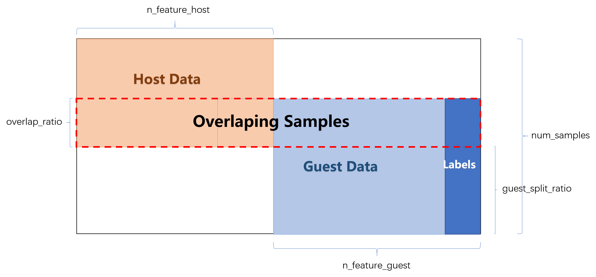
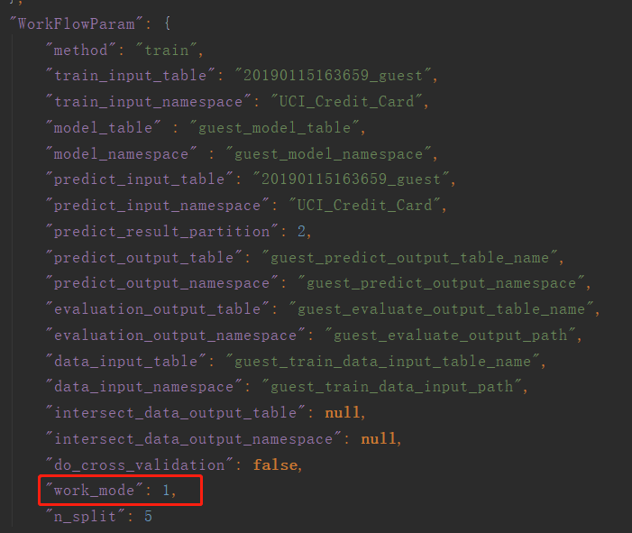

## Run Federated Learning

#### Plain vs Encryption

We have a plain version and a encryption version for the FTL algorithm. They are implemented in *plain_ftl.py* and *encrypted_ftl.py* respectively.

You can turn on the encryption version by setting the <b style="color:red">is_encrypt</b> parameter to true. Otherwise set it to false (default). You can find this parameter in both **guest_runtime_conf.json** and **host_runtime_conf.json** located in **examples/hetero_ftl/conf** folder.

> Note that you should set them either to true at the same time or to false at the same time.

#### Standalone vs Cluster

You can run FTL algorithm on two different work modes: *standalone* mode and *cluster* mode. On standalone mode, host, guest and/or arbiter are running in one machine while on cluster mode they are running in multiple machines. Running algorithm on cluster mode requires some configuration. Please refer to [`cluster-deploy`](https://github.com/WeBankFinTech/FATE/tree/master/cluster-deploy) for more details.

You can turn on the cluster mode by setting the <b style="color:red">work_mode</b> parameter to 1. Otherwise set it to 0 (default). You can find this parameter in **guest_runtime_conf.json**, **host_runtime_conf.json**  and  **arbiter_runtime_conf.json** located in **examples/hetero_ftl/conf** folder.

We will first elaborate how to run FTL algorithm on standalone mode. Running algorithm on cluster mode follows similar steps once you have cluster environment configured.

### 1. Run Plain Version

In plain version, You start running host and guest through following steps:
1. Open two terminals (or two sessions).
2. In each of the two terminal, go to **examples/hetero_ftl/** under the root folder of the FATE project.
3. Switch the algorithm to plain version. 
    * Set <b style="color:red">is_encrypt</b> of **FTLModelParam** to false in both **guest_runtime_conf.json** file and **host_runtime_conf.json** file. These two configuration files are located in **conf/** folder. When <b style="color:red">is_encrypt</b> is switched to false, <b style="color:red">enc_ftl</b> will not take effect.
 
    Following picture shows an example of parameters in **FTLModelParam** section.
    
    

    
    

4. Start host by

    > python run_host.py 123

5. Start guest by

    > python run_guest.py 123

123 is job id, and host and guest should have the same job id.

Or, 

You can simply run **run_ftl_dct_standalone.sh**, which will run host and guest together in the background.

   > sh run_ftl_dct_standalone.sh 123

### 2. Run Encryption Version

You can follow similar steps as described in "Run plain Version" section

1. Open three terminals (or three sessions)
2. In each of the three terminal, go to **examples/hetero_ftl/** under the root folder of the FATE project.
3. Switch the algorithm to encrypted version. This version is default. 
    * Set <b style="color:red">is_encrypt</b> of **FTLModelParam** to true in both **guest_runtime_conf.json** file and **host_runtime_conf.json** file. These two configuration files are located in **conf/** folder.
    * Set <b style="color:red">enc_ftl</b> of **FTLModelParam** to <b style="color:red">dct_enc_ftl</b> in both **guest_runtime_conf.json** file and **host_runtime_conf.json** file.
        * <b style="color:red">dct_enc_ftl</b> represents decentralized verison of the encrypted FTL algorithm (no arbiter in the loop).
      
    Following picture shows an example of parameters in **FTLModelParam** section.
    
    

    
    

4. Start host by

    > python run_host.py 124

5. Start guest by

    > python run_guest.py 124

Again the job id should be the same for host, guest and arbiter.

Or, 

You can simply run **run_ftl_dct_standalone.sh**, which will run host and guest together in the background.

> sh run_ftl_dct_standalone.sh 124

### 3. Check log files

You can check logs for the progress or result of a specific job. (almost) All the logs are located in **logs/** folder under the root folder of the FATE project. Logs related to a specific job say 124 are located in **logs/124/** folder. Normally, you only need to check two logs:

Normally, you only need to check logs for host and guest since arbiter is not in the loop:

* **hetero_ftl_guest.log**, records log information for guest side of running the FTL algorithm. 
  * In plain version, guest knows the loss for each iteration. Therefore, you can check the change of loss in this log file.
* **hetero_ftl_host.log**, records log information for host side of running the FTL algorithm. 
  * In our FTL algorithm, it is the host that always triggers predicting process. Therefore, you can check the evaluation result on training or predicting in this log file.

If you run the FTL algorithm by using **sh run_ftl_dct_standalone.sh {job_id}** or **sh run_ftl_ct_standalone.sh {job_id}**, two or three logs would be generated under **examples/hetero_ftl/** folder:

* *host.log* records standard output and standard error from host side.
* *guest.log* records standard output and standard error from guest side.
* *arbiter.log* records standard output and standard error from arbiter side.

Therefore, you can check these three logs for any error that might happen during the running of FTL algorithm. 

### 4. Configure files explained:

When we start running host, guest and arbiter, we need to feed them with a runtime configuration file respectively. These configuration files specify parameters for how to create models and run algorithm. They are located in **examples/hetero-ftl/conf** folder and written in the format of Json

For running FTL algorithm, we only need to know four sections of parameters.

1. **WorkFlowParam** specifies parameters for starting the whole program.
    * *method*: currently, in FTL algorithm, we only support two methods: **train** and **predict**
      * train:  collaboratively train models located in guest and host.
      * predict: predict labels for samples from the host
    * *work_mode*: if 0, we would run FTL algorithm in standalone mode. if 1, we would run FTL algorithm in cluster mode.
    
    > Host, guest and/or arbiter must have the same value for *work_mode* in a particular job.
    
    > Host and guest must have the same value for *method* parameter in a particular job. Arbiter should always have the value of "train" for this parameter.
    
2. **FTLModelParam** specifies parameters for running the FTL algorithm
    * *eps*： the threshold for determining if algorithm converges.
    * *alpha*: weight parameter for the training loss.
    * *max_iter*: maximum iteration for running the algorithm
    * *is_encrypt*: if true, we would use encryption version of FTL algorithm. if false, we would use plain version of FTL algorithm。
    * *enc_ftl*: short name for a specific algorithm. e.g., <b style="color:red">dct_enc_ftl</b> represents decentralized verison of the encrypted FTL algorithm (no arbiter in the loop). When <b style="color:red">is_encrypt</b> is set to false, *enc_ftl* will not take effect.
    
     > Host, guest and/or arbiter must have the same value for *max_iter* parameter in a particular job. 
     
     > Host and guest must have the same value for *is_encrypt* parameter in a particular job. Arbiter only works for encryption version and thus it does not have this parameter.
     
Following two sections of parameters only exist in configuration files of host and guest since arbiter is not responsible for training a model and predicting results, and thus it does not require these parameters.
      
3. **LocalModelParam** specifies parameters for building local model such as Autoencoder.
    * *input_dim:*: the dimension of the original input samples
    * *encode_dim:*: the dimension of the encoded (or hidden) representation.
    * *learning_rate*: learning rate for the local model.
     
    > Host and guest must have the same value for *encode_dim* parameter in a particular job.
   
4. **FTLDataModel** specifies parameters for preparing data.
    * *file_path*: the path to the data set file. e.g. "../data/UCI_Credit_Card.csv".
    * *n_feature_guest*: the number of features on the guest side.
    * *n_feature_host*: the number of features on the host side.
    * *overlap_ratio*: the ratio of samples that overlaps between guest and host.
    * *guest_split_ratio*： the ratio of all samples except overlapping samples that guest has.
    * *num_samples*: the number of samples extracted from the specified data set. If it is null, all samples would be extracted.
    * *balanced*: if true, samples of different labels would be balanced.
    * *is_read_table*: if true, read data from eggroll data table. By default, this parameter is set to false indicating that we read data from original data file directly (e.g. UCI_Credt_Card.csv) . If this parameter is set to true, the original data has to be first stored in a eggroll data.

**FTLDataModel** holds parameters for generating training, predicting and/or validating data. In our current example, we define parameters for splitting the UCI_Credit_Card dataset into two parts, one for host and the other for guest. We get splits of different shapes by giving different parameters. This provides us with flexibility to investigate the effectiveness of our algorithm. Following figure illustrates how these parameters split the dataset.

  > Because we split the dataset online when we start host (or guest), host and guest should have the save values for all these parameters in **FTLDataModel** in a particular **training** job.
  
In current example, we only use UCI_Credit_Card dataset. We will add more datasets (e.g. [NUS-WIDE](https://lms.comp.nus.edu.sg/research/NUS-WIDE.htm)) very soon.
 
You can add any parameters to the four sections or create your own sections of parameters. These parameters will be parsed with the help of *ParamExtract* tool.

To quickly run FTL algorithm, you do not need to change any parameter in the four sections except the ones I explicitly mentioned such as **is_encrypt** and **work_mode**.

### 5. Run algorithm in cluster mode

For running FTL algorithm on cluster mode, the **local** and **role** section in the three configuration files  (**guest_runtime_conf.json**, **host_runtime_conf.json**  and  **arbiter_runtime_conf.json**) should be consistent with what you have configured in the cluster environment. Following figure illustrates an example of a particular configuration.

As shown above, host, guest and arbiter have different values configured in **party_id** field. This means that they come from three different parties (e.g. organization, institute, company and so forth). Note that they should have the same configuration in the **role** section. 

It is possible that one party plays two roles. For example, if a party with **party_id** 10000 plays both host and arbiter, then in the **host_runtime_conf.json**  and  **arbiter_runtime_conf.json** files, host and arbiter should both have **party_id** of 10000. The **role** section should be configured accordingly.

Then, you can turn on the cluster mode by setting the <b style="color:red">work_mode</b> parameter to 1. You can find this parameter in **WorkFlowParam** section in **guest_runtime_conf.json**, **host_runtime_conf.json**  and  **arbiter_runtime_conf.json** located in **examples/hetero_ftl/conf** folder.

For example, following figure shows **WorkFlowParam** section in **guest_runtime_conf.json**

> Note that you should set <b style="color:red">work_mode</b> in the three configuration json files to 1 at the same time such that host, guest and arbiter would all work in cluster mode.

Finally, start running algorithm:

1. Open three terminals (or three session) from two or three machines of the cluster environment.
2. In each of the three terminal, go to examples/hetero_ftl/
3. Start arbiter by

    > python run_arbiter.py 125

4. Start host by

    > python run_host.py 125

5. Start guest by

    > python run_guest.py 125

Check the logs the same way as described before. But in this scenario, the logs are located in multiple machines that are running the FTL algorithm.

