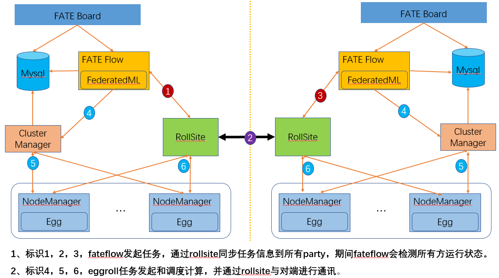

# FATE AllinOne部署指南
[English](./fate-allinone_deployment_guide.md)

> 警告：本文档仅用于快速开始，生产环境推荐使用其他部署方式，如 [AnsibleFATE](https://github.com/FederatedAI/AnsibleFATE)。
>
> 依照本文档同时部署多个 party 会导致 party 间各服务器可以通过 ssh 互相访问，从而产生严重的安全问题。

## 1. 服务器配置

|  服务器  |                                                              |
| :------: | ------------------------------------------------------------ |
|   数量   | 1 or 2                                                       |
|   配置   | 8 core /16GB memory / 500GB硬盘/10M带宽                      |
| 操作系统 | CentOS linux 7.2及以上/Ubuntu 18.04                          |
|  依赖包  | （部署时自动安装）                                           |
|   用户   | 用户：app，属主：apps（app用户需可以sudo su root而无需密码） |
| 文件系统 | 1.  500G硬盘挂载在 `/data` 目录下； 2.创建 `/data/projects` 目录，目录属主为：`app:apps` |

## 2. 集群规划

| party  | 主机名        | IP地址      | 操作系统                | 安装软件           | 服务                                                         |
| ------ | ------------- | ----------- | ----------------------- | ------------------ | ------------------------------------------------------------ |
| PartyA | VM_0_1_centos | 192.168.0.1 | CentOS 7.2/Ubuntu 18.04 | fate,eggroll,mysql | fate_flow，fateboard，clustermanager，nodemanager，rollsite，mysql |
| PartyB | VM_0_2_centos | 192.168.0.2 | CentOS 7.2/Ubuntu 18.04 | fate,eggroll,mysql | fate_flow，fateboard，clustermanager，nodemanager，rollsite，mysql |

架构图：

||
|:--:|
|架构图|

## 3. 组件说明

| 软件产品 | 组件           | 端口      | 说明                                                         |
| -------- | -------------- | --------- | ------------------------------------------------------------ |
| fate     | fate_flow      | 9360;9380 | 联合学习任务流水线管理模块                                   |
| fate     | fateboard      | 8080      | 联合学习过程可视化模块                                       |
| eggroll  | clustermanager | 4670      | cluster manager管理集群                                      |
| eggroll  | nodemanager    | 4671      | node manager管理每台机器资源                                 |
| eggroll  | rollsite       | 9370      | 跨站点或者说跨party通讯组件，相当于以前版本的proxy+federation |
| mysql    | mysql          | 3306      | 数据存储，clustermanager和fateflow依赖                       |

## 4. 基础环境配置

### 4.1. hostname配置

**1）修改主机名**

**在192.168.0.1 root用户下执行：**

hostnamectl set-hostname VM_0_1_centos

**在192.168.0.2 root用户下执行：**

hostnamectl set-hostname VM_0_2_centos

**2）加入主机映射**

**在目标服务器（192.168.0.1 192.168.0.2）root用户下执行：**

vim /etc/hosts

192.168.0.1 VM_0_1_centos

192.168.0.2 VM_0_2_centos

### 4.2. 关闭 SELinux（不推荐）

**在目标服务器（192.168.0.1 192.168.0.2）root用户下执行：**

确认是否已安装selinux

centos系统执行：rpm -qa | grep selinux

ubuntu系统执行：apt list --installed | grep selinux

如果已安装了selinux就执行：setenforce 0

### 4.3. 修改 Linux 系统参数

**在目标服务器（192.168.0.1 192.168.0.2）root用户下执行：**

1）清理20-nproc.conf文件

cd /etc/security/limits.d

ls -lrt 20-nproc.conf

存在则：mv 20-nproc.conf 20-nproc.conf_bak

2）vim /etc/security/limits.conf

\* soft nofile 65535

\* hard nofile 65535

\* soft nproc 65535

\* hard nproc 65535

重新登陆，ulimit -a查看是否生效

### 4.4. 关闭防火墙（不推荐）

**在目标服务器（192.168.0.1 192.168.0.2）root用户下执行**

如果是Centos系统：

systemctl disable firewalld.service

systemctl stop firewalld.service

systemctl status firewalld.service

如果是Ubuntu系统：

ufw disable

ufw status

### 4.5. 软件环境初始化

**1）创建用户**

**在目标服务器（192.168.0.1 192.168.0.2）root用户下执行**

```
groupadd -g 6000 apps
useradd -s /bin/bash -g apps -d /home/app app
passwd app
```

**2）配置sudo**

**在目标服务器（192.168.0.1 192.168.0.2）root用户下执行**

vim /etc/sudoers.d/app

app ALL=(ALL) ALL

app ALL=(ALL) NOPASSWD: ALL

Defaults !env_reset

**3）配置ssh无密登录**

**a. 在目标服务器（192.168.0.1 192.168.0.2）app用户下执行**

su app

ssh-keygen -t rsa

cat \~/.ssh/id_rsa.pub \>\> /home/app/.ssh/authorized_keys

chmod 600 \~/.ssh/authorized_keys

**b.合并id_rsa_pub文件**

拷贝192.168.0.1的authorized_keys 到192.168.0.2
\~/.ssh目录下,追加到192.168.0.2的id_rsa.pub到authorized_keys，然后再拷贝到192.168.0.1

**在192.168.0.1 app用户下执行**

scp \~/.ssh/authorized_keys app\@192.168.0.2:/home/app/.ssh

输入密码

**在192.168.0.2 app用户下执行**

cat \~/.ssh/id_rsa.pub \>\> /home/app/.ssh/authorized_keys

scp \~/.ssh/authorized_keys app\@192.168.0.1:/home/app/.ssh

覆盖之前的文件

**c. 在目标服务器（192.168.0.1 192.168.0.2）app用户下执行ssh 测试**

ssh app\@192.168.0.1

ssh app\@192.168.0.2

### 4.6. 增加虚拟内存

**目标服务器（192.168.0.1 192.168.0.2 192.168.0.3）**

生产环境使用时，因内存计算需要增加128G虚拟内存，执行前需检查存储空间是否足够。

手工创建，root用户执行：

```
cd /data
dd if=/dev/zero of=/data/swapfile128G bs=1024 count=134217728
mkswap /data/swapfile128G
swapon /data/swapfile128G
cat /proc/swaps
echo '/data/swapfile128G swap swap defaults 0 0' >> /etc/fstab
```

或者使用5.1章节的代码包中的脚本创建，app用户执行：

```
sh /data/projects/fate_cluster_install_${version}_release/tools-install/makeVirtualDisk.sh
Waring: please make sure has enough space of your disk first!!! （请确认有足够的存储空间）
current user has sudo privilege(yes|no):yes      （是否有sudo权限，输入yes，不能简写）
Enter store directory:/data    （设置虚拟内存文件的存放路径，确保目录存在和不要设置在根目录）
Enter the size of virtual disk(such as 64G/128G):128G  （设置虚拟内存文件的大小，32G的倍数，数字后要带单位G，一般设置为128G即可）
/data 32 1
32768+0 records in
32768+0 records out
34359738368 bytes (34 GB) copied, 200.544 s, 171 MB/s
Setting up swapspace version 1, size = 33554428 KiB
no label, UUID=58ce153c-feac-4989-b684-c100e4edca0b
/data 32 2
32768+0 records in
32768+0 records out
34359738368 bytes (34 GB) copied, 200.712 s, 171 MB/s
Setting up swapspace version 1, size = 33554428 KiB
no label, UUID=d44e27ed-966b-4477-b46e-fcda4e3057c2
/data 32 3
32768+0 records in
32768+0 records out
34359738368 bytes (34 GB) copied, 200.905 s, 171 MB/s
Setting up swapspace version 1, size = 33554428 KiB
no label, UUID=ab5db8d7-bc09-43fb-b23c-fc11aef1a3b6
/data 32 4
32768+0 records in
32768+0 records out
34359738368 bytes (34 GB) copied, 201.013 s, 171 MB/s
Setting up swapspace version 1, size = 33554428 KiB
no label, UUID=c125ede3-7ffd-4110-9dc8-ebdf4fab0fd1
```

校验

```
cat /proc/swaps

Filename                                Type            Size    Used    Priority
/data/swapfile32G_1                     file            33554428        0       -1
/data/swapfile32G_2                     file            33554428        0       -2
/data/swapfile32G_3                     file            33554428        0       -3
/data/swapfile32G_4                     file            33554428        0       -4

free -m
              total        used        free      shared  buff/cache   available
Mem:          15715        6885          91         254        8739        8461
Swap:        131071           0      131071

```

## 5. 项目部署


注：此指导安装目录默认为/data/projects/，执行用户为app，安装时根据具体实际情况修改。

### 5.1. 获取项目

**在目标服务器（192.168.0.1 具备外网环境）app用户下执行**

进入执行节点的/data/projects/目录，执行：

备注：用具体FATE版本号替换${version},可在[release页面](https://github.com/FederatedAI/FATE/releases)上查看

```
cd /data/projects/
wget https://webank-ai-1251170195.cos.ap-guangzhou.myqcloud.com/fate/${version}/release/fate_cluster_install_${version}_release.tar.gz
tar xzf fate_cluster_install_${version}_release.tar.gz

注意：version不带字符v，如fate_cluster_install_1.x.x_release.tar.gz
```

### 5.2. 部署前检查

**在目标服务器（192.168.0.1 192.168.0.2 ）app用户下执行**

把检查脚本fate_cluster_install_${version}_release/tools-install/check.sh从192.168.0.1拷贝到192.168.0.2

```
#在192.168.0.1和192.168.0.2服务器上分别执行检查脚本
sh ./check.sh

#确认app用户已配置sudo
#虚拟内存，size不低于128G，如不满足需参考4.6章节重新设置
#文件句柄数，不低于65535，如不满足需参考4.3章节重新设置
#用户进程数，不低于64000，如不满足需参考4.3章节重新设置
#确认部署前没有fate进程和端口冲突
#确认/etc/my.cnf是否存在，存在需要mv；确认是否存在/data/projects/fate目录，存在需把fate目录mv备份。
```

### 5.3. 配置文件修改和示例

**在目标服务器（192.168.0.1）app用户下执行**

修改配置文件fate_cluster_install_${version}_release/allInone/conf/setup.conf.

```
vi fate_cluster_install_${version}_release/allInone/conf/setup.conf
```

配置文件setup.conf说明：

| 配置项              | 配置项值                                              | 说明                                                         |
| ------------------- | ----------------------------------------------------- | ------------------------------------------------------------ |
| roles               | 默认："host" "guest"                                  | 部署的角色，有HOST端、GUEST端                                |
| version             | 默认：${version}                                      | Fate 版本号                                                  |
| pbase               | 默认： /data/projects                                 | 项目根目录                                                   |
| pname               | 默认：fate                                            | 项目名称                                                     |
| lbase               | 默认：/data/logs                                      | 保持默认不要修改                                             |
| ssh_user            | 默认：app                                             | ssh连接目标机器的用户，也是部署后文件的属主                  |
| ssh_group           | 默认：apps                                            | ssh连接目标的用户的属组，也是部署后文件的属组                |
| ssh_port            | 默认：22,根据实际情况修改                             | ssh连接端口，部署前确认好端口，不然会报连接错误              |
| eggroll_dbname      | 默认：eggroll_meta                                    | eggroll连接的DB名字                                          |
| fate_flow_dbname    | 默认：fate_flow                                       | fate_flow、fateboard等连接的DB名字                           |
| mysql_admin_pass    | 默认                                                  | mysql的管理员（root）密码                                    |
| redis_pass          | 默认                                                  | redis密码，暂未使用                                          |
| mysql_user          | 默认：fate                                            | msyql的应用连接账号                                          |
| mysql_port          | 默认：3306，根据实际情况修改                          | msql服务监听的端口                                           |
| host_id             | 默认 : 10000，根据实施规划修改                        | HOST端的party id。                                           |
| host_ip             | 192.168.0.1                                           | HOST端的ip                                                   |
| host_mysql_ip       | 默认和host_ip保持一致                                 | HOST端mysql的ip                                              |
| host_mysql_pass     | 默认                                                  | HOST端msyql的应用连接账号                                    |
| guest_id            | 默认 : 9999，根据实施规划修改                         | GUEST端的party id                                            |
| guest_ip            | 192.168.0.2                                           | GUEST端的ip                                                  |
| guest_mysql_ip      | 默认和guest_ip保持一致                                | GUEST端mysql的ip                                             |
| guest_mysql_pass    | 默认                                                  | GUEST端msyql的应用连接账号                                   |
| dbmodules           | 默认："mysql"                                         | DB组件的部署模块列表，如mysql                                |
| basemodules         | 默认："tools" "base" "java" "python" "eggroll" "fate" | 非DB组件的部署模块列表，如 "tools" "base"、 "java"、 "python" 、"eggroll" 、"fate" |
| fateflow_grpc_port  | 默认：9360                                            | fateflow grpc服务端口                                        |
| fateflow_http_port  | 默认：9380                                            | fateflow http服务端口                                        |
| fateboard_port      | 默认：8080                                            | fateboard服务端口                                            |
| rollsite_port       | 默认：9370                                            | rollsite服务端口                                             |
| clustermanager_port | 默认：4670                                            | clustermanager服务端口                                       |
| nodemanager_port    | 默认：4671                                            | nodemanager服务端口                                          |

**1）两台主机partyA+partyB同时部署****

```
#to install role
roles=( "host" "guest" )

version="${version}"
#project base
pbase="/data/projects"
#project name
pname="fate"

#log directory
lbase="/data/logs"

#user who connects dest machine by ssh
ssh_user="app"
ssh_group="apps"
#ssh port
ssh_port=22

#eggroll_db name
eggroll_dbname="eggroll_meta"
#fate_flow_db name
fate_flow_dbname="fate_flow"

#mysql init root password
mysql_admin_pass="fate_dev"

#redis passwd
redis_pass=""

#mysql user
mysql_user="fate"
#mysql port
mysql_port="3306"

#host party id
host_id="10000"
#host ip
host_ip="192.168.0.1"
#host mysql ip
host_mysql_ip="${host_ip}"
host_mysql_pass="fate_deV2999"

#guest party id
guest_id="9999"
#guest ip
guest_ip="192.168.0.2"
#guest mysql ip
guest_mysql_ip="${guest_ip}"
guest_mysql_pass="fate_deV2999"

#db module lists
dbmodules=( "mysql" )

#base module lists
basemodules=( "tools" "base" "java" "python" "eggroll" "fate" )

fateflow_grpc_port=9360
fateflow_http_port=9380
fateboard_port=8080

rollsite_port=9370
clustermanager_port=4670
nodemanager_port=4671
```

**2）只部署一个party**

```
#to install role
roles=( "host" )

version="${version}"
#project base
pbase="/data/projects"
#project name
pname="fate"

#log directory
lbase="/data/logs"

#user who connects dest machine by ssh
ssh_user="app"
ssh_group="apps"
#ssh port
ssh_port=22

#eggroll_db name
eggroll_dbname="eggroll_meta"
#fate_flow_db name
fate_flow_dbname="fate_flow"

#mysql init root password
mysql_admin_pass="fate_dev"

#redis passwd
redis_pass=""

#mysql user
mysql_user="fate"
#mysql port
mysql_port="3306"

#host party id
host_id="10000"
#host ip
host_ip="192.168.0.1"
#host mysql ip
host_mysql_ip="${host_ip}"
host_mysql_pass="fate_deV2999"

#guest party id
guest_id=""
#guest ip
guest_ip=""
#guest mysql ip
guest_mysql_ip="${guest_ip}"
guest_mysql_pass=""

#db module lists
dbmodules=( "mysql" )

#base module lists
basemodules=( "tools" "base" "java" "python" "eggroll" "fate" )

fateflow_grpc_port=9360
fateflow_http_port=9380
fateboard_port=8080

rollsite_port=9370
clustermanager_port=4670
nodemanager_port=4671
```

### 5.4. 部署

按照上述配置含义修改setup.conf文件对应的配置项后，然后在fate_cluster_install_${version}_release/allInone目录下执行部署脚本：

```
cd fate_cluster_install_${version}_release/allInone
nohup sh ./deploy.sh > logs/boot.log 2>&1 &
```

部署日志输出在fate_cluster_install_${version}_release/allInone/logs目录下,实时查看是否有报错：

```
tail -f ./logs/deploy.log （部署结束，查看一下即可）
tail -f ./logs/deploy-guest.log （实时打印GUEST端的部署情况）
tail -f ./logs/deploy-mysql-guest.log  （实时打印GUEST端mysql的部署情况）
tail -f ./logs/deploy-host.log    （实时打印HOST端的部署情况）
tail -f ./logs/deploy-mysql-host.log    （实时打印HOST端mysql的部署情况）
```

### 5.5. 问题定位

1）eggroll日志

 /data/projects/fate/eggroll/logs/eggroll/bootstrap.clustermanager.err

/data/projects/fate/eggroll/logs/eggroll/clustermanager.jvm.err.log

/data/projects/fate/eggroll/logs/eggroll/nodemanager.jvm.err.log

/data/projects/fate/eggroll/logs/eggroll/bootstrap.nodemanager.err

/data/projects/fate/eggroll/logs/eggroll/bootstrap.rollsite.err

/data/projects/fate/eggroll/logs/eggroll/rollsite.jvm.err.log

2）fateflow日志

/data/projects/fate/fateflow/logs/fate_flow

3）fateboard日志

/data/projects/fate/fateboard/logs

## 6.测试

### 6.1. Toy_example部署验证

此测试您需要设置2个参数：gid(guest partyid)，hid(host_partyid)。

#### 6.1.1. 单边测试

1）192.168.0.1上执行，gid和hid都设为10000：

```
source /data/projects/fate/bin/init_env.sh
flow test toy -gid 10000 -hid 10000
```

类似如下结果表示成功：

"2020-04-28 18:26:20,789 - secure_add_guest.py[line:126] - INFO: success to calculate secure_sum, it is 1999.9999999999998"

提示：如出现max cores per job is 1, please modify job parameters报错提示，需要修改运行时参数task_cores为1，增加命令行参数 '--task-cores 1'.

2）192.168.0.2上执行，gid和hid都设为9999：

```
source /data/projects/fate/bin/init_env.sh
flow test toy -gid 9999 -hid 9999
```

类似如下结果表示成功：

"2020-04-28 18:26:20,789 - secure_add_guest.py[line:126] - INFO: success to calculate secure_sum, it is 1999.9999999999998"

#### 6.1.2 双边测试

选定9999为guest方，在192.168.0.2上执行：

```
source /data/projects/fate/bin/init_env.sh
flow test toy -gid 9999 -hid 10000
```

类似如下结果表示成功：

"2020-04-28 18:26:20,789 - secure_add_guest.py[line:126] - INFO: success to calculate secure_sum, it is 1999.9999999999998"

### 6.2. 最小化测试

#### 6.2.1. 上传预设数据

分别在192.168.0.1和192.168.0.2上执行：

```bash
source /data/projects/fate/bin/init_env.sh
fate_test data upload -t min_test
```

#### 6.2.2. 快速模式

请确保guest和host两方均已分别通过给定脚本上传了预设数据。

快速模式下，最小化测试脚本将使用一个相对较小的数据集，即包含了569条数据的breast数据集。

选定9999为guest方，在192.168.0.2上执行：

```
source /data/projects/fate/bin/init_env.sh
cd /data/projects/fate/examples/min_test_task/
#单边测试
python run_task.py -gid 9999 -hid 9999 -aid 9999 -f fast
#双边测试
python run_task.py -gid 9999 -hid 10000 -aid 10000 -f fast
```

其他一些可能有用的参数包括：

1. -f: 使用的文件类型. "fast" 代表 breast数据集, "normal" 代表 default credit 数据集.
2. --add_sbt: 如果被设置为1, 将在运行完lr以后，启动secureboost任务，设置为0则不启动secureboost任务，不设置此参数系统默认为1。

若数分钟后在结果中显示了“success”字样则表明该操作已经运行成功了。若出现“FAILED”或者程序卡住，则意味着测试失败。

#### 6.2.3. 正常模式

只需在命令中将“fast”替换为“normal”，其余部分与快速模式相同。

### 6.3. Fateboard 测试

Fateboard是一项Web服务。如果成功启动了fateboard服务，则可以通过访问 http://192.168.0.1:8080 和 http://192.168.0.2:8080 来查看任务信息，如果有防火墙需开通。

## 7.系统运维

### 7.1. 服务管理

**在目标服务器（192.168.0.1 192.168.0.2）app用户下执行**

#### 7.1.1. Mysql服务管理

启动/关闭/查看/重启mysql服务

```bash
cd /data/projects/fate/common/mysql/mysql-*
sh ./service.sh start|stop|status|restart
```

#### 7.1.2. Eggroll服务管理

```bash
source /data/projects/fate/bin/init_env.sh
cd /data/projects/fate/eggroll
```

启动/关闭/查看/重启所有：

```bash
sh ./bin/eggroll.sh all start/stop/status/restart
```

启动/关闭/查看/重启单个模块(可选：clustermanager，nodemanager，rollsite)：

```bash
sh ./bin/eggroll.sh clustermanager start/stop/status/restart
```

#### 7.1.3. Fate服务管理

1) 启动/关闭/查看/重启fate_flow服务

```bash
source /data/projects/fate/bin/init_env.sh
cd /data/projects/fate/fateflow/bin
sh service.sh start|stop|status|restart
```

如果逐个模块启动，需要先启动eggroll再启动fateflow，fateflow依赖eggroll的启动。

2) 启动/关闭/重启fateboard服务

```bash
cd /data/projects/fate/fateboard
sh service.sh start|stop|status|restart
```

### 7.2. 查看进程和端口

**在目标服务器（192.168.0.1 192.168.0.2 ）app用户下执行**

#### 7.2.1. 查看进程

根据部署规划查看进程是否启动

```bash
ps -ef | grep -i clustermanager
ps -ef | grep -i nodemanager
ps -ef | grep -i rollsite
ps -ef | grep -i fate_flow_server.py
ps -ef | grep -i fateboard
```

#### 7.2.2. 查看进程端口

根据部署规划查看进程端口是否存在

```bash
#clustermanager
netstat -tlnp | grep 4670
#nodemanager
netstat -tlnp | grep 4671
#rollsite
netstat -tlnp | grep 9370
#fate_flow_server
netstat -tlnp | grep 9360
#fateboard
netstat -tlnp | grep 8080
```

### 7.3. 服务日志

| 服务               | 日志路径                                      |
| ------------------ | --------------------------------------------- |
| eggroll            | /data/projects/fate/eggroll/logs              |
| fate_flow&任务日志 | /data/projects/fate/fateflow/logs             |
| fateboard          | /data/projects/fate/fateboard/logs            |
| mysql              | /data/projects/fate/common/mysql/mysql-*/logs |

### 7.4. 空间清理规则

#### 7.4.1. fateflow作业日志

所在机器：fate flow服务所在机器

目录：`/data/projects/fate/fateflow/logs`

保留期限：N=14天

规则：目录以 `$jobid` 开头，清理` $jobid`为 N天前的数据

```bash
find /data/projects/fate/fateflow/logs/ -maxdepth 1 -mindepth 1 -mtime +N -type d ! -path "*/fate_flow" | xargs rm -rf
```

#### 7.4.2. fateflow系统日志

所在机器：fate flow服务所在机器

目录：`/data/projects/fate/fateflow/logs/fate_flow`

保留期限：N=14天

规则：以日期结尾，清理日期为 N天前的数据

```bash
find /data/projects/fate/fateflow/logs/fate_flow/ -maxdepth 1 -mtime +N -name "*.log.*" | xargs rm -rf
```

#### 7.4.3. EggRoll Session日志

所在机器：eggroll node节点

目录：`/data/projects/fate/eggroll/logs/`

保留期限：N=14天

规则：目录以 `$jobid` 开头，清理 `$jobid` 为 N天前的数据

```bash
find /data/projects/fate/eggroll/logs/ -maxdepth 1 -mindepth 1 -mtime +N -type d ! -path "*/eggroll" | xargs rm -rf
```

#### 7.4.4. EggRoll系统日志

所在机器：eggroll node节点

目录：`/data/projects/fate/eggroll/logs/eggroll`

保留期限：N=14天

规则：以日期结尾和以年份建立的历史文件夹中文件，清理N天前的数据

```bash
find /data/projects/fate/eggroll/logs/eggroll/ -maxdepth 1 -mtime +N -name "*.log.*" | xargs rm -rf
```

#### 7.4.5. 计算临时数据

所在机器：eggroll node节点

目录：`/data/projects/fate/eggroll/data/IN_MEMORY`

保留期限：N=7天

规则：namespace以 `$jobid` 开头，清理 `$jobid` 为 N天前的数据

```bash
find /data/projects/fate/eggroll/data/IN_MEMORY/ -maxdepth 1 -mindepth 1 -mtime +N -type d | xargs rm -rf
```

#### 7.4.6. 作业组件输出数据

所在机器：eggroll node节点

目录：/data/projects/fate/eggroll/data/LMDB

保留期限：N=14天

规则：namespace以 `output_data_$jobid` 开头，清理 `$jobid` 为N天前的数据

```bash
find /data/projects/fate/eggroll/data/LMDB/ -maxdepth 1 -mindepth 1 -mtime +N -type d -name "output_data_*" | xargs rm -rf
```

