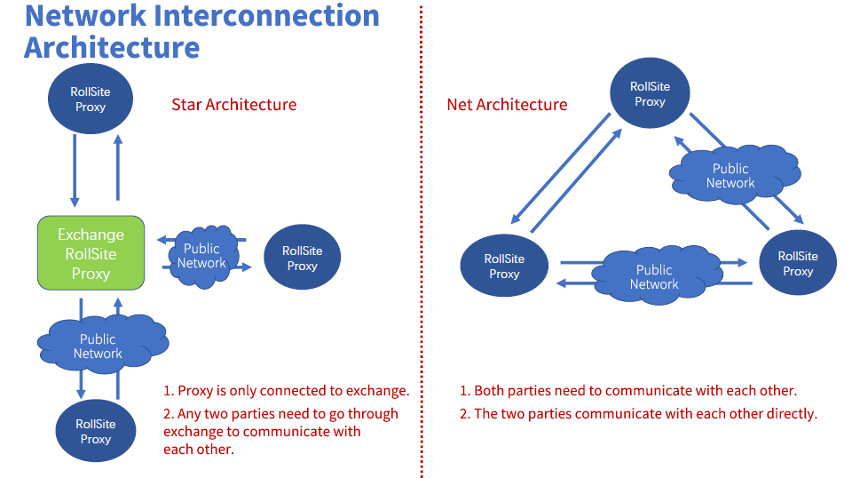

# FATE Exchange Deployment Guide
[中文](./fate-exchange_deployment_guide.zh.md)

# 1\. Server Configuration

| Server|                |
|:----------:|---------- |
| Quantities| 1 (configure according to the actual situation) |
| Configuration| 8 cores /16GB memory / 500GB hard disk / 10M bandwidth |
| Operating System| CentOS Linux 7.2+/Ubuntu 18.04 |
| Dependency Package| (Refer to "4.5 Initialize Software Environment") |
| User| User: app, Owner: apps (the app user should be able to execute sudo su root without entering a password) |
| File System| 1\. Mount the 500G hard disk in the /data directory; 2. Create the /data/projects directory with the directory owner of app:apps |

# 2\. Cluster Planning

| Party| Partyid| Hostname| IP Address| Operating System| Installed Software| Service|
|----------|----------|----------|----------|----------|----------|----------|
| exchange| exchange| VM\_0\_1\_centos| 192.168.0.1| CentOS 7.2/Ubuntu 18.04| eggroll| rollsite |

The architecture diagram:

||
|:--:|

# 3\. Component Description

| Software | Component | Port | Description                                                  |
| -------- | --------- | ---- | ------------------------------------------------------------ |
| eggroll  | rollsite  | 9370 | The cross-site/party communication component, equivalent to proxy+federation; each party can only have one for this service |

# 4\. Basic Environment Configuration

## 4.1 Configure hostname

**1\) Modify hostname**

**Execute as root user on 192.168.0.1:**

hostnamectl set-hostname VM\_0\_1\_centos

**2\) Add Host Mapping**

**Execute as root user on the destination server (192.168.0.1):**

vim /etc/hosts

192.168.0.1 VM\_0\_1\_centos

## 4.2 Shutdown selinux

**Execute as root user on the destination server (192.168.0.1):**

Confirm if selinux is installed

For CentOS, execute: rpm -qa \| grep selinux

For Ubuntu, execute: apt list --installed \| grep selinux

If selinux is installed, execute: setenforce 0

## 4.3 Modify Linux System Parameters

**Execute as root user on the destination server (192.168.0.1):**

1\) vim /etc/security/limits.conf

\* soft nofile 65535

\* hard nofile 65535

2\) vim /etc/security/limits.d/20-nproc.conf

\* soft nproc unlimited

## 4.4 Turn Firewall Off

**Execute as root user on the destination server (192.168.0.1):**

For CentOS:

systemctl disable firewalld.service

systemctl stop firewalld.service

systemctl status firewalld.service

For Ubuntu:

ufw disable

ufw status

## 4.5 Initialize Software Environment

**Execute as root user on the destination server (192.168.0.1):**

**1\) Create User**

```
groupadd -g 6000 apps
useradd -s /bin/bash -g apps -d /home/app app
passwd app
```

**2\) Create Directory**

```
mkdir -p /data/projects/fate
mkdir -p /data/projects/install
chown -R app:apps /data/projects
```

**3\) Install Dependencies**

```
#centos
yum -y install gcc gcc-c++ make openssl-devel gmp-devel mpfr-devel libmpc-devel libaio numactl autoconf automake libtool libffi-devel snappy snappy-devel zlib zlib-devel bzip2 bzip2-devel lz4-devel libasan lsof sysstat telnet psmisc
#ubuntu
apt-get install -y gcc g++ make openssl supervisor libgmp-dev  libmpfr-dev libmpc-dev libaio1 libaio-dev numactl autoconf automake libtool libffi-dev libssl1.0.0 libssl-dev  liblz4-1 liblz4-dev liblz4-1-dbg liblz4-tool  zlib1g zlib1g-dbg zlib1g-dev
cd /usr/lib/x86_64-linux-gnu
if [ ! -f "libssl.so.10" ];then
   ln -s libssl.so.1.0.0 libssl.so.10
   ln -s libcrypto.so.1.0.0 libcrypto.so.10
fi
```

# 5\. Project Deployment

Note: In this guide, the installation directory is /data/projects/install and the execution user is app by default. At the time of installation, a use can modify them according to the actual situation.

## 5.1 Obtain Installation Package

Execute as app user on the destination server (192.168.0.1 with extranet environment):

Note: Replace ${version} with the specific FATE version number.

```
cd /data/projects/install
wget https://webank-ai-1251170195.cos.ap-guangzhou.myqcloud.com/resources/jdk-8u192-linux-x64.tar.gz
wget https://webank-ai-1251170195.cos.ap-guangzhou.myqcloud.com/fate/${version}/release/fate_install_${version}_release.tar.gz

Note: version without character v, such as fate_install_1.x.x_release.tar.gz
```

## 5.2 Check OS Parameters

**Execute as app user on the destination server (192.168.0.1)**

```
#File handles, minimum 65535 in number; otherwise, refer to section 4.3 for resetting
ulimit -n
65535

#User processes, minimum 64000 in number; otherwise, refer to section 4.3 for resetting
ulimit -u
65535
```

## 5.3 Deploy JDK

**Execute as app user on the destination server (192.168.0.1)**:

```
#Create the jdk installation directory
mkdir -p /data/projects/fate/common/jdk
#Unzip
cd /data/projects/install
tar xzf jdk-8u192-linux-x64.tar.gz -C /data/projects/fate/common/jdk
cd /data/projects/fate/common/jdk
mv jdk1.8.0_192 jdk-8u192
```

## 5.4 Deploy Eggroll

### **5.4.1 Deploy Software**

```
#Deploy the software
#Execute as app user on the destination server (192.168.0.1):
cd /data/projects/install
tar xf fate_install_*.tar.gz
cd fate_install_*
tar xvf eggroll.tar.gz -C /data/projects/fate

#Set the environment variable file
#Execute as app user on the destination server (192.168.0.1):
cat >/data/projects/fate/init_env.sh <<EOF
export JAVA_HOME=/data/projects/fate/common/jdk/jdk-8u192
export PATH=\$PATH:\$JAVA_HOME/bin
export EGGROLL_LOG_LEVEL=DEBUG
EOF
```

### 5.4.2 Modify Eggroll System Profile

- Modify the rollsite IP and port of the corresponding party, and the party id of this party. For the rollsite port, the default value can be used.

  eggroll.rollsite.host: 192.168.0.1
  eggroll.rollsite.port: 9370
  eggroll.rollsite.party.id: exchange

These parameters can be manually configured by referring to the following example or by using the following commands:

Profile: /data/projects/fate/eggroll/conf/eggroll.properties

```
#Execute the modification as app user on the destination server (192.168.0.1)
cat > /data/projects/fate/eggroll/conf/eggroll.properties <<EOF
[eggroll]
# for roll site. rename in the next round
eggroll.rollsite.coordinator=webank
eggroll.rollsite.host=192.168.0.1
eggroll.rollsite.port=9370
eggroll.rollsite.party.id=exchange
eggroll.rollsite.route.table.path=conf/route_table.json
eggroll.rollsite.adapter.sendbuf.size=1048576
EOF
```

### 5.4.3 Modify Eggroll Routing Profile

The profile is used by rollsite, and the routing information can be manually configured by referring to the following example or by using the following commands:

Profile:  /data/projects/fate/eggroll/conf/route\_table.json

```
#Execute the modification as app user on the destination server (192.168.0.1)
cat > /data/projects/fate/eggroll/conf/route_table.json << EOF
{
  "route_table":
  {
    "9999":
    {
      "default":[
        {
          "port": 9370,
          "ip": "192.168.0.2"
        }
      ]
    },
    "10000":
    {
      "default":[
        {
          "port": 9370,
          "ip": "192.168.0.3"
        }
      ]
    }
  },
  "permission":
  {
    "default_allow": true
  }
}
EOF
```

### 5.4.4 Modify Default Routing Information of Each Party

**Connect the rollsite module of each exchange party, then modify as app user**

Modify the content in /data/projects/fate/eggroll/conf/route\_table.json. The default routing information points to the deployed exchange. There is no need to configure the fateflow information of other party. After the modification, a user must restart rollsite:

```
 "default": {
            "default": [
                {
                    "ip": "192.168.0.1",
                    "port": 9370
                }
            ]
        }
```

## 5.5 Start Service

**Execute as app user on the destination server (192.168.0.1)**

```
#Start the Eggroll service
source /data/projects/fate/init_env.sh
cd /data/projects/fate/eggroll
sh ./bin/eggroll.sh rollsite start
```

## 5.6 Verification and Troubleshooting

1\) Run a two-sided toy test. If the test passes, the configuration is correct. Refer to the allinone deployment document for specific use cases.

2\) Check the exchange log to see if the partyid involved in the use case in step 1 has routing information.

​       Log: /data/projects/fate/eggroll/logs/eggroll/rollsite.jvm.log

3\) Rollsite error log

​      /data/projects/fate/eggroll/logs/eggroll/bootstrap.rollsite.err

​      /data/projects/fate/eggroll/logs/eggroll/rollsite.jvm.err.log

# 6\. System Operation and Administration

## 6.1 Service Management

**Execute as app user on the destination server (192.168.0.1)**

### 6.1.1 Eggroll Service Management

```
cd /data/projects/fate/eggroll
```

Start/Shutdown/View/Restart rollsite:

```
sh ./bin/eggroll.sh rollsite start/stop/status/restart
```

## 6.2 View Processes and Ports

**Execute as app user on the destination server (192.168.0.1)**

### 6.2.1 View Processes

```
#Check if the process is started
ps -ef | grep -i rollsite
```

### 6.2.2 View Process Ports

```
#Check if the process port exists
#rollsite
netstat -tlnp | grep 9370
```

## 6.3 Service Logs

| Service| Log Path
|----------|----------
| eggroll| /data/projects/fate/eggroll/logs

