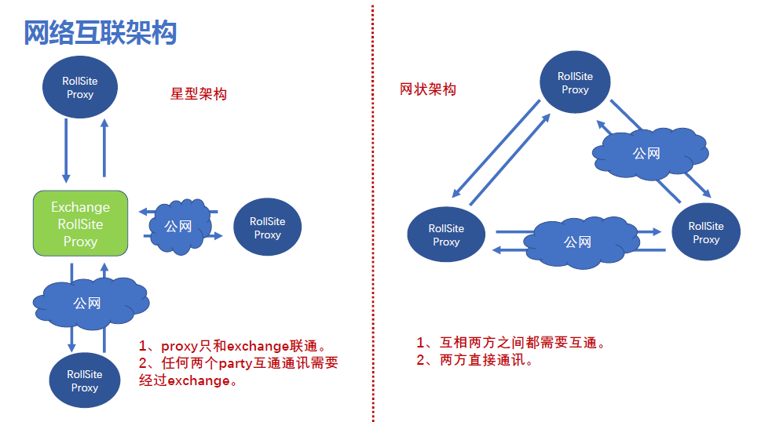

#  FATE exchange部署指南 
[English](./fate-exchange_deployment_guide.md)

1.服务器配置
============

|  服务器  |                                                              |
| :------: | ------------------------------------------------------------ |
|   数量   | 1（根据实际情况配置）                                        |
|   配置   | 8 core /16GB memory / 500GB硬盘/10M带宽                      |
| 操作系统 | CentOS linux 7.2及以上/Ubuntu 18.04                          |
|  依赖包  | （参见4.5 软件环境初始化）                                   |
|   用户   | 用户：app，属主：apps（app用户需可以sudo su root而无需密码） |
| 文件系统 | 1.  500G硬盘挂载在/ data目录下； 2.创建/ data / projects目录，目录属主为：app:apps |

2.集群规划
==========

| party    | partyid  | 主机名        | IP地址      | 操作系统                | 安装软件 | 服务     |
| -------- | -------- | ------------- | ----------- | ----------------------- | -------- | -------- |
| exchange | exchange | VM_0_1_centos | 192.168.0.1 | CentOS 7.2/Ubuntu 18.04 | eggroll  | rollsite |

架构图：

||
|:--:|

# 3.组件说明

| 软件产品 | 组件     | 端口 | 说明                                                         |
| -------- | -------- | ---- | ------------------------------------------------------------ |
| eggroll  | rollsite | 9370 | 跨站点或者说跨party通讯组件，相当于proxy+federation，每个party只能有一个此服务 |

4.基础环境配置
==============

4.1 hostname配置
----------------

**1）修改主机名**

**在192.168.0.1 root用户下执行：**

hostnamectl set-hostname VM_0_1_centos

**2）加入主机映射**

**在目标服务器（192.168.0.1）root用户下执行：**

vim /etc/hosts

192.168.0.1 VM_0_1_centos

4.2 关闭selinux
---------------

**在目标服务器（192.168.0.1）root用户下执行：**

确认是否已安装selinux

centos系统执行：rpm -qa | grep selinux

ubuntu系统执行：apt list --installed | grep selinux

如果已安装了selinux就执行：setenforce 0

4.3 修改Linux系统参数
---------------------------

**在目标服务器（192.168.0.1）root用户下执行：**

1）vim /etc/security/limits.conf

\* soft nofile 65535

\* hard nofile 65535

2）vim /etc/security/limits.d/20-nproc.conf

\* soft nproc unlimited

4.4 关闭防火墙
--------------

**在目标服务器（192.168.0.1）root用户下执行**

如果是Centos系统：

systemctl disable firewalld.service

systemctl stop firewalld.service

systemctl status firewalld.service

如果是Ubuntu系统：

ufw disable

ufw status

4.5 软件环境初始化
------------------

**在目标服务器（192.168.0.1）root用户下执行**

**1）创建用户**

```
groupadd -g 6000 apps
useradd -s /bin/bash -g apps -d /home/app app
passwd app
```

**2）创建目录**

```
mkdir -p /data/projects/fate
mkdir -p /data/projects/install
chown -R app:apps /data/projects
```

**3）安装依赖**

```
#centos
yum -y install gcc gcc-c++ make openssl-devel gmp-devel mpfr-devel libmpc-devel libaio numactl autoconf automake libtool libffi-devel snappy snappy-devel zlib zlib-devel bzip2 bzip2-devel lz4-devel libasan lsof sysstat telnet psmisc
#ubuntu
apt-get install -y gcc g++ make openssl supervisor libgmp-dev  libmpfr-dev libmpc-dev libaio1 libaio-dev numactl autoconf automake libtool libffi-dev libssl1.0.0 libssl-dev  liblz4-1 liblz4-dev liblz4-1-dbg liblz4-tool  zlib1g zlib1g-dbg zlib1g-dev
cd /usr/lib/x86_64-linux-gnu
if [ ! -f "libssl.so.10" ];then
   ln -s libssl.so.1.0.0 libssl.so.10
   ln -s libcrypto.so.1.0.0 libcrypto.so.10
fi
```

5.项目部署
==========

注：此指导安装目录默认为/data/projects/install，执行用户为app，安装时根据具体实际情况修改。

5.1 获取安装包
------------

在目标服务器（192.168.0.1 具备外网环境）app用户下执行:
备注：用具体FATE版本号替换${version}
```
cd /data/projects/install
wget https://webank-ai-1251170195.cos.ap-guangzhou.myqcloud.com/jdk-8u192-linux-x64.tar.gz
wget https://webank-ai-1251170195.cos.ap-guangzhou.myqcloud.com/FATE_install_${version}_release.tar.gz

注意：version不带字符v，如FATE_install_1.x.x_release.tar.gz
```

## 5.2 操作系统参数检查

**在目标服务器（192.168.0.1）app用户下执行**

```
#文件句柄数，不低于65535，如不满足需参考4.3章节重新设置
ulimit -n
65535

#用户进程数，不低于64000，如不满足需参考4.3章节重新设置
ulimit -u
65535
```

## 5.3 部署jdk

**在目标服务器（192.168.0.1）app用户下执行**:

```
#创建jdk安装目录
mkdir -p /data/projects/fate/common/jdk
#解压缩
cd /data/projects/install
tar xzf jdk-8u192-linux-x64.tar.gz -C /data/projects/fate/common/jdk
cd /data/projects/fate/common/jdk
mv jdk1.8.0_192 jdk-8u192
```


5.4 部署eggroll
--------

### **5.4.1软件部署**

```
#部署软件
#在目标服务器（192.168.0.1）app用户下执行:
cd /data/projects/install
tar xf FATE_install_*.tar.gz
cd FATE_install_*
tar xvf eggroll.tar.gz -C /data/projects/fate

#设置环境变量文件
#在目标服务器（192.168.0.1）app用户下执行:
cat >/data/projects/fate/init_env.sh <<EOF
export JAVA_HOME=/data/projects/fate/common/jdk/jdk-8u192
export PATH=\$PATH:\$JAVA_HOME/bin
export EGGROLL_LOG_LEVEL=DEBUG
EOF
```

### 5.4.2 eggroll系统配置文件修改

- 对应party rollsite的IP、端口、本party的Party Id修改，rollsite的端口一般默认即可。

  eggroll.rollsite.host: 192.168.0.1
  eggroll.rollsite.port: 9370
  eggroll.rollsite.party.id: exchange

以上参数调整可以参考如下例子手工配置，也可以使用以下指令完成：

配置文件：/data/projects/fate/eggroll/conf/eggroll.properties

```
#在目标服务器（192.168.0.1）app用户下修改执行
cat > /data/projects/fate/eggroll/conf/eggroll.properties <<EOF
[eggroll]
# for roll site. rename in the next round
eggroll.rollsite.coordinator=fate
eggroll.rollsite.host=192.168.0.1
eggroll.rollsite.port=9370
eggroll.rollsite.party.id=exchange
eggroll.rollsite.route.table.path=conf/route_table.json
eggroll.rollsite.route.table.key=fate
eggroll.rollsite.route.table.whitelist=127.0.0.1
eggroll.rollsite.jvm.options=-XX:+UseG1GC -XX:+PrintGCDetails -XX:+PrintGCDateStamps -Xloggc:logs/eggroll/rollsite.gc.log
eggroll.rollsite.push.max.retry=3
eggroll.rollsite.push.long.retry=2
eggroll.rollsite.push.batches.per.stream=10
eggroll.rollsite.adapter.sendbuf.size=100000
eggroll.core.grpc.channel.keepalive.timeout.sec=20
EOF
```

### 5.4.3 eggroll路由配置文件修改

此配置文件rollsite使用，配置路由信息，可以参考如下例子手工配置，也可以使用以下指令完成：

配置文件:  /data/projects/fate/eggroll/conf/route_table.json

```
#在目标服务器（192.168.0.1）app用户下修改执行
cat > /data/projects/fate/eggroll/conf/route_table.json << EOF
{
  "route_table":
  {
    "9999":
    {
      "default":[
        {
          "port": 9370,
          "ip": "192.168.0.2"
        }
      ]
    },
    "10000":
    {
      "default":[
        {
          "port": 9370,
          "ip": "192.168.0.3"
        }
      ]
    }
  },
  "permission":
  {
    "default_allow": true
  }
}
EOF
```

### 5.4.4 各party默认路由信息修改

**需要连接exchange的各party的rollsite模块，app用户修改**

修改/data/projects/fate/eggroll/conf/route_table.json部分，默认路由信息指向部署好的exchange，不需要配置对端fateflow信息，修改后需重启rollsite：

```
 "default": {
            "default": [
                {
                    "ip": "192.168.0.1",
                    "port": 9370
                }
            ]
        }
```

## 5.5 启动服务

**在目标服务器（192.168.0.1）app用户下执行**

```
#启动eggroll服务
source /data/projects/fate/init_env.sh
cd /data/projects/fate/eggroll
sh ./bin/eggroll.sh rollsite start
```

## 5.6 验证和问题定位

1）跑一个双边toy测试，看是否可以测试通过，通过则表示配置无误，具体用例参考allinone部署文档。

2）查看exchange日志，看第1步用例涉及到的partyid是否有路由信息，

​       日志：/data/projects/fate/eggroll/logs/eggroll/rollsite.jvm.log

3）rollsite错误日志

​      /data/projects/fate/eggroll/logs/eggroll/bootstrap.rollsite.err

​      /data/projects/fate/eggroll/logs/eggroll/rollsite.jvm.err.log

6.系统运维
================

6.1 服务管理
------------

**在目标服务器（192.168.0.1）app用户下执行**

### 6.1.1 Eggroll服务管理

```
cd /data/projects/fate/eggroll
```

启动/关闭/查看/重启rollsite：

```
sh ./bin/eggroll.sh rollsite start/stop/status/restart
```

## 6.2 查看进程和端口

**在目标服务器（192.168.0.1）app用户下执行**

### 6.2.1 查看进程

```
#查看进程是否启动
ps -ef | grep -i rollsite
```

### 6.2.2 查看进程端口

```
#查看进程端口是否存在
#rollsite
netstat -tlnp | grep 9370
```


## 6.3 服务日志

| 服务    | 日志路径                         |
| ------- | -------------------------------- |
| eggroll | /data/projects/fate/eggroll/logs |
