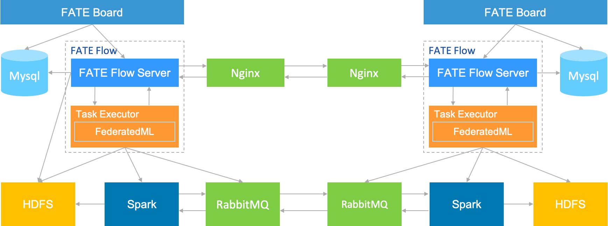

# FATE ON Spark 部署指南
[English](fate_on_spark_deployment_guide.md)

## 1.服务器配置

|  服务器  |                                                              |
| :------: | ------------------------------------------------------------ |
|   数量   | >1（根据实际情况配置）                                       |
|   配置   | 8 core /16GB memory / 500GB硬盘/10M带宽                      |
| 操作系统 | CentOS linux 7.2及以上/Ubuntu 16.04 以上                     |
|  依赖包  | （参见4.5 软件环境初始化）                                   |
|   用户   | 用户：app，属主：apps（app用户需可以sudo su root而无需密码） |
| 文件系统 | 1.  500G硬盘挂载在/ data目录下； 2.创建/ data / projects目录，目录属主为：app:apps |

## 2.集群规划

| party  | partyid | 主机名        | IP地址      | 操作系统                | 安装软件    | 服务                              |
| ------ | ------- | ------------- | ----------- | ----------------------- | ----------- | --------------------------------- |
| PartyA | 10000   | VM-0-1-centos | 192.168.0.1 | CentOS 7.2/Ubuntu 16.04 | fate，mysql, nginx | fateflow，fateboard，mysql，nginx |
| PartyA | 10000   |               |             |                         | Spark、HDFS |                                   |
| PartyA | 10000   |               |             |                         | RabbitMQ(或pulsar )   |                                   |
| PartyB | 9999    | VM-0-2-centos | 192.168.0.2 | CentOS 7.2/Ubuntu 16.04 | fate，mysql, nginx | fateflow，fateboard，mysql，nginx |
| PartyB | 9999    |               |             |                         | Spark、HDFS |                                   |
| PartyB | 9999    |               |             |                         | RabbitMQ(或pulsar )  |                                   |

架构图：

||
|:--:|

## 3.组件说明

| 软件产品 | 组件      | 端口      | 说明                                                  |
| -------- | --------- | --------- | ----------------------------------------------------- |
| fate     | fate_flow | 9360;9380 | 联合学习任务流水线管理模块，每个party只能有一个此服务 |
| fate     | fateboard | 8080      | 联合学习过程可视化模块，每个party只能有一个此服务     |
| nginx    | nginx     | 9370      | 跨站点(party)调度协调代理                             |
| mysql    | mysql     | 3306      | 元数据存储                                            |
| Spark    |           |           | 计算引擎                                              |
| HDFS(或者LocalFS)     |           |           | 存储引擎                                              |
| RabbitMQ(或pulsar) |           |           | 跨站点(party)数据交换代理

## 4.基础环境配置

### 4.1 hostname配置(可选)

**1）修改主机名**

**在192.168.0.1 root用户下执行：**

```bash
hostnamectl set-hostname VM-0-1-centos
```

**在192.168.0.2 root用户下执行：**

```bash
hostnamectl set-hostname VM-0-2-centos
```

**2）加入主机映射**

**在目标服务器（192.168.0.1 192.168.0.2 ）root用户下执行：**

```bash
vim /etc/hosts
192.168.0.1 VM-0-1-centos
192.168.0.2 VM-0-2-centos
```

### 4.2 关闭SELinux(可选)

**在目标服务器（192.168.0.1 192.168.0.2）root用户下执行：**

确认是否已安装SELinux

CentOS系统执行：

```bash
rpm -qa | grep selinux
```

Ubuntu系统执行：

```bash
apt list --installed | grep selinux
```

如果已安装了SELinux就执行：

```bash
setenforce 0
```

### 4.3 修改Linux系统参数

**在目标服务器（192.168.0.1 192.168.0.2 192.168.0.3）root用户下执行：**

```bash
vim /etc/security/limits.conf
* soft nofile 65536
* hard nofile 65536
```

```bash
vim /etc/security/limits.d/20-nproc.conf
* soft nproc unlimited
```

### 4.4 关闭防火墙(可选)


**在目标服务器（192.168.0.1 192.168.0.2 192.168.0.3）root用户下执行**

如果是CentOS系统：

```bash
systemctl disable firewalld.service
systemctl stop firewalld.service
systemctl status firewalld.service
```

如果是Ubuntu系统：

```bash
ufw disable
ufw status
```

### 4.5 软件环境初始化

**在目标服务器（192.168.0.1 192.168.0.2 192.168.0.3）root用户下执行**

**1）创建用户**

```bash
groupadd -g 6000 apps
useradd -s /bin/bash -g apps -d /home/app app
passwd app
```

**2）创建目录**

```bash
mkdir -p /data/projects/fate
mkdir -p /data/projects/install
chown -R app:apps /data/projects
```

**3）安装依赖**

```bash
#centos
yum -y install gcc gcc-c++ make openssl-devel gmp-devel mpfr-devel libmpc-devel libaio numactl autoconf automake libtool libffi-devel snappy snappy-devel zlib zlib-devel bzip2 bzip2-devel lz4-devel libasan lsof sysstat telnet psmisc
#ubuntu
apt-get install -y gcc g++ make openssl supervisor libgmp-dev  libmpfr-dev libmpc-dev libaio1 libaio-dev numactl autoconf automake libtool libffi-dev libssl1.0.0 libssl-dev liblz4-1 liblz4-dev liblz4-1-dbg liblz4-tool  zlib1g zlib1g-dbg zlib1g-dev
cd /usr/lib/x86_64-linux-gnu
if [ ! -f "libssl.so.10" ];then
   ln -s libssl.so.1.0.0 libssl.so.10
   ln -s libcrypto.so.1.0.0 libcrypto.so.10
fi
```

## 5.部署依赖组件

注：此指导安装目录默认为/data/projects/install，执行用户为app，安装时根据具体实际情况修改。

### 5.1 获取安装包

在目标服务器（192.168.0.1 具备外网环境）app用户下执行:

```bash
mkdir -p /data/projects/install
cd /data/projects/install
wget https://webank-ai-1251170195.cos.ap-guangzhou.myqcloud.com/resources/Miniconda3-py38_4.12.0-Linux-x86_64.sh
wget https://webank-ai-1251170195.cos.ap-guangzhou.myqcloud.com/resources/jdk-8u192-linux-x64.tar.gz
wget https://webank-ai-1251170195.cos.ap-guangzhou.myqcloud.com/resources/mysql-8.0.28.tar.gz
wget https://webank-ai-1251170195.cos.ap-guangzhou.myqcloud.com/resources/openresty-1.17.8.2.tar.gz
wget https://webank-ai-1251170195.cos.ap-guangzhou.myqcloud.com/fate/${version}/release/pip_packages_fate_${version}.tar.gz
wget https://webank-ai-1251170195.cos.ap-guangzhou.myqcloud.com/fate/${version}/release/fate_install_${version}_release.tar.gz

#传输到192.168.0.1和192.168.0.2
scp *.tar.gz app@192.168.0.1:/data/projects/install
scp *.tar.gz app@192.168.0.2:/data/projects/install
```
注意: 当前文档需要部署的FATE version>=1.7.0，${version}替换为如1.9.0，不带v字符
### 5.2 操作系统参数检查

**在目标服务器（192.168.0.1 192.168.0.2 192.168.0.3）app用户下执行**

```bash
#文件句柄数，不低于65535，如不满足需参考4.3章节重新设置
ulimit -n
65535

#用户进程数，不低于64000，如不满足需参考4.3章节重新设置
ulimit -u
65535
```

### 5.3 部署MySQL

**在目标服务器（192.168.0.1 192.168.0.2）app用户下执行**

**1）MySQL安装：**

```bash
#建立mysql根目录
mkdir -p /data/projects/fate/common/mysql
mkdir -p /data/projects/fate/data/mysql

#解压缩软件包
cd /data/projects/install
tar xf mysql-*.tar.gz
cd mysql
tar xf mysql-8.0.28.tar.gz -C /data/projects/fate/common/mysql

#配置设置
mkdir -p /data/projects/fate/common/mysql/mysql-8.0.28/{conf,run,logs}
cp service.sh /data/projects/fate/common/mysql/mysql-8.0.28/
cp my.cnf /data/projects/fate/common/mysql/mysql-8.0.28/conf

#初始化
cd /data/projects/fate/common/mysql/mysql-8.0.28/
./bin/mysqld --initialize --user=app --basedir=/data/projects/fate/common/mysql/mysql-8.0.28 --datadir=/data/projects/fate/data/mysql > logs/init.log 2>&1
cat logs/init.log |grep root@localhost
#注意输出信息中root@localhost:后的是mysql用户root的初始密码，需要记录，后面修改密码需要用到

#启动服务
cd /data/projects/fate/common/mysql/mysql-8.0.28/
nohup ./bin/mysqld_safe --defaults-file=./conf/my.cnf --user=app >>logs/mysqld.log 2>&1 &

#修改mysql root用户密码
cd /data/projects/fate/common/mysql/mysql-8.0.28/
./bin/mysqladmin -h 127.0.0.1 -P 3306 -S ./run/mysql.sock -u root -p password "fate_dev"
Enter Password:【输入root初始密码】

#验证登陆
cd /data/projects/fate/common/mysql/mysql-8.0.28/
./bin/mysql -u root -p -S ./run/mysql.sock
Enter Password:【输入root修改后密码:fate_dev】
```

**2）建库授权和业务配置**

```bash
cd /data/projects/fate/common/mysql/mysql-8.0.28/
./bin/mysql -u root -p -S ./run/mysql.sock
Enter Password:【fate_dev】

#创建fate_flow库
mysql>CREATE DATABASE IF NOT EXISTS fate_flow;

#创建远程用户和授权
1) 192.168.0.1执行
mysql>CREATE USER 'fate'@'192.168.0.1' IDENTIFIED BY 'fate_dev';
mysql>GRANT ALL ON *.* TO 'fate'@'192.168.0.1';
mysql>flush privileges;

2) 192.168.0.2执行
mysql>CREATE USER 'fate'@'192.168.0.2' IDENTIFIED BY 'fate_dev';
mysql>GRANT ALL ON *.* TO 'fate'@'192.168.0.2';
mysql>flush privileges;

#校验
mysql>select User,Host from mysql.user;
mysql>show databases;

```

### 5.4 部署JDK

**在目标服务器（192.168.0.1 192.168.0.2）app用户下执行**:

```bash
#创建jdk安装目录
mkdir -p /data/projects/fate/common/jdk
#解压缩
cd /data/projects/install
tar xzf jdk-8u192-linux-x64.tar.gz -C /data/projects/fate/common/jdk
```

### 5.5 部署python

**在目标服务器（192.168.0.1 192.168.0.2）app用户下执行**:

```bash
#创建python虚拟化安装目录
mkdir -p /data/projects/fate/common/python/venv

#安装miniconda3
cd /data/projects/install
sh Miniconda3-py38_4.12.0-Linux-x86_64.sh -b -p /data/projects/fate/common/miniconda3
#创建虚拟化环境
/data/projects/fate/common/miniconda3/bin/python3.8 -m venv /data/projects/fate/common/python/venv

```

### 5.6  部署Spark & HDFS
请参阅部署指南：[Hadoop+Spark集群部署](common/hadoop_spark_deployment_guide.zh.md)

### 5.7 部署Nginx
请参阅部署指南：[Nginx部署](common/nginx_deployment_guide.zh.md)

### 5.8 部署RabbitMQ(和Pulsar二选一)

请参阅部署指南：[RabbitMQ部署](common/rabbitmq_deployment_guide.zh.md)

请参阅部署指南：[Pulsar部署](common/pulsar_deployment_guide.zh.md)

## 6 部署FATE

### 6.1 软件部署

```
#部署软件
#在目标服务器（192.168.0.1 192.168.0.2）app用户下执行:
cd /data/projects/install
tar xf fate_install_*.tar.gz
cd fate_install_*
cp fate.env /data/projects/fate/
cp RELEASE.md /data/projects/fate
tar xvf bin.tar.gz -C /data/projects/fate/
tar xvf conf.tar.gz -C /data/projects/fate/
tar xvf deploy.tar.gz -C /data/projects/fate/
tar xvf examples.tar.gz -C /data/projects/fate/
tar xvf fate.tar.gz -C /data/projects/fate/
tar xvf fateflow.tar.gz -C /data/projects/fate/
tar xvf fateboard.tar.gz -C /data/projects/fate
tar xvf proxy.tar.gz -C /data/projects/fate

#设置环境变量文件
#在目标服务器（192.168.0.1 192.168.0.2）app用户下执行:
cat >/data/projects/fate/bin/init_env.sh <<EOF
fate_project_base=/data/projects/fate
export FATE_PROJECT_BASE=\$fate_project_base
export FATE_DEPLOY_BASE=\$fate_project_base

export PYTHONPATH=/data/projects/fate/fateflow/python:/data/projects/fate/fate/python
venv=/data/projects/fate/common/python/venv
export JAVA_HOME=/data/projects/fate/common/jdk/jdk-8u192
export PATH=\$PATH:\$JAVA_HOME/bin
source \${venv}/bin/activate
export FATE_LOG_LEVEL=DEBUG
export FATE_PROFILE_LOG_ENABLED=0
EOF

#安装依赖包
cd /data/projects/install
tar xvf pip_packages_fate_*.tar.gz
source /data/projects/fate/common/python/venv/bin/activate
cd pip_packages_fate_*
pip install -r /data/projects/fate/fate/python/requirements.txt -f ./ --no-index
cd /data/projects/fate/fate/python/fate_client
python setup.py install
cd /data/projects/fate/fate/python/fate_test
python setup.py install
pip list | wc -l
```


### 6.2 FATE-Board配置文件修改

1）conf/application.properties

- 服务端口

  server.port---默认

- fateflow的访问url

  fateflow.url，host：http://192.168.0.1:9380，guest：http://192.168.0.2:9380


```
#在目标服务器（192.168.0.1）app用户下修改执行
cat > /data/projects/fate/fateboard/conf/application.properties <<EOF
server.port=8080
fateflow.url=http://192.168.0.1:9380
#priority is higher than {fateflow.url}, split by ;
fateflow.url-list=
fateflow.http_app_key=
fateflow.http_secret_key=
spring.http.encoding.charset=UTF-8
spring.http.encoding.enabled=true
server.tomcat.uri-encoding=UTF-8
fateboard.front_end.cors=false
fateboard.front_end.url=http://localhost:8028
server.tomcat.max-threads=1000
server.tomcat.max-connections=20000
spring.servlet.multipart.max-file-size=10MB
spring.servlet.multipart.max-request-size=100MB
spring.servlet.session.timeout=1800s
server.compression.enabled=true
server.compression.mime-types=application/json,application/xml,text/html,text/xml,text/plain
server.board.login.username=admin
server.board.login.password=admin
#only [h,m,s] is available
server.servlet.session.timeout=4h
server.servlet.session.cookie.max-age=4h
management.endpoints.web.exposure.exclude=*
feign.client.config.default.connectTimeout=10000
feign.client.config.default.readTimeout=10000
EOF

#在目标服务器（192.168.0.2）app用户下修改执行
cat > /data/projects/fate/fateboard/conf/application.properties <<EOF
server.port=8080
fateflow.url=http://192.168.0.2:9380
#priority is higher than {fateflow.url}, split by ;
fateflow.url-list=
fateflow.http_app_key=
fateflow.http_secret_key=
spring.http.encoding.charset=UTF-8
spring.http.encoding.enabled=true
server.tomcat.uri-encoding=UTF-8
fateboard.front_end.cors=false
fateboard.front_end.url=http://localhost:8028
server.tomcat.max-threads=1000
server.tomcat.max-connections=20000
spring.servlet.multipart.max-file-size=10MB
spring.servlet.multipart.max-request-size=100MB
spring.servlet.session.timeout=1800s
server.compression.enabled=true
server.compression.mime-types=application/json,application/xml,text/html,text/xml,text/plain
server.board.login.username=admin
server.board.login.password=admin
#only [h,m,s] is available
server.servlet.session.timeout=4h
server.servlet.session.cookie.max-age=4h
management.endpoints.web.exposure.exclude=*
feign.client.config.default.connectTimeout=10000
feign.client.config.default.readTimeout=10000
EOF
```

### 6.3 FATE配置文件修改

  配置文件：/data/projects/fate/conf/service_conf.yaml

##### 6.3.1 运行配置
- FATE引擎相关配置:

```yaml
default_engines:
  computing: spark
  federation: rabbitmq #(或pulsar)
  storage: hdfs #(或localfs)
```

- FATE-Flow的监听ip、端口

- FATE-Board的监听ip、端口

- db的连接ip、端口、账号和密码

- proxy相关配置(ip及端口)

**conf/service_conf.yaml**
```yaml
fateflow:
  proxy: nginx
fate_on_spark:
  nginx:
    host: 127.0.0.1
    http_port: 9390
    grpc_port: 9310
```

##### 6.3.2 依赖服务配置

**conf/service_conf.yaml**
```yaml
fate_on_spark:
  spark:
    home:
    cores_per_node: 40
    nodes: 1
  hdfs:
    name_node: hdfs://fate-cluster
    path_prefix:
  # rabbitmq和pulsar二选一
  rabbitmq:
    host: 127.0.0.1
    mng_port: 12345
    port: 5672
    user: fate
    password: fate
    route_table:
  pulsar:
    host: 127.0.0.1
    port: 6650
    mng_port: 8080
    cluster: standalone
    tenant: fl-tenant
    topic_ttl: 5
    route_table:

```
- Spark的相关配置
    - home为Spark home绝对路径
    - cores_per_node为Spark集群每个节点的cpu核数
    - nodes为Spark集群节点数量

- HDFS的相关配置
    - name_node为hdfs的namenode完整地址
    - path_prefix为默认存储路径前缀，若不配置则默认为/

- RabbitMQ相关配置
    - host: 主机ip
    - mng_port: 管理端口
    - port: 服务端口
    - user：管理员用户
    - password: 管理员密码
    - route_table: 路由表信息，默认为空

- pulsar相关配置
    - host: 主机ip
    - port: brokerServicePort
    - mng_port: webServicePort
    - cluster：集群或单机
    - tenant: 合作方需要使用同一个tenant
    - topic_ttl： 回收资源参数
    - route_table: 路由表信息，默认为空


##### 6.3.3 spark依赖分发模式(仅适用spark集群版本)
- "conf/service_conf.yaml"
```yaml
dependent_distribution: true # 推荐使用true
```

**注意:若该配置为"true"，可忽略下面的操作**

- 依赖准备:整个fate目录拷贝到每个work节点,目录结构保持一致

- spark配置修改：spark/conf/spark-env.sh
```shell script
export PYSPARK_PYTHON=/data/projects/fate/common/python/venv/bin/python
export PYSPARK_DRIVER_PYTHON=/data/projects/fate/common/python/venv/bin/python
```

##### 6.3.4 fateflow配置文件参考配置

此配置文件格式要按照yaml格式配置，不然解析报错，可以参考如下例子手工配置，也可以使用以下指令完成。

```
#在目标服务器（192.168.0.1）app用户下修改执行
cat > /data/projects/fate/conf/service_conf.yaml <<EOF
use_registry: false
use_deserialize_safe_module: false
dependent_distribution: false
encrypt_password: false
encrypt_module: fate_arch.common.encrypt_utils#pwdecrypt
private_key:
party_id:
hook_module:
  client_authentication: fate_flow.hook.flow.client_authentication
  site_authentication: fate_flow.hook.flow.site_authentication
  permission: fate_flow.hook.flow.permission
hook_server_name:
authentication:
  client:
    switch: false
    http_app_key:
    http_secret_key:
  site:
    switch: false
permission:
  switch: false
  component: false
  dataset: false
fateflow:
  host: 192.168.0.1
  http_port: 9380
  grpc_port: 9360
  nginx:
    host:
    http_port:
    grpc_port:
  proxy: nginx
  protocol: default
database:
  name: fate_flow
  user: fate
  passwd: fate_dev
  host: 192.168.0.1
  port: 3306
  max_connections: 100
  stale_timeout: 30
zookeeper:
  hosts:
    - 127.0.0.1:2181
  use_acl: false
  user: fate
  password: fate
default_engines:
  computing: spark
  federation: pulsar
  storage: localfs
fate_on_standalone:
  standalone:
    cores_per_node: 20
    nodes: 1
fate_on_eggroll:
  clustermanager:
    cores_per_node: 16
    nodes: 1
  rollsite:
    host: 127.0.0.1
    port: 9370
fate_on_spark:
  spark:
    home:
    cores_per_node: 20
    nodes: 1
  linkis_spark:
    cores_per_node: 20
    nodes: 2
    host: 127.0.0.1
    port: 9001
    token_code: MLSS
    python_path: /data/projects/fate/python
  hive:
    host: 127.0.0.1
    port: 10000
    auth_mechanism:
    username:
    password:
  linkis_hive:
    host: 127.0.0.1
    port: 9001
  hdfs:
    name_node: hdfs://fate-cluster
    path_prefix:
  rabbitmq:
    host: 192.168.0.1
    mng_port: 15672
    port: 5672
    user: fate
    password: fate
    route_table:
    mode: replication
    max_message_size: 1048576
  pulsar:
    host: 192.168.0.1
    port: 6650
    mng_port: 18080
    cluster: standalone
    tenant: fl-tenant
    topic_ttl: 5
    route_table:
    mode: replication
    max_message_size: 1048576
  nginx:
    host: 192.168.0.1
    http_port: 9300
    grpc_port: 9310
fateboard:
  host: 192.168.0.1
  port: 8080
enable_model_store: false
model_store_address:
  storage: mysql
  name: fate_flow
  user: fate
  passwd: fate_dev
  host: 127.0.0.1
  port: 3306
  max_connections: 10
  stale_timeout: 10
servings:
  hosts:
    - 127.0.0.1:8000
fatemanager:
  host: 127.0.0.1
  port: 8001
  federatedId: 0
EOF

#在目标服务器（192.168.0.2）app用户下修改执行
cat > /data/projects/fate/conf/service_conf.yaml <<EOF
use_registry: false
use_deserialize_safe_module: false
dependent_distribution: false
encrypt_password: false
encrypt_module: fate_arch.common.encrypt_utils#pwdecrypt
private_key:
party_id:
hook_module:
  client_authentication: fate_flow.hook.flow.client_authentication
  site_authentication: fate_flow.hook.flow.site_authentication
  permission: fate_flow.hook.flow.permission
hook_server_name:
authentication:
  client:
    switch: false
    http_app_key:
    http_secret_key:
  site:
    switch: false
permission:
  switch: false
  component: false
  dataset: false
fateflow:
  host: 192.168.0.2
  http_port: 9380
  grpc_port: 9360
  nginx:
    host:
    http_port:
    grpc_port:
  proxy: nginx
  protocol: default
database:
  name: fate_flow
  user: fate
  passwd: fate_dev
  host: 192.168.0.2
  port: 3306
  max_connections: 100
  stale_timeout: 30
zookeeper:
  hosts:
    - 127.0.0.1:2181
  use_acl: false
  user: fate
  password: fate
default_engines:
  computing: spark
  federation: pulsar
  storage: localfs
fate_on_standalone:
  standalone:
    cores_per_node: 20
    nodes: 1
fate_on_eggroll:
  clustermanager:
    cores_per_node: 16
    nodes: 1
  rollsite:
    host: 127.0.0.1
    port: 9370
fate_on_spark:
  spark:
    home:
    cores_per_node: 20
    nodes: 1
  linkis_spark:
    cores_per_node: 20
    nodes: 2
    host: 127.0.0.1
    port: 9001
    token_code: MLSS
    python_path: /data/projects/fate/python
  hive:
    host: 127.0.0.1
    port: 10000
    auth_mechanism:
    username:
    password:
  linkis_hive:
    host: 127.0.0.1
    port: 9001
  hdfs:
    name_node: hdfs://fate-cluster
    path_prefix:
  rabbitmq:
    host: 192.168.0.2
    mng_port: 15672
    port: 5672
    user: fate
    password: fate
    route_table:
    mode: replication
    max_message_size: 1048576
  pulsar:
    host: 192.168.0.2
    port: 6650
    mng_port: 18080
    cluster: standalone
    tenant: fl-tenant
    topic_ttl: 5
    route_table:
    mode: replication
    max_message_size: 1048576
  nginx:
    host: 192.168.0.2
    http_port: 9300
    grpc_port: 9310
fateboard:
  host: 192.168.0.1
  port: 8080
enable_model_store: false
model_store_address:
  storage: mysql
  name: fate_flow
  user: fate
  passwd: fate_dev
  host: 127.0.0.1
  port: 3306
  max_connections: 10
  stale_timeout: 10
servings:
  hosts:
    - 127.0.0.1:8000
fatemanager:
  host: 127.0.0.1
  port: 8001
  federatedId: 0
EOF
```

##### 6.3.5 mq路由表配置

**conf/rabbitmq_route_table.yaml**
```yaml
10000:
  host: 192.168.0.1
  port: 5672
9999:
  host: 192.168.0.2
  port: 5672
```

**conf/pulsar_route_table.yaml**
```yml
9999:
  # host can be a domain like 9999.fate.org
  host: 192.168.0.2
  port: 6650
  sslPort: 6651
  # set proxy address for this pulsar cluster
  proxy: ""

10000:
  # host can be a domain like 10000.fate.org
  host: 192.168.0.1
  port: 6650
  sslPort: 6651
  proxy: ""

default:
  # compose host and proxy for party that does not exist in route table
  # in this example, the host for party 8888 will be 8888.fate.org
  proxy: "proxy.fate.org:443"
  domain: "fate.org"
  port: 6650
  sslPort: 6651
```

##### 6.3.6 Nginx路由配置文件修改

配置文件:  /data/projects/fate/proxy/nginx/conf/route_table.yaml
此配置文件Nginx使用，配置路由信息，可以参考如下例子手工配置，也可以使用以下指令完成：

```
#在目标服务器（192.168.0.1）app用户下修改执行
cat > /data/projects/fate/proxy/nginx/conf/route_table.yaml << EOF
default:
  proxy:
    - host: 192.168.0.2
      http_port: 9300
      grpc_port: 9310
10000:
  proxy:
    - host: 192.168.0.1
      http_port: 9300
      grpc_port: 9310
  fateflow:
    - host: 192.168.0.1
      http_port: 9380
      grpc_port: 9360
9999:
  proxy:
    - host: 192.168.0.2
      http_port: 9300
      grpc_port: 9310
  fateflow:
    - host: 192.168.0.2
      http_port: 9380
      grpc_port: 9360
EOF

#在目标服务器（192.168.0.2）app用户下修改执行
cat > /data/projects/fate/proxy/nginx/conf/route_table.yaml << EOF
default:
  proxy:
    - host: 192.168.0.1
      http_port: 9300
      grpc_port: 9310
10000:
  proxy:
    - host: 192.168.0.1
      http_port: 9300
      grpc_port: 9310
  fateflow:
    - host: 192.168.0.1
      http_port: 9380
      grpc_port: 9360
9999:
  proxy:
    - host: 192.168.0.2
      http_port: 9300
      grpc_port: 9310
  fateflow:
    - host: 192.168.0.2
      http_port: 9380
      grpc_port: 9360
EOF
```

## 7. 启动FATE服务

**在目标服务器（192.168.0.1 192.168.0.2）app用户下执行**

```
#启动FATE服务，FATE-Flow依赖MySQL的启动
cd /data/projects/fate/fateflow/bin
sh service.sh start
#启动fateboard服务
cd /data/projects/fate/fateboard
sh service.sh start
#启动nginx服务
/data/projects/fate/proxy/nginx/sbin/nginx -c /data/projects/fate/proxy/nginx/conf/nginx.conf
```

## 8. Fate client和Fate test配置

**在目标服务器（192.168.0.1 192.168.0.2）app用户下执行**

```
#配置fate client
source /data/projects/fate/bin/init_env.sh
flow init -c /data/projects/fate/conf/service_conf.yaml

#配置fate test
source /data/projects/fate/bin/init_env.sh
fate_test config edit

#192.168.0.1参数修改如下
data_base_dir: /data/projects/fate
fate_base: /data/projects/fate/fate
parties:
  guest: [10000]
  - flow_services:
      - {address: 192.168.0.1:9380, parties: [10000]}

#192.168.0.2参数修改如下
data_base_dir: /data/projects/fate
fate_base: /data/projects/fate/fate
parties:
  guest: [9999]
  - flow_services:
      - {address: 192.168.0.2:9380, parties: [9999]}

```

## 9. 问题定位

1）FATE-Flow日志

/data/projects/fate/fateflow/logs

2）FATE-Board日志

/data/projects/fate/fateboard/logs

3） NginX日志

/data/projects/fate/proxy/nginx/logs

## 10.测试

### 10.1 Toy_example部署验证

此测试您需要设置2个参数：gid(guest partyid)，hid(host_partyid)。

#### 10.1.1 单边测试

1）192.168.0.1上执行，gid和hid都设为10000：

```
source /data/projects/fate/bin/init_env.sh
flow test toy -gid 10000 -hid 10000
```

类似如下结果表示成功：

"2020-04-28 18:26:20,789 - secure_add_guest.py[line:126] - INFO: success to calculate secure_sum, it is 1999.9999999999998"

提示：如出现max cores per job is 1, please modify job parameters报错提示，需要修改运行时参数task_cores为1，增加命令行参数 '--task-cores 1'.

2）192.168.0.2上执行，gid和hid都设为9999：

```
source /data/projects/fate/bin/init_env.sh
flow test toy -gid 9999 -hid 9999
```

类似如下结果表示成功：

"2020-04-28 18:26:20,789 - secure_add_guest.py[line:126] - INFO: success to calculate secure_sum, it is 1999.9999999999998"

#### 10.1.2 双边测试

选定9999为guest方，在192.168.0.2上执行：

```
source /data/projects/fate/bin/init_env.sh
flow test toy -gid 9999 -hid 10000
```

类似如下结果表示成功：

"2020-04-28 18:26:20,789 - secure_add_guest.py[line:126] - INFO: success to calculate secure_sum, it is 1999.9999999999998"

### 10.2 最小化测试


####10.2.1 上传预设数据：

分别在192.168.0.1和192.168.0.2上执行：

```
source /data/projects/fate/bin/init_env.sh
fate_test data upload -t min_test
```

#### 10.2.2 快速模式：

请确保guest和host两方均已分别通过给定脚本上传了预设数据。

快速模式下，最小化测试脚本将使用一个相对较小的数据集，即包含了569条数据的breast数据集。

选定9999为guest方，在192.168.0.2上执行：

```
source /data/projects/fate/bin/init_env.sh
cd /data/projects/fate/examples/min_test_task/
#单边测试
python run_task.py -gid 9999 -hid 9999 -aid 9999 -f fast
#双边测试
python run_task.py -gid 9999 -hid 10000 -aid 10000 -f fast
```

其他一些可能有用的参数包括：

1. -f: 使用的文件类型. "fast" 代表 breast数据集, "normal" 代表 default credit 数据集.
2. --add_sbt: 如果被设置为1, 将在运行完lr以后，启动secureboost任务，设置为0则不启动secureboost任务，不设置此参数系统默认为1。

若数分钟后在结果中显示了“success”字样则表明该操作已经运行成功了。若出现“FAILED”或者程序卡住，则意味着测试失败。

#### 10.2.3 正常模式：

只需在命令中将“fast”替换为“normal”，其余部分与快速模式相同。

### 10.3 FATEBoard testing

FATEBoard是一项Web服务。如果成功启动了FATEBoard服务，则可以通过访问 http://192.168.0.1:8080 和 http://192.168.0.2:8080 来查看任务信息，如果有防火墙需开通。

## 11.系统运维

### 11.1 服务管理

**在目标服务器（192.168.0.1 192.168.0.2）app用户下执行**

####  11.1.1 FATE服务管理

1) 启动/关闭/查看/重启fate_flow服务

```bash
source /data/projects/fate/init_env.sh
cd /data/projects/fate/fateflow/bin
sh service.sh start|stop|status|restart
```

如果逐个模块启动，需要先启动eggroll再启动fateflow，fateflow依赖eggroll的启动。

2) 启动/关闭/重启FATE-Board服务

```bash
cd /data/projects/fate/fateboard
sh service.sh start|stop|status|restart
```

3) 启动/关闭/重启NginX服务

```
cd /data/projects/fate/proxy
./nginx/sbin/nginx -s reload
./nginx/sbin/nginx -s stop
```

#### 11.1.2 MySQL服务管理

启动/关闭/查看/重启MySQL服务

```bash
cd /data/projects/fate/common/mysql/mysql-8.0.13
sh ./service.sh start|stop|status|restart
```

### 11.2 查看进程和端口

**在目标服务器（192.168.0.1 192.168.0.2）app用户下执行**

##### 11.2.1 查看进程

```
#根据部署规划查看进程是否启动
ps -ef | grep -i fate_flow_server.py
ps -ef | grep -i fateboard
ps -ef | grep -i nginx
```

### 11.2.2 查看进程端口

```
#根据部署规划查看进程端口是否存在
#fate_flow_server
netstat -tlnp | grep 9360
#fateboard
netstat -tlnp | grep 8080
#nginx
netstat -tlnp | grep 9390
```


### 11.3 服务日志

| 服务               | 日志路径                                           |
| ------------------ | -------------------------------------------------- |
| fate_flow任务日志 | /data/projects/fate/fateflow/logs                    |
| fateboard          | /data/projects/fate/fateboard/logs                 |
| nginx | /data/projects/fate/proxy/nginx/logs                 |
| mysql              | /data/projects/fate/common/mysql/mysql-*/logs |


