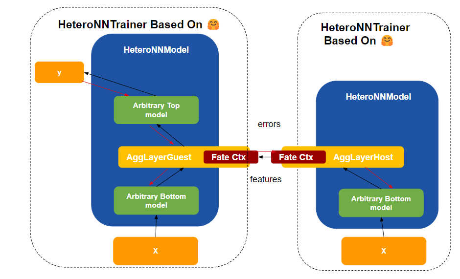
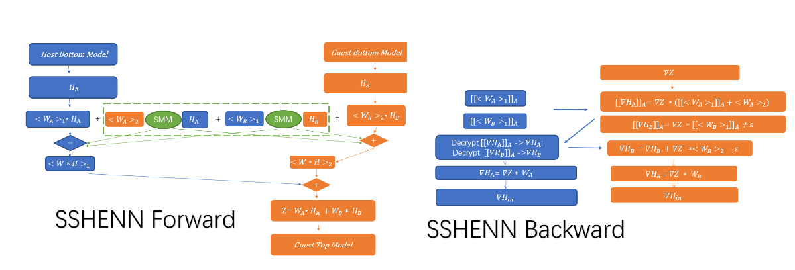
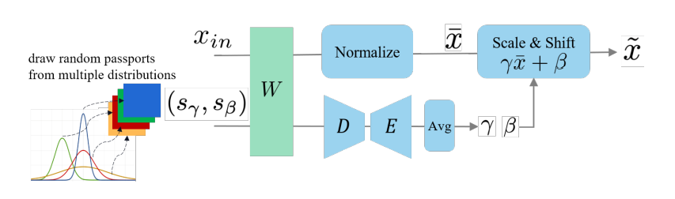
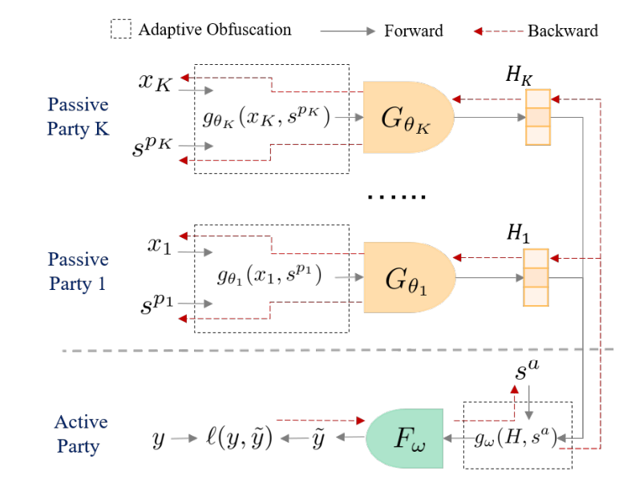

# Hetero NN

In FATE-2.0, we introduce our new Hetero-NN framework which allows you to quickly set up a hetero federated NN learning task. Built on the PyTorch and transformers, our framework ensures smooth integration of your existing datasets and models. For a quick introduction to Hetero-NN, refer to our [quick start](../ml/hetero_nn_tutorial.md).

The architecture of the Hetero-NN framework is depicted in the figure below. In this structure, all submodels from guests and hosts are encapsulated within the HeteroNNModel, enabling independent forwards and backwards. Both guest and host trainers are developed based on the HuggingFace trainer, allowing for rapid configuration of heterogeneous federated learning tasks with your existing datasets and models. These tasks can be run independently, without the need for FATEFlow. The FATE-pipeline Hetero-NN components are built upon this foundational framework.

    

Besides the new framework, we also introduce two new privacy-preserving strategies for federated learning: SSHE and FedPass. These strategies can be configured in the aggregate layer configuration. For more information on these strategies, refer to the [SSHE](#sshe) and [FedPass](#fedpass) sections below.

## SSHE

SSHENN is a privacy-preserving strategy that uses homomorphic encryption and secure sharing to protect the privacy of the model and data. The weights of guest/host aggregate layer are split into two parts, and are shared with cooperating party. Picture blow illustrates the process of SSHE. The design of SSHE is inspired by the paper: [When Homomorphic Encryption Marries Secret Sharing:
Secure Large-Scale Sparse Logistic Regression and Applications
in Risk Control](https://arxiv.org/pdf/2008.08753.pdf).

## FedPass

FedPass works by embedding private passports into a neural network to enhance privacy and obfuscation. It utilizes the DNN passport technique for adaptive obfuscation, which involves inserting a passport layer into the network. This layer adjusts the scale factor and bias term using model parameters and private passports, followed by an autoencoder and averaging. Picture below illustrates
the process of FedPass.

    

In FATE-2.0, you can specify the Fedpass strategy for guest top model and host bottom model, picture below shows the architecture of FedPass when running a hetero-nn task.

    

For more details of Fedpass, please refer to the [paper](https://arxiv.org/pdf/2301.12623.pdf).

The features of Fedpass are:

- Privacy Preserving: Without access to the passports, it's extremely difficult for an attacker to infer inputs from outputs.
- Preserved model performance: The model parameters are optimized through backpropagation, adapting the obfuscation to the model, which offers superior performance compared to fixed obfuscation.
- Speed Comparable to Plaintext Training: Fedpass does not require homomorphic encryption or secure sharing, ensuring that the training speed is nearly equivalent to that of plaintext training.

## Features 

- A brand new hetero-nn framework develop based on pytorch and transformers. Able to intergrate exsiting resources, like models, dataset into hetero-nn federated learning. If you are using Hetero-NN in FATE pipelien, you can configure your cutomize models, datasets via confs.

- Support SSHE strategy for privacy preserving training. 

- Support FedPass strategy for privacy preserving training. You can set passport for host bottom models and guest
top model. Support single GPU training.
