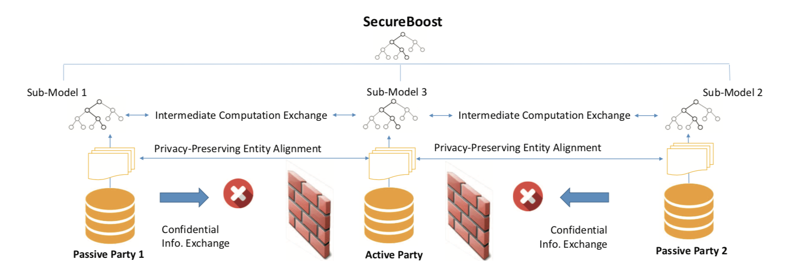
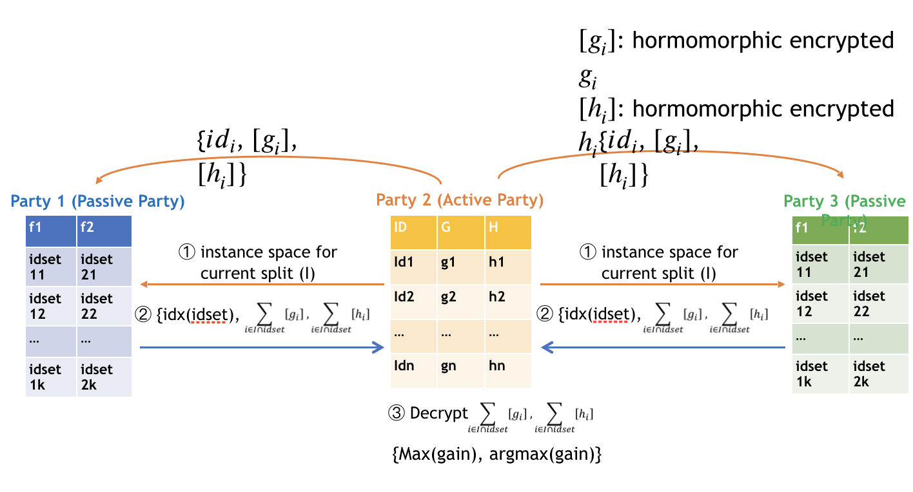
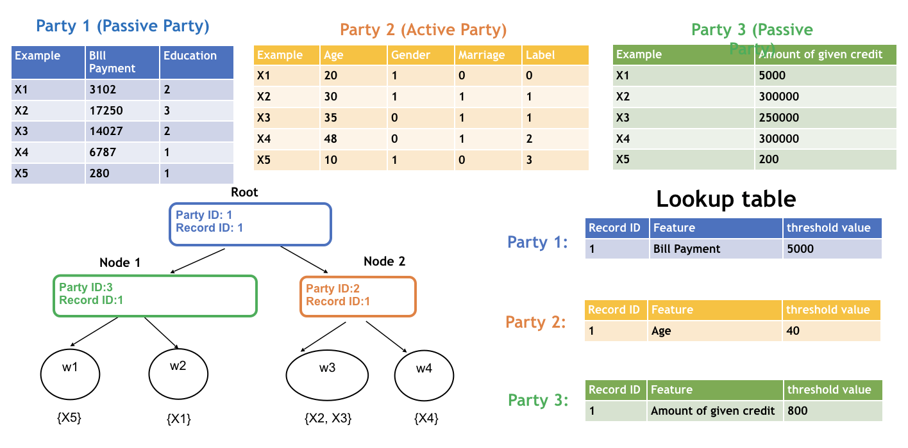
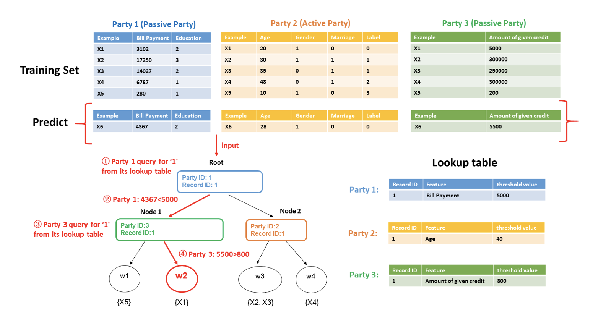

# Hetero SecureBoost

Gradient Boosting Decision Tree(GBDT) is a widely used statistic model
for classification and regression problems. FATE provides a novel
lossless privacy-preserving tree-boosting system known as
[SecureBoost: A Lossless Federated Learning Framework.](https://arxiv.org/abs/1901.08755)

This federated learning system allows a learning process to be jointly
conducted over multiple parties with partially common user samples but
different feature sets, which corresponds to a vertically partitioned
data set. An advantage of SecureBoost is that it provides the same level
of accuracy as the non privacy-preserving approach while revealing no
information on private data.

The following figure shows the proposed Federated SecureBoost framework.

  - Active Party

    > We define the active party as the data provider who holds both a data
    > matrix and the class label. Since the class label information is
    > indispensable for supervised learning, there must be an active party
    > with access to the label y. The active party naturally takes the
    > responsibility as a dominating server in federated learning.

  - Passive Party

    > We define the data provider which has only a data matrix as a passive
    > party. Passive parties play the role of clients in the federated
    > learning setting. They are also in need of building a model to predict
    > the class label y for their prediction purposes. Thus they must
    > collaborate with the active party to build their model to predict y
    > for their future users using their own features.

We align the data samples under an encryption scheme by using the
privacy-preserving protocol for inter-database intersections to find the
common shared users or data samples across the parties without
compromising the non-shared parts of the user sets.

To ensure security, passive parties cannot get access to gradient and
hessian directly. We use a "XGBoost" like tree-learning algorithm. In
order to keep gradient and hessian confidential, we require that the
active party encrypt gradient and hessian before sending them to passive
parties. After encrypted the gradient and hessian, active party will
send the encrypted [gradient] and [hessian] to passive
party. Each passive party uses [gradient] and [hessian] to
calculate the encrypted feature histograms, then encodes the (feature,
split\_bin\_val) and constructs a (feature, split\_bin\_val) lookup
table; it then sends the encoded value of (feature, split\_bin\_val)
with feature histograms to the active party. After receiving the feature
histograms from passive parties, the active party decrypts them and
finds the best gains. If the best-gain feature belongs to a passive
party, the active party sends the encoded (feature, split\_bin\_val) to
back to the owner party. The following figure shows the process of
finding split in federated tree building.

The parties continue the split finding process until tree construction
finishes. Each party only knows the detailed split information of the
tree nodes where the split features are provided by the party. The
following figure shows the final structure of a single decision tree.

To use the learned model to classify a new instance, the active party
first judges where current tree node belongs to. If the current tree
belongs to the active party, then it can use its (feature,
split\_bin\_val) lookup table to decide whether going to left child node
or right; otherwise, the active party sends the node id to designated
passive party, the passive party checks its lookup table and sends back
which branch should the current node goes to. This process stops until
the current node is a leave. The following figure shows the federated
inference process.

By following the SecureBoost framework, multiple parties can jointly
build tree ensemble model without leaking privacy in federated learning.
If you want to learn more about the algorithm, you can read the paper
attached above.

## HeteroSecureBoost Features

- Support federated machine learning tasks:
    - binary classification, the objective function is binary:bce
    - multi classification, the objective function is multi:ce
    - regression, the objective function is regression:l2

- Support multi-host federated machine learning tasks.

- Support Paillier and Ou homogeneous encryption schemes.

- Support common-used Xgboost regularization methods:
    - L1 & L2 regularization
    - Min childe weight
    - Min Sample Split

- Support GOSS Sampling

- Support complete secure tree

- Support hist-subtraction, grad and hess optimization

