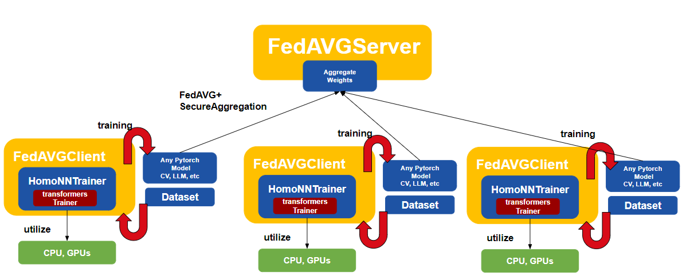

# Homo NN

The Homo(Horizontal) federated learning in FATE-2.0 allows multiple parties to collaboratively train a neural network model without sharing their actual data. In this arrangement, different parties possess datasets with the same features but different user samples. Each party locally trains the model on its data subset and shares only the model updates, not the data itself.

Our neural network (NN) framework in FATE-2.0 is built upon PyTorch and transformers libraries, easing the integration of existing models ,including computer vision (CV) models, pretrained large language (LLM), etc., and datasets into federated training. The framework is also compatible with advanced computing resources like GPUs and DeepSpeed for enhanced training efficiency. In the HomoNN module, we support standard FedAVG algorithms. Using the FedAVGClient and FedAVGServer trainer classes, homo federated learning tasks can be set up quickly and efficiently. The trainers, developed on the transformer trainer, facilitate the consistent setting of training and federation parameters via TrainingArguments and FedAVGArguments.

Below show the architecture of the 2.0 Homo-NN framework.

## Features

-  A new neural network (NN) framework, developed leveraging PyTorch and transformers. This framework offers easy integration of existing models, including CV, LLM models, etc., and datasets. It's ready to use right out of the box.

- Provides support for the FedAVG algorithm, featuring secure aggregation.

- The Trainer class includes callback support, allowing for customization of the training process.

- FedAVGClient supports a local model mode for local testing.

- Compatible with single and multi-GPU training. The framework also allows for easy integration of DeepSpeed.
