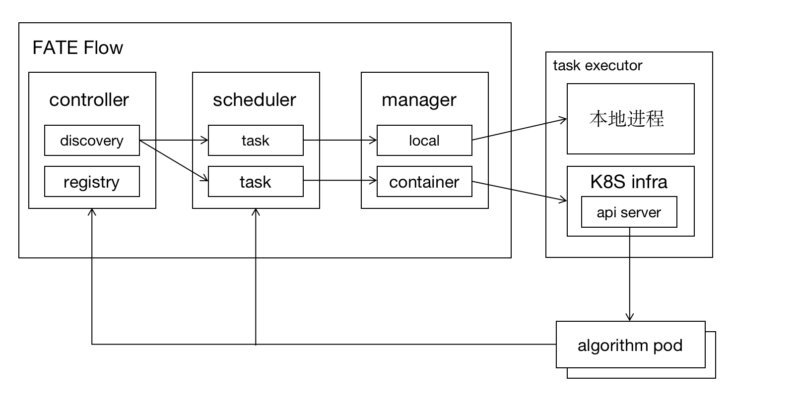
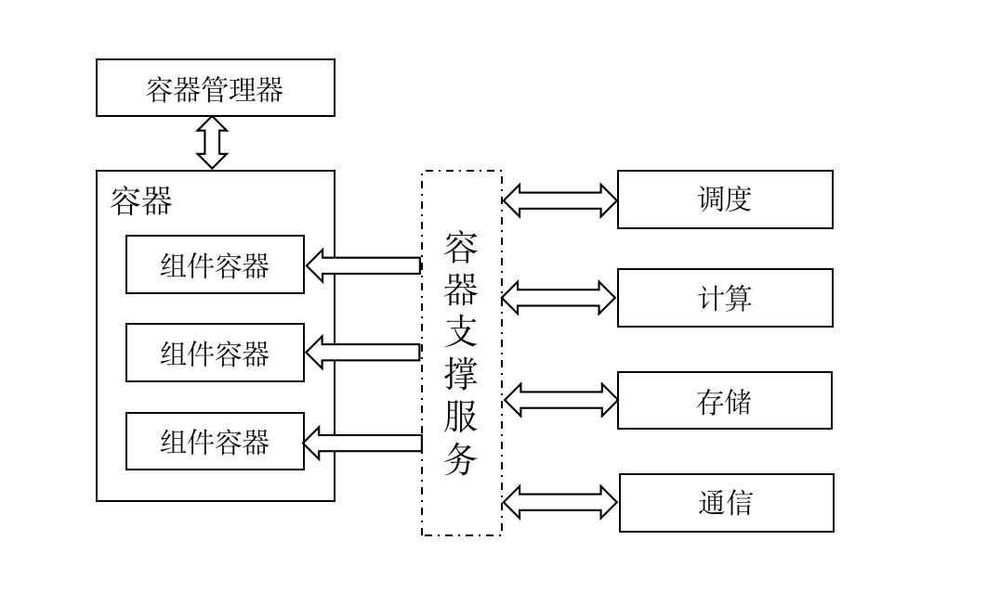

## 算法容器注册与加载方案

### 1. 整体架构图

模块说明：

1. discovery: 算法服务发现和路由
2. registry: 算法注册器，包括本地算法和算法镜像
3. scheduler: 调度器，对任务进行调度
4. local manager: 本地算法任务(非容器化方式)管理
5. container manager: 基于容器化方式的管理，是对底层容器编排能力的封装

### 2. 容器加载

#### 2.1 容器管理器

负责管理组件所运行的容器的管理，与容器平台(如：Docker、Kubernetes等)进行对接，完成容器的编排管理。

#### 2.2 容器支撑服务

用于对组件容器内所使用的功能，提供标准的服务接口。

### 3. 镜像定义规范

- 镜像命名：fate/<version>
- 目录结构：待定
- 安全性：
  - 防篡改
  - 漏洞扫描

### 4. 组件名称定义规范
<前缀>.<版本>.<类型>.<名称>

### 5. 组件实例状态定义
- UNLOADED 未加载
- LOADED	已加载
- STOPPED	已停止
- STARTED	已运行
- FAILED	已故障
- 

### 6. 算法运行流程
流程说明：
1. 容器组件注册步骤：a.拉取镜像，一个镜像内包含fate某个版本的全部算法包；b.使用镜像启动容器, 容器启动成功后，向fate flow注册组件信息(版本+组件， 容器名或容器id， 容器类型等)；c. 容器启动后为常驻型组件实例，可供多个任务使用。
2. local组件注册步骤：a. 算法组件需要放到固定的目录下，如fate/components/$version; b. flow启动时会自动搜索本机器上的组件并进行注册；
3. fate flow定期对组件的健康情况进行探测，当发现容器存在故障，或者本地的算法目录不存在，会主动完成对组件的卸载工作。
4. 某个组件可能存在多种形式(如local、docker、k8s等)，类似于fate 1.x版本的provider，可作为task参数，如fate.local@version、fate.docker@version；若未指定，由系统选择默认；
5. 系统收到run task命令时，映射成对应的类(LocalManager、DockerManager、K8sManager)并执行run操作。
6. 容器运行算法方式有两种：1. 在容器内使用python脚本方式启动task executor； 2. 容器中启动服务，调用服务的接口。
7. 算法容器调用外界的接口包括：fate flow接口、 存储、计算、通信。

### 7. 接口定义
待定