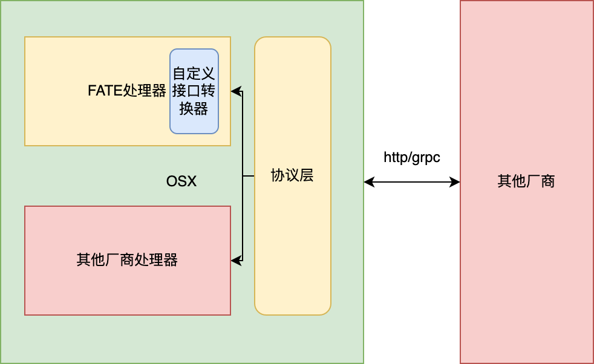

# 一、背景：

FATE1.X维护了多套通信架构，包括eggroll、spark+pulsar+nginx 、spark+rabbitmq+nginx。

##### 下图为FATE1.X采用eggroll为计算引擎时的通信架构


##### 下图为FATE1.X采用spark为计算引擎时的通信架构


如上所示，FATE1.X通信架构有一些弊端如下：

*   需要维护多套通信组件来支持不同的计算引擎
*   多种计算引擎组网困难，难以统一路由以及流控
*   eggroll通信只支持同步rpc调用+流式传输，不支持消息队列类型的异步传输
*   pulsar 以及rabbitmq等集群不易安装以及维护，程序不容易感知集群间传输时出现的网络异常
*   不容易对消息队列组件进行自定义开发等

为了解决以上问题，我们预备在FATE2.X中使用统一的通信组件OSX，统一支持不同计算引擎

# 二、新组件OSX:

## 新组件特性：

*   站点之间通信同时支持grpc、http1.X协议
*   支持多种计算引擎传输，包括eggroll、spark
*   支持在FATE1.X中无缝替代rollsite组件
*   同时支持同步rpc调用+消息队列
*   支持作为exchange中心节点部署 ，支持FATE1.X  、FATE2.X 接入
*   支持集群流量控制，可以针对不同参与方制定流控策略
*   路由配置与原eggroll基本一致，降低了移植难度
*   支持集群模式与standalone两种模式（默认为standalone模式，standalone已可满足大部分场景）
*   可根据接口中厂商编码可针对不同技术提供商做自定义开发

## 组件设计：

## 

## 部署架构：

采用eggroll作为计算引擎时的部署架构:


上图为采用spark作为计算引擎时的部署架构:


## 配置：

以下为osx最简配置,对应部署文件中的broker.properties

```properties
#grpc端口
grpc.port= 9370 
#是否开启http server
open.http.server=false
# http端口
http.port=8080
# 是否开启grpc+TLS传输
open.grpc.tls.server=false
#grpc+TLS传输时使用的端口
grpc.tls.port=9883
#本方partyId,可以以逗号分隔并填写多个
self.party=10000
#部署方式 standalone/cluster，standalone代表单机模式 cluster代表集群模式
deploy.model=standalone
#集群模式下需要接入zookeeper,以下为zookeeper地址
zk.url=localhost:2181
#若要使用eggroll作为计算引擎，需要知悉eggroll cluster-manager组件的ip与端口
eggroll.cluster.manager.ip =  localhost
eggroll.cluster.manager.port = 4670
```

## 路由：

路由配置相关文件为route\_table.json ,与eggroll组件rollsite保持一致：

```json
{
  "route_table":
  {
    "9999":
    {
      "default":[
        {
          "port": 9370,
          "ip": "localhost"
        }
      ],
      "fateflow":[
        {
          "port": 9360,
          "ip": "localhost"
        }
      ]
    },
    "10000":{
      "default":[{
        "port": 9889,
        "ip": "localhost"
      }]

    }
  },
  "permission":
  {
    "default_allow": true
  }
}
```

## 接口：

```protobuf
message Message{
  string msgId = 1;//消息ID
  bytes head = 2;//消息头部
  bytes body = 3;//消息体
}
message  TopicInfo{
  string topic=1;
  string ip = 2;
  int32  port = 3;
  int64  createTimestamp = 4;
  int32  status = 5;
}

// PTP Private transfer protocol
// 通用报头名称编码，4层无Header以二进制填充到报头，7层以Header传输
enum Header {
  Version = 0;           // 协议版本               对应7层协议头x-ptp-version
  TechProviderCode = 1;  // 厂商编码               对应7层协议头x-ptp-tech-provider-code
  TraceID = 4;           // 链路追踪ID             对应7层协议头x-ptp-trace-id
  Token = 5;             // 认证令牌               对应7层协议头x-ptp-token
  SourceNodeID = 6;      // 发送端节点编号          对应7层协议头x-ptp-source-node-id
  TargetNodeID = 7;      // 接收端节点编号          对应7层协议头x-ptp-target-node-id
  SourceInstID = 8;      // 发送端机构编号          对应7层协议头x-ptp-source-inst-id
  TargetInstID = 9;      // 接收端机构编号          对应7层协议头x-ptp-target-inst-id
  SessionID = 10;        // 通信会话号，全网唯一     对应7层协议头x-ptp-session-id
}

// 通信扩展元数据编码，扩展信息均在metadata扩展
enum Metadata {
  MessageTopic = 0;                    // 消息话题，异步场景
  MessageCode = 1;                     // 消息编码，异步场景
  SourceComponentName = 2;             // 源组件名称
  TargetComponentName = 3;             // 目标组件名称
  TargetMethod = 4;                    // 目标方法
  MessageOffSet = 5;                   // 消息序列号
  InstanceId = 6;                      // 实例ID
  Timestamp  = 7;                      // 时间戳
}

// 通信传输层输入报文编码
message Inbound {
  map<string, string>  metadata = 1;   // 报头，可选，预留扩展，Dict，序列化协议由通信层统一实现
  bytes payload = 2;                   // 报文，上层通信内容承载，序列化协议由上层基于SPI可插拔
}

// 通信传输层输出报文编码
message Outbound {
  map<string, string>  metadata = 1;  // 报头，可选，预留扩展，Dict，序列化协议由通信层统一实现
  bytes payload = 2;                  // 报文，上层通信内容承载，序列化协议由上层基于SPI可插拔
  string code = 3;                    // 状态码
  string message = 4;                 // 状态说明
}

// 互联互通如果使用异步传输协议作为标准参考，Header会复用metadata传输互联互通协议报头，且metadata中会传输异步场景下的消息相关属性
// 互联互通如果使用其他协议作为参考标准，Header会复用metadata传输互联互通协议报头
// 互联互通如果使用GRPC作为参考标准，Header会复用HTTP2的报头传输互联互通协议报头

service PrivateTransferProtocol {
  rpc transport (stream Inbound) returns (stream Outbound);
  rpc invoke (Inbound) returns (Outbound);
}
```

## 源码打包：

1.  下载源码，打包机器需要安装好maven  + jdk
2.  进入源码目录/deploy,  执行sh auto-package.sh, 执行完之后会在当前目录出现osx.tar.gz。

## 部署：

1.  部署机器需要安装jdk1.8+
2.  解压osx.tar.gz
3.  进入部署目录，执行sh service.sh start

# 三、与其他厂商的互联互通:

osx的接口协议目前采用了互联互通会议制定的通信协议以及字段。详情可参见osx.proto

目前设计三种方案以供选择：

**1.完全按照FATE接口规则进行适配（推荐）**

**2.在使用FATE基本接口规则的前提下，开发自定义接口转化器进行接口输入输出转换（推荐）**

**3.开发自定义的厂商处理器**



### 如何适配FATE处理器（方案一、方案二）：

若不开发自定义的处理器且需要对接FATE，则需要了解OSX 的接口逻辑，且按照OSX逻辑发送对应的信息。

目前OSX支持同步/流式/消息队列 模式传输，同步rpc用于调度组件的命令传输，流式传输目前用在了与FATE eggroll组件的通信中，流式传输对接难度较大且eggroll接口逻辑复杂，不建议使用该方式对接。建议使用消息队列模式对接。FATE处理器支持配置接口转化器，一些

消息队列模式包含几个操作：

*   命令通道双方调度组件同步通信，如fateflow与其他厂商调度组件通信。

*   数据通道生产消息并传递到对方。

*   数据通道消费消息。

*   数据通道消费确认。

下面将通过几个示例来说明：

        //构造请求发送至fateflow
        public void testFateflow(byte[] data){
            Osx.Inbound.Builder inboundBuilder = Osx.Inbound.newBuilder();
            inboundBuilder.putMetadata(Osx.Header.Version.name(), "123");
            inboundBuilder.putMetadata(Osx.Header.TechProviderCode.name(), "FATE");//
            inboundBuilder.putMetadata(Osx.Header.Token.name(), "testToken");
            inboundBuilder.putMetadata(Osx.Header.SourceNodeID.name(), "9999");
            inboundBuilder.putMetadata(Osx.Header.TargetNodeID.name(), "10000");
            inboundBuilder.putMetadata(Osx.Header.SourceInstID.name(), "9999");
            inboundBuilder.putMetadata(Osx.Header.TargetInstID.name(), "10000");
            inboundBuilder.putMetadata(Osx.Header.SessionID.name(), "testSessionID");
            inboundBuilder.putMetadata(Osx.Metadata.TargetMethod.name(), "UNARY_CALL");
            inboundBuilder.putMetadata(Osx.Metadata.TargetComponentName.name(), "fateflow");
            inboundBuilder.putMetadata(Osx.Metadata.SourceComponentName.name(), "");
            inboundBuilder.putMetadata(Osx.Header.TraceID.name(), "28938999993");
            inboundBuilder.setPayload(ByteString.copyFrom(data));
            Osx.Outbound outbound = blockingStub.invoke(inboundBuilder.build());
            System.err.println("response : "+outbound);
        }
        
            //构造请求生产消息，并传递给目的地
        public void testMsgProduce() {
           
                Osx.Inbound.Builder inboundBuilder = Osx.Inbound.newBuilder();
                inboundBuilder.putMetadata(Osx.Header.Version.name(), "123");
                inboundBuilder.putMetadata(Osx.Header.TechProviderCode.name(),  "FATE");
                inboundBuilder.putMetadata(Osx.Header.Token.name(), "testToken");
                inboundBuilder.putMetadata(Osx.Header.SourceNodeID.name(), "9999");
                inboundBuilder.putMetadata(Osx.Header.TargetNodeID.name(), "10000");
                inboundBuilder.putMetadata(Osx.Header.SourceInstID.name(), "");
                inboundBuilder.putMetadata(Osx.Header.TargetInstID.name(), "");
                inboundBuilder.putMetadata(Osx.Header.SessionID.name(), "testSessionID");
                inboundBuilder.putMetadata(Osx.Metadata.TargetMethod.name(), "PRODUCE_MSG");
                inboundBuilder.putMetadata(Osx.Metadata.TargetComponentName.name(), "");
                inboundBuilder.putMetadata(Osx.Metadata.SourceComponentName.name(), "");
                inboundBuilder.putMetadata(Osx.Metadata.MessageTopic.name(), transferId);
                Osx.Message.Builder messageBuilder = Osx.Message.newBuilder();
                messageBuilder.setBody(ByteString.copyFrom(("test body element " + i).getBytes()));
                messageBuilder.setHead(ByteString.copyFrom(("test head " + i).getBytes()));
                inboundBuilder.setPayload(messageBuilder.build().toByteString());
                Osx.Outbound outbound = blockingStub.invoke(inboundBuilder.build());
                System.err.println("response " + outbound);
        }
        
        	    //消费消息
          public void testMsgConsume() {
    
                Osx.Inbound.Builder inboundBuilder = Osx.Inbound.newBuilder();
                inboundBuilder.putMetadata(Osx.Header.Version.name(), "123");
                inboundBuilder.putMetadata(Osx.Header.TechProviderCode.name(),  "FATE");
                inboundBuilder.putMetadata(Osx.Header.Token.name(), "testToken");
                inboundBuilder.putMetadata(Osx.Header.SourceNodeID.name(), "9999");
                inboundBuilder.putMetadata(Osx.Header.TargetNodeID.name(), "10000");
                inboundBuilder.putMetadata(Osx.Header.SourceInstID.name(), "");
                inboundBuilder.putMetadata(Osx.Header.TargetInstID.name(), "");
                inboundBuilder.putMetadata(Osx.Header.SessionID.name(), "testSessionID");
                inboundBuilder.putMetadata(Osx.Metadata.TargetMethod.name(), "CONSUME_MSG");
                inboundBuilder.putMetadata(Osx.Metadata.TargetComponentName.name(), "");
                inboundBuilder.putMetadata(Osx.Metadata.SourceComponentName.name(), "");
                inboundBuilder.putMetadata(Osx.Metadata.MessageTopic.name(), "testTopic");
                inboundBuilder.putMetadata(Osx.Metadata.MessageOffSet.name(), "-1");
                blockingStub.invoke(inboundBuilder.build());

    	  }
        
              public void testMsgAck() {
    
                Osx.Inbound.Builder inboundBuilder = Osx.Inbound.newBuilder();
                inboundBuilder.putMetadata(Osx.Header.Version.name(), "123");
                inboundBuilder.putMetadata(Osx.Header.TechProviderCode.name(),  "FATE");
                inboundBuilder.putMetadata(Osx.Header.Token.name(), "testToken");
                inboundBuilder.putMetadata(Osx.Header.SourceNodeID.name(), "9999");
                inboundBuilder.putMetadata(Osx.Header.TargetNodeID.name(), "10000");
                inboundBuilder.putMetadata(Osx.Header.SourceInstID.name(), "");
                inboundBuilder.putMetadata(Osx.Header.TargetInstID.name(), "");
                inboundBuilder.putMetadata(Osx.Header.SessionID.name(), "testSessionID");
                inboundBuilder.putMetadata(Osx.Metadata.TargetMethod.name(), "ACK_MSG");
                inboundBuilder.putMetadata(Osx.Metadata.TargetComponentName.name(), "");
                inboundBuilder.putMetadata(Osx.Metadata.SourceComponentName.name(), "");
                inboundBuilder.putMetadata(Osx.Metadata.MessageTopic.name(), "testTopic");
                inboundBuilder.putMetadata(Osx.Metadata.MessageOffSet.name(), "122");
                 blockingStub.invoke(inboundBuilder.build());

        }

| 字段名称                | 是否必填 | 意义                                                                                                                                                                                                                                                       | 默认值  |
| ------------------- | ---- | -------------------------------------------------------------------------------------------------------------------------------------------------------------------------------------------------------------------------------------------------------- | ---- |
| TechProviderCode    | 是    | 厂商编号，通过该字段来选择不同厂商的处理器，若需要跟FATE通信，该字段需要填入FATE，若有自定义的厂商处理器，则填入自定义的厂商编号                                                                                                                                                                                     | FATE |
| Version             | 否    | 版本                                                                                                                                                                                                                                                       |      |
| Token               | 否    | token用于校验身份，默认不校验。                                                                                                                                                                                                                                       |      |
| SourceNodeID        | 是    | 代表请求发起方的partyId                                                                                                                                                                                                                                          | 无    |
| TargetNodeID        | 是    | 代表请求目的地partyId                                                                                                                                                                                                                                           | 无    |
| SourceInstID        | 否    | 代表请求发起方机构id，因为目前FATE中无机构id概念，所以未对该字段进行强制校验                                                                                                                                                                                                               | 无    |
| TargetInstID        | 否    | 代表请求目的地机构id，因为目前FATE中无机构id概念，所以未对该字段进行强制校验                                                                                                                                                                                                               | 无    |
| SessionID           | 是    | 代表本次请求的会话id                                                                                                                                                                                                                                              | 无    |
| TargetMethod        | 是    | 目标方法，该字段决定了调用OSX中FATE处理器的何种逻辑，目前支持UNARY\_CALL(用于与FATEFLOW通信)、PRODUCE\_MSG(生产消息)、CONSUME\_MSG（消费消息）、ACK\_MSG（消费确认）                                                                                                                                        | 无    |
| TargetComponentName | 否    | 目标组件名称，该字段制定传输过程中目的组件的名称，比如需要与FATE-FLOW通信时该字段填入fateflow，osx会根据该字段查找路由表中fateflow组件的地址，并将请求转发至目标组件。                                                                                                                                                        | 无    |
| SourceComponentName | 否    | 源组件名称，该字段目前未做强制校验                                                                                                                                                                                                                                        | 无    |
| TraceID             | 否    | 用于跟踪请求的ID，目前未做强制校验                                                                                                                                                                                                                                       | 无    |
| payload             | 否    | 请求数据                                                                                                                                                                                                                                                     | 无    |
| MessageTopic        |      | 该字段用于数据传输时的Topic ，如当TargetMethod 为PRODUCE\_MSG、CONSUME\_MSG、ACK\_MSG时为必填                                                                                                                                                                                 |      |
| MessageOffSet       |      | 该字段用于表示消息offset  ，在TargetMethod为CONSUME\_MSG、ACK\_MSG 时该字段为必填，当TargetMethod为CONSUME\_MSG时，填入-1表示取队头消息（需要注意在该种情况下，目前osx的实现逻辑为：当消息未到来之前会阻塞请求，直到消息到来才会返回结果）  ，填入其他整数则表示取对应offset的消息，一般情况下填入-1即可。当TargetMethod为ACK\_MSG时填入确认消费消息的offset，该offset可从消费请求的结果中获取。 |      |

#### 自定义的接口转化器（alpha版本中该功能未完善，从beta版本中正式加入）

在FATE处理器中可以加入自定义的接口转化器，用于处理通信相关数据，实现自定义逻辑之后可将编译后的jar包加入{在部署目录}/extends/ 下，并在translator.properties加入对应配置，并重启服务。

```java
//用于转换不同厂商通信时的接收和发总数据，
public interface Translator {
    //服务方转化接收的数据
    Osx.Inbound  translateReceiveInbound(Context context,Osx.Inbound inbound);
    //请求方转化接受到的返回数据
    Osx.Outbound translateReceiveOutbound(Context  context,Osx.Outbound outbound);
    //请求方转化发送的数据
    Osx.Inbound  translateSendInbound(Context  context,Osx.Inbound inbound);
    //服务方转化准备返回的数据
    Osx.Outbound translateSendOutbound(Context  context,Osx.Outbound outbound);
}
```

编辑{在部署目录}/conf/broker/下translator.properties，如下所示示例。

```properties
#key为源PartyId-目的PartyId
9999-10000=com.osx.broker.demo.DemoTranslator1
10000-9999=com.osx.broker.demo.DemoTranslator2
```

### 自定义厂商处理器（方案三）：

osx目前支持加入不同厂商处理器的插件（alpha版本中该功能未完善，从beta版本中正式加入）

查看{在部署目录}/conf/broker/下provider.properties，如下所示，目前只默认实现了FATE的请求处理器。

```properties
##不同厂商处理器
FATE=com.osx.tech.provider.FateTechProvider
```

可以看到FATE默认的请求处理器FateTechProvider，若有需要可自定义实现其他厂商处理器，实现方式为实现TechProvider接口，该接口定义如下：

```java
public interface TechProvider {
    //用于处理http1.X请求
    void processHttpInvoke(HttpServletRequest  httpServletRequest,HttpServletResponse httpServletResponse);
    //用于处理grpc非流式请求
    void processGrpcInvoke(Osx.Inbound request,
                           io.grpc.stub.StreamObserver<Osx.Outbound> responseObserver);
    //用于处理grpc流式请求
    public StreamObserver<Osx.Inbound> processGrpcTransport(Osx.Inbound inbound, StreamObserver<Osx.Outbound> responseObserver);

}
```

可根据需要实现以上方法，比如对接方若只有grpc请求则只实现processGrpcInvoke方法即可。实现自定义逻辑之后可将编译后的jar包加入{在部署目录}/extends/ 下，并在provider.properties加入对应厂商的处理器配置，并重启服务。

如下所示，FATE 与AA 对应接口中厂商编码TechProviderCode字段，需要在调用时正确填入该字段才能找到对应的处理器，详情可参考osx.proto 文件。

```properties
##不同厂商处理器
FATE=com.osx.tech.provider.FateTechProvider
AA=com.aa.bb.TestTechProvider
```

