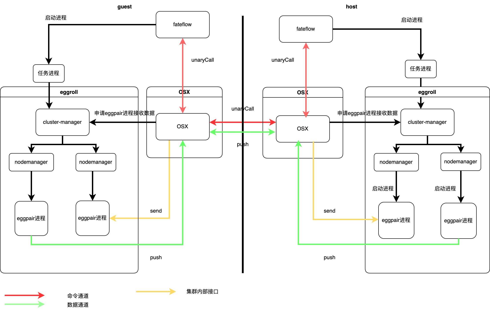

# 一、背景：

FATE1.X维护了多套通信架构，包括eggroll、spark+pulsar+nginx 、spark+rabbitmq+nginx。

##### 下图为FATE1.X采用eggroll为计算引擎时的通信架构


##### 下图为FATE1.X采用spark为计算引擎时的通信架构


如上所示，FATE1.X通信架构有一些弊端如下：

- 需要维护多套通信组件来支持不同的计算引擎
- 多种计算引擎组网困难，难以统一路由以及流控
- eggroll通信只支持同步rpc调用+流式传输，不支持消息队列类型的异步传输
- pulsar 以及rabbitmq等集群不易安装以及维护，程序不容易感知集群间传输时出现的网络异常
- 不容易对消息队列组件进行自定义开发等

为了解决以上问题，我们预备在FATE2.X中使用统一的通信组件OSX，统一支持不同计算引擎

# 二、新组件OSX:


## 新组件特性：

- 传输接口兼容FATE1.X版本  FATE2.X版本

- 按照《金融业隐私计算互联互通平台技术规范》实现传输接口

- 支持多种计算引擎传输，包括eggroll、spark

- 传输模式支持rpc、消息队列

- 传输协议支持grpc（rpc、消息队列模式）、http1.1(消息队列模式)

- 支持作为exchange中心节点部署 ，支持FATE1.X  、FATE2.X 接入

- 路由配置与原eggroll基本一致，降低了移植难度

  

## 组件设计：


## 

## 部署架构：

采用eggroll作为计算引擎时的部署架构:



上图为采用spark作为计算引擎时的部署架构:


与其他厂商互联互通互联互通


#### 传输模式：

osx 支持两种传输模式：

- 流式（支持grpc，兼容FATE1.x版本传输，使用eggroll作为计算引擎）
- 队列（支持grpc、http1.x ，可以使用eggroll或者spark以及其他厂商计算引擎，按照《金融业隐私计算互联互通平台技术规范》实现的传输接口，推荐使用grpc协议，不同协议对应的路由表配置不一样，详情可见路由相关配置 ）

不同的传输模式使用不同的传输接口 ， 不需要在 osx中配置中指定，而是由FATE的配置决定，有多个参与方的情况下，双方需要预先商定使用的传输模式，只有在双方都使用一种传输模式的情况下才能正常工作。


## 配置：

以下为osx最简配置,配置文件位于 {部署目录}/conf/broker/broker.properties

```properties
grpc.port= 9377   （服务监听的grpc端口）
# （若使用eggroll作为计算引擎，此处填入eggroll cluster-manager 的ip）
eggroll.cluster.manager.ip = localhost
# （若使用eggroll作为计算引擎，此处填入eggroll cluster-manager 的端口）
eggroll.cluster.manager.port = 4670
```

全部配置：

| 名称                                           | 含义                                                         | 默认值               | 是否必须配置                        | 说明                                                         |
| ---------------------------------------------- | ------------------------------------------------------------ | -------------------- | ----------------------------------- | ------------------------------------------------------------ |
| grpc.port                                      | 服务监听grpc端口（非TLS）                                    | 9370                 | 否                                  | 该端口用做默认的集群内部通信端口 ，若是用于非生产环境，出于方便测试以及调试考虑，可以将此端口作为集群间通信端口。若是生产环境使用，出于安全考虑，不应该将此对外暴露，而是将使用TLS 的端口对外暴露 ，参考配置open.grpc.tls.server grpc.tls.port |
|                                                |                                                              |                      |                                     |                                                              |
| eggroll.cluster.manager.ip                     | 若使用eggroll作为计算引擎，此处填入eggroll cluster-manager 的ip | 无                   | 否                                  |                                                              |
| eggroll.cluster.manager.port                   | 若使用eggroll作为计算引擎，此处填入eggroll cluster-manager 的端口 | 无                   | 否                                  |                                                              |
| open.grpc.tls.server                           | 是否开启使用TLS的grpc端口                                    | false                | 否                                  | 开启之后，服务将会监听一个使用TLS的grpc端口                  |
| grpc.tls.port                                  | 服务监听grpc端口(使用TLS)                                    | 无                   | 若open.grpc.tls.server =true 则必填 | 出于安全考虑，在生产上一般将此端口用做对外通信。而通过grpc.port配置的端口，则用于集群内部组件之间的通信。 |
| open.http.server                               | 是否开启http1.x协议端口(非TLS)                               | false                | 否                                  | http协议目前只适用于队列模式传输，且FATE1.X版本接口不支持http协议，若使用了其他厂家提供的使用http协议的算法容器（FATE算法默认使用grpc），则可以开启httpServer，该配置默认关闭 |
| http.port                                      | httpServer端口(非TLS)                                        | 无                   | 若open.http.server =true 则必填     |                                                              |
| open.https.server                              | 是否开启http1.x协议端口(TLS)                                 | false                | 否                                  |                                                              |
| http.context.path                              | http服务端配置                                               | /v1                  | 否                                  | eg:  http://127.0.0.1:9370/v1/interconn/chan/invoke  中的v1字符串 |
| http.servlet.path                              | http服务端配置                                               | /*                   | 否                                  | eg:  http://127.0.0.1:9370/v1/interconn/chan/invoke   中v1/后的内容 |
| https.port                                     | httpServer端口(使用TLS)                                      | 无                   | 若open.https.server=true 则必填     |                                                              |
| bind.host                                      | 绑定本地ip（适用于http 与grpc server）                       | 0.0.0.0              | 否                                  |                                                              |
| grpc.server.max.concurrent.call.per.connection | 服务端单个grpc链接最大并发                                   | 1000                 | 否                                  |                                                              |
| grpc.server.max.inbound.message.size           | 服务端单个grpc包最大大小                                     | 2147483647           | 否                                  |                                                              |
| grpc.server.max.inbound.metadata.size          | 服务端单个grpc包最大 metadata 大小                           | 134217728            | 否                                  |                                                              |
| grpc.server.flow.control.window                | 服务端grpc流控窗口大小                                       | 134217728            | 否                                  |                                                              |
| grpc.server.keepalive.without.calls.enabled    | 服务端grpc是否允许连接没有调用是保持存活                     | true                 | 否                                  |                                                              |
| grpc.client.max.inbound.message.size           | 客户端单个grpc包最大大小                                     | 2147483647           | 否                                  |                                                              |
| grpc.client.flow.control.window                | 客户端grpc流控窗口大小                                       | 134217728            | 否                                  |                                                              |
|                                                |                                                              |                      |                                     |                                                              |
| queue.max.free.time                            | 队列最大空闲时间                                             | 43200000（单位毫秒） | 否                                  | 空闲时间超过该配置的队列，将会被回收，释放本地资源           |
| queue.check.interval                           | 检查队列空闲定时任务间隔                                     | 60000（单位毫秒）    | 否                                  |                                                              |
| consume.msg.waiting.timeout                    | 消费阻塞最大时间                                             | 3600000              | 否                                  | 若不同厂商算法组件消费接口中未指定超时时间，则使用配置作为超时时间 |
| grpc.oncompleted.wait.timeout                  | grpc流式传输中当一方已经完成传输后，等待另一方完成的时间     | 600（单位秒）        | 否                                  | grpc流式传输接口中使用                                       |


## 路由：

路由配置相关文件为{部署目录}/conf/broker/route_table.json ，下面介绍在不使用证书的情况下的操作步骤：

，self_party=[“9999”]则代表本方partyId为9999，（若是与遵循互联互通协议的其他厂商隐私计算产品对接，此处对应于互联互通协议的nodeId）

****

本方partyId ：9999  （若是与遵循互联互通协议的其他厂商隐私计算产品对接，此处对应于互联互通协议的nodeId）

若对方partyId 为10000  （若是与遵循互联互通协议的其他厂商隐私计算产品对接，此处对应于互联互通协议的nodeId），则按照如下配置

```json
{
  "route_table":
  {
    "9999":      //己方partyId 9999  ，  
    {
      "fateflow":[    //配置己方路由只需要配置fateflow 地址就可以，需要注意这里需要配置fateflow的grpc端口，默认是9360
        {
          "port": 9360,   
          "ip": "localhost"
        }
      ]
    },
    "10000":{  //对方partyId 10000
      "default":[{   //配置对方路由，只需要配置default 地址就可以  , 地址为对方的osx grpc端口
        "port": 9370,
        "ip": "192.168.xx.xx"  
      }]

    }
  },
  // self_party 为必填字段
	"self_party":[
		"9999"   //本方partyId 
	]
}
```

**路由表修改之后不需要重启应用，系统会自动读取，需要保证该文件内容为可解析的json格式，否则会解析失败。**

## 

```protobuf

```


## 部署教程

1. 下载源码，打包机器需要安装好maven  + jdk
2. 进入源码目录/deploy,  执行sh auto-package.sh, 执行完之后会在当前目录出现osx.tar.gz。

## 部署：

1. 部署机器需要安装jdk1.8+
2. 解压osx.tar.gz 
3. 进入部署目录，执行sh service.sh start


### 日志分析

默认日志目录位于安装目录下 logs/broker 文件夹下，如下图所示


   flow.log  ： 记录请求日志 

   broker.log ： 记录所有日志

   broker-error:  记录异常日志

   broker-debug: debug日志默认不开启

正常启动后可以在broker.log中看到如下日志：


在收到请求后可以在flow.log中看到访问日志：

例如取其中几条日志分析

- 日志1

```
2023-11-27 23:53:42,320|grpc|1701100422_1009|MSG_REDIRECT|session:202311271901517083180_lr_0_0|topic:202311271901517083180_lr_0_0-host-10000-guest-9999-<dtype>-<dtype>|des:9999|code:E0000000000|cost:1|192.168.0.5:9370|size:224|msg:success
```

这条日志为使用队列模式传输时，osx收到了消息，且该osx不是该消息目的地时的日志，收到消息后osx采取的动作为MSG_REDIRECT，代表着将该消息传递至其他合作方。

它的格式为 时间戳|请求入口协议|流水号|处理动作|此次传输的sessionId|队列传输的topic|目的地partyId|返回码|耗时|目的地ip端口|传输数据大小|返回message

- 日志2

```
**2023-11-27 23:53:36,574|grpc|1701100416_9289|MSG_DOWNLOAD|session:202311271901517083180_lr_0_0|topic:202311271901517083180_lr_0_0-arbiter-10000-host-10000-g|offset-in-queue:100|des:10000|code:E0000000000|cost:0|size:2972|
```

这条日志为使用队列模式传输时，osx收到了消息，且该osx是该消息目的地时的日志，收到消息后osx采取的动作为MSG_DOWNLOAD，代表着将该消息本地持久化

它的格式为 时间戳|请求入口协议|流水号|处理动作|此次传输的sessionId|队列传输的topic|队列中消息数量|目的地partyId|返回码|耗时|数据大小|

- 日志3

```
2023-11-27 23:53:36,576|grpc|1701100416_7277|DEFUALT_CONSUME|session:202311271901517083180_lr_0_0|topic:202311271901517083180_lr_0_0-guest-9999-arbiter-10000-loss|req-offset:100|offset-in-queue:100|code:0|cost:0|
```

这条日志为使用队列模式传输时，osx收到了消费请求，osx采取的动作为DEFUALT_CONSUME，代表着从本地队列取出消息

它的格式为 时间戳|请求入口协议|流水号|处理动作|此次传输的sessionId|队列传输的topic|请求消费的序列号|队列中消息总数|返回码|耗时|

- 日志4

```
2023-11-27 23:54:23,318|grpc|UNARY_CALL|session:_fateflow_10000|topic:202311271901517083180|src:|des:10000|code:E0000000000|cost:18|172.16.153.111:9360|size:320|
```

这条日志为osx收到fateflow的请求，osx采取的动作为UNARY_CALL，代表着为fateflow所使用的接口

它的格式为 时间戳|请求入口协议|处理动作|此次传输的sessionId|topic|来源partid|目的partyId|返回码|目的地ip端口|数据大小|

- 日志5

```
2023-11-27 23:44:44,128|grpc|11|PUSH_REMOTE|session:202311271453035771030_sbt_0_0|topic:putBatch-__rsk#202311271453035771030_sbt_0_0#updated_data__table_persistent_0__#default.iterations-49.iterations-4#host#10000#guest#9999-12|src:10000|des:9999|code:E0000000000|cost:0|192.168.0.5:9370|size:90536|
```

这条日志为osx 在使用流式传输模式时，收到了流式传输请求，且osx不是该请求目的地，osx采取的动作为PUSH_REMOTE，代表着为将其请求转发至他处，其中的192.168.0.5:9370为目的地

- 日志6

```
2023-11-27 23:44:47,703|grpc|3|PUSH_EGGPAIR|session:202311271453035771030_sbt_0_0_host_10000|topic:putBatch-__rsk#202311271453035771030_sbt_0_0#new_sample_pos__table_persistent_0__#default.iterations-49.iterations-4#guest#9999#host#10000-1|code:E0000000000|cost:152|192.168.0.5:36110|size:98080|
```

这条日志为osx 在使用流式传输模式时，收到了流式传输请求，且osx为该请求目的地，osx采取的动作为PUSH_EGGPAIR，代表着为将其请求转发至eggroll 所启动的进程 eggpair，其中的192.168.0.5:36110为目的地


### 证书相关：

#### OSX相关配置：

- grpcs：

  broker.property配置（使用keystore方式，即方式1）：

  ```
  # 打开grpcs server开关
  open.grpc.tls.server= true
  # 是否使用keystore方式（默认为false）
  open.grpc.tls.use.keystore= true
  #server端密码箱路径以及密码
  server.keystore.file=
  server.keystore.file.password=
  #server端信任证书keystore路径及密码
  server.trust.keystore.file=
  server.trust.keystore.file.password=
  
  ```

  相关client端路由表配置：

  ```
  "default": [
          {
            "protocol": "grpc",
            "keyStoreFile": "D:/webank/osx/test3/client/identity.jks",
            "keyStorePassword": "123456",
            "trustStoreFile": "D:/webank/osx/test3/client/truststore.jks",
            "trustStorePassword": "123456",
            "useSSL": true,
            "port": 9885,
            "ip": "127.0.0.1"
          }
        ]
  ```

  

- https：

  broker.property配置（使用keystore方式，即方式1）：

  ```
  # grpcs端口
  https.port=8092
  # 打开grpcs server开关
  open.https.server= true
  # server端密码箱路径以及密码
  server.keystore.file=
  server.keystore.file.password=
  # server端信任证书keystore路径及密码
  server.trust.keystore.file=
  server.trust.keystore.file.password=
  
  ```
  
  相关client端路由表配置：
  
  ```
  
  ```
  
  

2）方式二：单独文件存储私钥、证书、信任证书方式

​	生成命令：

​	

#### OSX相关配置：

- grpcs：

  broker.property配置（使用非keystore方式，即方式2）：

  ```
  # 打开grpcs server开关
  open.grpc.tls.server= true
  # 是否使用keystore方式
  open.grpc.tls.use.keystore= false
  
  
  
  
  ```

  相关client端路由表配置：

  ```
  
  ```

  

- https：

  broker.property配置（使用非keystore方式，即方式2）：

  ```
  
  ```

  相关client端路由表配置：

  ```
  
  ```

  


### 常见问题：


