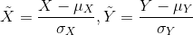
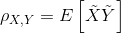

# Heterogeneous Pearson Correlation Coefficient

## Introduction

Pearson Correlation Coefficient is a measure of the linear correlation
between two variables, X and Y, defined as,

Let

then,

## Implementation Detail

We use an MPC protocol called SPDZ for Heterogeneous Pearson Correlation
Coefficient calculation. For more details, one can refer
[\[here\].](secureprotol.md)

## Param

::: federatedml.param.pearson_param
    rendering:
      heading_level: 3
      show_source: true
      show_root_heading: true
      show_root_toc_entry: false
      show_root_full_path: false

## How to Use

  - params

  - column\_indexes  
    \-1 or list of int. If -1 provided, all columns are used for
    calculation. If a list of int provided, columns with given indexes
    are used for calculation.

  - column\_names  
    names of columns use for calculation.

> 
> 
> 

> 
> 

> 
> Note
> 
> 

> 
> if both params are provided, the union of columns indicated are used
> for calculation.
> 
> 

  - examples  
    Please refer `[here] <../../../examples/pipeline/hetero_pearson>`
    for examples.
