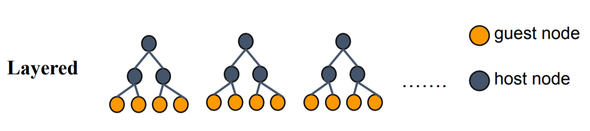
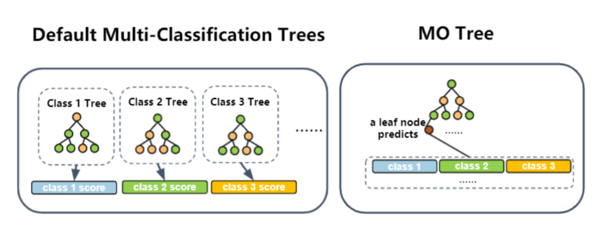

# Tree Models

## Hetero SecureBoost

Gradient Boosting Decision Tree(GBDT) is a widely used statistic model
for classification and regression problems. FATE provides a novel
lossless privacy-preserving tree-boosting system known as
[SecureBoost: A Lossless Federated Learning Framework.](https://arxiv.org/abs/1901.08755)

This federated learning system allows a learning process to be jointly
conducted over multiple parties with partially common user samples but
different feature sets, which corresponds to a vertically partitioned
data set. An advantage of SecureBoost is that it provides the same level
of accuracy as the non privacy-preserving approach while revealing no
information on private data.

The following figure shows the proposed Federated SecureBoost framework.

  - Active Party

    > We define the active party as the data provider who holds both a data
    > matrix and the class label. Since the class label information is
    > indispensable for supervised learning, there must be an active party
    > with access to the label y. The active party naturally takes the
    > responsibility as a dominating server in federated learning.

  - Passive Party

    > We define the data provider which has only a data matrix as a passive
    > party. Passive parties play the role of clients in the federated
    > learning setting. They are also in need of building a model to predict
    > the class label y for their prediction purposes. Thus they must
    > collaborate with the active party to build their model to predict y
    > for their future users using their own features.

We align the data samples under an encryption scheme by using the
privacy-preserving protocol for inter-database intersections to find the
common shared users or data samples across the parties without
compromising the non-shared parts of the user sets.

To ensure security, passive parties cannot get access to gradient and
hessian directly. We use a "XGBoost" like tree-learning algorithm. In
order to keep gradient and hessian confidential, we require that the
active party encrypt gradient and hessian before sending them to passive
parties. After encrypted the gradient and hessian, active party will
send the encrypted [gradient] and [hessian] to passive
party. Each passive party uses [gradient] and [hessian] to
calculate the encrypted feature histograms, then encodes the (feature,
split\_bin\_val) and constructs a (feature, split\_bin\_val) lookup
table; it then sends the encoded value of (feature, split\_bin\_val)
with feature histograms to the active party. After receiving the feature
histograms from passive parties, the active party decrypts them and
finds the best gains. If the best-gain feature belongs to a passive
party, the active party sends the encoded (feature, split\_bin\_val) to
back to the owner party. The following figure shows the process of
finding split in federated tree building.

The parties continue the split finding process until tree construction
finishes. Each party only knows the detailed split information of the
tree nodes where the split features are provided by the party. The
following figure shows the final structure of a single decision tree.

To use the learned model to classify a new instance, the active party
first judges where current tree node belongs to. If the current tree
belongs to the active party, then it can use its (feature,
split\_bin\_val) lookup table to decide whether going to left child node
or right; otherwise, the active party sends the node id to designated
passive party, the passive party checks its lookup table and sends back
which branch should the current node goes to. This process stops until
the current node is a leave. The following figure shows the federated
inference process.

By following the SecureBoost framework, multiple parties can jointly
build tree ensemble model without leaking privacy in federated learning.
If you want to learn more about the algorithm, you can read the paper
attached above.

### Optimization in Parallel Learning

SecureBoost uses data parallel learning algorithm to build the decision
trees in every party. The procedure of the data parallel algorithm in
each party is:

  - Every party use mapPartitions API interface to generate
    feature-histograms of each partition of data.
  - Use reduce API interface to merge global histograms from all local
    feature-histograms
  - Find the best splits from merged global histograms by federated
    learning, then perform splits.

### Applications

Hetero SecureBoost supports the following applications.

  - binary classification, the objective function is sigmoid
    cross-entropy
  - multi classification, the objective function is softmax
    cross-entropy
  - regression, objective function includes
    least-squared-error-loss、least-absolutely-error-loss、huber-loss、
    tweedie-loss、fair-loss、 log-cosh-loss

### Other features

  - Column sub-sample
  - Controlling the number of nodes to split parallelly at each layer by
    setting max\_split\_nodes parameter，in order to avoid memory limit
    exceeding
  - Support feature importance calculation
  - Support Multi-host and single guest to build model
  - Support different encrypt-mode to balance speed and security
  - Support missing value in train and predict process
  - Support evaluate training and validate data during training process
  - Support another homomorphic encryption method called "Iterative
  - Support early stopping in FATE-1.4, to use early stopping, see
    [Boosting Tree Param](../../python/federatedml/param/boosting_param.py)
  - Support sparse data optimization in FATE-1.5. You can activate it by
    setting "sparse\_optimization" as true in conf. Notice that this
    feature may increase memory consumption. See
    [here](../../python/federatedml/param/boosting_param.py).
  - Support feature subsample random seed setting in FATE-1.5
  - Support feature binning error setting
  - Support GOSS sampling in FATE-1.6
  - Support cipher compressing and g, h packing in FATE-1.7

## Homo SecureBoost

Unlike Hetero Secureboost, Homo SecureBoost is conducted under a
different setting. In homo SecureBoost, every participant(clients) holds
data that shares the same feature space, and jointly train a GBDT model
without leaking any data sample.

The figure below shows the overall framework of the homo SecureBoost
algorithm.

  - Client  
    Clients are the participants who hold their labeled samples. Samples
    from all client parties have the same feature space. Clients are to
    build a more powerful model together without leaking local samples,
    and they share the same trained model after learning.

  - Server  
    There are potentials of data leakage if all participants send its
    local histogram(which contains sum of gradient and hessian) to each
    other because sometimes features and labels can be inferred from
    gradient sums and hessian sums. Thus, to ensure security in the
    learning process, the Server uses secure aggregation to aggregate
    all participants' local histograms in a safe manner. The server can
    get a global histogram while not getting any local histogram and
    then find and broadcast the best splits to clients. Server
    collaborates with all clients in the learning process.

The key steps of learning a Homo SecureBoost model are described below:

1.  Clients and Server initialize local settings. Clients and Server
    apply homo feature binning to get binning points for all features
    and then to pre-process local samples.
2.  Clients and Server build a decision tree collaboratively:
    
    a. Clients compute local histograms for cur leaf nodes (left nodes or root node)
    
    b. The server applies secure aggregations: every local histogram plus a random number, 
      and these numbers can cancel each other out. 
      By this way server can get the global histogram without knowing any local histograms and data leakage is prevented. 
      Figure below shows how histogram secure aggregations are conducted.
        
      
    
    c. The server commit histogram subtractions: getting the right node
      histograms by subtracting left node local histogram from parent
      node histogram. Then, the server will find the best splits
      points and broadcast them to clients.
    
    d. After getting the best split points, clients build the next
      layer for the current decision tree and re-assign samples. If
      current decision tree reaches the max depth or stop conditions
      are fulfilled, stop build the current tree, else go back to step
      (1). Figure below shows the procedure of fitting a decision
      tree.
        
      

3.  If tree number reaches the max number, or loss is converged, Homo
    SecureBoost Fitting process stops.

By following the steps above clients are able to jointly build a GBDT
model. Every client can then conduct inference on a new instance
locally.

### Optimization in learning

Homo SecureBoost utilizes data parallelization and histogram subtraction
to accelerate the learning process.

  - Every party use mapPartitions and reduce API interface to generate
    local feature-histograms, only samples in left nodes are used in
    computing feature histograms.
  - The server aggregates all local histograms to get global histograms
    then get sibling histograms by subtracting left node histograms from
    parent histograms.
  - The server finds the best splits from merged global histograms, then
    broadcast best splits.
  - The computational cost and transmission cost are halved by using
    node subtraction.

### Applications

Homo SecureBoost supports the following applications:

  - binary classification, the objective function is sigmoid
    cross-entropy
  - multi classification, the objective function is softmax
    cross-entropy
  - regression, objective function includes
    least-squared-error-loss, least-absolutely-error-loss, huber-loss, tweedie-loss, fair-loss,
    log-cosh-loss

### Other features

  - Server uses safe aggregations to aggregate clients' histograms and
    losses, ensuring data security
  - Column sub-sample
  - Controlling the number of nodes to split parallelly at each layer by
    setting max\_split\_nodes parameter，in order to avoid memory limit
    exceeding
  - Support feature importance calculation
  - Support Multi-host and single guest to build model
  - Support missing value in train and predict process
  - Support evaluate training and validate data during training process
  - Support feature subsample random seed setting in FATE-1.5
  - Support feature binning error setting.

<!-- mkdocs
### Param

::: federatedml.param.boosting_param
    rendering:
      heading_level: 3
      show_source: true
      show_root_heading: true
      show_root_toc_entry: false
      show_root_full_path: false
 -->

## Hetero Complete Secureboost 

Now Hetero SecureBoost adds a new option: complete\_secure. Once
enabled, the boosting model will only use guest features to build the
first decision tree. This can avoid label leakages, accord to
[SecureBoost: A Lossless Federated Learning Framework.](https://arxiv.org/abs/1901.08755)

<!-- mkdocs
### Examples


 -->

## Hetero Fast SecureBoost

We support Hetero Fast SecureBoost, in abbreviation, fast SBT, in
FATE-1.5. The fast SBT uses guest features and host features alternately
to build trees, in order to save encryption costs and communication
costs. In fast SBT, we support **MIX** mode and **LAYERED** mode and
they use different strategies while building decision trees.

### MIX mode

In mix mode, we offer a new parameter 'tree\_num\_per\_party'. Every
participated party will build 'tree\_num\_per\_party' trees using their
local features, and this procedure will be repeated until reach the max
tree number. Figure 5 illustrates the mix mode.

While building a guest tree, the guest party side simply computes g/h
and finds the best split points, other host parties will skip this tree
and wait. While building a host tree, the related host party will
receive encrypted g/h and find the best split points with the assistant
of the guest party. The structures of host trees and split points will
be preserved on the host side while leaf weights will be preserved on
the guest side. In this way, encryption and communication costs are
reduced by half. (If there are two parties)

While conducting inference, every party will traverse its trees locally.
All hosts will send the final leaf id to guests and the guest retrieves
leaf weights using received leaf id. The prediction only needs one
communication in mix mode.

### LAYERED mode

In layered mode, only supports one guest party and one host party. The
host will be responsible for building the first "host\_depth" layers,
with the help of the guest, and the guest will be responsible for the
next "guest\_depth" layers. All trees will be built in this 'layered'
manner.

The benefits of layered mod is obvious, like the mix mode, parts of
communication costs and encryption costs will be saved in the process of
training. When predicting, we only need one communication because all
host can conduct inferences of host layers locally.

According to experiments on our standard data sets, mix mode and layered
mode of Fast SBT can still give performances (sometimes even better)
equivalent to standard Hetero SecureBoost, even the training data is
unbalanced distributed in different parties or contains noise features.
(Binary, multi-class, and regression tasks are tested). **At the same
time, the time consumption of FAST SBT is reduced by 30% ~ 50% on
average.**

### Optimization in learning

Fast SBT uses guest features and host features alternately by
trees/layers to reduce encryption and communication costs.

  - Prediction only needs one communication round.

### Applications

Fast SBT supports the following applications.

  - binary classification, the objective function is sigmoid
    cross-entropy
  - multi classification, the objective function is softmax
    cross-entropy
  - regression, objective function includes
    least-squared-error-loss、least-absolutely-error-loss、huber-loss、tweedie-loss、fair-loss、
    log-cosh-loss

### Other features

  - In mix mode, every host parties only keep their own tree models.
    Guest will only keep guest trees and host leaves.
  - In mix mode, host side support feature importance calculation (split
    type is supported, gain type is not supported)
  - In layered mode, model exporting setting is the same as the
    normal-SBT.
  - The time consumption of FAST SBT is reduced by 30% ~ 50% on average.

## Hetero SecureBoost with Multi-Output(SBT-MO)

In the traditional GBDT setting, the strategy of multi-classification learning is to separate the gradient/hessian of
each class and learn a tree for each class independently. Each tree is responsible for predicting a single variable. In the vertical federated
scenario, using a traditional single-output-tree-based multi-classification strategy has its limitations: All the computation costs and communication overheads are amplified by
the times of the number of labels. It will be extremely time-consuming if we are training on a dataset with many types
of labels. 

To address the efficiency problem, in FATE-1.8,
we propose a novel multi-output-tree based vertical boosting tree techniques for multi-classification tasks.
Leaves of multi-output-tree give multi-dimension output, corresponding to every class. Instead of learning trees for 
every class separately, now we only need to fit one tree at every boosting epoch. We also combines our cipher
optimization techniques with SBT-MO. According to our preliminary experiments, on the conditions of reaching the 
same accuracy, SBT-MO reduces tree building time(ignoring data preprocessing and evaluation time) by over 50%+.
For more details of SBT-MO, please refer to [SecureBoost+ : A High Performance Gradient Boosting Tree Framework for
Large Scale Vertical Federated Learning](https://arxiv.org/pdf/2110.10927.pdf).

### Optimization in learning

SBT-MO solve multi-classification tasks with multi-output decision trees. Save time when training on a dataset with many types
of labels. 

### Applications

  - multi classification, the objective function is softmax
    cross-entropy

