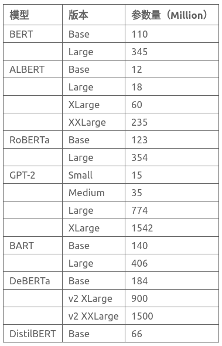
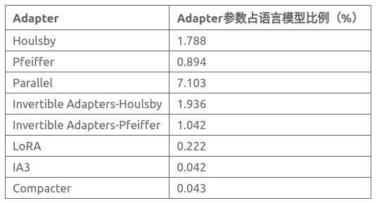
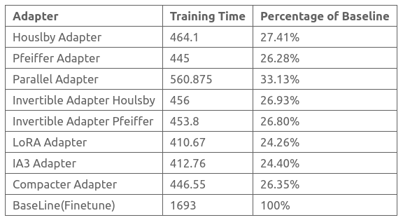

# FATE-LLM
FATE-LLM is a framework to support federated training with large language models, it also provides multiple parameter-efficient fine-tuning strategies[1][2] for industrial applications.

## Features
In current version, it supports the following features:
* Integration of various large language models for federated learning: including BERT[, ALBERT, RoBERta, GPT-2, BART, DeBERta, DistilBERT, etc. 
These models are widely used in natural language understanding and generation tasks, and can meet the needs of different application scenarios[3][4][5].
* Integration of multiple parameter-efficient tuning methods: Bottleneck Adapters (including Houlsby, Pfeiffer, Parallel schemes), Invertible Adapters, LoRA, IA3, and Compacter

## Experiment Data

### Model Parameter Sizes
The current version of FATE-LLM supports various classic large language models, with parameters amount ranging from tens of millions to 1.5 billions. 
The following table are the parameters amounts of models we support for commonly used versions  

### Trainable Parameter Sizes Of Parameter-Efficient Methods
In order to give users a more intuitive feelings for the huge improvement of federated training and transmission in FATE-LLM, 
we will take gpt-2 as an example and show the parameter amount in the federated training and transmission process.  

### Training Time Improvement:
We present a comparison of training times between different adapter
 methods and fine-tuning a complete model in a homo(horizontal) federated learning scenario for a text sentiment classification task using the IMDB dataset
- Scenario: Homo(Horizontal) Federated Learning Scenario
- Task Type: Text Sentiment Classification Task
- Participants: Two client parties involved in model building and one server for aggregation.
- Data & Basic parameters: IMDB dataset, with a size of 25,000, batch_size=64, padding_length=200.
- Environment: Each modeling party uses 2x V100 32GB GPUs, and the experiments are conducted in a local area network environment.

The table below shows the training time comparison between using various adapters and fine-tuning the complete model for each epoch (in seconds).
It can be observed that the federated form of adapter+language model can significantly save training time.  

## References
[1] Cai D, Wu Y, Wang S, et al. Autofednlp: An efficient fednlp framework[J]. arXiv preprint arXiv:2205.10162, 2022.   
[2] Zhang Z, Yang Y, Dai Y, et al. When Federated Learning Meets Pre-trained Language Models' Parameter-Efficient Tuning Methods[J]. arXiv preprint arXiv:2212.10025, 2022.   
[3] Zhou C, Li Q, Li C, et al. A comprehensive survey on pretrained foundation models: A history from bert to chatgpt[J].   
[4] Devlin J, Chang M W, Lee K, et al. Bert: Pre-training of deep bidirectional transformers for language understanding[J].arXiv preprint arXiv:1810.04805, 2018.   
[5] Radford A, Wu J, Child R, et al. Language models are unsupervised multitask learners[J]. OpenAI blog, 2019, 1(8): 9.