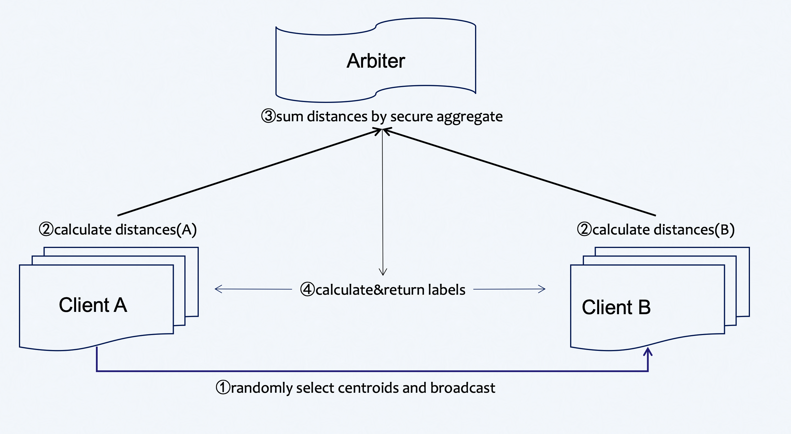

# Federated Kmeans

Kmeans is a simple statistic model widely used for clustering. FATE
provides Heterogeneous Kmeans(HeteroKmeans).

Here we simplify participants of the federation process into three
parties. Party A represents Guest, party B represents Host. Party C,
which is also known as “Arbiter,” is a third party that works as a
coordinator. Party C is responsible for generating private and public
keys.

## Heterogeneous Kmeans

The process of HeteroKmeans training is shown below:

Figure 1 (Federated HeteroKmeans Principle)

A sample alignment process is conducted before training. The sample
alignment process identifies overlapping samples in databases of all
parties. The federated model is built based on the overlapping samples.
The whole sample alignment process is conducted in encryption mode, and
so confidential information (e.g. sample ids) will not be leaked.

In the training process, party A will choose centroids from samples
randomly and send them to party B . Party A and party B then compute the
distance to centroids ,which is needed for label assignment. Arbiter
aggregates, calculates, and returns back the final label to each sample
and repeats this part until the max iter or tolerance meets the
criteria.

During the aggregate process, parties will use secure aggregate as all
sent distances will be added with random numbers that can be combined to
zero when aggregating at arbiter.

<!-- mkdocs
## Param

::: federatedml.param.hetero_kmeans_param
    rendering:
      heading_level: 3
      show_source: true
      show_root_heading: true
      show_root_toc_entry: false
      show_root_full_path: false
-->

## Features

1.  Tolerance & Max\_iter supported for convergence
2.  Random\_stat specify supported
3.  Centroids are selected randomly
4.  Labeled and unlabeled data supported

<!-- mkdocs
## Examples


-->
