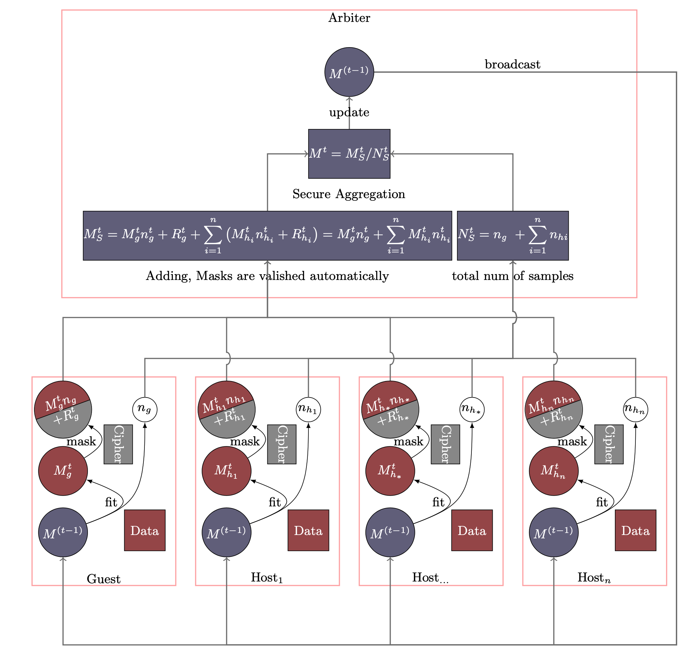

# Homogeneous Neural Networks

Neural networks are probably the most popular machine learning
algorithms in recent years. FATE provides a federated homogeneous neural
network implementation. We simplified the federation process into three
parties. Party A represents Guest，which acts as a task trigger. Party B
represents Host, which is almost the same with guest except that Host
does not initiate task. Party C serves as a coordinator to aggregate
models from guest/hosts and broadcast aggregated model.

## Basic Process

As its name suggested, in Homogeneous Neural Networks, the feature
spaces of guest and hosts are identical. An optional encryption mode for
model is provided. By doing this, no party can get the private model of
other parties.



The Homo NN process is shown in Figure 1. Models of Party A and Party B
have the same neural networks structure. In each iteration, each party
trains its model on its own data. After that, all parties upload their
encrypted (with random mask) model parameters to arbiter. The arbiter
aggregates these parameters to form a federated model parameter, which
will then be distributed to all parties for updating their local models.
Similar to traditional neural network, the training process will stop
when the federated model converges or the whole training process reaches
a predefined max-iteration threshold.

Please note that random numbers are carefully generated so that the
random numbers of all parties add up an zero matrix and thus disappear
automatically. For more detailed explanations, please refer to [Secure
Analytics: Federated Learning and Secure
Aggregation](https://inst.eecs.berkeley.edu/~cs261/fa18/scribe/10_15.pdf).
Since there is no model transferred in plaintext, except for the owner
of the model, no other party can obtain the real information of the
model.

<!-- mkdocs
## Param

::: federatedml.param.homo_nn_param
    rendering:
      heading_level: 3
      show_source: true
      show_root_heading: true
      show_root_toc_entry: false
      show_root_full_path: false
-->

## Features

### tensorflow backend

#### supported layers

=== "Dense"
    ```json
    {
      "layer": "Dense",
      "units": ,
      "activation": null,
      "use_bias": true,
      "kernel_initializer": "glorot_uniform",
      "bias_initializer": "zeros",
      "kernel_regularizer": null,
      "bias_regularizer": null,
      "activity_regularizer": null,
      "kernel_constraint": null,
      "bias_constraint": null
    }
    ```

=== "Droupout"
    ```json
    {
      "rate": ,
      "noise_shape": null,
      "seed": null
    }
    ```


other layers listed in [tf.keras.layers](https://www.tensorflow.org/versions/r1.14/api_docs/python/tf/keras/layers) will be supported in near feature.

#### supported optimizer

all optimizer listed in
[tf.keras.optimizers](https://www.tensorflow.org/versions/r1.15/api_docs/python/tf/keras/optimizers) supported

=== "Adadelta"
    [adadelta info](https://www.tensorflow.org/versions/r1.15/api_docs/python/tf/keras/optimizers/Adadelta)
    ```json
    {
      "optimizer": "Adadelta",
      "learning_rate": 0.001,
      "rho": 0.95,
      "epsilon": 1e-07
    }
    ```

=== "Adagrad"
    [adagrad info](https://www.tensorflow.org/versions/r1.15/api_docs/python/tf/keras/optimizers/Adagrad)
    ``` json
    {
      "optimizer": "Adagrad",
      "learning_rate": 0.001,
      "initial_accumulator_value": 0.1,
      "epsilon": 1e-07
    }
    ```

=== "Adam"
    [adam info](https://www.tensorflow.org/versions/r1.14/api_docs/python/tf/keras/optimizers/Adam)
    ```json
    {
      "optimizer": "Adam",
      "learning_rate": 0.001,
      "beta_1": 0.9,
      "beta_2": 0.999,
      "amsgrad": false,
      "epsilon": 1e-07
    }
    ```

=== "Ftrl"
    [ftrl info](https://www.tensorflow.org/versions/r1.15/api_docs/python/tf/keras/optimizers/Ftrl)
    ```json
    {
      "optimizer": "Ftrl",
      "learning_rate": 0.001,
      "learning_rate_power": -0.5,
      "initial_accumulator_value": 0.1,
      "l1_regularization_strength": 0.0,
      "l2_regularization_strength": 0.0,
      "l2_shrinkage_regularization_strength": 0.0
    }
    ```

=== "Nadam"
    [nadam info](https://www.tensorflow.org/versions/r1.15/api_docs/python/tf/keras/optimizers/Nadam)
    ```json
    {
      "optimizer": "Nadam",
      "learning_rate": 0.001,
      "beta_1": 0.9,
      "beta_2": 0.999,
      "epsilon": 1e-07
    }
    ```

=== "RMSprop"
    [rmsprop info](https://www.tensorflow.org/versions/r1.15/api_docs/python/tf/keras/optimizers/RMSprop)
    ```json
    {
      "optimizer": "RMSprop",
      "learning_rate": 0.001,
      "pho": 0.9,
      "momentum": 0.0,
      "epsilon": 1e-07,
      "centered": false
    }
    ```

=== "SGD"
    [sgd info](https://www.tensorflow.org/versions/r1.15/api_docs/python/tf/keras/optimizers/SGD)
    ```json
    {
      "optimizer": "SGD",
      "learning_rate": 0.001,
      "momentum": 0.0,
      "nesterov": false
    }
    ```

#### supported losses

all losses listed in [tf.keras.losses](https://www.tensorflow.org/versions/r1.14/api_docs/python/tf/keras/losses) supported

- binary\_crossentropy
- categorical\_crossentropy
- categorical\_hinge
- cosine\_similarity
- hinge
- kullback\_leibler\_divergence
- logcosh
- mean\_absolute\_error
- mean\_absolute\_percentage\_error
- mean\_squared\_error
- mean\_squared\_logarithmic\_error
- poisson
- sparse\_categorical\_crossentropy
- squared\_hinge

#### support multi-host  

In fact, for model security reasons, at least two host parties are required.


### pytorch backend  

There are some difference in nn configuration build by pytorch compared to tf or keras.

- config\_type  
  pytorch, if use pytorch to build your model

- nn\_define  
  Each layer is represented as an object in json.


#### supported layers

!!! Examples "Linear"
    
    ```json
    {
      "layer": "Linear",
      "name": #string,
      "type": "normal",
      "config": [input_num,output_num]
    }
    ```
    
other normal layers
      
  - BatchNorm2d
  
  - dropout

#### supportd activate

!!! Examples "Rulu"
    
    {
      "layer": "Relu",
      "type": "activate",
      "name": #string
    }

    - other activate layers
    
      - Selu
      - LeakyReLU
      - Tanh
      - Sigmoid
      - Relu
      - Tanh

#### supported optimizer  

A json object is needed

!!! Example "Adam"

    ```json
    "optimizer": {
      "optimizer": "Adam",
      "learning_rate": 0.05
    }
    ```
optimizer include "Adam","SGD","RMSprop","Adagrad"

#### supported loss  

A string is needed, supported losses include:

- "CrossEntropyLoss"
- "MSELoss"
- "BCELoss"
- "BCEWithLogitsLoss"
- "NLLLoss"
- "L1Loss"
- "SmoothL1Loss"
- "HingeEmbeddingLoss"

#### supported metrics  

A string is needed, supported metrics include:

- auccuray
- precision
- recall
- auc
- f1
- fbeta

## Use

Since all parties training Homogeneous Neural Networks have the same
network structure, a common practice is to configure parameters under
algorithm\_parameters, which is shared across all parties. The basic
structure is:

```json
{
  "config_type": "nn",
  "nn_define": [layer1, layer2, ...]
  "batch_size": -1,
  "optimizer": optimizer,
  "early_stop": {
    "early_stop": early_stop_type,
    "eps": 1e-4
  },
  "loss": loss,
  "metrics": [metrics1, metrics2, ...],
  "max_iter": 10
}
```

- nn\_define  
  Each layer is represented as an object in json. Please refer to
  supported layers in Features part.

- optimizer  
  A json object is needed, please refer to supported optimizers in
  Features part.

- loss  
  A string is needed, please refer to supported losses in Features
  part.

- others
  
  1.  batch\_size: a positive integer or -1 for full batch
  2.  max\_iter: max aggregation number, a positive integer
  3.  early\_stop: diff or abs
  4.  metrics: a string name, refer to
      [metrics doc](https://www.tensorflow.org/versions/r1.15/api_docs/python/tf/keras/metrics),
      such as Accuracy, AUC ...

<!-- mkdocs
## Examples


-->
