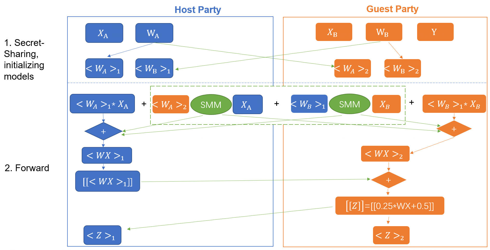
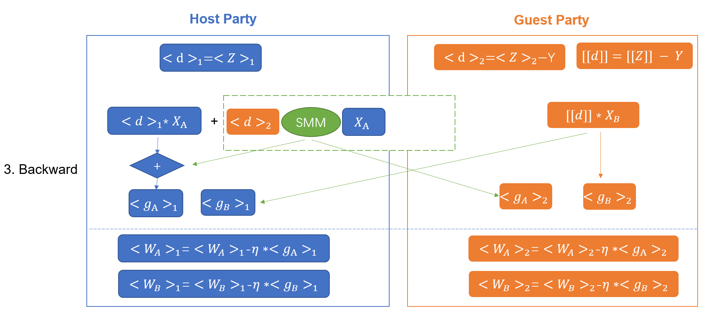
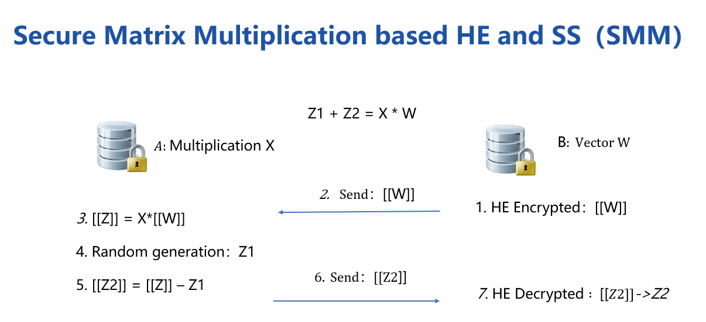

# Federated Logistic Regression

Logistic Regression(LR) is a widely used statistic model for
classification problems. FATE provided two modes of federated LR:
Homogeneous LR (HomoLR) and Heterogeneous LR (HeteroLR and Hetero_SSHE_LR).

Below lists features of each LR models:

| Linear Model  	| Multiclass(OVR)                                                                                	| Arbiter-less Training                                                          	| Weighted Training                                                                                  	| Multi-Host                                                                                     	| Cross Validation                                                                       	| Warm-Start/CheckPoint                                                                          	|
|---------------	|------------------------------------------------------------------------------------------------	|--------------------------------------------------------------------------------	|----------------------------------------------------------------------------------------------------	|------------------------------------------------------------------------------------------------	|----------------------------------------------------------------------------------------	|------------------------------------------------------------------------------------------------	|
| Hetero LR     	| [&check;](../../examples/pipeline/hetero_logistic_regression/pipeline-hetero-lr-one-vs-all.py) 	| &cross;                                                                        	| [&check;](../../examples/pipeline/hetero_logistic_regression/pipeline-hetero-lr-sample-weights.py) 	| [&check;](../../examples/pipeline/hetero_logistic_regression/pipeline-hetero-lr-multi-host.py) 	| [&check;](../../examples/pipeline/hetero_logistic_regression/pipeline-hetero-lr-cv.py) 	| [&check;](../../examples/pipeline/hetero_logistic_regression/pipeline-hetero-lr-warm-start.py) 	|
| Hetero SSHELR 	| [&check;](../../examples/pipeline/hetero_sshe_lr/pipeline-hetero-lr-ovr.py)                    	| [&check;](../../examples/pipeline/hetero_sshe_lr/pipeline-hetero-lr-normal.py) 	| [&check;](../../examples/pipeline/hetero_sshe_lr/pipeline-hetero-lr-sample-weights.py)             	| &cross;                                                                                        	| [&check;](../../examples/pipeline/hetero_sshe_lr/pipeline-hetero-lr-cv.py)             	| [&check;](../../examples/pipeline/hetero_sshe_lr/pipeline-hetero-lr-warm-start.py)             	|
| Homo LR       	| [&check;](../../examples/pipeline/homo_logistic_regression/pipeline-homo-lr-one-vs-all.py)     	| &cross;                                                                        	| [&check;](../../examples/pipeline/homo_logistic_regression/pipeline-homo-lr-sample-weights.py)     	| [&check;](../../examples/pipeline/homo_logistic_regression/pipeline-homo-lr-multi-host.py)     	| [&check;](../../examples/pipeline/homo_logistic_regression/pipeline-homo-lr-cv.py)     	| [&check;](../../examples/pipeline/homo_logistic_regression/pipeline-homo-lr-warm-start.py)     	|

We simplified the federation process into three parties. Party A
represents Guest， party B represents Host while party C, which also
known as "Arbiter", is a third party that holds a private key for each
party and work as a coordinator. (Hetero_SSHE_LR have not "Arbiter" role)

## Homogeneous LR

As the name suggested, in HomoLR, the feature spaces of guest and hosts
are identical. An optional encryption mode for computing gradients is
provided for host parties. By doing this, the plain model is not
available for this host any more.

Models of Party A and Party B have the same structure. In each iteration, each party trains
its model on its own data. After that, all parties upload their
encrypted (or plain, depends on your configuration) gradients to
arbiter. The arbiter aggregates these gradients to form a federated
gradient that will then be distributed to all parties for updating their
local models. Similar to traditional LR, the training process will stop
when the federated model converges or the whole training process reaches
a predefined max-iteration threshold. More details is available in this
[Practical Secure Aggregation for Privacy-Preserving Machine Learning](https://dl.acm.org/citation.cfm?id=3133982).

## Heterogeneous LR

The HeteroLR carries out the federated learning in a different way. As
shown in Figure 2, A sample alignment process is conducted before
training. This sample alignment process is to identify overlapping
samples stored in databases of the two involved parties. The federated
model is built based on those overlapping samples. The whole sample
alignment process will **not** leak confidential information (e.g.,
sample ids) on the two parties since it is conducted in an encrypted
way. 

In the training process, party A and party B compute out the elements
needed for final gradients. Arbiter aggregate them and compute out the
gradient and then transfer back to each party. More details is available in this: [Private federated learning on vertically partitioned data via entity resolution and additively homomorphic encryption](https://arxiv.org/abs/1711.10677).

## Multi-host hetero-lr

For multi-host scenario, the gradient computation still keep the same as
single-host case. However, we use the second-norm of the difference of
model weights between two consecutive iterations as the convergence
criterion. Since the arbiter can obtain the completed model weight, the
convergence decision is happening in Arbiter.

# Heterogeneous SSHE Logistic Regression 
FATE implements a heterogeneous logistic regression without arbiter role
called for hetero_sshe_lr. More details is available in this
following paper: [When Homomorphic Encryption Marries Secret Sharing:
Secure Large-Scale Sparse Logistic Regression and Applications
in Risk Control](https://arxiv.org/pdf/2008.08753.pdf).
We have also made some optimization so that the code may not exactly
same with this paper.
The training process could be described as the
following: forward and backward process.

The training process is based secure matrix multiplication protocol(SMM), 
which HE and Secret-Sharing hybrid protocol is included.

<!-- mkdocs
## Param

::: federatedml.param.logistic_regression_param
    rendering:
      heading_level: 3
      show_source: true
      show_root_heading: true
      show_root_toc_entry: false
      show_root_full_path: false
-->

## Features

  - Both Homo-LR and Hetero-LR

> 1.  L1 & L2 regularization
> 
> 2.  Mini-batch mechanism
> 
> 3.  Weighted training
> 
> 4.  Six optimization method:
>     
>     >   - sgd  
>     >     gradient descent with arbitrary batch size
>     > 
>     >   - rmsprop  
>     >     RMSProp
>     > 
>     >   - adam  
>     >     Adam
>     > 
>     >   - adagrad  
>     >     AdaGrad
>     > 
>     >   - nesterov\_momentum\_sgd  
>     >     Nesterov Momentum
>     > 
> 
> 5.  Three converge criteria:
>     
>     >   - diff  
>     >     Use difference of loss between two iterations, not available
>     >     for multi-host training;
>     > 
>     >   - abs  
>     >     use the absolute value of loss;
>     > 
>     >   - weight\_diff  
>     >     use difference of model weights
> 
> 6.  Support multi-host modeling task.
> 
> 7.  Support validation for every arbitrary iterations
> 
> 8.  Learning rate decay mechanism

  - Homo-LR extra features

> 1.  Two Encryption mode
>     
>     >   - "Paillier" mode  
>     >     Host will not get clear text model. When using encryption
>     >     mode, "sgd" optimizer is supported only.
>     > 
>     >   - Non-encryption mode  
>     >     Everything is in clear text.
> 
> 2.  Secure aggregation mechanism used when more aggregating models
> 
> 3.  Support aggregate for every arbitrary iterations.
> 
> 4.  Support FedProx mechanism. More details is available in this
>     [Federated Optimization in Heterogeneous Networks](https://arxiv.org/abs/1812.06127).

  - Hetero-LR extra features

1. Support different encrypt-mode to balance speed and security
2. Support OneVeRest
3. When modeling a multi-host task, "weight\_diff" converge criteria
>     is supported only.
4. Support sparse format data
5. Support early-stopping mechanism
6. Support setting arbitrary metrics for validation during training
7. Support stepwise. For details on stepwise mode, please refer [stepwise](stepwise.md).
8. Support batch shuffle and batch masked strategy.

 - Hetero-SSHE-LR extra features
  > 1. Support different encrypt-mode to balance speed and security
  > 2. Support OneVeRest
  > 3. Support early-stopping mechanism
  > 4. Support setting arbitrary metrics for validation during training
  > 5. Support model encryption with host model
