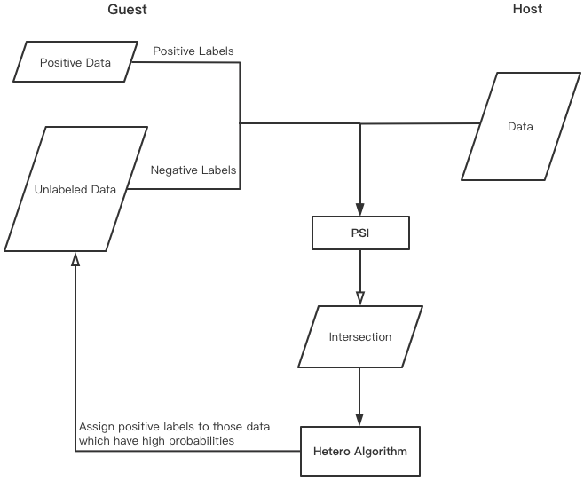
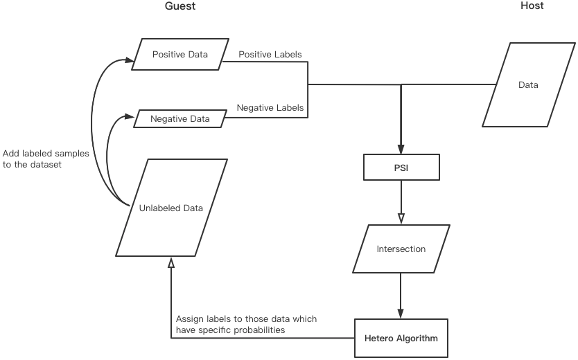

# Positive Unlabeled Learning

## Introduction

Positive unlabeled learning is one of the semi-supervised algorithms. This component is applied to hetero classification tasks, in particular, learning classifiers from both labeled and unlabeled data. PU learning has two paradigms, `"standard"` and `"two-step"`.

For the `"standard"` mode, the dataset has only positive and unlabeled samples. Unlabeled data are treated as negative data for the binary classifier training. The trained classification model is used for assigning labels to those unlabeled data. After relabeling operations, the dataset is repartitioned and the number of labeled data is increased. Repeatedly, `"standard"` mode can gain a classification model that takes advantage of unlabeled data. The procedure of probability relabeling strategy is shown below.

For the `"two-step"` mode, the dataset has not only positive and unlabeled samples but also negative data. In this mode, unlabeled data are merely used in the prediction stage. Positive and negative data are applied to the binary classifier training. Similar to the `"standard"` mode, unlabeled data are assigned labels by a trained classification model in relabeling strategy. As a result of unlabeled samples allocated to the labeled set, `"two-step"` mode can make the best of the unlabeled data. The procedure of probability relabeling strategy is shown below.

## Usage
1. Positive unlabeled module currently only supports hetero binary classification tasks.

2. Use ***Label Transform*** component to specify the value of unlabeled digit. The unlabeled digit should be set to **0** in `"standard"` mode and set to **-1** in `"two-step"` mode.

3. Users can freely connect the combination of ***classifier*** and ***Positive Unlabeled*** components in DSL or pipeline.

## Features

Positive unlabeled learning is provided with different training modes and labeling strategies.

* `mode`: the training mode of positive unlabeled learning, including `"standard"` and `"two-step"`

* `labeling_strategy`: the labeling strategy for unlabeled data, including `"proportion"`, `"quantity"`, `"probability"` and `"interval"`

  * `threshold_percent`: the threshold percent in proportion strategy

  * `threshold_amount`: the threshold amount in quantity strategy

  * `threshold_proba`: the threshold proba in probability strategy

## Application

Positive unlabeled learning supports the following situations.

* The dataset partition can be positive and unlabeled *or* positive, negative, and unlabeled.

* The model of binary classification can be ***Hetero-LR***, ***Hetero-SSHELR*** *or* ***Hetero-SecureBoost***.
