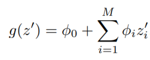
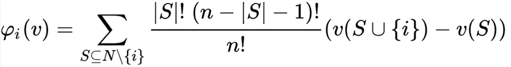
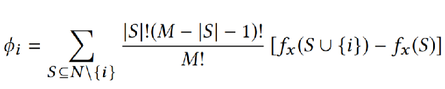

# Explainable Federated Learning

Understanding why a model makes a certain prediction and how a feature value contributes to the
predict result are as the same importance as training a accurate model. For a better understandingof trained federated 
models, in FATE-1.8 we provides a brand new module 'Model Interpret' which offers novel model-interpretation algorithms 
specifically designed for federated machine learning.

# SHAP Based Methods

SHAP(SHapley Additive exPlanations) is one of the most widely used Model-Agnostic methods [1] in explainable machine learning. 
It is developed mainly on two basic concepts: Additive feature attribution methods and Shapley Values. 
Here we briefly introduce SHAP and Federated SHAP developed based on SHAP.

Additive feature attribution methods have an explanatory model that is a linear function of binary variables[2].
Give a machine learning model *f*, 
assuming we have an instance *x* with *M* features, φ denotes the contribution  made by a certain feature value. 
*z* is a vector of *M* dimension and it only contains 0 and 1, indicating a feature exists or not. *z'* is a 
all 1 vector. *g* is a explainable additive model and we have *f(x)=g(z')*.To explain the predict result, we use
definition:

to represent an additive feature attribution model. 
In a nutshell, in the perspective of the additive feature attribution method, instance feature values contribute 
to the predict result, and their contributions sum up to get the predict result. From this simple additive method, 
we are able to have a straight view of feature importance and relate features with a realistic interpretation.

The Shapley value is a game theory concept that involves fairly distributing gains to several players working in a coalition.  Formally, a coalition game is defined as: There is a set *N* (of *n* players) and a contribution estimation function *v*
 that maps subsets of players to the gain values in real numbers. *S* is a set of players, then *v(S)*, 
 describes the total expected sum of payoffs the members of *S* can obtain by cooperation. Then, the gain a player
 can get in this coalition game can be computed as:
 

 
By enumerating all possible subsets we are able to compute the gains of all participated players.

By combining additive feature attribution method and the shapley value we are able to estimate the contributions a 
feature contribute to a predict result. The contribution φ of a certain feature value *i* can be computed as:
      

Where *fx* is a function gives an expected predicted value given a feature subset. 

However, the exact computation of SHAP values is somehow costly because you have to enumerate all the feature subsets. 
Therefore, in [2],[3] they offer one approximation method and one fast method specially designed for Tree algorithms:
KernelSHAP and TreeSHAP. We firstly develop the federation version of KernelSHAP and TreeSHAP.
           
                       
## Hetero and Homo Kernel SHAP

How

## Hetero and Homo Tree SHAP

## Reference
[1]https://christophm.github.io/interpretable-ml-book/local-methods.html

[2]A unified approach to interpreting model predictions. Scott M. Lundberg and Su-In Lee. 2017. In Proceedings of the 31st International Conference on Neural Information Processing Systems

[3]