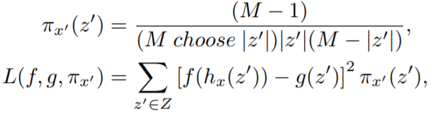
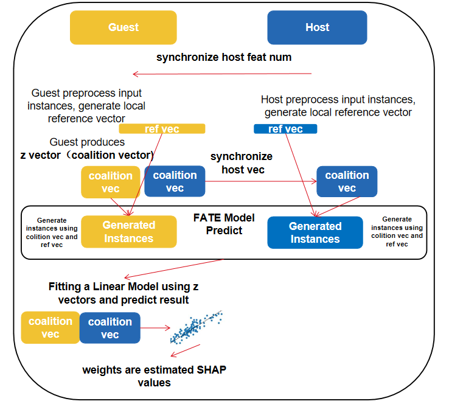

# Explainable Federated Learning

Understanding why a model makes a certain prediction and how a feature value contributes to the
predict result are as the same importance as training a accurate model. For a better understandingof trained federated 
models, in FATE-1.8 we provides a brand new module 'Model Interpret' which offers novel model-interpretation algorithms 
specifically designed for federated machine learning. We initially tried to develop several algorithms to implement 
interpretation algorithms on federated learning.

# SHAP Based Methods

SHAP(SHapley Additive exPlanations) is one of the most widely used Model-Agnostic methods [1] in explainable machine learning. 
It is developed mainly on two basic concepts: Additive feature attribution methods and Shapley Values. 
Here we briefly introduce SHAP and Federated SHAP developed based on SHAP.

Additive feature attribution methods have an explanatory model that is a linear function of binary variables[2].
Firstly we show the basic definitions of this additive feature attribution methods. Assuming that we are training on a tabular data set:
Given a machine learning model *f*, we have an instance *x* with *M* features, φ denotes the contribution  made by a certain feature value. 
*z'* is a coalition vector of *M* dimension and it only contains 0 and 1, indicating a feature value exists or not.
*h* is a mapping function that map *z'* to an instance *x'* in the instance spaces(Sometimes absent feature values will
be replaced by 0s or some reference values). We have *f(h(z'))=f(x')=g(z')*.
*z* is an all 1 vector. *g* is an explainable additive model and we have *f(x)=g(z)*.
To explain the predict result, we use definition:

to represent an additive feature attribution model. 
In a nutshell, in the perspective of the additive feature attribution method, instance feature values contribute 
to the predict result, and their contributions sum up to get the predict result. From this simple additive method, 
we are able to have a straight view of feature importance and relate features with a realistic interpretation.

The Shapley value is a game theory concept that involves fairly distributing gains to several players working in a coalition.  Formally, a coalition game is defined as: There is a set *N* (of *n* players) and a contribution estimation function *v*
 that maps subsets of players to the gain values in real numbers. *S* is a set of players, then *v(S)*, 
 describes the total expected sum of payoffs the members of *S* can obtain by cooperation. Then, the gain a player
 can get in this coalition game can be computed as:
 

 
By enumerating all possible subsets we are able to compute the gains of all participated players.

By combining additive feature attribution method and the shapley value we are able to estimate the contributions a 
feature contribute to a predict result. The contribution(SHAP values) φ of a certain feature value *i* can be computed as:
      

Where *fx* is a function outputs an expected predicted value given a feature subset. 

However, the exact computation of SHAP values is somehow costly because you have to enumerate all the feature subsets. 
Therefore, in [2],[3] they offer one approximation method and one fast method specially designed for Tree algorithms:
KernelSHAP and TreeSHAP. We firstly develop the federation version of KernelSHAP and TreeSHAP.
           
                       
## Hetero and Homo Kernel SHAP

KernelSHAP is an approximation method for SHAP values computation proposed in [2]. As mentioned above, vector *z'*s
are vectors of *M* dimension and it only contains 0 and 1, indicating a feature exists or not, so every *z'* vector
corresponds to a feature subset, and function *g* maps *z'* to model output. Instead of enumerating all coalition vectors 
and computing exact SHAP values, the key idea of Kernel SHAP is to randomly subsample coalition vectors to estimate SHAP 
values with only a small fraction of all subsets by fitting a weighted linear regression model. The formula is shown below:

In this linear model *L*, the coalition vectors *z'* will be the instances and *g(z')* will be the label, weight function is *Π*

The weights of the trained linea
r regression model will be the estimated SHAP values φ. For more details of 
Kernel SHAP pleaser refer to [2].

In FATE, inspired by Federated Shapely Value proposed in [4], we develop a hetero explain methods based on KernelSHAP.
The process of Hetero KernelSHAP in FATE can be described in following steps

1. Guest and Host preprocess input model and an instances to be explained. Generate local reference vector(all zeros, features'  
average, or features' median), when mapping coalition vectors to instances, absent features values in the generated 
instances will be replaced by the feature values in the reference vector. Hosts send their feature numbers to Guest.

2. Start to explain an instance. Guest randomly generates global coalition vectors, produces weights for coalition vectors.
Guest sends corresponding dimensions to hosts.

3. Guest & Hosts mapping their local coalition vectors to instance spaces to generate instances. Load federated 
   hetero model and predict these instances.

4. Guest get the prediction result and fitting a linear regression model to estimate the SHAP values. Finish explain
   one instance, go to step 2 until finish explaining all instances.

For the concern of privacy protection, when running KernelSHAP on linear models, **for every host, we combine their feature
space as one united federated feature**[4].

Figure above demonstrate the process of Hetero KernelSHAP

The Homo KernelSHAP is the same as ordinary non-federation KernelSHAP.

## Hetero and Homo Tree SHAP

Unlike KernelSHAP which is an approximation method, TreeSHAP is specifically designed for tree algorithms. 
With this properties, it speeds up SHAP values computation by utilizing the structure of trees.

The Homo TreeSHAP is the same as ordinary non-federation TreeSHAP. We transform Homo-sbt models into lightgbm models
and call built-in TreeSHAP.

## Reference
[1]https://christophm.github.io/interpretable-ml-book/local-methods.html

[2]A unified approach to interpreting model predictions. Scott M. Lundberg and Su-In Lee. 2017. In Proceedings of the 31st International Conference on Neural Information Processing Systems.

[3]Consistent Individualized Feature Attribution for Tree Ensembles. Lundberg, Scott M. et al. ArXiv abs/1802.03888.

[4]Interpret Federated Learning with Shapley Values. Wang, G.  ArXiv, abs/1905.04519.