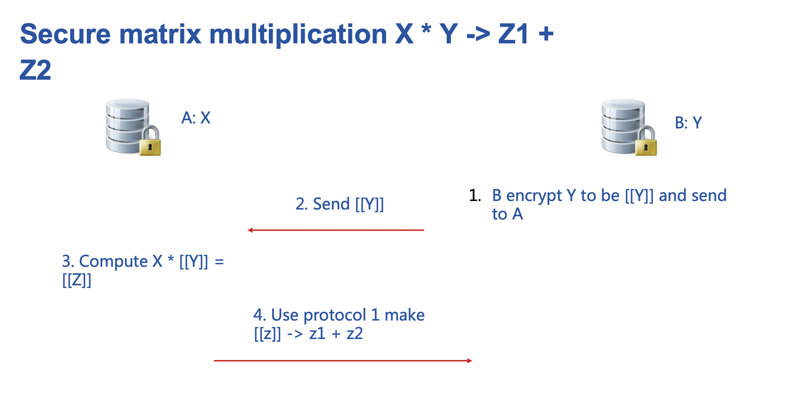
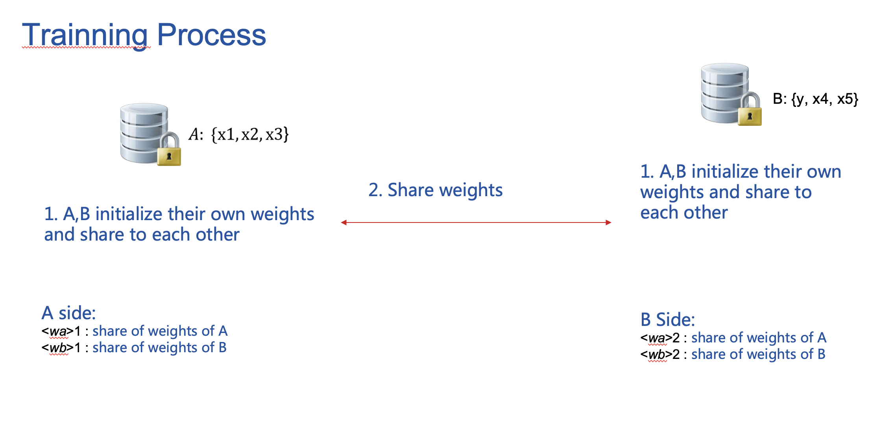
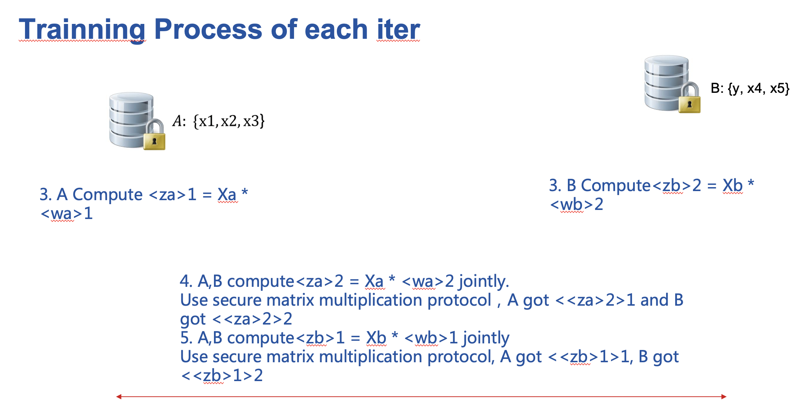
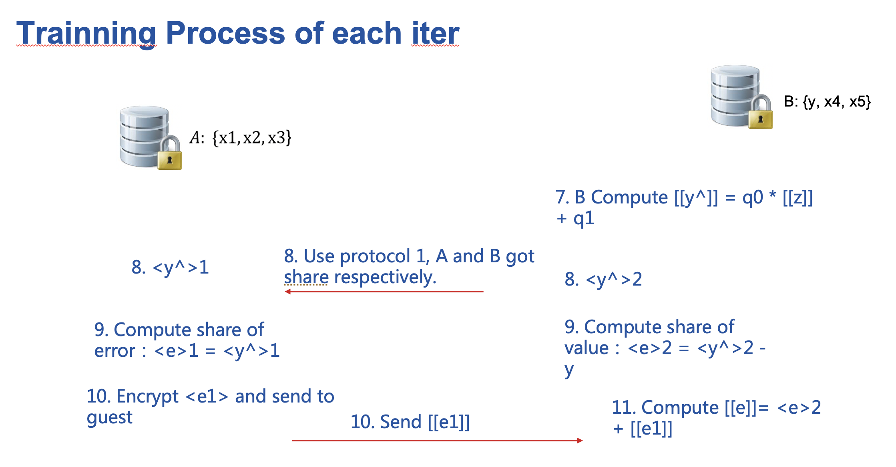
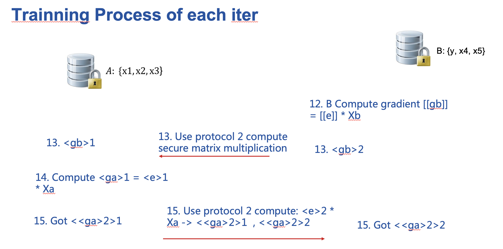
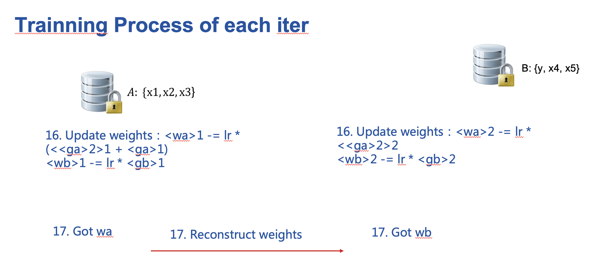

# Federated SSHE Logistic Regression 

Logistic Regression(LR) is a widely used statistic model for
classification problems. This folder shows a hetero federated LR with
both secure sharing and homomorphic encryption. This methods is refer to
the following paper: [paper](https://arxiv.org/pdf/2008.08753.pdf)
We have also made some optimization so that the code may not exactly
same with this paper.

We simplified the federation process into three parties. Party A
represents Guest， party B represents Host.

To begin with, there are two protocol will be used below.

Use these two protocol, the training process could be described as the
following.

<!-- mkdocs
## Param

::: federatedml.param.hetero_sshe_lr_param
    rendering:
      heading_level: 3
      show_source: true
      show_root_heading: true
      show_root_toc_entry: false
      show_root_full_path: false
-->

## Features

> 1.  L1 & L2 regularization
> 
> 2.  Mini-batch mechanism
> 
> 3.  Five optimization method:
>     
>     >   - sgd  
>     >     gradient descent with arbitrary batch size
>     > 
>     >   - rmsprop  
>     >     RMSProp
>     > 
>     >   - adam  
>     >     Adam
>     > 
>     >   - adagrad  
>     >     AdaGrad
>     > 
>     >   - nesterov\_momentum\_sgd  
>     >     Nesterov Momentum
>
>
> 4.  Three converge criteria:
>     
>     >   - diff  
>     >     Use difference of loss between two iterations, not available
>     >     for multi-host training;
>     > 
>     >   - abs  
>     >     use the absolute value of loss;
>     > 
>     >   - weight\_diff  
>     >     use difference of model weights
> 
> 5.  Support validation for every arbitrary iterations
> 
> 6.  Learning rate decay mechanism
> 
> 7.  Support OneVeRest
> 
> 8.  Support early-stopping mechanism
> 
> 9.  Support setting arbitrary metrics for validation during training
