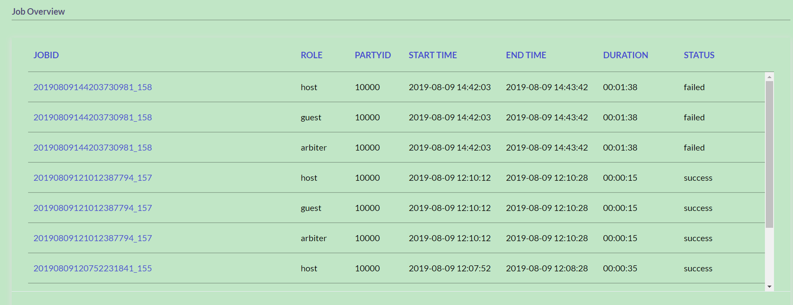
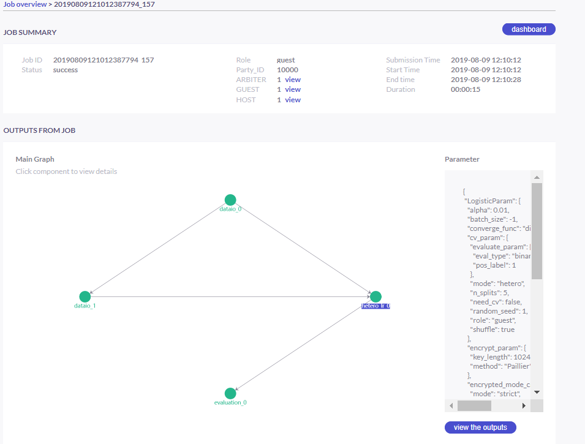
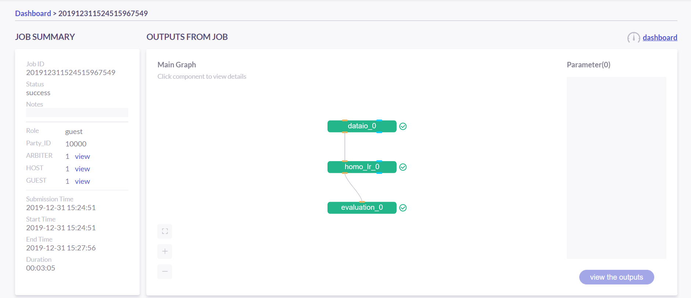
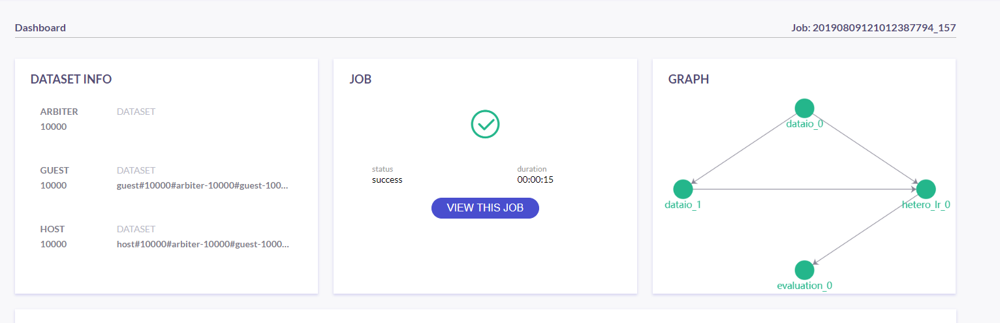

# Instructions for building models

## Quick Start

We have provided a python script for quick starting modeling task.

### 1. Command Line Interface

- command: python quick_run.py
- parameter:
    * -r  --role: start role, needed only in cluster version, Optional
- description: quick start a job.

### 2. Standalone Version
1. Start standalone version hetero-lr task (default) by running this command:

> python quick_run.py

Then you are supposed to see the output as follows.


```
stdout:{
    "data": {
        "board_url": "http://localhost:8080/index.html#/dashboard?job_id=20190815211211735986134&role=guest&party_id=10000",
        "job_dsl_path": "${your install path}/jobs/20190815211211735986134/job_dsl.json",
        "job_runtime_conf_path": "/data/projects/fate/python/jobs/20190815211211735986134/job_runtime_conf.json",
        "model_info": {
            "model_id": "arbiter-10000#guest-10000#host-10000#model",
            "model_version": "20190815211211735986134"
        }
    },
    "jobId": "20190815211211735986134",
    "meta": null,
    "retcode": 0,
    "retmsg": "success"
}

Please check your task in fate-board, url is : http://localhost:8080/index.html#/dashboard?job_id=20190815211211735986134&role=guest&party_id=10000
The log info is located in ${your install path}/examples/federatedml-1.x-examples/../../logs/20190815211211735986134
```

You can view the job on the url above or check out the log through the log file path.

You can also define your own task through editing the following variables in quick_run.py:
```python
# You can set up your own configuration files here
DSL_PATH = 'hetero_logistic_regression/test_hetero_lr_train_job_dsl.json'
SUBMIT_CONF_PATH = 'hetero_logistic_regression/test_hetero_lr_train_job_conf.json'

TEST_PREDICT_CONF = HOME_DIR + '/test_predict_conf.json'

# Define what type of task it is
TASK = 'train'
# TASK = 'predict'

# Put your data to /example/data folder and indicate the data names here
GUEST_DATA_SET = 'breast_b.csv'
HOST_DATA_SET = 'breast_a.csv'
# GUEST_DATA_SET = 'breast_homo_guest.csv'
# HOST_DATA_SET = 'breast_homo_host.csv'

# Define your party ids here
GUEST_ID = 10000
HOST_ID = 10000
ARBITER_ID = 10000

# 0 represent for standalone version while 1 represent for cluster version
WORK_MODE = 0

# Time out for waiting a task
MAX_WAIT_TIME = 3600

# Time interval for querying task status
RETRY_JOB_STATUS_TIME = 10
```

### 3. Cluster Version

1. Host party:
> python quick_run.py -r host

This is just uploading data

2. Guest party:
> python quick_run.py -r guest

The config files that generated is stored in a new created folder named **user_config**

### 4. Start a Predict Task
Once you finish one training task, you can start a predict task. You need to modify "TASK" variable in quick_run.py script as "predict":
```
# Define what type of task it is
# TASK = 'train'
TASK = 'predict'
```
Then all you need to do is running the following command:
> python quick_run.py

Please note this works only if you have finished the trainning task.


## Start Training Task

There are three config files need to be prepared to build a algorithm model in FATE.
1. Upload data config file: for upload data
2. DSL config file: for defining your modeling task
3. Submit runtime conf: for setting parameters for each component

### Step1: Define upload data config file

To make FATE be able to use your data, you need to upload them. Thus, a upload-data conf is needed. A sample file named "upload_data.json" has been provided in current folder.

#### Field Specification
1. file: file path
2. head: Specify whether your data file include a header or not
3. partition: Specify how many partitions used to store the data
4. table_name & namespace: Indicators for stored data table.
5. work_mode: Indicate if using standalone version or cluster version. 0 represent for standalone version and 1 stand for cluster version.

### Step2: Define your modeling task structure

Practically, when building a modeling task, several components might be involved, such as data_io, feature_engineering, algorithm_model, evaluation as so on. However, the combination of these components would differ from task to task. Therefore, a convenient way to freely combine these components would be a critical feature.

Currently, FATE provide a kind of domain-specific language(DSL) to define whatever structure you want. The components are combined as a Directed Acyclic Graph(DAG) through the dsl config file. The usage of dsl config file is as simple as defining a json file.

The DSL config file will define input data and(or) model as well as output data and(or) model for each component. The downstream components take output data and(or) model of upstream components as input. In this way, a DAG can be constructed by the config file.

We have provided several example dsl files located in the corresponding algorithm folder. For example, hetero-lr dsl files are located in 'hetero_logistic_regression/test_hetero_lr_train_job_dsl.json'


#### Field Specification
1. component_name: key of a component. This name should end with a "_num" such as "_0", "_1" etc. And the number should start with 0. This is used to distinguish multiple same kind of components that may exist.
2. module: Specify which component use. This field should be one of the algorithm modules FATE supported.
   The supported algorithms can be referred to [here](../../federatedml/README.md)

3. input: There are two type of input, data and model.
    1. data: There are three possible data_input type:
        1. data: typically used in data_io, feature_engineering modules and evaluation.
        2. train_data: Used in homo_lr, hetero_lr and secure_boost. If this field is provided, the task will be parse as a **fit** task
        3. eval_data: If train_data is provided, this field is optional. In this case, this data will be used as validation set. If train_data is not provided, this task will be parse as a **predict** or **transform** task.
    2. model: There are two possible model-input type:
        1. model: This is a model input by same type of component, used in prediction\transform stage. For example, hetero_binning_0 run as a fit component, and hetero_binning_1 take model output of hetero_binning_0 as input so that can be used to transform or predict.
        2. isometric_model: This is used to specify the model input from upstream components, only used by HeteroFeatureSelection module in FATE-1.x. HeteroFeatureSelection can take the model output of HetereFeatureBinning and use information value calculated as filter criterion.
4. output: Same as input, two type of output may occur which are data and model.
    1. data: Specify the output data name
    2. model: Specify the output model name

5. need_deploy: true or false. This field is used to specify whether the component need to deploy for online inference or not. This field just use for online-inference dsl deduction.

### Step3: Define Submit Runtime Configuration for Each Specific Component.
This config file is used to config parameters for all components among every party.
1. initiator: Specify the initiator's role and party id
2. role: Indicate all the party ids for all roles.
3. role_parameters: Those parameters are differ from roles and roles are defined here separately. Please note each parameter are list, each element of which corresponds to a party in this role.
4. algorithm_parameters: Those parameters are same among all parties are here.

### Step4: Start Modeling Task

#### 1. Upload data
Before starting a task, you need to load data among all the data-providers. To do that, a load_file config is needed to be prepared.  Then run the following command:

> python ${your_install_path}/fate_flow/fate_flow_client.py -f upload -c upload_data.json

Here is an example of configuring upload_data.json:
``` json
    {
      "file": "examples/data/breast_b.csv",
      "head": 1,
      "partition": 10,
      "work_mode": 0,
      "table_name": "hetero_breast_b",
      "namespace": "hetero_guest_breast"
    }
```

We use **hetero_breast_b** & **hetero_guest_breast** as guest party's table name and namespace. To use default runtime conf, please set host party's name and namespace as **hetero_breast_a** & **hetero_host_breast** and upload the data with path of  **examples/data/breast_a.csv**

To use other data set, please change your file path and table_name & namespace. Please do not upload different data set with same table_name and namespace.

Note: This step is needed for every data-provide node(i.e. Guest and Host).

#### 2. Start your modeling task
In this step, two config files corresponding to dsl config file and submit runtime conf file should be prepared. Please make sure the table_name and namespace in the conf file match with upload_data conf.

 ```
     "role_parameters": {
        "guest": {
            "args": {
                "data": {
                    "train_data": [{"name": "hetero_breast_b", "namespace": "hetero_guest_breast"}]
                }
            },
 ```

 As the above example shows, the input train_data should match the upload file conf.

 Then run the following command:

> python ${your_install_path}/fate_flow/fate_flow_client.py -f submit_job -d hetero_logistic_regression/test_hetero_lr_train_job_dsl.json -c hetero_logistic_regression/test_hetero_lr_train_job_conf.json

#### 3. Check log files
Now you can check out the log in the following path: ${your_install_path}/logs/{your jobid}.


### Step5: Check out Results
FATE now provide "FATE-BOARD" for showing modeling log-metrics and evaluation results.

Use your browser to open a website: http://{Your fate-board ip}:{your fate-board port}/index.html#/history.

<div style="text-align:center", align=center>
<br/>
Figure 1： Job List</div>

There will be all your job history list here. Your latest job will be list in the first page. Use JOBID to find out the modeling task you want to check.

<div style="text-align:center", align=center>
<br/>
Figure 2： Job Overview</div>

In the task page, all the components will be shown as a DAG. We use different color to indicate their running status.
1. Green: run success
2. Blue: running
3. Gray: Waiting
4. Red: Failed.

 You can click each component to get their running parameters on the right side. Below those parameters, there exist a **View the outputs** button. You may check out model output, data output and logs for this component.

<div style="text-align:center", align=center>
<br/>
Figure 3： Component Output</div>

If you want a big picture of the whole task, there is a **dashboard** button on the right upper corner. Get in the Dashboard, there list three windows showing different information.

<div style="text-align:center", align=center>
<br/>
Figure 4： Dash Board</div>

1. Left window: showing data set used for each party in this task.
2. Middle window: Running status or progress of the whole task.
3. Right window: DAG of components.

### Step6: Check out Logs

After you submit a job, you can find your job log in ${Your install path}/logs/${your jobid}

The logs for each party is collected separately and list in different folders. Inside each folder, the logs for different components are also arranged in different folders. In this way, you can check out the log more specifically and get useful detailed  information.


## FATE-FLOW Usage

#### 1.How to get the output data of each component:

 >cd {your_fate_path}/fate_flow
 
 >python fate_flow_client.py -f component_output_data -j $jobid -p $party_id -r $role -cpn $component_name -o $output_dir

jobid:the task jobid you want to get.

party_id:your mechine's party_id, such as 10000

role:"guest" or "host" or "arbiter"
 
component_name: the component name which you want to get, such as component_name "hetero_lr_0" in {your_fate_path}/examples/federatedml-1.x-examples/hetero_logistic_regression/test_hetero_lr_train_job_dsl.json

output_dir: the output directory

#### 2.How to get the output model of each component
 
 >python fate_flow_client.py -f component_output_model -j $jobid -p $party_id -r $role -cpn $component_name


#### 3.How to get the logs of task

 >python fate_flow_client.py -f job_log -j $jobid -o $output_dir
 
#### 4.How to stop the job

 > python fate_flow_client.py -f stop_job -j $jobid

#### 5.How to query job current status

 > python fate_flow_client.py -f query_job -j $jobid -p party_id -r role

#### 6.How to get the job runtime configure
 > python fate_flow_client.py -f job_config -j $jobid -p party_id -r role -o $output_dir

#### 7.How to download a table which has been uploaded before
 > python fate_flow_client.py -f download -n table_namespace -t table_name -w work_mode -o save_file
 
 work_mode: will be 0 for standalone or 1 for cluster, which depend on what you set in upload config


# Predict Task Usage

## Instructions for using training models to predict

In order to use trained model to predict. The following several steps are needed.

### Step1: Train Model

Pay attention to following points to enable predicting:
1. you should add/modify "need_deploy" field for those modules that need to deploy in predict stage. All modules have set True as their default value except FederatedmSample and Evaluation, which typically will not run in predict stage. The "need_deploy" field is True means this module should run a "fit" process and the fitted model need to be deployed in predict stage.

2. Besiedes setting those model as "need_deploy", they should also config to have a model output except Intersect module. Only in this way can fate-flow store the trained model and make it usable in inference stage.

3. Get training model's model_id and model_version. There are two ways to get this.

   a. After submit a job, there will be some model information output in which "model_id" and "model_version" are our interested field.
   b. Beside that, you can also obtain these information through the following command directly:

       python ${your_fate_install_path}/fate_flow/fate_flow_client.py -f job_config -j ${jobid} -r guest -p ${guest_partyid}  -o ${job_config_output_path}

       where
       $guest_partyid is the partyid of guest (the party submitted the job)
       $job_config_output_path: path to store the job_config

      After that, a json file including model info will be download to ${job_config_output_path}/model_info.json in which you can find "model_id" and "model_version".

### Step2: define your predict config.

This config file is used to config parameters for predicting.

1. initiator: Specify the initiator's role and party id, it should be same with training process.
2. job_parameters:
    work_mode: cluster or standalone, it should be same with training process.
    model_id\model_version: model indicator which mentioned in Step1.
    job_type: type of job. In this case, it should be "predict".

    There is an example test config file located in ["./test_predict_conf.json"](./test_predict_conf.json)
3. role: Indicate all the party ids for all roles, it should be same with training process.
4. role_parameters: Set parameters for each roles. In this case, the "eval_data", which means data going to be predicted, should be filled for both Guest and Host parties.

### Step3. Start your predict task

After complete your predict configuration, run the following command.

    python ${your_fate_install_path}/fate_flow/fate_flow_client.py -f submit_job -c ${predict_config}

### Step4: Check out Running State.

Running State can be check out in FATE_board whose url is http://${fate_board_ip}:${fate_board_port}/index.html#/details?job_id=${job_id}&role=guest&party_id=${guest_partyid}

where

${fate_board_ip}\${fate_board_port}: ip and port to deploy the FATE board module.

${job_id}: the predict task's job_id.

${guest_partyid}: the guest party id

You can also checkout job status by fate_flow in case without FATE_board installed.

The following command is used to query job status such as running, success or fail.

    python ${your_fate_install_path}/fate_flow/fate_flow_client.py -f query_job -j {job_id} -r guest

### Step5: Download Predicting Results.

Once predict task finished, the first 100 records of predict result are available in FATE-board. You can also download all results through the following command.

    python ${your_fate_install_path}/fate_flow/fate_flow_client.py -f component_output_data -j ${job_id} -p ${party_id} -r ${role} -cpn ${component_name} -o ${predict_result_output_dir}

    where
    ${job_id}: predict task's job_id
    ${party_id}: the partyid of current user.
    ${role}: the role of current user. Please keep in mind that host users are not supposed to get predict results in heterogeneous algorithm.
    ${component_name}: the component who has predict results
    ${predict_result_output_dir}: the directory which use download the predict result to.


# Other Configuration

## use spark

1. deploy spark(yarn or standalone)
2. export SPARK_HOME env before fate_flow service start(better adding env to service.sh)
3. adjust runtime_conf, adjust job_parameters field:

    ```json
    "job_parameters": {
        "work_mode": ?,
        "backend": 1,
        "spark_submit_config": {
            "deploy-mode": "client",
            "queue": "default",
            "driver-memory": "1g",
            "num-executors": 2,
            "executor-memory": "1g",
            "executor-cores": 1
        }
    }
    ```