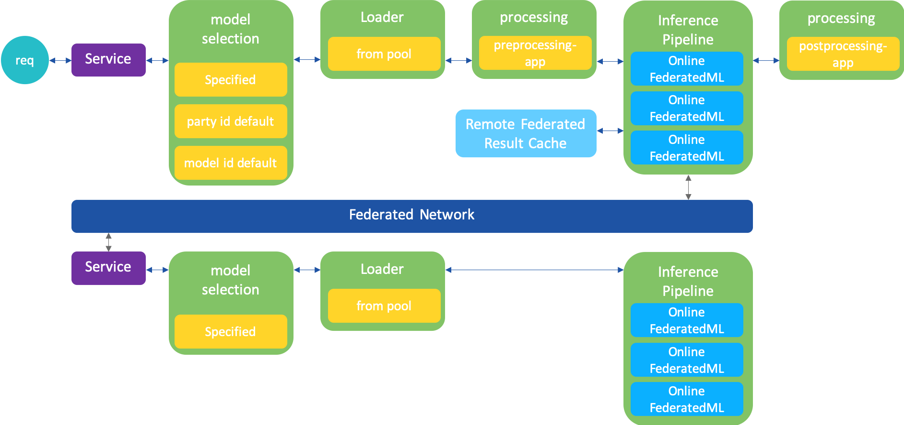
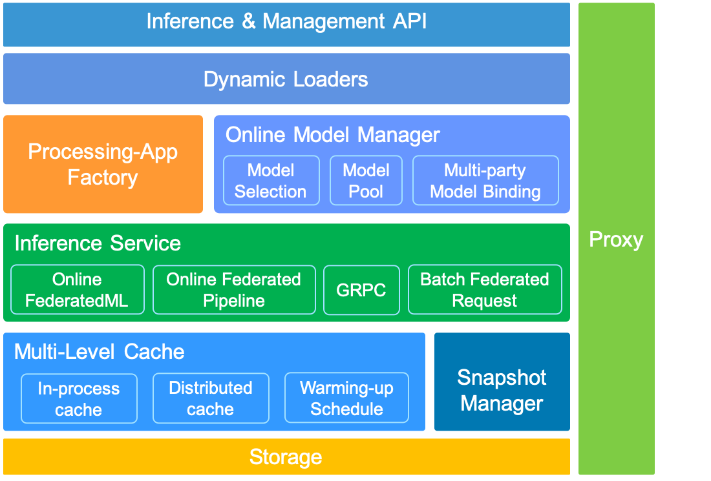

# FATE-Serving

## Introduction

FATE-Serving is a high-performance, industrialized serving system for federated learning models, designed for production environments.

### FATE-Serving now supports

- High performance online Federated Learning algorithms.
- Federated Learning online inference pipeline.
- Dynamic loading federated learning models.
- Can serve multiple models, or multiple versions of the same model.
- Support A/B testing experimental models.
- Real-time inference using federated learning models.
- Support multi-level cache for remote party federated inference result.
- Support pre-processing, post-processing and data-access adapters for the production deployment.


## Federated Learning Online Inference Pipeline




## Architecture




## Deploy
The code directory for FATE-Serving is ``FATE/fate-serving``, which contains three parts:

- fate-serving-core: base api for FATE-Serving.
- federatedml: high performance online Federated Learning algorithms. 
- serving-server: Federated Learning online inference service based on GRPC.

After the compilation is complete, the fate-serving-core and federatedml will be included in the lib, and the serving-server is included in the jar package.

FATE-Serving has two profiles, one is the log4j2.xml for log settings, another is serving-server.properties.


### serving-server.properties
Key configuration item description:

| Configuration item | Configuration item meaning | Configuration item value |
| - | - | - |
| ip | listen address for FATE-Serving | default 0.0.0.0 |
| port | listen port for the grpc server of FATE-Serving | default 8000 |
| workMode | the work mode of FATE-Flow | 0 for standalone, 1 for cluster |
| inferenceWorkerThreadNum | inference worker num for async inference | default 10 |
| standaloneStoragePath | the storage path of standalone EggRoll | generally is PYTHONPATH/data |
| remoteModelInferenceResultCacheSwitch | switch of remote model inference result cache storage | default true |
| proxy | the address of proxy | custom configuration |
| roll | the address of roll | custom configuration |
| OnlineDataAccessAdapter | data access adapter class for obtaining host feature data | default TestFile, read host feature data from ``host_data.csv`` on serving-server root directory |
| InferencePostProcessingAdapter| inference post-processing adapter class for dealing result after model inference | default pass |
| InferencePreProcessingAdapter | inference pre-processing adapter class for dealing guest feature data before model inference | default pass |


### Deploy Serving-Server
For detail, please refer to cluster deploy guide at [cluster-deploy](../cluster-deploy). 
Here are some key steps:

- Compile in the arch directory
- Compile in the fate-serving directory
- Create your serving directory by referring to the cluster-deploy/example-dir-tree/serving-server directory
- Copy fate-serving/serving-server/target/fate-serving-server-*.jar to serving-server directory
- Copy fate-serving/serving-server/target/lib to serving-server directory
- Copy fate-serving/serving-server/src/main/resources/* to serving-server/conf
- Modify the configuration file according to the actual situation
- Using the service.sh script to start/stop/restart


## Usage
FATE-Serving provide publish model and online inference API.

### Publish Model

Please use FATE-Flow Client which in the fate-flow to operate, refer to **Online Inference** guide at [fate_flow_readme](../fate_flow/README.md). 


### Inference

Serving currently supports three inference-related interfaces, using the grpc protocol.

- inference: Initiate an inference request and get the result
- startInferenceJob: Initiate an inference request task without getting results
- getInferenceResult: Get the result of the inference by caseid

```shell
python examples/inference_request.py ${sering_host}
```

please refer to this script for inference.


### Adapter

Serving supports pre-processing, post-processing and data-access adapters for the actural production.

- pre-processing: Data pre processing before model calculation
- post-processing: Data post processing after model calculation
- data-access: get feature from party's system

At the current stage, you need to put the java code to recompile, and later support to dynamically load the jar in the form of a release.

For now:

- push your pre-processing and post-processing adapter code into fate-serving/serving-server/src/main/java/com/webank/ai/fate/serving/adapter/processing and modify the InferencePreProcessingAdapter/InferencePostProcessingAdapter configuration parameters.
- push your data-access adapter code into fate-serving/serving-server/src/main/java/com/webank/ai/fate/serving/adapter/dataaccess and modify the OnlineDataAccessAdapter configuration parameters.

please refer to PassPostProcessing, PassPreProcessing, TestFile adapter.


### Remote party multi-level cache

For federal learning, one inference needs to be calculated by multiple parties. In the production environment, the parties are deployed in different IDCs, and the network communication between multiple parties is one of the bottleneck.

So, fate-serving supports caches multi-party model inference results on the initiator, but never caches feature data. you can turn the remoteModelInferenceResultCacheSwitch which in the configuration.