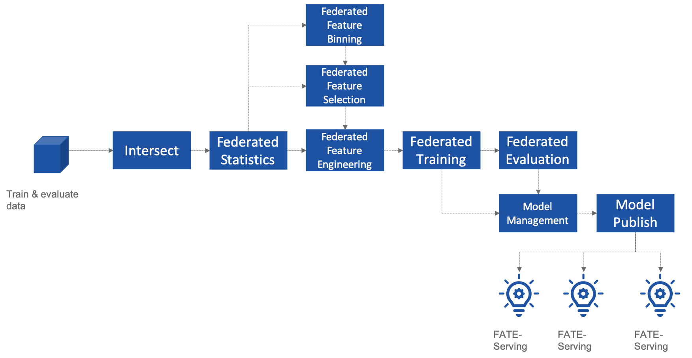
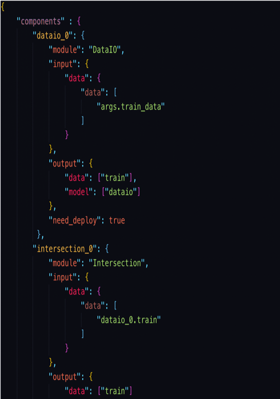

English | [中文](./README_zh.md)
# FATE-Flow
## Introduction
FATE-Flow is a end to end pipeline platform for Federated Learning. Pipeline is a sequence of components which is specifically designed for highly flexible, high performance federated learning tasks. That includes data processing, modeling, training, verification, publishing and serving inference.


### FATE-Flow Federated Learning Pipeline



### FATE-Flow now supports

- DAG define Pipeline
- Describe DAG using **FATE-DSL** in **JSON** format
- FATE has a large number of default federated learning components, such as Hetero LR/Homo LR/Secure Boosting Tree and so on.
- Developers can easily implement custom components using Basic-API and build their own Pipeline through DSL.
- Federated Modeling Task Life-cycle Manager, start/stop, status synchronization and so on.
- Powerful Federated Scheduler, support multiple scheduling strategies for DAG Job and Component Task.
- Real-time tracking of data, parameters, models, and metric during the experiment.
- Federated Model Manager, model binding, versioning and deployment tools.
- Provide HTTP API and Command Line Interface.
- Data and interface support for modeling visualization on **FATE-Board**.


## Build Pipeline
### DSL Example



### Write a DSL
Only one step is required to configure a component for pipeline.

- define the module of this component
- define the input, includes data, model or isometric_model(only be used for FeatureSelection)
- define the output, includes data and model


### Pipeline Run Example


## Architecture


## Deploy
Fate-flow is deployed in ``$PYTHONPATH/fate_flow/``. It depends on two configuration files: ``$PYTHONPATH/arch/conf/server.conf``, ``$PYTHONPATH/fate_flow/settings.py``


### server.conf
Server.conf configures the address of all FATE services. FATE-Flow of different deployment modes needs different fate services. For details, please refer to the following specific deployment mode.


### settings.py
Key configuration item description:

| Configuration item | Configuration item meaning | Configuration item value |
| - | - | - |
| IP | listen address for FATE-Flow | default 0.0.0.0 |
| GRPC_PORT | listen port for the grpc server of FATE-Flow | default 9360 |
| HTTP_PORT | listen port for the http server of FATE-Flow | default 9380 |
| WORK_MODE | the work mode of FATE-Flow | 0 for standalone, 1 for cluster |
| USE_LOCAL_DATA | ways to upload data  | True means use client data, False means use server data |
| USE_LOCAL_DATABASE | Whether to use a local database(sqlite) | False for no, True for yes |
| USE_AUTHENTICATION | Whether to enable authentication | False for no, True for yes |
| USE_CONFIGURATION_CENTER  | Whether to use zookeeper | False for no, True for yes |
| MAX_CONCURRENT_JOB_RUN | Pipeline jobs that are executed in parallel at the same time | default 5 |
| MAX_CONCURRENT_JOB_RUN_HOST | Maximum running jobs | default 10 |
| DATABASE | configuration for mysql database | custom configuration |
| REDIS | configuration for redis | custom configuration |
| REDIS_QUEUE_DB_INDEX | the redis db index of redis queue | default 0 |


### service.sh
Server start/stop/restart script

| Configuration item | Configuration item meaning | Configuration item value |
| - | - | - |
| PYTHONPATH | the python path | Absolute path to the parent directory of the FATE-Flow |
| venv | the python virtual environment | custom configuration, such as /data/projects/fate/venv, not /data/projects/fate/venv/bin/activate |


### Simple Standalone
You only need to start the FATE-Flow service to run the federated learning modeling experiment.

##### **Configuration**
| Configuration item | Configuration item value |
| - | - |
| WORK_MODE | 0 |
| USE_LOCAL_DATABASE | True |

##### **Features**
- Use **Sqlite** as database, db file is fate_flow_sqlite.db on the FATE-Flow root directory.
- Use in-process queue as job queue.
- Multi-Party communication loop back.


### Standard Standalone
You need to deploy three service:

- MySQL
- FATE-Flow
- FATE-Board

##### **Docker version**

FATE provides a standalone version of the docker for experience.please refer to docker version deploy guide at [docker-deploy](../standalone-deploy/docker).

##### **Configuration**
| Configuration item | Configuration item value |
| - | - |
| WORK_MODE | 0 |
| USE_LOCAL_DATABASE | False |
| DATABASE | configuration for mysql database | custom configuration |

##### **Features**
- Use **MySQL** as database.
- Use in-process queue as job queue.
- Multi-Party communication loop back.
- Support visualization by FATE-Board !


### Cluster
FATE also provides a distributed runtime architecture for Big Data scenario. Migration from standalone to cluster requires configuration change only. No algorithm change is needed. 
To deploy FATE on a cluster, please refer to cluster deploy guide at [cluster-deploy](./../cluster-deploy). 

##### **Configuration**
| Configuration item | Configuration item value |
| - | - |
| WORK_MODE | 1 |
| DATABASE | configuration for mysql database | custom configuration |
| REDIS | configuration for redis | custom configuration |

##### **Features**
- Use **MySQL** as database.
- Use **redis queue** as job queue.
- Multi-Party communication use **proxy**.
- Support visualization by FATE-Board !


## Usage
FATE-Flow provide [**REST API**](./doc/fate_flow_rest_api.md) and [**Command Line Interface**](./doc/fate_flow_cli.md). 
Let's start using the client to run a Federated Learning Pipeline Job example(**Standalone**).

### Offline Modeling
#### Upload Data(guest/host)
```bash
python fate_flow_client.py -f upload -c examples/upload_guest.json
python fate_flow_client.py -f upload -c examples/upload_host.json
```
#### Note 1:
The configuration item **USE_LOCAL_DATA** in FATE-Flow Server represents whether to use the data on the FATE-Flow client machine when uploading data, and the default is use(True).
If the configuration **USE_LOCAL_DATA** of FATE-Flow Server is set to **True**, and you still want to use the data on the machine where the FATE-Flow Server is located, you can change the Client's USE_LOCAL_DATA to False and add it to the upload configuration "**module**" parameter, the parameter value is not empty.
#### Note 2: 
When the cluster deployment uses the same table to upload data, it is necessary to carry the **drop** parameter (0 represents overwriting upload, 1 represents deleting the previous data and re-uploading)
```bash
python fate_flow_client.py -f upload -c examples/upload_guest.json -drop 0
```

#### Submit Job
```bash
python fate_flow_client.py -f submit_job -d examples/test_hetero_lr_job_dsl.json -c examples/test_hetero_lr_job_conf.json
```
Command response example:
```json
{
    "data": {
        "board_url": "http://localhost:8080/index.html#/dashboard?job_id=2019121910313566330118&role=guest&party_id=9999",
        "job_dsl_path": "xxx/jobs/2019121910313566330118/job_dsl.json",
        "job_runtime_conf_path": "xxx/jobs/2019121910313566330118/job_runtime_conf.json",
        "logs_directory": "xxx/logs/2019121910313566330118",
        "model_info": {
            "model_id": "arbiter-10000#guest-9999#host-10000#model",
            "model_version": "2019121910313566330118"
        }
    },
    "jobId": "2019121910313566330118",
    "retcode": 0,
    "retmsg": "success"
}

```
Some of the following operations will use these response information.

#### Query Job
```bash
python fate_flow_client.py -f query_job -r guest -p 10000 -j $job_id
```
And then, you can found so many useful command from [**CLI**](./doc/fate_flow_cli.md).

##### For more Federated Learning pipeline Job example, please refer at [**federatedml-1.x-examples**](./../examples/federatedml-1.x-examples) and it's [**README**](./../examples/federatedml-1.x-examples/README.md)


### Online Inference
Publish model to **FATE-Serving**, and then using Serving's GRPC API to inference. 

#### Modify service configuration
Modify the IP and end of **FATE-Serving** in **arch/conf/server_conf.json** (please note that many parties need to modify the actual deployment address of their respective **FATE-Serving**), the content is "servings ":["ip: port"], restart **FATE-Flow** after modification.
server_conf.json format is as follows:
```json
{
	"servers": {
		"servings": [
			"127.0.0.1:8000"
		]
	}
}
```

#### Publish Model
```bash
python fate_flow_client.py -f load -c examples/publish_load_model.json
```
Please replace the corresponding configuration in ``publish_load_model.json`` with your job configuration.
After that, you can make online inference request to FATE-Serving by specifying the model id and model version used.

#### Publish Model Online Default
```bash
python fate_flow_client.py -f bind -c examples/bind_model_service.json
```
Please replace the corresponding configuration in ``publish_online_model.json`` with your job configuration.
After that, the FATE-Serving uses the configuration you provided to set the party's default model id and the default model version that involves the model id.
And then, will you can make online inference request to FATE-Serving by only specifying the party_id or the model id.


## Logs
#### FATE-Flow Server log
``$PYTHONPATH/logs/fate_flow/``

#### Job log
``$PYTHONPATH/logs/$job_id/``


## FAQ

#### What is the role of FATE FLOW in the FATE?
- FATE Flow is a scheduling system that schedules the execution of algorithmic components based on the DSL of the job submitted by the user.


#### ModuleNotFoundError: No module named "arch"
- Set PYTHONPATH to the parent directory of fate_flow.


#### Why does the task show success when submitting the task, but the task fails on the dashboard page?
- Submit success just means that the job was submitted and not executed. If the job fails, you need to check the log. 
- You can view the logs through the board.


#### What meaning and role do the guest, host, arbiter, and local roles represent in fate?
- Arbiter is used to assist multiple parties to complete joint modeling. Its main role is to aggregate gradients or models. For example, in vertical lr, each party sends half of its gradient to arbiter, and then arbiter jointly optimizes, etc.
- Guest represents the data application party.
- Host is the data provider.
- Local refers to local, only valid for upload and download.


#### Error about“cannot find xxxx” when killing a waiting job
- Fate_flow currently only supports kill on the job initiator, kill will report "cannot find xxx".


#### What is the upload data doing?

- Upload data is uploaded to eggroll and becomes a DTable format executable by subsequent algorithms.


#### How to download the generated data in the middle of the algorithm?
- You can use ``python fate_flow_client.py -f component_output_data -j $job_id -r $role -p $party_id -cpn $component_name -o $output_path``


#### If the same file upload is executed twice, will fate delete the first data and upload it again?
- It will be overwritten if the keys are the same in the same table.


#### What is the reason for the failure of this job without error on the board?
- The logs in these places will not be displayed on the board:```$job_id/fate_flow_schedule.log```, ``logs/error.log``, ``logs/fate_flow/ERROR.log`` .


#### What is the difference between the load and bind commands? 
- Load can be understood as a model release, and bind is the default model version.
