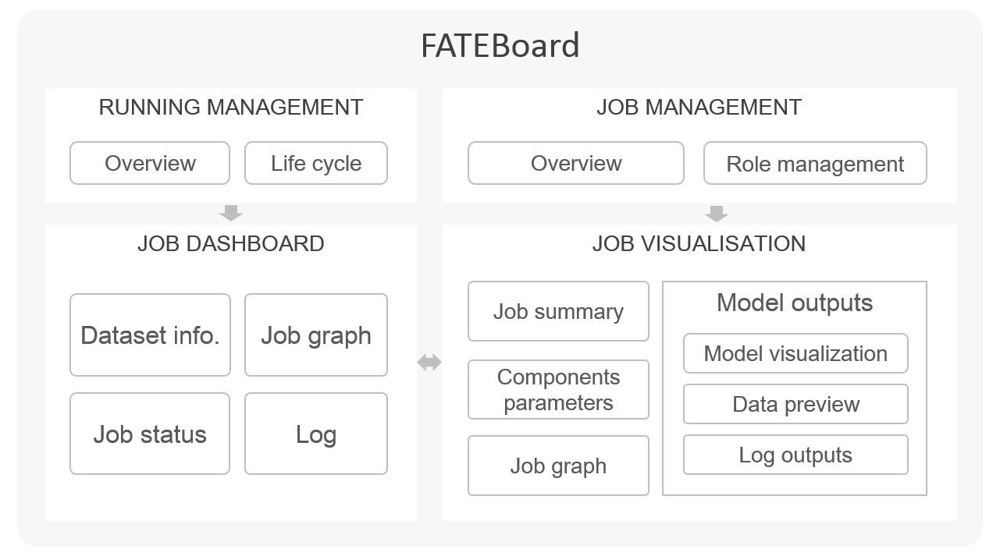
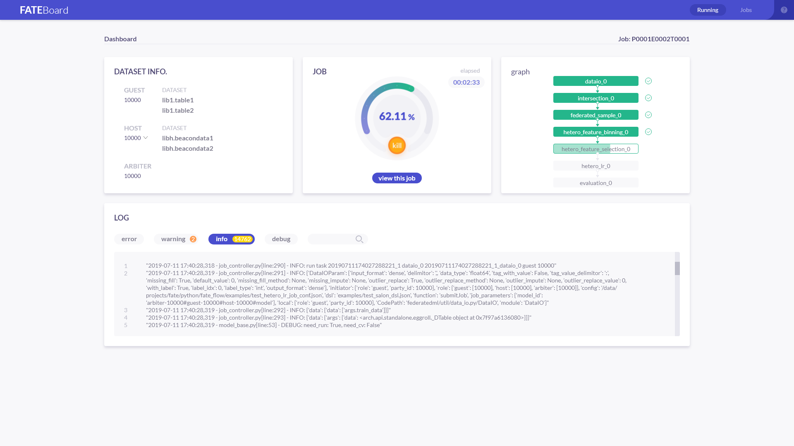
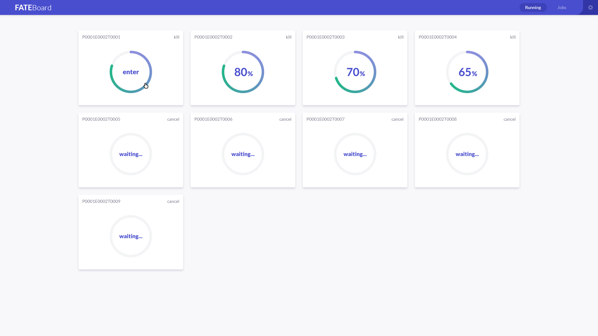
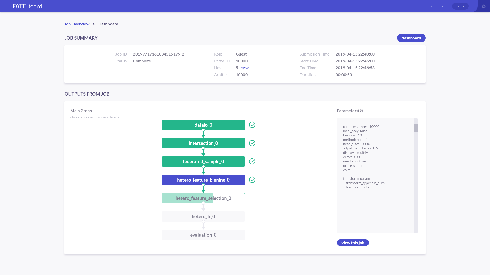

FATE-Board as a suite of visualization tool for federated learning modeling designed to deep explore models and understand models easily and effectively. 

To make it easier to understand, track, debug, and explore federated learning modeling, as well as examine, evaluate, and compare various federation learning models. FATEBoard provides a visual way to probe models, from which you can reshape and improve models efficiently.

# **Deploy** #

The FATE stand-alone version has been integrated with FATEBoard, and users just follow the steps indicated on the home page to launch the relevant components instead of configuring additional information.

In a distributed environment, FATEBoard needs to be deployed through cluster automated deployment script rather than individually, which you need to configure some information about the cluster, such as URL of FATEFlow, directory of log files, SSH information of each machine, etc. All the configuration information could be generated automatically using automated script deployment. If the information is not filled in correctly, it will not work properly.

# **Usage** #

**Starting FATEBoard** 

The FATEBoard source code uses the spring-boot framework and the embedded tomcat container. The default web port provided is 8080. Before starting, it is necessary to check whether port 8080 of the machine is already occupied. If the port is occupied, FATEBoard will fail to start.

FATEBoard gets job list through accessing MySQL database. If the database is not installed properly, the job list query will fail.
FATEBoard access FATEFlow through HTTP protocol. If FATEFlow is not started properly, FATEBoard will not display charts.

You can access FATEBoard by visiting http://{fateboard-ip}:8080.

**Starting a new job** 

1. Preparing a job: you should configure a pipeline, create graph, and define parameters. 
2. Launching FATEBoard: submit the job and get started, returning a job URL. Click the URL to view the job on web. Alternatively, once the job is running, you can navigate your web browser to http://{fateboard-ip}:8080 to view the FATEBoard.
Host or arbiter can also access the FATEBoard through http://{fateboard-ip}:8080.
3. Monitoring the job: dashboard visualizes the whole running progress.
4. Viewing the job outputs: you may view visual model outputs, model scores, and model logs for each component.

FATEBoard can be used in Google Chrome, IE (10.0 and above) and other mainstream browsers. Some browsers might work, but there may be bugs or performance issues.

# **The Visualizations** #

**Job Dashboard** 

FATEBoard’s dashboard visualizes basic statistics that vary over time, which include running time of job, real-time Log of job, running status for each component. Once you submit your job, you may have to wait for it to run. You can check the RUNNING page to see the progress of all running jobs and all waiting jobs.

**Job Visualization**

Job visualization provides overviews of the overall execution of the job, visualizes all the results as much as possible. There are some simple interactions as following:

- Clicking on component and you can see the parameters
- Clicking on the button under the parameter and you can see the model outputs
- Switching tabs to see model output, data output, and log
- Mousing over the chart in the model output will produce dynamic vertical reference line, with data values displayed.

**Visualizing the job workflow**

The job workflow of federated learning modeling is easy to understand, which can help you track the running progress intuitively. For each role, you may see your own graph in the federated learning modeling. 

**Visualizing the model graph**

FATEBoard provides different visualizations for federated learning models, including statistical table, histograms, curves, confusion matrices, and so on. You can compare the performance of multiple training models on the same dataset, or inspect a single model’s performance for continued tuning and training, which all probe your models better.

Take evaluation as an example:

For Binary Classification job, FATEBoard shows an evaluation score chart, a ROC curve, a K-S curve, a Lift curve, a Gains curve, a Precision-Recall curve, and an accuracy curve.For Multiclass classification job, FATEBoard shows an evaluation score chart, and a Precision-Recall curve.For Regression job, FATEBoard shows an evaluation score chart.
If a validate set was provided for the job, then evaluation curves are presented separately according to train set and validate set. Evaluation curves of different model training are presented together for model performance comparison, as well as model validation.

**Visualizing the data**

Preview the data of each component and you can view 100 lines of output data, from which you can also see the prediction data, including prediction result, prediction score and prediction detail.

# **FAQ** #

**My FATEBoard isn’t showing any data of components!** 

FATEBoard sends a request to access FATEFlow via HTTP to obtain all the data needed by a model. Log of httpclient is defined separately in the logback.xml in the source code, through which you can check communication between FATEBoard and FATEFlow, and you can easily locate the problem if there is an exception.

**My FATEBoard isn’t showing any log！**

FATEBoard gets the list of jobs and details by querying MySQL. 
In a stand-alone environment, Fateboard reads the local log file and returns it to the user through WebSocekt. If the log file cannot be displayed, you can first check whether the local log file has been generated.
In a clustered environment, FATEBoard could access log files on different machines with SSH, and push them to the browser through WebSocket. The default log lookup path is /data/projects/fate/python/logs/. If you cannot view the logs, it may be an error in SSH information in the cluster. you can set the correct SSH information by clicking the button in the upper right corner of the page.
