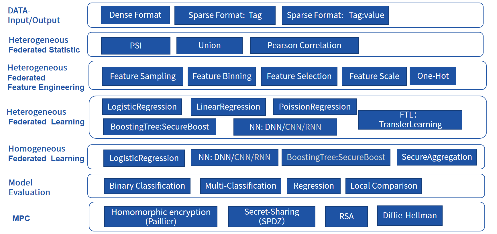

# 联邦机器学习

Federatedml模块包括许多常见机器学习算法联邦化实现。 所有模块均采用去耦的模块化方法开发，以增强模块的可扩展性。 具体来说，我们提供：

1. 联邦统计: 包括隐私交集计算，并集计算，皮尔逊系数等

2. 联邦特征工程：包括联邦采样，联邦特征分箱，联邦特征选择等。

3. 联邦机器学习算法：包括横向和纵向的联邦LR, GBDT， DNN，迁移学习等

4. 模型评估：提供对二分类，多分类，回归评估，联邦和单边对比评估

5. 安全协议：提供了多种安全协议，以进行更安全的多方交互计算。

 

   
  Figure 1： Federated Machine Learning Framework

## 算法清单

1. [DataIO](./util/README.md)

该组件通常是建模任务的第一个组件。 它将用户上传的数据转换为Instance对象，该对象可用于以下组件。

+ 对应模块名称：DataIO
+ 数据输入：DTable，值为原始数据
+ 数据输出：转换后的数据表，值为在`federatedml/feature/instance.py`中定义的Data Instance的实例

2. [Intersect](./statistic/intersect/README.md)

计算两方的相交数据集，而不会泄漏任何差异数据集的信息。 主要用于纵向任务。

+ 对应模块名称：Intersection
+ 数据输入：DTable
+ 数据输出：两方DTable中相交的部分

3. [Federated Sampling](./feature/README.md)

对数据进行联邦采样，使得数据分布在各方之间变得平衡。这一模块同时支持单机和集群版本。

+ 对应模块名称：FederatedSample
+ 数据输入：DTable
+ 数据输出：采样后的数据，同时支持随机采样和分层采样

4. [Feature Scale](./feature/README.md)

特征归一化和标准化。

+ 对应模块名称：FeatureScale
+ 数据输入：DTable，其值为instance
+ 数据输出：转换后的DTable
+ 模型输出：变换系数，例如最小值/最大值，平均值/标准差

5. [Hetero Feature Binning](./feature/README.md)

使用分箱的输入数据，计算每个列的iv和woe，并根据合并后的信息转换数据。

+ 对应模块名称：Hetero Feature Binning
+ 数据输入：DTable，在guest中有标签y，在host中没有标签y
+ 数据输出：转换后的DTable
+ 模型输出：每列的iv/woe，分裂点，事件计数，非事件计数等

6. [OneHot Encoder](./feature/README.md)

将一列转换为One-Hot格式。

+ 对应模块名称：OneHotEncoder
+ 数据输入：DTable
+ 数据输出：转换了带有新列名的DTable
+ 模型输出：原始列名和特征值到新列名的映射

7. [Hetero Feature Selection](./feature/README.md)

提供多种类型的filter。每个filter都可以根据用户配置选择列。

+ 对应模块名称：HeteroFeatureSelection
+ 数据输入：DTable
+ 模型输入：如果使用iv filters，则需要hetero_binning模型
+ 数据输出：转换的DTable具有新的header和已过滤的数据实例
+ 模型输出：每列是否留下

8. [Union](./statistic/union/README.md)

将多个数据表合并成一个。

+ 对应模块名称：Union
+ 数据输入：DTables
+ 数据输出：多个Dtables合并后的Dtable

9. [Hetero-LR](./linear_model/logistic_regression/README.md)

通过多方构建纵向逻辑回归模块。

+ 对应模块名称：HeteroLR
+ 数据输入：DTable
+ 模型输出：Logistic回归模型

10. [Local Baseline](./local_baseline/README.md)

使用本地数据运行sklearn Logistic回归模型。

+ 对应模块名称：LocalBaseline
+ 数据输入：DTable
+ 模型输出：Logistic回归

11. [Hetero-LinR](./linear_model/linear_regression/README.md)

通过多方建立纵向线性回归模块。

+ 对应模块名称：HeteroLinR
+ 数据输入：DTable
+ 模型输出：线性回归模型

12. [Hetero-Poisson](./linear_model/poisson_regression/README.md)

通过多方构建纵向泊松回归模块。

+ 对应模块名称：HeteroPoisson
+ 数据输入：DTable
+ 模型输出：泊松回归模型

13. [Homo-LR](./linear_model/logistic_regression/README.md)

通过多方构建横向逻辑回归模块。

+ 对应模块名称：HomoLR
+ 数据输入：DTable
+ 模型输出：Logistic回归模型

14. [Homo-NN](./nn/homo_nn/README.md)

通过多方构建横向神经网络模块。

+ 对应模块名称：HomoNN

+ 数据输入：DTable
+ 模型输出：神经网络模型

15. [Hetero Secure Boosting](./tree/README.md)

通过多方构建纵向Secure Boost模块。

+ 对应模块名称：HeteroSecureBoost
+ 数据输入：DTable，其值为instance
+ 模型输出：SecureBoost模型，由模型本身和模型参数组成

16. [Evaluation](./evaluation/README.md)

为用户输出模型评估指标。

+ 对应模块名称：Evaluation

17. [Hetero Pearson](./statistic/correlation/README.md)

计算来自不同方的特征的纵向关联。

+ 对应模块名称：HeteroPearson

18. [Hetero-NN](./nn/hetero_nn/README.md)
构建纵向神经网络模块。

+ 对应模块名称：HeteroNN

+ 数据输入：DTable
+ 模型输出：纵向神经网络模型

### 安全协议
#### 1. [同态加密](./secureprotol/README.md)

- Paillier 同态加密
- Affine 同态加密
- IterativeAffine 同态加密

#### 2. [秘密共享](./secureprotol/README.md)

- SPDZ

#### 3. [Diffie Hellman密钥交换](./secureprotol/README.md)

#### 4. [RSA](./secureprotol/README.md)
