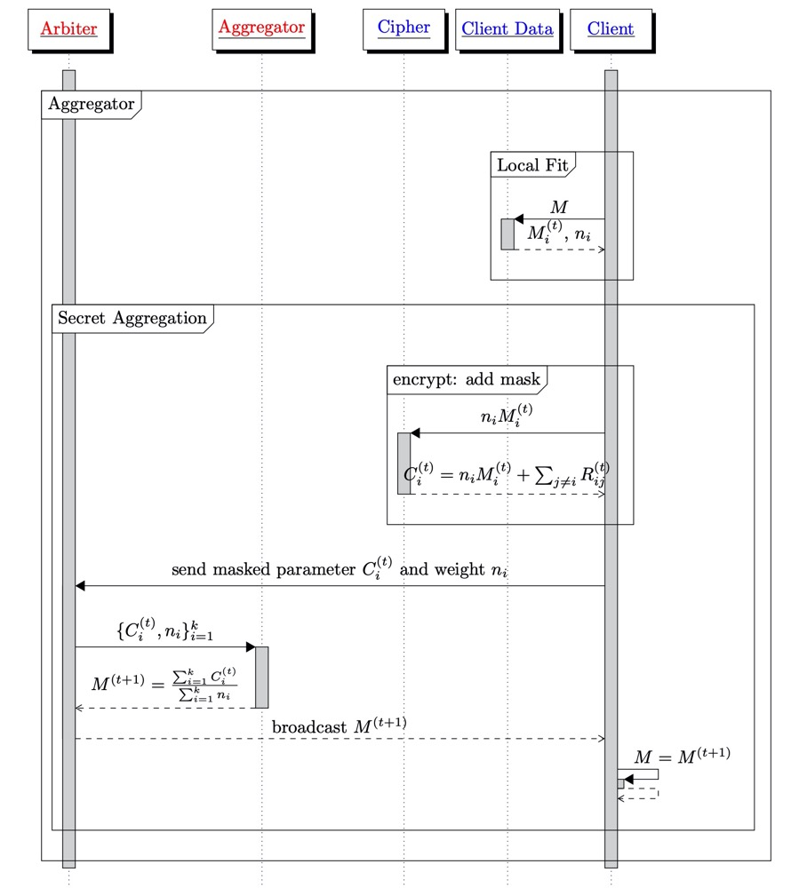

### Homo Framework

This module provides tools to help us implement homogeneous federated learning algorithms. Two levels of abstraction are provided:

1. sync: implement communication interaction in a logically independent process, witch could be reused sin different procedure.
2. procedure: use syncs to describe high-level logical. 

#### procedure
FATE currently offers three prerequisite modules:

1. aggregator: Implements model aggregation, loss aggregation, and convergence checking. This is the main processes of homogeneous federated learning.
2. random_padding_cipher: Implements the model's encryption process, including uuid synchronization, random seed generation based on dh key exchange and cipher generation.
3. paillier_cipher: Used by Home-LR, mainly about paillier secret protocol.
##### aggregator
<br/>

aggregator.py response for model aggregation:

Arbiter:
```python
>>> from federatedml.framework.homo import aggregator
>>> agg = aggregator.Arbiter()
>>> agg.register_aggregator(transfer_variables)
>>> agg.aggregate_and_broadcast()
```

Guest:
```python
>>> from federatedml.framework.homo import aggregator
>>> agg = aggregator.Guest()
>>> agg.register_aggregator(transfer_variables)
>>> agg.aggregate_then_get(model, degree)
```


##### random_padding_cipher
<br/>

random_padding_cipher.py create a cipher for each client(Guest/Host):

Arbiter:
```python
>>> from federatedml.framework.homo.procedure import random_padding_cipher
>>> cipher = random_padding_cipher.Arbiter()
>>> cipher.register_random_padding_cipher(transfer_variables)
>>> cipher.exchange_secret_keys()
```

Client:(Guest/Host):
```python
>>> from federatedml.framework.homo.procedure import random_padding_cipher
>>> cipher = random_padding_cipher.Guest() # or Host()
>>> cipher.create_cipher()
>>> # use cipher to encrypt weights
>>> print(cipher.encrypt(transfer_weights)) 
```

##### paillier_cipher
<br/>

paillier_cipher.py create a cipher for hosts:

Arbiter:
```python
>>> from federatedml.framework.homo.procedure import paillier_cipher
>>> cipher = random_padding_cipher.Arbiter()
>>> cipher.register_paillier_cipher(transfer_variables)
>>> host_ciphers = cipher.paillier_keygen(key_length=1024)
>>> re_ciphre_times = cipher.set_re_cipher_time(host_ciphers)
>>> for iter_num in range(...):
        cipher.re_cipher(iter_num=iter_num,
                         re_encrypt_times=re_ciphre_times,
                         host_ciphers_dict=host_ciphers,
                         re_encrypt_batches=re_encrypt_batches)
```

Host:
```python
>>> from federatedml.framework.homo.procedure import paillier_cipher
>>> cipher = random_padding_cipher.Host()
>>> cipher.register_paillier_cipher(transfer_variables)
>>> cipher.gen_paillier_pubkey(enable)
>>> cipher.set_re_cipher_time(re_encrypt_times)
>>> for iter_num in range(...):
        for batch_num in xxx:
            cipher.re_cipher(w=w, 
                             iter_num=iter_num,
                             batch_iter_num=batch_num)
```

#### sync

##### dh_keys_exchange_sync

Do Diffie–Hellman key exchange.

Arbiter:
```python
>>> from federatedml.framework.homo.sync import dh_keys_exchange_sync
>>> dh = dh_keys_exchange_sync.Arbiter()
>>> dh.register_dh_key_exchange(...)
>>> dh.key_exchange()
```

Client:
```python
>>> from federatedml.framework.homo.sync import dh_keys_exchange_sync
>>> dh = dh_keys_exchange_sync.Client()
>>> dh.register_dh_key_exchange(...)
>>> share_secret = dh.key_exchange(uuid)
>>> print(share_secret)
```

##### identify_uuid_sync

Generate uuid for each client.

Arbiter:
```python
>>> from federatedml.framework.homo.sync import identify_uuid_sync
>>> uuid_sync = identify_uuid_sync.Arbiter()
>>> uuid_sync.register_identify_uuid(...)
>>> uuid_sync.validate_uuid()
```

Client:
```python
>>> from federatedml.framework.homo.sync import identify_uuid_sync
>>> uuid_sync = identify_uuid_sync.Client()
>>> uuid = uuid_sync.generate_uuid(...)
>>> print(uuid)
```

##### is_converge_sync

Checking convergence status.

Arbiter:
```python
>>> from federatedml.framework.homo.sync import is_converge_sync
>>> conv = is_converge_sync.Arbiter()
>>> conv.register_is_converge(...)
>>> is_converge = conv.check_converge_status()
```

Client:
```python
>>> from federatedml.framework.homo.sync import is_converge_sync
>>> conv = is_converge_sync._Client()
>>> conv.register_is_converge(...)
>>> is_converge = conv.get_converge_status()
```

##### loss_transfer_sync

Send losses to arbiter.

Arbiter:
```python
>>> from federatedml.framework.homo.sync import loss_transfer_sync
>>> loss_sync = loss_transfer_sync.Arbiter()
>>> loss_sync.register_loss_transfer(...)
>>> losses = loss_sync.get_losses()
```

Client:
```python
>>> from federatedml.framework.homo.sync import loss_transfer_sync
>>> loss_sync = loss_transfer_sync._Client()
>>> loss_sync.register_loss_transfer(...)
>>> losses = loss_sync.send_loss(loss)
```

##### model_broadcast_sync

Braodcast model to clients.

Arbiter:
```python
>>> from federatedml.framework.homo.sync import model_broadcast_sync
>>> model_bc = model_broadcast_sync.Arbiter()
>>> model_bc.register_model_broadcaster(...)
>>> model_bc.send_model(model)
```

Client:
```python
>>> from federatedml.framework.homo.sync import model_broadcast_sync
>>> model_bc = model_broadcast_sync.Client()
>>> model_bc.register_model_broadcaster(...)
>>> model = model_bc.get_model()
```

##### model_scatter_sync

Send models to Arbiter

Arbiter:
```python
>>> from federatedml.framework.homo.sync import model_scatter_sync
>>> model_st = model_scatter_sync.Arbiter()
>>> model_st.register_model_scatter(...)
>>> models = model_st.get_models()
```

Client:
```python
>>> from federatedml.framework.homo.sync import model_scatter_sync
>>> model_st = model_scatter_sync._Client()
>>> model_st.register_model_scatter(...)
>>> model_st.send_model(weights)
```

##### paillier_keygen_sync

Create Pallier ciphers

Arbiter:
```python
>>> from federatedml.framework.homo.sync import paillier_keygen_sync
>>> keygen = paillier_keygen_sync.Arbiter()
>>> keygen._register_paillier_keygen(...)
>>> host_ciphers = keygen.paillier_keygen(key_length=1024)
```

Host:
```python
>>> from federatedml.framework.homo.sync import paillier_keygen_sync
>>> keygen = paillier_keygen_sync.Host()
>>> keygen._register_paillier_keygen(...)
>>> keygen.gen_paillier_pubkey(enable=enable)
```

##### paillier_re_cipher_sync

Send weights to arbiter for re-encrypt.
Arbiter:
```python
>>> from federatedml.framwork.homo.sync import paillier_re_cipher_sync
>>> re_cipher = paillier_re_cipher_sync.Arbiter()
>>> re_cipher._register_paillier_re_cipher(...)
>>> re_cihper_time = re_cipher.set_re_cipher_time(host_cipher)
>>> re_cipher.re_cipher(iter_num=..., re_cipher_time=re_cipher_time, host_cipher_dict=host_cipher, re_encrypt_batches=...)
```

Host:
```python
>>> from federatedml.framwork.homo.sync import paillier_re_cipher_sync
>>> re_cipher = paillier_re_cipher_sync.Host()
>>> re_cipher._register_paillier_re_cipher(...)
>>> re_cipher.set_re_cipher_time(...)
>>> re_cipher.re_cipher(w=model, iter_num=..., batch_iter_num=...)
```

