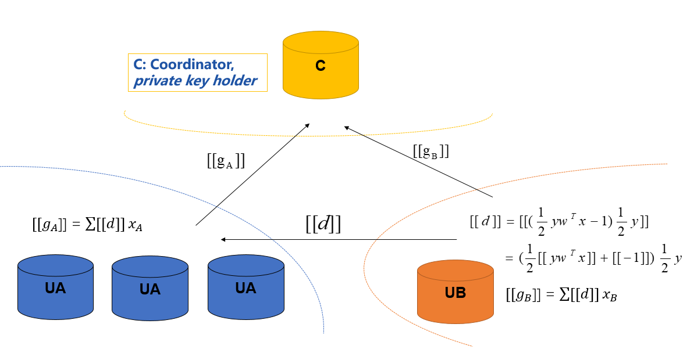

# Federated Logistic Regression

Logistic Regression(LR) is a widely used statistic model for classification problems. FATE provided two kinds of federated LR: Homogeneous LR (HomoLR) and Heterogeneous LR (HeteroLR). 

We simplified the federation process into three parties. Party A represents Guest， party B represents Host while party C, which also known as "Arbiter", is a third party that holds a private key for each party and work as a coordinator. 
 
## 1. Homogeneous LR 

As the name suggested, in HomoLR, the feature spaces of guest and hosts are identical. An optional encryption mode for computing gradients is provided for host parties. By doing this, the plain model is not available for this host any more. 

 
Figure 1： Federated HomoLR Principle
 

The HomoLR process is shown in Figure 1. Models of Party A and Party B have the same structure.
In each iteration, each party trains its model on its own data. After that, all parties upload their encrypted (or plain, depends on your configuration) gradients to arbiter. The arbiter aggregates these gradients to form a federated gradient that will then be distributed to all parties for updating their local models. Similar to traditional LR, the training process will stop when the federated model converges or the whole training process reaches a predefined max-iteration threshold. More details is available in this [paper](https://dl.acm.org/citation.cfm?id=3133982)

## 2. Heterogeneous LR 

The HeteroLR carries out the federated learning in a different way. As shown in Figure 2, A sample alignment process is conducted before training. This sample alignment process is to identify overlapping samples stored in databases of the two involved parties. The federated model is built based on those overlapping samples. The whole sample alignment process will **not** leak confidential information (e.g., sample ids) on the two parties since it is conducted in an encrypted way. Check out [paper](https://arxiv.org/abs/1711.10677) for more details. 

 

 
Figure 2： Federated HeteroLR Principle

In the training process, party A and party B compute out the elements needed for final gradients. Arbiter aggregate them and compute
out the gradient and then transfer back to each party. Check out the [paper](https://arxiv.org/abs/1711.10677) for more details.

### Multi-host hetero-lr

For multi-host scenario, the gradient computation still keep the same as single-host case. However, we use the second-norm of the difference of model weights between two consecutive iterations as the convergence criterion. Since the arbiter can obtain the completed model weight, the convergence decision is happening in Arbiter.

 

 
Figure 3： Federated Multi-host HeteroLR Principle

## Features

Both Homo-LR and Hetero-LR supports the following features:

1. L1 & L2 regularization
2. Mini-batch mechanism
3. Weighted training
4. Five optimization method:
    a)	“sgd”: gradient descent with arbitrary batch size
    b) “rmsprop”: RMSProp
    c) “adam”: Adam
    d) “adagrad”: AdaGrad
    e) “nesterov_momentum_sgd”: Nesterov Momentum
    f) "sqn": stochastic quansi-newton. The algorithm details can refer to [this paper](https://arxiv.org/abs/1912.00513v2)
5. Three converge criteria:
    a) "diff": Use difference of loss between two iterations, not available for multi-host training;
    b) "abs": use the absolute value of loss;
    c) "weight_diff": use difference of model weights
6. Support multi-host modeling task. The detail configuration for multi-host modeling task is located [Here](../../../doc/dsl_conf_setting_guide.md)
7. Support validation for every arbitrary iterations
8. Learning rate decay mechanism

Homo-LR support the following extra features:
1. Two Encryption mode
    a) "Paillier" mode: Host will not get clear text model. When using encryption mode, "sgd" optimizer is supported only.
    b) Non-encryption mode: Everything is in clear text.
2. Secure aggregation mechanism used when more aggregating models
3. Support aggregate for every arbitrary iterations.

Hetero-LR support the following extra features:
1. Support different encrypt-mode to balance speed and security
2. Support OneVeRest
3. When modeling a multi-host task, "weight_diff" converge criteria is supported only.
4. Support sparse format data
