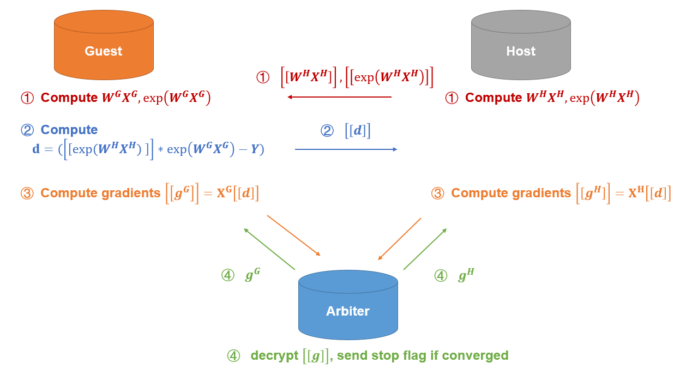

# Federated Poisson Regression

Poisson distribution is a convenient model for modeling occurrences within a certain time period or geographical area. It is commonly used for predicting rates of low-frequency events. FATE provides Heterogeneous Poisson Regression(HeteroPoisson). The module can accept data with exposure variable, whose column name may be specified in job configuration file. Please refer to the [examples](../../../examples/federatedml-1.x-examples/hetero_poisson_regression) on how to specify exposure element in job configuration.

Here we simplify participants of the federation process into three parties. Party A represents Guest, party B represents Host. Party C, which is also known as “Arbiter,” is a third party that works as coordinator. Party C is responsible for generating private and public keys.

## Heterogeneous Poisson

The process of HeteroPoisson training is shown below:

 
Figure 1： Federated HeteroPoisson Principle

A sample alignment process is conducted before training. The sample alignment process identifies overlapping samples in databases of all parties. The federated model is built based on the overlapping samples. The whole sample alignment process is conducted in encryption mode, and so confidential information (e.g. sample ids) will not be leaked.

In the training process, party A and party B each compute the elements needed for final gradients. Arbiter aggregates, calculates, and transfers back the final gradients to corresponding parties. Arbiter also decides at the end of each iteration whether the model has converged, based on the stopping criteria set by Guest.

## Features 

1. L1 & L2 regularization
2. Mini-batch mechanism
3. Five optimization methods:
    a)	“sgd”: gradient descent with arbitrary batch size
    b) “rmsprop”: RMSProp
    c) “adam”: Adam
    d) “adagrad”: AdaGrad
    e) “nesterov_momentum_sgd”: Nesterov Momentum
4. Three converge criteria:
    a) "diff": Use difference of loss between two iterations
    b) "abs": Use the absolute value of loss
    c) "weight_diff": Use difference of model weights
5. Support use of exposure variable. Guest party may specify "exposure_colname" in the job configuration file
6. Support validation for every arbitrary iterations
7. Learning rate decay mechanism

## Notes on Training

The performance of poisson regression is highly dependent on model meta and the underlying distribution of given data. We provide here some suggestions on modeling:

1. The module uses log link function. We suggest that you start with large penalty scale and/or small learning step. For example, setting alpha to 100 and learning rate to 0.01.
2. We suggest that you initialize model weights at 0 when learning rate is small.
3. The current version of HeteroPoisson module does not support multi-host, but it will accept weight difference as a stopping criteria.
4. The current version does not support over-dispersion term.