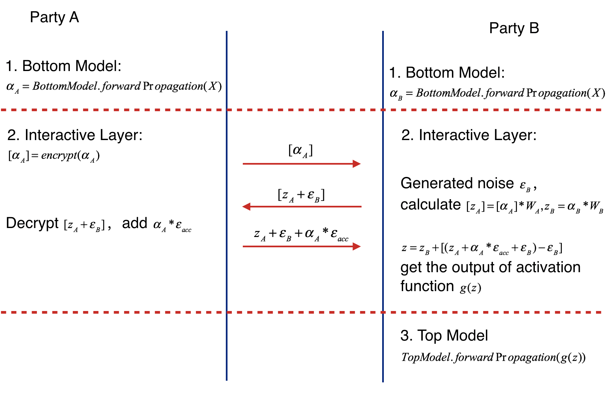

# Heterogeneous  Neural Networks 

Neural networks are probably the most popular machine learning algorithms in recent years. FATE provides a federated Heterogeneous neural network implementation.

This federated heterogeneous neural network framework allows a learning process to be jointly conducted over multiple parties with partially 
common user samples but different feature sets, which corresponds to a vertically partitioned virtual data set. An 
advantage of Hetero NN is that it provides the same level of accuracy as the non privacy-preserving approach while 
at the same time, reveal no information of each private data provider.

 
## 1. Basic FrameWork

The following figure shows the proposed Federated Heterogeneous Neural Network framework.

 
Figure 1: Framework of Federated Heterogeneous Neural Network/div>

Active Party: We define the active party as the data provider who holds both a data matrix and the class label. 
Since the class label information is indispensable for supervised learning, there must be an active party with access to the label y. 
The active party naturally takes the responsibility as a dominating server in federated learning. 

Passive Party: We define the data provider which has only a data matrix as a passive party. 
Passive parties play the role of clients in the federated learning setting. They are also in need of building a model to predict the class label y for their prediction purposes. 
Thus they must collaborate with the active party to build their model to predict y for their future users using their own features.

We align the data samples under an encryption scheme by using the privacy-preserving protocol for inter-database intersections 
to find the common shared users or data samples across the parties without compromising the non-shared parts of the user sets.

In general, active party and passive party both have their own bottom neural network model, which may be different.
The parties jointly build the interactive layer, this layer's input is the concatenation of the two parties' bottom input, and it's a fully connected layer. 
In addition, only active party owns the model of interactive layer. Lastly, the active party builds the top neural network model and feeds the output of interactive layer to it.

## 2. Forward Propagation of Federated Heterogeneous Neural Network 
Forward Propagation Process consists of three parts.

Part Ⅰ: Forward Propagation of Bottom Model.
1. Passive party feeds its input features X to its bottom model and get the forward output of bottom model alpha_P
2. Active Party feeds its input features X to its bottom model and get the forward output of bottom model  alpha_A if active party has input features.

Part ⅠⅠ: Forward Propagation of Interactive Layer.
1. Passive party uses additive homomorphic encryption to encrypt alpha_P(mark as [alpha _P] ), and sends the encrypted result to Active Party.

2. Active Party receives the [alpha_P], multiply it by interactive layer's passive party model weight W_P, get [z_P].  
   Active party also multiply interactive layer's active party by its own bottom output, get z_A.  
   Active party generates noise epsilon_A, adds it to [z_P] and sends addition result to Passive party.
   
3. Passive party calculates the product of accumulate noise epsilon_acc and bottom input alpha_P (epsilon_acc * alpha_P). Decrypting the receiving result [z_P + epsilon_A], add the product to it and sends to Active party.

4. Active party subtracts the Passive party's message by epsilon_A( get z_P + epsilon_acc * alpha_P), and feeds z = z_P + epsilon_acc * alpha_P + z_A(if exists) to activation function. 

Part ⅠⅠⅠ: Forward Propagation of Interactive Layer.
1. Active party takes the output of activation function's output of interactive layer g(z) and runs the forward process of top model.

The following figure shows the forward propagation of Federated Heterogeneous Neural Network framework.

 
Figure 2: Forward Propagation of Federated Heterogeneous Neural Network/div>

## 3. Backward Propagation of Federated Heterogeneous Neural Network 

Backward Propagation Process also consists of three parts.

Part I: Backward Propagation of Top Model.
1. Active party calculates the interactive layer output' error delta, then updates top model.

Part II: Backward Propagation of Interactive layer.
1. Active party calculates the error delta_act of activation function's output by delta.  
2. Active party propagates delta_bottomA = delta_act * W_A to bottom model, Update W_A(W_A -= eta * delta_act * alpha_A).
3. Active party generates noise epsilon_A, calculates [delta_act * (W_P + epsilon_A] and sends it to Passive party.
4. Passive party encrypts epsilon_acc, sends [epsilon_acc] to Active party.  
   Then decrypts the receiving message, generates noise epsilon_P, adds epsilon_P / eta to decrypt result(delta_act * W_P + epsilon_A + epsilon_P / eta) and epsilon_P to ecc(epsilon_P += epsilon_P), sends the addition result to Active party. (delta_act * W_P + epsilon_A + epsilon_P / eta)  
5. Active party receives [epsilon_acc] and delta_act * W_P + epsilon_A + epsilon_P / eta. Firstly it sends passive party's bottom model output' error [alpha_P * W_P + acc] to host. 
   Secondly updates W_P -= eta * (delta_act * W_P + epsilon_A + epsilon_P / eta) - epsilon_A = eta * delta_act * W_P - epsilon_P = W_TRUE - epsilon_acc. Where W_TRUE is the actually weights.  
6. Passive party decrypts [alpha_P * (W_P + acc)] and passes alpha_P * (W_P + acc) to its bottom model.

Part III: Backward Propagation of Interactive layer.
1. Active party and Passive party updates their bottom model separately.

The following figure shows the backward propagation of Federated Heterogeneous Neural Network framework.

 
Figure 3: Backward Propagation of Federated Heterogeneous Neural Network/div>
   
  

