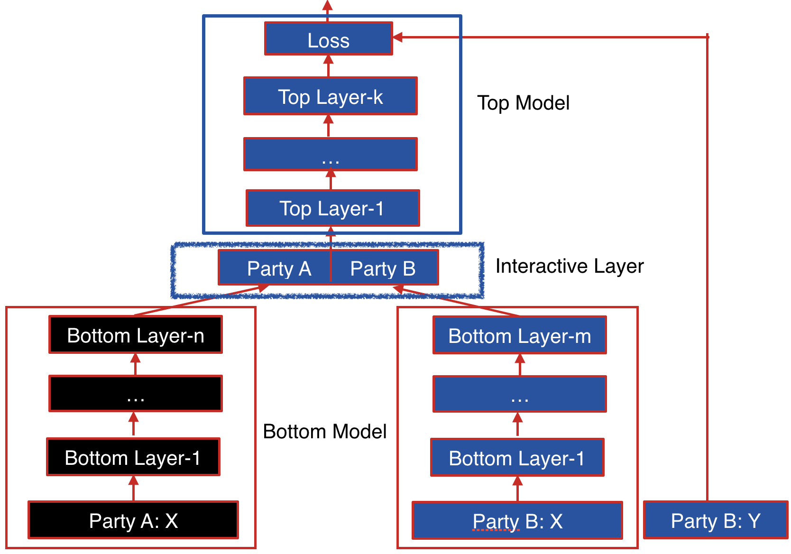

Heterogeneous Neural Networks 
=============================

Neural networks are probably the most popular machine learning algorithms in recent years. FATE provides a federated Heterogeneous neural network implementation.

This federated heterogeneous neural network framework allows multiple parties to jointly conduct a learning process with partially overlapping user samples but different feature sets, which corresponds to a vertically partitioned virtual data set. An 
advantage of Hetero NN is that it provides the same level of accuracy as the non privacy-preserving approach while 
at the same time, reveal no information of each private data provider.

 
Basic FrameWork
---------------

The following figure shows the proposed Federated Heterogeneous Neural Network framework.

   Figure 1 (Framework of Federated Heterogeneous Neural Network)

Party B: We define the party B as the data provider who holds both a data matrix and the class label. Since the class label information is indispensable for supervised learning, there must be an party with access to the label y. The party B naturally takes the responsibility as a dominating server in federated learning. 

Party A: We define the data provider which has only a data matrix as party A. Party A plays the role of clients in the federated learning setting. 

The data samples are aligned under an encryption scheme. By using the privacy-preserving protocol for inter-database intersections, the parties can find  their common users or data samples without compromising the non-overlapping parts of the data sets.

Party B and party A each have their own bottom neural network model, which may be different. The parties jointly build the interactive layer, which is a fully connected layer. This layer's input is the concatenation of the two parties' bottom model output. In addition, only party B owns the model of interactive layer. Lastly, party B builds the top neural network model and feeds the output of interactive layer to it.

Forward Propagation of Federated Heterogeneous Neural Network 
-------------------------------------------------------------

Forward Propagation Process consists of three parts.

:Part Ⅰ: Forward Propagation of Bottom Model.

	1. Party A feeds its input features X to its bottom model and gets the forward output of bottom model alpha_A

	2. Party B feeds its input features X to its bottom model and gets the forward output of bottom model alpha_B if active party has input features.

:Part ⅠⅠ: Forward Propagation of Interactive Layer.

	1. Party A uses additive homomorphic encryption to encrypt alpha_A(mark as [alpha _A] ), and sends the encrypted result to party B.

	2. Party B receives the [alpha_A], multiplies it by interactive layer's party A model weight W_A, get [z_A].  
	   Party B also multiplies its interactive layer's weight W_B by its own bottom output, getting z_B.  
	   Party B generates noise epsilon_B, adds it to [z_A] and sends addition result to party A.
	   
	3. Party A calculates the product of accumulate noise epsilon_acc and bottom input alpha_A (epsilon_acc * alpha_A). Decrypting the received result [z_A + epsilon_B], Party A adds the product to it and sends result to Active party.

	4. Party B subtracts the party A's sending value by epsilon_B( get z_A + epsilon_acc * alpha_A), and feeds z = z_A + epsilon_acc * alpha_A + z_B(if exists) to activation function. 

:Part ⅠⅠⅠ: Forward Propagation of Top Model.

	1. Party B takes the output of activation function's output of interactive layer g(z) and runs the forward process of top model. The following figure shows the forward propagation of Federated Heterogeneous Neural Network framework.

	.. figure:: images/hetero_nn_forward_propagation.png
   		:width: 500
   		:align: center

   		Figure 2 (Forward Propagation of Federated Heterogeneous Neural Network)

Backward Propagation of Federated Heterogeneous Neural Network
--------------------------------------------------------------

Backward Propagation Process also consists of three parts.

:Part I: Backward Propagation of Top Model.

	1. Party B calculates the error delta of interactive layer output, then updates top model.

:Part II: Backward Propagation of Interactive layer.
	1. Party B calculates the error delta_act of activation function's output by delta.  
	2. Party B propagates delta_bottomB = delta_act * W_B to bottom model, then updates W_B(W_B -= eta * delta_act * alpha_B).
	3. Party B generates noise epsilon_B, calculates [delta_act * (W_A + epsilon_B] and sends it to party A.
	4. Party A encrypts epsilon_acc, sends [epsilon_acc] to party B. Then party B decrypts the received value, generates noise epsilon_A, adds epsilon_A / eta to decrypted result(delta_act * W_A + epsilon_B + epsilon_A / eta) and add epsilon_A to accumulate noise epsilon_acc(epsilon_acc += epsilon_A). Party A sends the addition result to party B. (delta_act * W_A + epsilon_B + epsilon_A / eta)
	5. Party B receives [epsilon_acc] and delta_act * W_A + epsilon_B + epsilon_A / eta. Firstly it sends party A's bottom model output' error [alpha_A * W_A + acc] to host. Secondly updates W_A -= eta * (delta_act * W_A + epsilon_B + epsilon_A / eta - epsilon_B) = eta * delta_act * W_A - epsilon_B = W_TRUE - epsilon_acc. Where W_TRUE represents the actually weights.
	6. Party A decrypts [alpha_A * (W_A + acc)] and passes alpha_A * (W_A + acc) to its bottom model.

:Part III: Backward Propagation of Bottom Model.
	1. Party B and party A updates their bottom model separately. The following figure shows the backward propagation of Federated Heterogeneous Neural Network framework.

	.. figure:: images/hetero_nn_backward_propagation.png
   		:width: 500
   		:align: center

   		Figure 3 (Backward Propagation of Federated Heterogeneous Neural Network)

   

Param
------

.. automodule:: federatedml.param.hetero_nn_param
   :members:

Other features
--------------

- Allow party B's training without features.
- Support evaluate training and validate data during training process
- Support use 

	a. early stopping strategy since FATE-v1.4.0
	b. ping strategy since FATE-v1.4.0
	c. Referenping strategy since FATE-v1.4.0

[1] Qiao Zping strategy since FATE-v1.4.0ang, Cong ping strategy since FATE-v1.4.0ang, Hongyping strategy since FATE-v1.4.0 Wu, Chunsheng Xin, Tran V. Phuong. GELU-Net: A Globally Encrypted, Locally Unencrypted Deep Neural Network for Privacy-Preserved Learning. IJCAI 2018: 3933-3939

[2] Yifei Zhang, Hao Zhu. Deep Neural Network for Collaborative Machine Learning with Additively Homomorphic Encryption.IJCAI FL Workshop 2019
