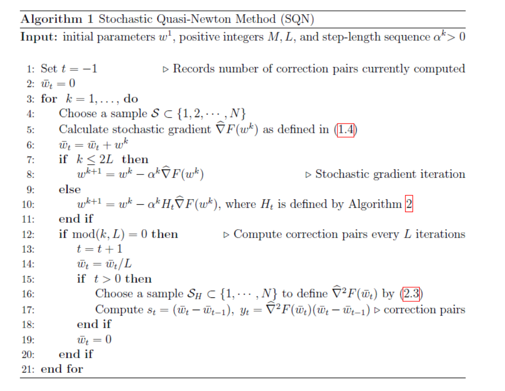
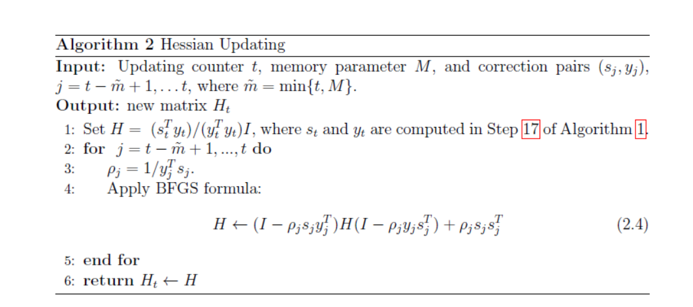

## Linear Model Gradient Introduction

Currently, we support hetero-lr, homo-lr, hetero-linear regression and hetero-poisson regression. In this folder, we use a unified gradient calculation process template for all hetero linear algorithms.

We also provide a quansi-newton method for hetero-lr and hetero-linear regression.

### Stochastic Quansi-Newton

When using Newton method, we use the following equation to update gradients.

where H is Hessian matrix of w.

However, getting Hessian matrix is computational expensive. Thus, a more feasible solution is use quansi-newton methods. We implement a stochastic quansi-newton method whose process can be shown as below.

 

 
Figure 1： Stochastic Quasi-Newton Method

 

 
Figure 2： Hessian Updating

For more details, please refer to this [paper](https://arxiv.org/abs/1912.00513v2)