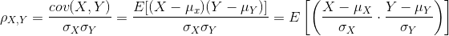
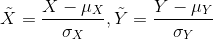
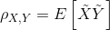

### Heterogeneous Pearson Correlation Coefficient

#### Introduction
Pearson Correlation Coefficient is a measure of the linear correlation between two variables, X and Y, defined as,

Let 

then,

#### Implementation Detail
We use an MPC protocol called SPDZ for Heterogeneous Pearson Correlation Coefficient calculation. 
For more details, one can refer to [README](../../secureprotol/README.md).

#### How to Use
- params
    1. column_indexes: -1 or list of int. If -1 provided, all columns are used for calculation. If a list of int provided, columns with given indexes are used for calculation.
    2. column_names: names of columns use for calculation.
    Notice that, if both params are provided, the union of columns indicated are used for calculation.  

- examples
    There is an example [conf](../../../examples/federatedml-1.x-examples/hetero_pearson/test_conf.json) 
    and [dsl](../../../examples/federatedml-1.x-examples/hetero_pearson/test_conf.json).