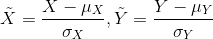

Heterogeneous Pearson Correlation Coefficient
=============================================

Introduction
------------

Pearson Correlation Coefficient is a measure of the linear correlation between two variables, X and Y, defined as,

.. figure:: img/pearson.png
   	:align: center

Let 

then,

.. figure:: img/rewrited.png
   	:align: center

Implementation Detail
---------------------

We use an MPC protocol called SPDZ for Heterogeneous Pearson Correlation Coefficient calculation. 
For more details, one can refer to `[README]. <../../secureprotol/README.rst>`_

Param
------

.. automodule:: federatedml.param.pearson_param
   :members:

How to Use
----------

:params:

    :column_indexes: -1 or list of int. If -1 provided, all columns are used for calculation. If a list of int provided, columns with given indexes are used for calculation.
    
    :column_names: names of columns use for calculation. 
    
    .. Note::

    	if both params are provided, the union of columns indicated are used for calculation.  

:examples:
    There is an example :download:`[conf] <../../../examples/federatedml-1.x-examples/hetero_pearson/test_conf.json>` and :download:`[dsl] <../../../examples/federatedml-1.x-examples/hetero_pearson/test_conf.json>`