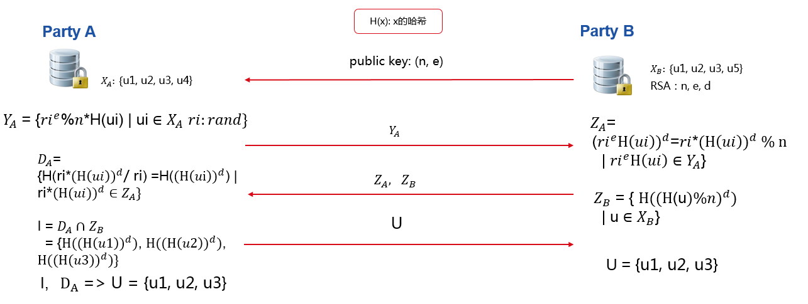
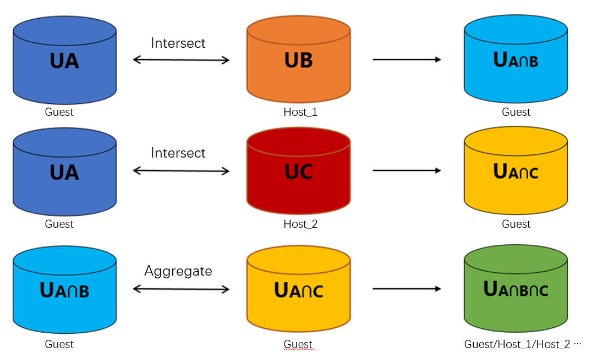

Intersection
============

This module provide some method of PSI(Private Set Intersection)

RSA Intersection
----------------

This folder contains code for implementing algorithm based on [`RSA Intersection`__]. This work is built on FATE, eggroll and federation API that construct the secure, distributed and parallel infrastructure.

.. __: https://books.google.com.hk/books?id=zfvf37_YS8cC&pg=PA73&lpg=PA73&dq=rsa+commutative+encryption&source=bl&ots=LbOiyIlr3E&sig=IIWlTGeoU0C8dRiN10uH2OAwobQ&hl=zh-CN&sa=X&ved=0ahUKEwiLoozC1tbXAhVDnJQKHbP7DvAQ6AEIdTAJ#v=onepage&q&f=false.

Our Intersection module is trying to solve the problem that Privacy-Preserving Entity Match. This module will help at least two parties to find the same user ids without leaking all their user ids
to the other. This is illustrated in :ref:`figure 1`.

   Figure 1 (RSA Intersection between party A and party B)

In :ref:`figure 1` ,Party A has user id u1,u2,u3,u4, while Party B has u1,u2,u3,u5. After Intersection,
party A and party B know their same user ids, which are u1,u2,u3, but party A know nothing about
other user ids of party B, like u5, and party B know nothing about party A except u1,u2,u3 as well.
While party A and party B transmit their processed id information to the other party, like :math:`Y-A` and :math:`Z-B`,
it will not leak any raw ids. :math:`Z-B` can be safe because of the privacy key of party B.
Each :math:`Y-A` includes different random value which binds to each value in :math:`X-A` and will be safe as well.

Using this module, we can get the intersection ids between two parties in security and efficiently.  

RAW Intersection
----------------

This intersection module implements the simple intersection method that A or B as a sender will sends all his ids to another, and another one 
will find the sample ids according to it's ids. Finally it will send the intersection ids to the sender.

Multi-Host Intersection
-----------------------

Both rsa and raw intersection support multi-host. It means a guest can do intersection with more than one host simultaneously and finally get the common ID with all hosts. 

   Figure 2 (multi-hosts Intersection)

See in :ref:`figure 2`, this is a introduction to a guest intersect with two hosts, and it is the same as more than two hosts. Firstly, guest will intersect with each host and get overlapping IDs respectively. Secondly, guest will find common IDs from all intersection results. Finally,
guest will send common IDs to every host if necessary.

Repeated ID intersection
------------------------

We support repeated id intersection for some applications. For this case, one should provide the mask id which map to the repeated ids.   
For instances, in Guest, your data is
::

   mask_id, id, value
   alice_1, alice, 2
   alice_2, alice, 3
   bob, bob, 4

In Host, you data is
::

   id, value
   alice, 5
   bob, 6

After intersecting, guest will get the intersection results:  
::

   mask_id, value
   alice_1, 2
   alice_2, 3
   bob, 4

And in host:
::

   id, value
   alice_1, 5
   alice_2, 5
   bob, 4

This switch is "repeated_id_process" in the parameter of intersection, set it to true if you want to use this function.

Param
------

.. automodule:: federatedml.param.intersect_param
   :members:

Feature
-------

Both RSA and RAW intersection supports the following features:

1. Support multi-host modeling task. The detail configuration for multi-host modeling task is located `here. <../../../doc/dsl_conf_setting_guide.rst>`_

2. Repeated ID intersection using ID expanding.

RSA intersection support the following extra features:

1. RSA support cache to speed up.

RAW intersection support the following extra features:

1. RAW support some encoders like md5 or sha256 to make it more safely.
