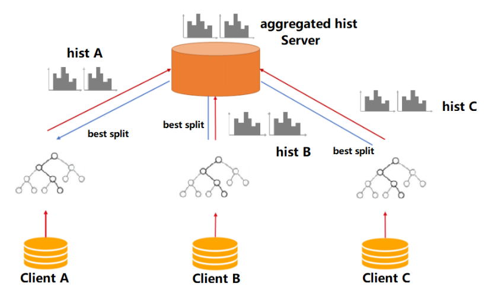
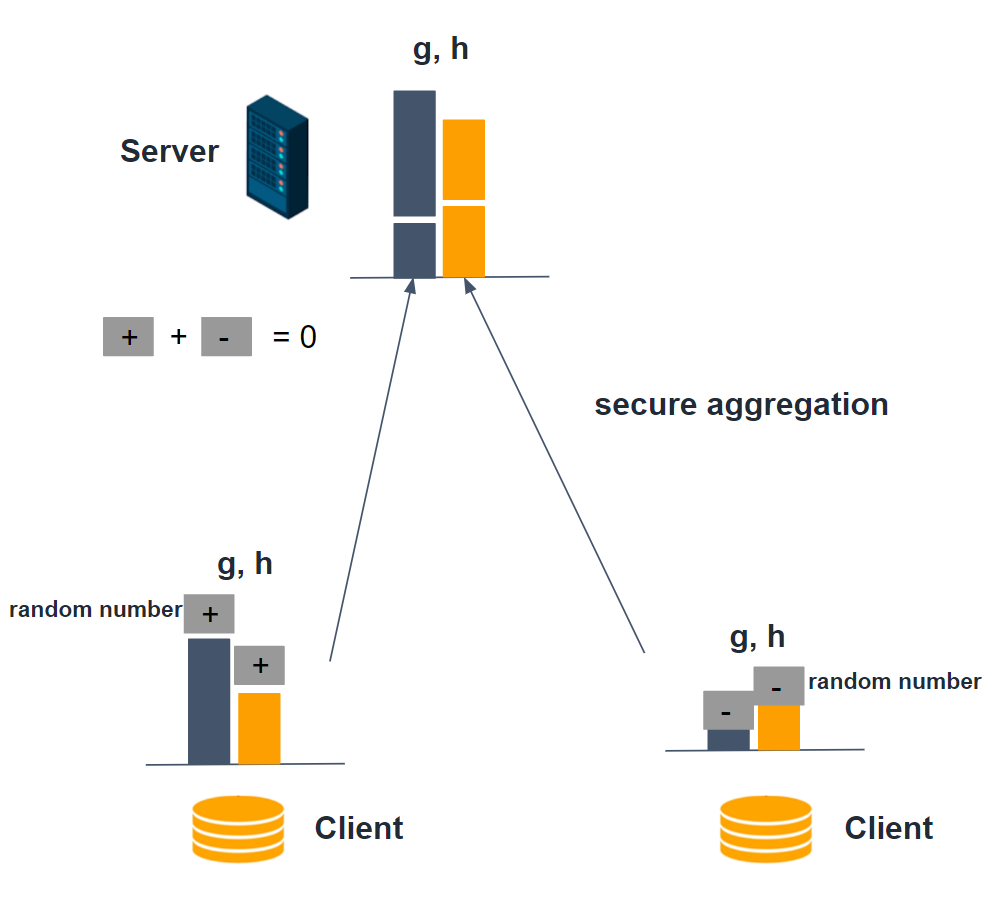
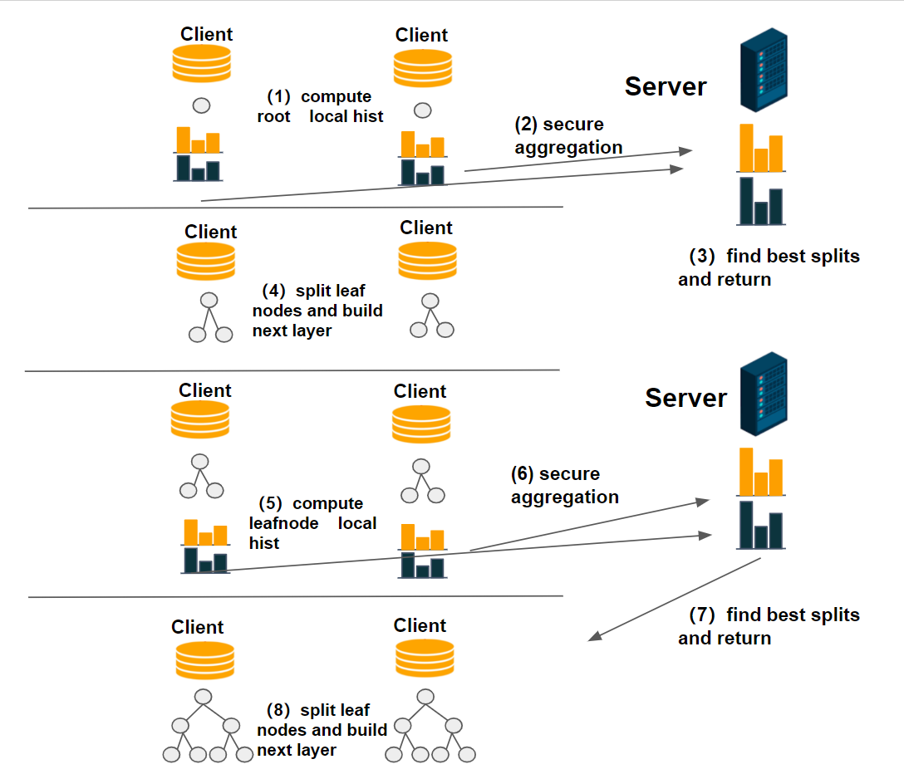

## Tree Models

### Hetero SecureBoost
Gradient Boosting Decision Tree(GBDT) is a widely used statistic model for classification and regression problems. 
FATE has provided a novel lossless privacy-preserving tree-boosting system known as [SecureBoost: A Lossless Federated Learning Framework](https://arxiv.org/abs/1901.08755).

This federated learning system allows a learning process to be jointly conducted over multiple parties with partially 
common user samples but different feature sets, which corresponds to a vertically partitioned virtual data set. An 
advantage of SecureBoost is that it provides the same level of accuracy as the non privacy-preserving approach while 
at the same time, reveal no information of each private data provider.

The following figure shows the proposed Federated SecureBoost framework.

 
Figure 1: Framework of Federated SecureBoost

Active Party:
We define the active party as the data provider who holds both a data matrix and the class label.
Since the class label information is indispensable for supervised learning, there must be an active party with access 
to the label y. The active party naturally takes the responsibility as a dominating server in federated learning.

Passive Party:
We define the data provider which has only a data matrix as a passive party.
Passive parties play the role of clients in the federated learning setting. They are also in need of building a model 
to predict the class label y for their prediction purposes. Thus they must collaborate with the active party to 
build their model to predict y for their future users using their own features.

We align the data samples under an encryption scheme by using the privacy-preserving protocol for inter-database 
intersections to find the common shared users or data samples across the parties without compromising the 
non-shared parts of the user sets.

To ensure security, passive parties cannot get access to gradient and hessian directly. 
We use a "XGBoost" like tree-learning algorithm. In order to keep gradient and hessian confidential, we require the active party to 
encrypt gradient and hessian before sending them to passive parties. After encrypted the gradient and hessian, active party will
send the encrypted [[gradient]] and [[hessian]] to passive party, the passive party use [[gradient]] and [[hessian]] to calculate the 
encrypted feature histograms, then encodes the (feature, split_bin_val) and construct a (feature, split_bin_val) lookup table, 
sends the encode value of (feature, split_bin_val) with feature histograms to active party. 
After receiving the feature histograms from passive party, the active party decrypt them and find the best gains, if the feature belongs to passive party, 
send back the encode (feature, split_bin_val) to passive party.
The following figure shows the process of federated split finding. 

 
Figure 2: Process of Federated Split Finding

The parties continue the split finding process until finishing constructed the tree. 
Each party only knows the detailed split information of the tree nodes where the split features belong to its data. 
The following figure shows the final structure of a single decision tree.

 
Figure 3: A Single Decision Tree

To use the learned model to classify a new instance, firstly the active party judge if current tree node belongs to it or not.
IF the current tree belongs to active party, then it can use its (feature, split_bin_val) lookup table to decide going to left child node of right,
otherwise, the active party sends the node id to designated passive party, the passive party looks at its lookup table and sends back to active party which branch should the current node goes to.
This process stops until the current node is a leave. 
The following figure shows the federated inference process.

 
Figure 4: Process of Federated Inference

By following the SecureBoost framework, multiple parties can jointly build tree ensembled model without leaking privacy 
in federated learning. If you want to learn more about the algorithm details, you can read the paper attached above.

#### Optimization in Parallel Learning
SecureBoost use data parallel learning algorithm to build the decision trees in every party.  
The procedure of the data parallel algorithm in each party is:  
* Every party use mapPartitions API interface to generate feature-histograms of each partition of data.
* Use reduce API interface to merge global histograms from all local feature-histograms
* Find the best splits from merged global histograms by federated learning, then perform splits.

#### Applications
Hetero secureboost supports the following applications.  
* binary classification, the objective function is sigmoid cross-entropy  
* multi classification, the objective function is softmax cross-entropy
* regression, objective function now support is least-squared-error-loss、least-absolutely-error-loss、huber-loss、
tweedie-loss、fair-loss、 log-cosh-loss

#### Other features
* Column sub-sample
*  Controlling the number of nodes to split parallelly at each layer by setting max_split_nodes parameter，in order to avoid memory limit exceeding
* Support feature importance calculation
* Support Multi-host and single guest to build model
* Support different encrypt-mode to balance speed and security
* Support missing value in train and predict process
* Support evaluate training and validate data during training process
* Support another homomorphic encryption method called "Iterative Affine" since FATE-1.1 

### Homo Secureboost

Unlike Hetero Secureboost, Homo secureboost is conducted under a different setting. 
In homo secureboost, every participant(clients) holds data that shares the same feature space, and jointly train a 
GBDT model without leaking any data sample.

The figure below shows the overall framework of the homo secureboost algorithm.

 
Figure 1: Framework of Homo SecureBoost

Client:
Clients are the participants who hold their labeled samples. Samples from all client parties have the same feature space. 
Participants have the demand for building a more powerful model together without leaking local samples, 
and they share the same trained model after learning.  

Server:
There are potentials of data leakage if all participants send its local histogram(which contains sum 
of gradient and hessian) to each other because sometimes features and labels can be inferred from gradient sums and hessian sums.
Thus, to ensure security in the learning process, the Server uses secure aggregation to aggregate all participants' local histograms 
in a safe manner. 
The server can get a global histogram while not getting any local histogram and then find and broadcast the best splits to clients. 
Server collaboratives with all clients in the learning process. 

The key steps of learning a homo secureboost model are described below:

* Clients and the server initialize local settings. Clients and the server apply homo feature binning to get binning 
  points for all features and then to pre-process local samples. 
  
* Clients and Server build a decision tree collaboratively:

    (1) Clients compute local histograms for cur leaf nodes (left nodes or root node)
    
    (2) The server applies secure aggregations: every local histogram plus a random number, and these numbers can cancel 
    each other out. By this way server can get the global histogram without knowing any local histograms and data 
    leakage is prevented. Figure below shows how histogram secure aggregations are conducted.
    
    

    
     
    Figure 2: Secure aggregation

    
    (3) The server commit histogram subtractions: getting the right node histograms by subtracting left node local 
    histogram from parent node histogram. Then, the server will find the best splits points and broadcast them to
    clients.
    
    (4) After getting the best split points, clients build the next layer for the current decision tree and 
    re-assign samples. 
    If current decision 
    tree reaches the max depth or stop conditions are fulfilled, stop build the current tree, else go back to step (1).
    
    Figure below shows the procedure of fitting a decision tree.
    
    

    
     
    Figure 3: Example of bulding a two-layer homo-decision tree.

    
* If tree number reach the max number, or loss is converged, stop fitting homo secureboost.

By follwing the steps above clients are able to jointly build a GBDT model together. After getting the model, every 
client can conduct inference to predict a new instance locally. 

#### Optimization in learning
Homo secureboost utilizes data parallelization and histogram subtraction to accelerate the learning process.
* Every party use mapPartitions and reduce API interface to generate local feature-histograms, 
only samples in left nodes are used in computing feature histograms.
* The server aggregates all local histograms to get global histograms then get sibling histograms by subtracting left 
node histograms from parent histograms.
* The server 
finds the best splits from merged global histograms, then broadcast best splits.
* The computational cost and transmission cost are halved by using node subtraction.

#### Applications
homo secureboost supports the following applications.  
* binary classification, the objective function is sigmoid cross-entropy  
* multi classification, the objective function is softmax cross-entropy
* regression, objective function now support is least-squared-error-loss、least-absolutely-error-loss、huber-loss、
tweedie-loss、fair-loss、 log-cosh-loss

#### Other features
* The server uses safety aggregations to aggregate clients' histograms and losses, ensuring the data security
* Column sub-sample
* Controlling the number of nodes to split parallelly at each layer by setting max_split_nodes parameter，in order to avoid memory limit exceeding
* Support feature importance calculation
* Support Multi-host and single guest to build model
* Support missing value in train and predict process
* Support evaluate training and validate data during training process

