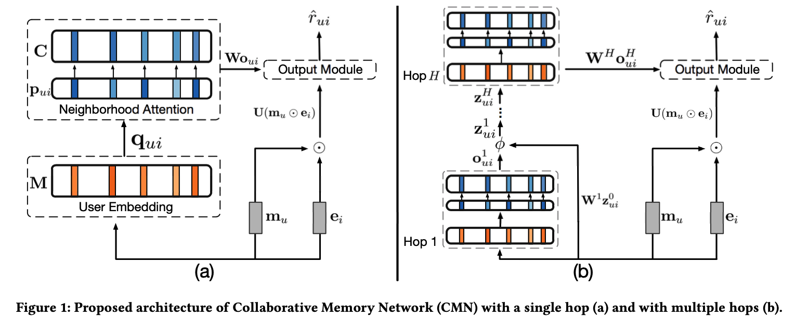
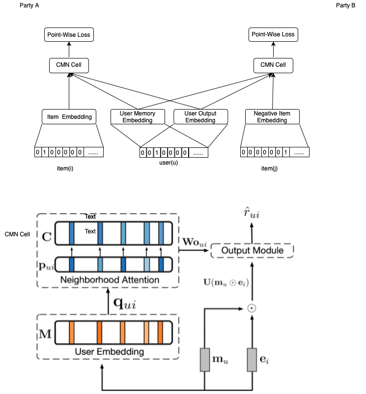

# Federated Collaborative Memory Network 

Collaborative Memory Network (CMN) is a popular deep neural networks approach applied in recommendation system. It proposed a deep architecture to unify the two classes of CF models capitalizing on the strengths of the global structure of latent factor model and local neighborhood-based structure in a nonlinear fashion. Motivated by the success of Memory Networks, it fused a memory component and neural attention mechanism as the neighborhood component. The associative addressing scheme with the user and item memories in the memory module encodes complex user-item relations coupled with the neural attention mechanism to learn a user-item specific neighborhood.

CMN was proposed in SIGIR ’18: The 41st International ACM SIGIR Conference on Research & Development in Information Retrieval, July 8–12, 2018, Ann Arbor, MI, USA. ACM, New York, NY, USA, 10 pages. https: //doi.org/10.1145/3209978.3209991.
 
In FATE, we implement an Federated CMN algorithm using these cross-party user embeddings, while each party retains own items embeddings, then exchange their user embedding under encryption to get better performance. 

Here we simplify participants of the federation process into three parties. Party A represents Guest, party B represents Host. Party C, which is also known as “Arbiter,” is a third party that works as coordinator. Party C is responsible for generating private and public keys.

## Heterogeneous CMN

The inference process of HeteroCMN is shown below:

 
Figure 1： Collaborative Memory Network

 
Figure 2： Federated Collaborative Memory Network

Hetero MF-based methods has not need to alignment samples, instead of having similar user ids, conducting same methods to generate userIds. The sample is designed as a tuple (sample_id, user_id, item_id, rating).

Considering the one-class nature of implicit feedback, we can view the value of yui as a label — 1 means item i is relevant to u, and 0 otherwise. In party A and B, we take the same logloss fucntion to learn model parameters as follow: 

In the training process, party A and party B each compute their own user and item embeddings, and send their user embeddings to arbiter party under homomorphic encryption. Arbiter then aggregates, calculates, and transfers back the final user embedding to corresponding parties. 

## Features:
1. L1 & L2 regularization
2. Mini-batch mechanism
3. Five optimization methods:
    a) “sgd”: gradient descent with arbitrary batch size
    b) “rmsprop”: RMSProp
    c) “adam”: Adam
    d) “adagrad”: AdaGrad
    e) “nesterov_momentum_sgd”: Nesterov Momentum
4. Three converge criteria:
 a) "diff": Use difference of loss between two iterations, not available for multi-host training
 b) "abs": Use the absolute value of loss
 c) "weight_diff": Use difference of model weights
5. Support multi-host modeling task. For details on how to configure for multi-host modeling task, please refer to this [guide](../../../doc/dsl_conf_setting_guide.md)
6. Support validation for every arbitrary iterations
7. Learning rate decay mechanism.