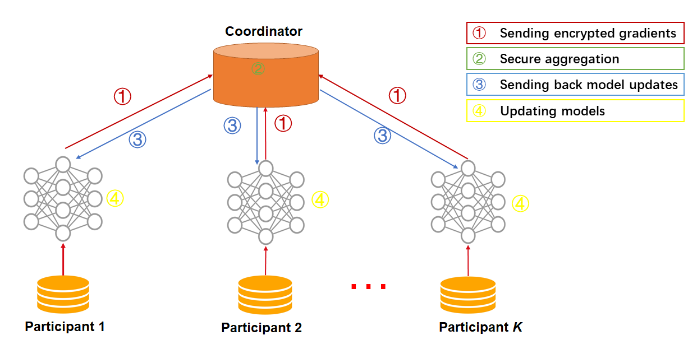

# Federated Factorization Machine

Factorization Machine(FM) is a  supervised learning approach incorporates second-order feature interaction.
Federated factorization machine computes these cross-party cross-features and their gradients under encryption. 

Here we simplify participants of the federation process into three parties. Party A represents Guest, party B represents Host. Party C, which is also known as “Arbiter,” is a third party that works as coordinator. Party C is responsible for generating private and public keys.

## Heterogeneous FM

The inference process of HeteroFM is shown below:

 
Figure 1： Federated HeteroFM

Similar to other hetero federated learning approch, a sample alignment process is conducted before training. The sample alignment process identifies overlapping samples in databases of all parties. The federated model is built based on the overlapping samples. The whole sample alignment process is conducted in encryption mode, and so confidential information (e.g. sample ids) will not be leaked.

In the training process, party A and party B each compute their own linear and cross-features forward results, and compute sucure cross-party cross-features under homomorphic encryption. Arbiter then aggregates, calculates, and transfers back the final gradients to corresponding parties. 

FM prediction over two parties as:
$$
\begin{split}
f([X_p^{(A)};X_q^{(B)}]) {} &=  f(X_p^{(A)})+f(X_q^{(B)})+\sum\limits_{i,j}x_p,i^{(A)}x_q,j^{(B)}  {}\\
	&=f(X_p^{(A)})+f(X_q^{(B)})+\sum_{i}\sum_{j}\sum_{k=1}^{d'}v_{i,k}^{(A)}v_{j,k}^{(B)}x_{p,i}^{(A)}x_{q,j}^{(B)} {}\\
	&=f(X_p^{(A)})+f(X_q^{(B)})+\sum_{k=1}^{d'}(\sum_iv_{i,k}^{(A)}x_{p,i}^{(A)})(\sum_jv_{j,k}^{(B)}x_{q,j}^{(B)}) {}\\
\end{split}
$$
FM loss function over two parties is defined as:
$$
\begin{split}
{} &\ell([W^{(A)};W^{(B)}],[V^{(A)};V^{(B)}])  {}\\
	&=\frac{1}{2nA}\sum_{p=1}^{nA}(y_p-f([X_{p}^{(A)};X_{q}^{(B)}]))^2+\frac{\alpha}{2}\Omega([W^{(A)};W^{(B)}],[V^{(A)};V^{(B)}]) {}\\

\end{split}
$$
where $\alpha>0$ is a hyper-parameter.

## Homogeneous FM

As the name suggested, in HomoFM, the feature spaces of guest and hosts are identical. An optional encryption mode for computing gradients is provided for host parties. By doing this, the plain model is not available for this host any more. 

 
Figure 1： Federated HomoFM Principle
 

The HomoFM process is shown in Figure 1. Models of Participant 1 and Participant 2 and the rest of them have the same structure.
Calculate Wp1,Vp1,Wp2,Vp2 and the rest of W and V and update the model. For more detail please refer to https://www.csie.ntu.edu.tw/~b97053/paper/Rendle2010FM.pdf
In each iteration, each party trains its model on its own data. After that, all parties upload their plain gradients to arbiter(Homo FM do not support encrypt at this time). The arbiter aggregates these gradients to form a federated gradient that will then be distributed to all parties for updating their local models. Similar to traditional FM, the training process will stop when the federated model converges or the whole training process reaches a predefined max-iteration threshold.

## Features:
1. L1 & L2 regularization
2. Mini-batch mechanism
3. Five optimization methods:
    a)	“sgd”: gradient descent with arbitrary batch size
    b) “rmsprop”: RMSProp
    c) “adam”: Adam
    d) “adagrad”: AdaGrad
    e) “nesterov_momentum_sgd”: Nesterov Momentum
4. Three converge criteria:
    a) "diff": Use difference of loss between two iterations, not available for multi-host training
    b) "abs": Use the absolute value of loss
    c) "weight_diff": Use difference of model weights
5. Support multi-host modeling task. For details on how to configure for multi-host modeling task, please refer to this [guide](../../../doc/dsl_conf_setting_guide.md)
6. Support validation for every arbitrary iterations
7. Learning rate decay mechanism.