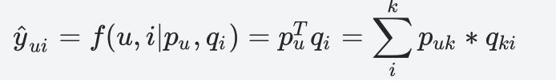
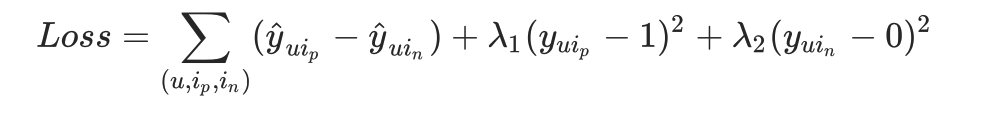
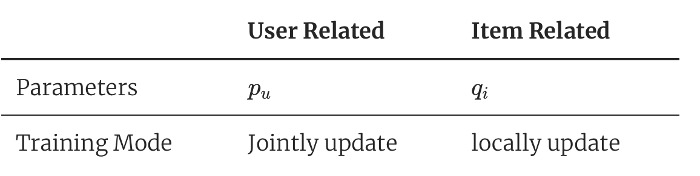
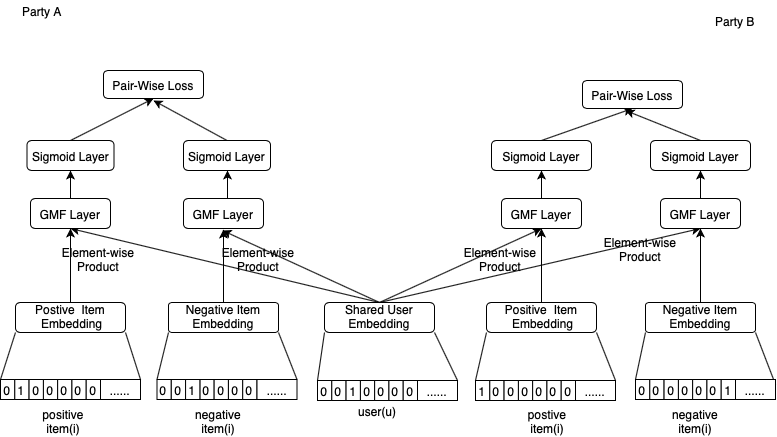

# Federated Generalized Matrix Factorization.

Popularized by the Netflix Prize, Matrix Factorization has become the defacto approach to latent factor model-based recommendation.

FATE provides an Federated GMF(Generalize Matrix Factorization) algorithm implementation using these cross-party user embeddings, while each party retains own items embeddings, then exchange their user embedding under encryption to get better performance.

# Related Work ( General Matrix Factorization)

General Matrix Factorizaton, GMF for short,  was proposed in [Neural Collaborative Matrix](http://dx.doi.org/10.1145/3038912.3052569) by Xiangnan He et. 

GMF associates each user and item with a real-valued vector of latent features. Let p_u and q_i denote the latent vector (embedding) for user $$u$$ and item i, respectively; GMF estimates an interaction y_{ui} as the inner product of p_u and q_i:

where k denotes the dimension of the latent space. 

Since GMF maps users and items to the same latent space, the similarity between two users can also be measured with an inner product, or equivalently, the cosine of the angle between their latent vectors, which can be used to approximate the click-through rate.  A lot of items was impression to each user, with only a few of them been clicked. GMF assume the clicked items as postive items, unclicked items as implicit negative items. It make sure that similary between embedding of user and postive items greater than that between embeddings of user and negative items. GMF applied pairwise-loss to learn model parameters, 

## Heterogeneous Generalized Matrix Factorization

Here we simplify participants of the federation process into three parties. Party A represents Guest, party B represents Host. Party C, which is also known as “Arbiter,” is a third party that works as coordinator. Party C is responsible for generating private and public keys.

We can divide the parameters of GMF into item-related (e.g. $p$) and user-related (e.g. $q$) ones. And we find that the updates of item-related parameters does not relys on other party’s data thus can be updated locally, while the user-related parameters needs data from other participants thus require to be updated jointly.

Unlike other hetero federated learning approaches, hetero MF-based methods has not need to alignment samples, instead of having similar user ids, conducting same methods to generate userIds. The sample is designed as a tuple (sample_id, user_id, item_id, rating).

The inference process of HeteroGMF is shown below:

 
Figure 1： Federated Generalized Matrix Factorization

In the training process, party A and party B each compute their own user and item embeddings, and send their user embeddings to arbiter party under homomorphic encryption. Arbiter then aggregates, calculates, and transfers back the final user embedding to corresponding parties. 

## Features:
1. L1 & L2 regularization
2. Mini-batch mechanism
3. Five optimization methods:
    a) “sgd”: gradient descent with arbitrary batch size
    b) “rmsprop”: RMSProp
    c) “adam”: Adam
    d) “adagrad”: AdaGrad
    e) “nesterov_momentum_sgd”: Nesterov Momentum
4. Three converge criteria:
 a) "diff": Use difference of loss between two iterations, not available for multi-host training
 b) "abs": Use the absolute value of loss
 c) "weight_diff": Use difference of model weights
5. Support multi-host modeling task. For details on how to configure for multi-host modeling task, please refer to this [guide](../../../doc/dsl_conf_setting_guide.md)
6. Support validation for every arbitrary iterations
7. Learning rate decay mechanism.