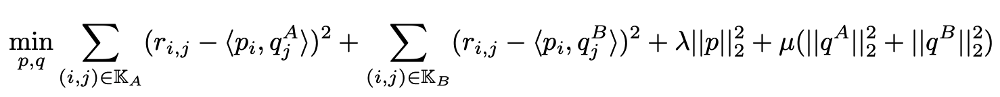
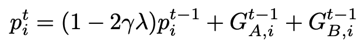
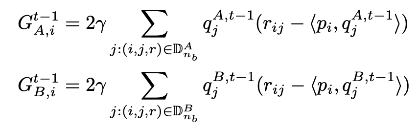
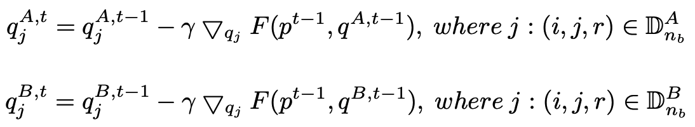

# Federated Matrix Factorization

Matrix Factorization( or Matrix Decomposition) is a  supervised learning approach that decompose a matrix into a product of matrices.

Matrix Factorization is commonly used in recommendation senario to decompose a user-item rating matrix into user profile and item profile, and to predict unknown user-item pair's rating by compute the dot product of user profile and item profile.

Here we simplify participants of the federation process into three parties. Party A represents Guest, party B represents Host. Party C, which is also known as “Arbiter,” is a third party that works as coordinator. Party C is responsible coordinate training process and encrypted data exchange.

## Heterogeneous MF

Based on the setting of same-user and different-item, we let party A, B share the same user-profile and hold item-profile individually. The rating data is protected by keeping the item-profile unknown to each other.

Thus the loss function can be divided based on items:

 

We can use a mini-batch gradient descent method to train *p* and *q* using the following equations.

**Mini-Batch Updating *p*:**

 

where

 

**Mini-Batch Updating *q*:**

 

where $\mathbb{D}_{n_b}^A$ and $\mathbb{D}_{n_b}^B$  represent the batched training data from A, B respectively.

The work flow of the training can be represented as : The user profile *p* is initialized using the same method in *A*, *B*, thus it is shared implicitly. The $G_A$, $G_B$ are aggregated gradients over items, thus it leaks no information to each other.

One more thing we noticed is that the item-profile(i.e. q) is updated locally at A,B without requiring information from each other. Only the user-profiles’ update requires information from the other party.

 

## Features:
1. L1 & L2 regularization
2. Mini-batch mechanism
3. Five optimization methods:
    a)	“sgd”: gradient descent with arbitrary batch size
    b) “rmsprop”: RMSProp
    c) “adam”: Adam
    d) “adagrad”: AdaGrad
    e) “nesterov_momentum_sgd”: Nesterov Momentum
4. Three converge criteria:
    a) "diff": Use difference of loss between two iterations, not available for multi-host training
    b) "abs": Use the absolute value of loss
    c) "weight_diff": Use difference of model weights
6. Support validation for every arbitrary iterations
7. Learning rate decay mechanism.