# Federated Singular Value Decomposition

SVD is a  supervised learning approach that decompose a matrix into a product of matrices. It does matrix factorization via following formula:

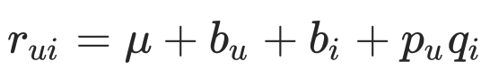 

Different to MF, SVD incoporate bias of users as 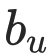 and bias of items as 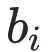.

SVD is commonly used in recommendation senario to decompose a user-item rating matrix into user profile and item profile, and to predict unknown user-item pair's rating by compute the dot product of user profile and item profile.

SVD's loss function:

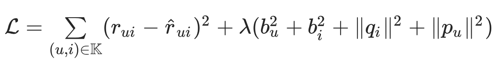 

where λ is a small positive values to rescale the penalizer. Denote 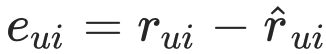, and the gradients on different parameters are:

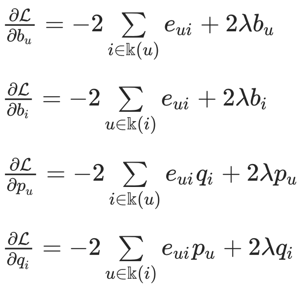 

## Heterogeneous SVD

Here we simplify participants of the federation process into three parties. Party A represents Guest, party B represents Host. Party C, which is also known as “Arbiter,” is a third party that works as coordinator. Party C is responsible coordinate training process and encrypted data exchange.

Inspired by VFedMF, we can divide the parameters of SVD into item-related (e.g. p) and user-related (e.g. q) ones. Based on the setting of same-user and different-item, we let party A, B share the same user-profile and hold item-profile individually. The rating data is protected by keeping the item-profile unknown to each other.

|               | User-Related   | Item-Related |
| ------------- | -------------- | ------------ |
| Parameters    |      | 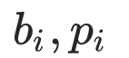    |
| Training mode | Jointly update | Local update |
|               |                |              |

**User-related parameters:**

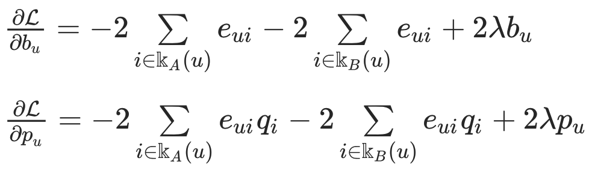 

**Let:**

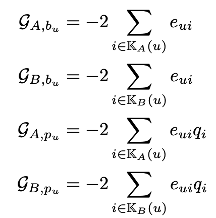 

Then the parameter updates of user-related parameters can be represented as:

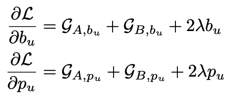 

**Item-related parameters** 

The item-related parameters can be updated locally by A,B using the same equation as regular SVD.

**Compute** 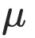

According to equation, we need to compute µ before the training of SVD, where µ is the global average rating score. Intutively, µ can be computed using following equation.

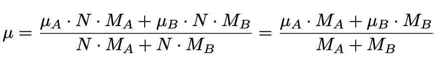 

## Features:
1. L2 regularization
2. Mini-batch mechanism
3. Five optimization methods:
    a)	“sgd”: gradient descent with arbitrary batch size
    b) “rmsprop”: RMSProp
    c) “adam”: Adam
    d) “adagrad”: AdaGrad
    e) “nesterov_momentum_sgd”: Nesterov Momentum
4. Three converge criteria:
    a) "diff": Use difference of loss between two iterations, not available for multi-host training
    b) "weight_diff": Use difference of model weights
6. Support validation for every arbitrary iterations
7. Learning rate decay mechanism.