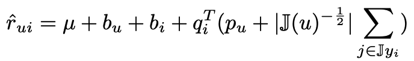
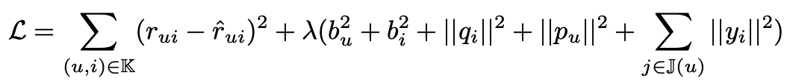
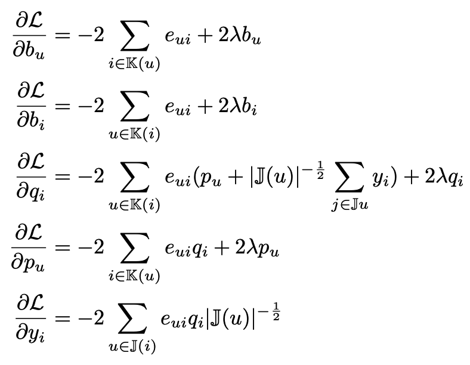
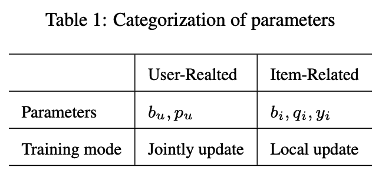
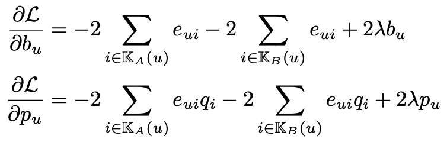
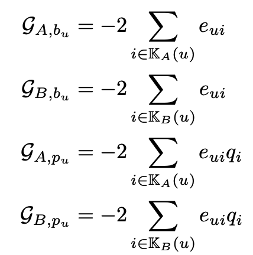
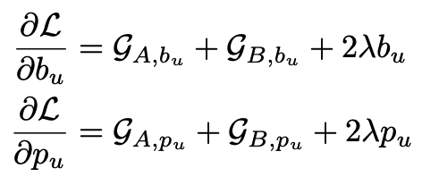
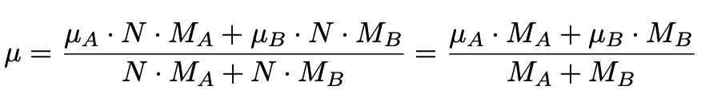

# Federated Singular Value Decomposition++

SVD++ is a  supervised learning approach that decompose a matrix into a product of matrices. It does matrix factorization via following formula:

 

Different to SVD, SVD++ incorporate implicit feedback of users.

SVD++ is commonly used in recommendation senario to decompose a user-item rating matrix into user profile and item profile, and to predict unknown user-item pair's rating by compute the dot product of user profile and item profile.

SVD++'s loss function:

 

where λ is a small positive values to rescale the penalizer, $y_i\in{\mathbb{R}^d}$ is a parameter vector. Denote $e_{ui}=r_{ui}-{\hat{r}}_{ui}$, and the gradients on different parameters are:

 

## Heterogeneous SVD++

Here we simplify participants of the federation process into three parties. Party A represents Guest, party B represents Host. Party C, which is also known as “Arbiter,” is a third party that works as coordinator. Party C is responsible coordinate training process and encrypted data exchange.

Inspired by VFedMF, we can divide the parameters of SVD++ into item-related (e.g. $p$) and user-related (e.g. $q$) ones. Table 1 shows an example of such categorization. And we find that the updates of item-related parameters does not relys on other party’s data thus can be updated locally, while the user-related parameters needs data from other participants thus require to be updated jointly.

 

**User-related parameters:**

 

**Let:**

 

Then the parameter updates of user-related parameters can be represented as:

 

**Item-related parameters** 

The item-related parameters can be updated locally by A,B using the same equation as regular SVD++.

**Compute** $\mu$

According to equation, we need to compute µ before the training of SVD++, where µ is the global average rating score. Intutively, µ can be computed using following equation.

 

## Features:

1. L1 & L2 regularization
2. Mini-batch mechanism
3. Five optimization methods:
    a)	“SGD”: gradient descent with arbitrary batch size
    b) “RMSprop”: RMSprop
    c) “Adam”: Adam
    d) “Adagrad”: AdaGrad
4. Three converge criteria:
    a) "diff": Use difference of loss between two iterations, not available for multi-host training
    b) "abs": Use the absolute value of loss
    c) "weight_diff": Use difference of model weights
6. Support validation for every arbitrary iterations
7. Learning rate decay mechanism.